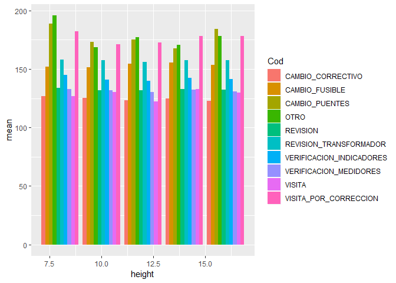
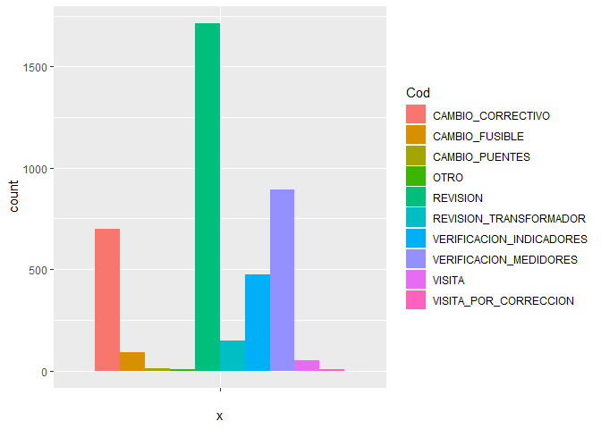
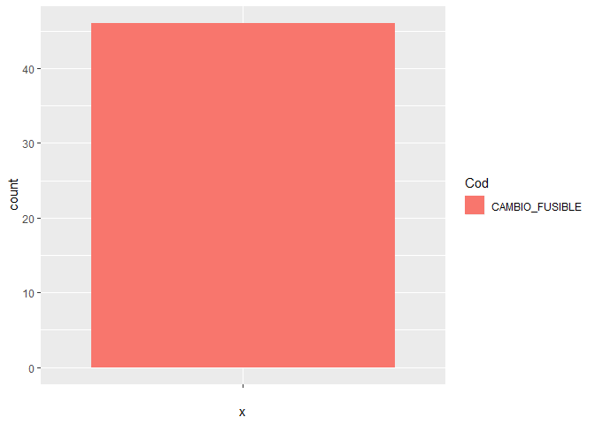
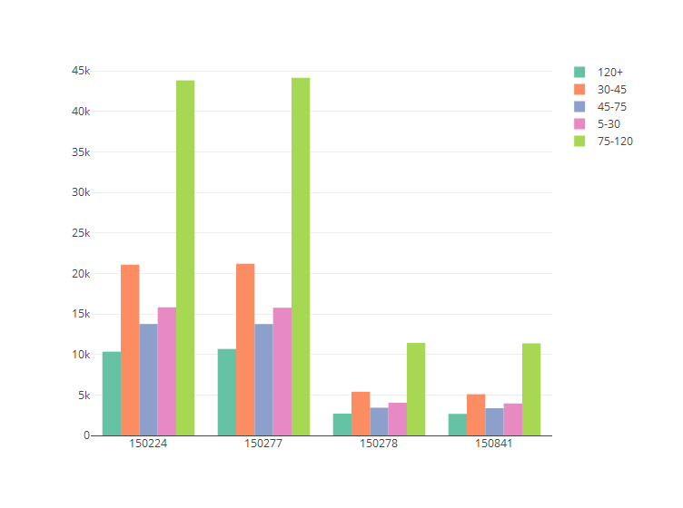
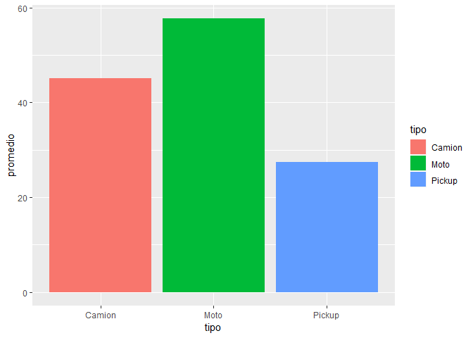
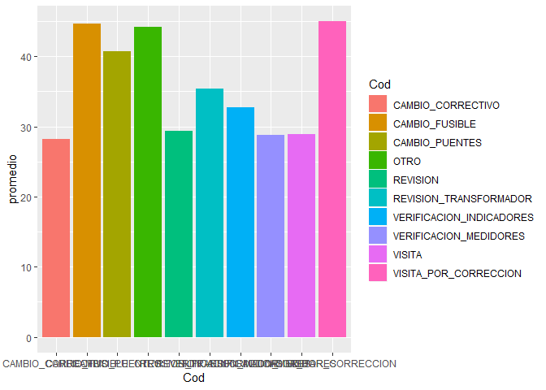

Laboratorio 7
================
Mafer Pérez
18 de septiembre de 2019

``` r
library(readr)
library(dplyr)
```

    ## Warning: package 'dplyr' was built under R version 3.5.3

    ## 
    ## Attaching package: 'dplyr'

    ## The following objects are masked from 'package:stats':
    ## 
    ##     filter, lag

    ## The following objects are masked from 'package:base':
    ## 
    ##     intersect, setdiff, setequal, union

``` r
library(lubridate)
```

    ## Warning: package 'lubridate' was built under R version 3.5.3

    ## 
    ## Attaching package: 'lubridate'

    ## The following object is masked from 'package:base':
    ## 
    ##     date

``` r
datos <- read_csv(file = "lab7/c1.csv")
```

    ## Parsed with column specification:
    ## cols(
    ##   .default = col_character(),
    ##   ID = col_integer(),
    ##   origen = col_integer(),
    ##   Lat = col_double(),
    ##   Long = col_double(),
    ##   height = col_integer()
    ## )

    ## See spec(...) for full column specifications.

``` r
datos$Fecha <- dmy(datos$Fecha)
```

``` r
library(stringr)
library(tidyr)
library(dplyr)
library(reshape2)
```

    ## 
    ## Attaching package: 'reshape2'

    ## The following object is masked from 'package:tidyr':
    ## 
    ##     smiths

``` r
datos$Camion_5 <- str_replace(string = datos$Camion_5, pattern = "^Q\\-$", replacement = "0")
datos$Camion_5 <- str_replace(string = datos$Camion_5, pattern = "^Q", replacement = "0")
datos$Camion_5 <- as.numeric(datos$Camion_5)
datos$Pickup <- str_replace(string = datos$Pickup, pattern = "^Q\\-$", replacement = "0")
datos$Pickup <- str_replace(string = datos$Pickup, pattern = "^Q", replacement = "0")
datos$Pickup <- as.numeric(datos$Pickup)
datos$Moto <- str_replace(string = datos$Moto, pattern = "^Q\\-$", replacement = "0")
datos$Moto <- str_replace(string = datos$Moto, pattern = "^Q", replacement = "0")
datos$Moto <- as.numeric(datos$Moto)
datos <- gather(datos, key = 'tipo', value = 'costo', Camion_5, Pickup, Moto) 
datos <- datos %>% filter(datos$costo > 0)

datos$directoCamion_5 <- str_replace(string = datos$directoCamion_5, pattern = "^Q", replacement = "0")
datos$directoCamion_5 <- str_replace(string = datos$directoCamion_5, pattern = "^Q\\-$", replacement = "0")
datos$directoCamion_5 <- as.numeric(datos$directoCamion_5)
```

    ## Warning: NAs introducidos por coerción

``` r
datos$directoPickup <- str_replace(string = datos$directoPickup, pattern = "^Q", replacement = "0")
datos$directoPickup <- str_replace(string = datos$directoPickup, pattern = "^Q\\-$", replacement = "0")
datos$directoPickup <- as.numeric(datos$directoPickup)
```

    ## Warning: NAs introducidos por coerción

``` r
datos$directoMoto <- str_replace(string = datos$directoMoto, pattern = "^Q", replacement = "0")
datos$directoMoto <- str_replace(string = datos$directoMoto, pattern = "^Q\\-$", replacement = "0")
datos$directoMoto <- as.numeric(datos$directoMoto)
```

    ## Warning: NAs introducidos por coerción

``` r
datos$fijoCamion_5 <- str_replace(string = datos$fijoCamion_5, pattern = "^Q", replacement = "0")
datos$fijoCamion_5 <- str_replace(string = datos$fijoCamion_5, pattern = "^Q\\-$", replacement = "0")
datos$fijoCamion_5 <- as.numeric(datos$fijoCamion_5)
```

    ## Warning: NAs introducidos por coerción

``` r
datos$fijoPickup <- str_replace(string = datos$fijoPickup, pattern = "^Q", replacement = "0")
datos$fijoPickup <- str_replace(string = datos$fijoPickup, pattern = "^Q\\-$", replacement = "0")
datos$fijoPickup <- as.numeric(datos$fijoPickup)
```

    ## Warning: NAs introducidos por coerción

``` r
datos$fijoMoto <- str_replace(string = datos$fijoMoto, pattern = "^Q", replacement = "0")
datos$fijoMoto <- str_replace(string = datos$fijoMoto, pattern = "^Q\\-$", replacement = "0")
datos$fijoMoto <- as.numeric(datos$fijoMoto)
```

    ## Warning: NAs introducidos por coerción

``` r
datos$factura <- str_replace(string = datos$factura, pattern = "^Q", replacement = "0")
datos$factura <- str_replace(string = datos$factura, pattern = "^Q\\-$", replacement = "0")
datos$factura <- as.numeric(datos$factura)

datos <- gather(datos, key = 'tipo', value = 'costodirecto', directoCamion_5, directoPickup, directoMoto) 
datos <- datos %>% filter(datos$costodirecto > 0)
datos <- gather(datos, key = 'tipo', value = 'costofijo', fijoCamion_5, fijoPickup, fijoMoto) 
datos <- datos %>% filter(datos$costofijo > 0)
names(datos)[names(datos) == "may-30"] <- "5-30"
datos <- gather(datos, key = 'tiempo', value = 'minutos', `5-30`, `30-45`, `45-75`, `75-120`, `120+`)
datos <- drop_na(datos)
datos$tipo <- substr(datos$tipo, 5,10)
datos <- datos %>% select(Fecha, ID, Cod, height, Lat, Long, factura, tipo, origen, costo, costodirecto, costofijo, tiempo)
datos %>% View()
```

``` r
library(tidyr)
library(dplyr)
library(reshape2)
#Estado de resultados
estado_de_resultados <- data.frame(ventas = sum(datos$factura), costo_de_ventas = sum(datos$costo), costo_directo= sum(datos$costodirecto), costo_fijo = sum(datos$costofijo), ganancias = sum(datos$factura) - sum(datos$costo))
estado_de_resultados <- t(estado_de_resultados)
colnames(estado_de_resultados) <- c('Ingreso/Costo')
estado_de_resultados
```

    ##                 Ingreso/Costo
    ## ventas               36688096
    ## costo_de_ventas      28174019
    ## costo_directo        17893607
    ## costo_fijo           10280412
    ## ganancias             8514077

``` r
#Desglosado
ingreso_camion <- datos  %>% filter(tipo =="Camion") %>% summarise (ingreso = sum(factura))
ingreso_camion
```

    ## # A tibble: 1 x 1
    ##     ingreso
    ##       <dbl>
    ## 1 11461980.

``` r
costo_camion <- datos %>% filter(tipo =="Camion") %>% summarise (ingreso = sum(costo))
directo_camion <- datos %>% filter(tipo =="Camion") %>% summarise (ingreso = sum(costodirecto))
fijo_camion <- datos %>% filter(tipo =="Camion") %>% summarise (ingreso = sum(costofijo))
TotalCamion <- data.frame(ingreso_camion, porcentaje_ingresos = ingreso_camion/sum(datos$factura), costo_camion , directo_camion, fijo_camion)
TotalCamion
```

    ##    ingreso ingreso.1 ingreso.2 ingreso.3 ingreso.4
    ## 1 11461980 0.3124169   8658363   5499060   3159304

``` r
ingreso_pickup <- datos %>% filter(tipo =="Pickup") %>% summarise (ingreso = sum(factura))
costo_pickup <- datos %>% filter(tipo =="Pickup") %>% summarise (ingreso = sum(costo))
directo_pickup <- datos %>% filter(tipo =="Pickup") %>% summarise (ingreso = sum(costodirecto))
fijo_pickup <- datos %>% filter(tipo =="Pickup") %>% summarise (ingreso = sum(costofijo))
TotalPickup <- data.frame(ingreso_pickup, porcentaje_ingresos = ingreso_pickup/sum(datos$factura), costo_pickup , directo_pickup, fijo_pickup)
TotalPickup
```

    ##    ingreso ingreso.1 ingreso.2 ingreso.3 ingreso.4
    ## 1 24502084 0.6678483  19121908  12144675   6977232

``` r
ingreso_Moto <- datos %>% filter(tipo =="Moto") %>% summarise (ingreso = sum(factura))
costo_Moto <- datos %>% filter(tipo =="Moto") %>% summarise (ingreso = sum(costo))
directo_Moto <- datos %>% filter(tipo =="Moto") %>% summarise (ingreso = sum(costodirecto))
fijo_Moto <- datos %>% filter(tipo =="Moto") %>% summarise (ingreso = sum(costofijo))
TotalMoto <- data.frame(ingreso_Moto, porcentaje_ingresos = ingreso_Moto/sum(datos$factura), costo_Moto , directo_Moto, fijo_Moto)
TotalMoto
```

    ##    ingreso  ingreso.1 ingreso.2 ingreso.3 ingreso.4
    ## 1 724031.9 0.01973479  393747.9    249872  143875.9

``` r
library(ggplot2)
library(plotly)
```

    ## Warning: package 'plotly' was built under R version 3.5.3

    ## 
    ## Attaching package: 'plotly'

    ## The following object is masked from 'package:ggplot2':
    ## 
    ##     last_plot

    ## The following object is masked from 'package:stats':
    ## 
    ##     filter

    ## The following object is masked from 'package:graphics':
    ## 
    ##     layout

``` r
tarifas<- datos %>% select(factura, Cod, height) %>% group_by(Cod, height) %>% summarise(mean = mean(factura), min = min(factura), max = max(factura))
tarifas
```

    ## # A tibble: 50 x 5
    ## # Groups:   Cod [10]
    ##    Cod               height  mean   min   max
    ##    <chr>              <int> <dbl> <dbl> <dbl>
    ##  1 CAMBIO_CORRECTIVO      8  127.  17.3  414.
    ##  2 CAMBIO_CORRECTIVO     10  125.  16.6  410.
    ##  3 CAMBIO_CORRECTIVO     12  123.  11.5  442.
    ##  4 CAMBIO_CORRECTIVO     14  125.  17.0  471.
    ##  5 CAMBIO_CORRECTIVO     16  123.  11.3  425.
    ##  6 CAMBIO_FUSIBLE         8  152.  29.1  437.
    ##  7 CAMBIO_FUSIBLE        10  152.  14.9  449.
    ##  8 CAMBIO_FUSIBLE        12  154.  13.0  442.
    ##  9 CAMBIO_FUSIBLE        14  155.  19.5  522.
    ## 10 CAMBIO_FUSIBLE        16  154.  21.6  462.
    ## # ... with 40 more rows

``` r
tarifas$Cod <- as.character(tarifas$Cod)
ggplot(data = tarifas, aes(x = height, y = mean, fill = Cod))+geom_bar(stat='identity', position = 'dodge')
```



``` r
#Son aceptadas por el cliente? Tenemos pérdidas?
library(lubridate)
datos <- datos %>% mutate(ingresos = factura - costo)
datos %>% group_by(month(Fecha)) %>% summarise(Totalingresos =sum(ingresos)) 
```

    ## # A tibble: 12 x 2
    ##    `month(Fecha)` Totalingresos
    ##             <dbl>         <dbl>
    ##  1              1        717969
    ##  2              2        642027
    ##  3              3        730779
    ##  4              4        697533
    ##  5              5        722327
    ##  6              6        690980
    ##  7              7        733610
    ##  8              8        721290
    ##  9              9        703845
    ## 10             10        731844
    ## 11             11        701043
    ## 12             12        720830

``` r
posibleperdida <- datos %>% filter(ingresos == 5) %>% group_by(Cod) %>% summarise(count = n())
ggplot(data = posibleperdida, aes(x ="", y = count, fill = Cod)) +
  geom_bar(position = 'dodge', stat = 'identity')
```



``` r
masganancias <- datos %>% filter(ingresos == 100) %>% group_by(Cod) %>% summarise(count = n())
ggplot(data = masganancias, aes(x ="", y = count, fill = Cod)) +
  geom_bar(position = 'dodge', stat = 'identity')
```



``` r
perdidas <- datos %>% filter(ingresos <= 0)
#El mínimo ingreso se tiene cuando es tardado, se hace una revisión, verficación medirdores, o cambio correctivo. y los costos directos son altos, se va en pickup
#Se tienen mayores ganancias cuando es un cambio de fusible, se va en moto y los costos son bajos
```

``` r
#Debo abrir más centros de distribución?
datos$origen <- as.character(datos$origen)
tiempototal <- datos %>% group_by(origen, tiempo) %>% summarise(count = n()) %>% ungroup()
tiempototal
```

    ## # A tibble: 20 x 3
    ##    origen tiempo count
    ##    <chr>  <chr>  <int>
    ##  1 150224 120+   10341
    ##  2 150224 30-45  21076
    ##  3 150224 45-75  13759
    ##  4 150224 5-30   15817
    ##  5 150224 75-120 43830
    ##  6 150277 120+   10675
    ##  7 150277 30-45  21195
    ##  8 150277 45-75  13750
    ##  9 150277 5-30   15765
    ## 10 150277 75-120 44150
    ## 11 150278 120+    2696
    ## 12 150278 30-45   5388
    ## 13 150278 45-75   3419
    ## 14 150278 5-30    4028
    ## 15 150278 75-120 11417
    ## 16 150841 120+    2661
    ## 17 150841 30-45   5086
    ## 18 150841 45-75   3356
    ## 19 150841 5-30    3949
    ## 20 150841 75-120 11367

``` r
plot_ly(
  x = tiempototal$origen,
  y = tiempototal$count,
  color = tiempototal$tiempo,
  type = "bar"
)
```



``` r
datos$ID <- as.character(datos$ID)
ingresoposte <- datos %>% group_by(ID) %>% summarise(total = sum(factura)) %>% arrange(desc(total)) %>% mutate(porcentaje = 100*total/sum(total))
ingresoposte
```

    ## # A tibble: 74,239 x 3
    ##    ID      total porcentaje
    ##    <chr>   <dbl>      <dbl>
    ##  1 773607 54202.     0.148 
    ##  2 863979 50494.     0.138 
    ##  3 969156 44404.     0.121 
    ##  4 477971 41224.     0.112 
    ##  5 337161 34991.     0.0954
    ##  6 519948 32008.     0.0872
    ##  7 507880 31123.     0.0848
    ##  8 974308 30087.     0.0820
    ##  9 353203 28458.     0.0776
    ## 10 479116 24938      0.0680
    ## # ... with 74,229 more rows

``` r
postes <- datos %>% 
  select(ID) %>% 
  distinct() %>% 
  count()
postes
```

    ## # A tibble: 1 x 1
    ##       n
    ##   <int>
    ## 1 74239

``` r
#80% de las ventas
ventas <- datos %>% 
  select(factura) %>% 
  sum()
ventas 
```

    ## [1] 36688096

``` r
ventas1 <- ventas*.8
ventas1
```

    ## [1] 29350477

``` r
clientestotal <- datos %>% 
  group_by(ID) %>% 
  summarise(totalfactura = sum(factura)) %>% 
  arrange(desc(totalfactura))
clientestotal
```

    ## # A tibble: 74,239 x 2
    ##    ID     totalfactura
    ##    <chr>         <dbl>
    ##  1 773607       54202.
    ##  2 863979       50494.
    ##  3 969156       44404.
    ##  4 477971       41224.
    ##  5 337161       34991.
    ##  6 519948       32008.
    ##  7 507880       31123.
    ##  8 974308       30087.
    ##  9 353203       28458.
    ## 10 479116       24938 
    ## # ... with 74,229 more rows

``` r
#Los que representan el 20% de todo
postes20 <- postes*0.2
postes20
```

    ##         n
    ## 1 14847.8

``` r
clientes_20 <- head(clientestotal,14847)
clientes_20
```

    ## # A tibble: 14,847 x 2
    ##    ID     totalfactura
    ##    <chr>         <dbl>
    ##  1 773607       54202.
    ##  2 863979       50494.
    ##  3 969156       44404.
    ##  4 477971       41224.
    ##  5 337161       34991.
    ##  6 519948       32008.
    ##  7 507880       31123.
    ##  8 974308       30087.
    ##  9 353203       28458.
    ## 10 479116       24938 
    ## # ... with 14,837 more rows

``` r
ventas_80 <- clientes_20 %>% 
  summarise(totalventas= sum(totalfactura))
ventas_80
```

    ## # A tibble: 1 x 1
    ##   totalventas
    ##         <dbl>
    ## 1   19947961.

``` r
#el 20% de los clientes representa cuanto porcentaje de las ventas
Porcentaje <- ventas_80/ventas
Porcentaje
```

    ##   totalventas
    ## 1   0.5437175

``` r
#el 20% de los clientes representa el 54% de las ventas
postes30 <- postes*0.3
postes30
```

    ##         n
    ## 1 22271.7

``` r
clientes_30 <- head(clientestotal,22271)
ventas_30 <- clientes_30 %>% 
  summarise(totalventas= sum(totalfactura))
ventas_30
```

    ## # A tibble: 1 x 1
    ##   totalventas
    ##         <dbl>
    ## 1   24210314.

``` r
Porcentaje30 <- ventas_30/ventas
Porcentaje30
```

    ##   totalventas
    ## 1   0.6598956

``` r
#El 30% representa el66%
postes40 <- postes*0.4
postes40
```

    ##         n
    ## 1 29695.6

``` r
clientes_40 <- head(clientestotal,29695)
ventas_40 <- clientes_40 %>% 
  summarise(totalventas= sum(totalfactura))
ventas_40
```

    ## # A tibble: 1 x 1
    ##   totalventas
    ##         <dbl>
    ## 1   27497750.

``` r
Porcentaje40 <- ventas_40/ventas
Porcentaje40
```

    ##   totalventas
    ## 1   0.7495006

``` r
#El 40% representa el 75% de las ventas
```

``` r
clientes_40
```

    ## # A tibble: 29,695 x 2
    ##    ID     totalfactura
    ##    <chr>         <dbl>
    ##  1 773607       54202.
    ##  2 863979       50494.
    ##  3 969156       44404.
    ##  4 477971       41224.
    ##  5 337161       34991.
    ##  6 519948       32008.
    ##  7 507880       31123.
    ##  8 974308       30087.
    ##  9 353203       28458.
    ## 10 479116       24938 
    ## # ... with 29,685 more rows

``` r
#Gráfica del 40% de los clientes
clientes_60 <- 74239-29695
clientes_60
```

    ## [1] 44544

``` r
#Recorridos más efectivos
datos$Cod<-as.character(datos$Cod)
PorTipo <- datos%>% group_by(tipo) %>% summarise(count = n(), total = sum(ingresos)) %>% mutate(promedio = total/count) %>%  arrange(desc(promedio))
PorCod <- datos%>% group_by(Cod) %>% summarise(count = n(), total = sum(ingresos)) %>% mutate(promedio = total/count) %>%  arrange(desc(promedio))
ggplot(data = PorTipo, aes(x = tipo, y = promedio, fill = tipo))+
  geom_bar(stat = 'identity')
```



``` r
ggplot(data = PorCod, aes(x = Cod,  y = promedio, fill = Cod))+
  geom_bar(stat = 'identity')
```


