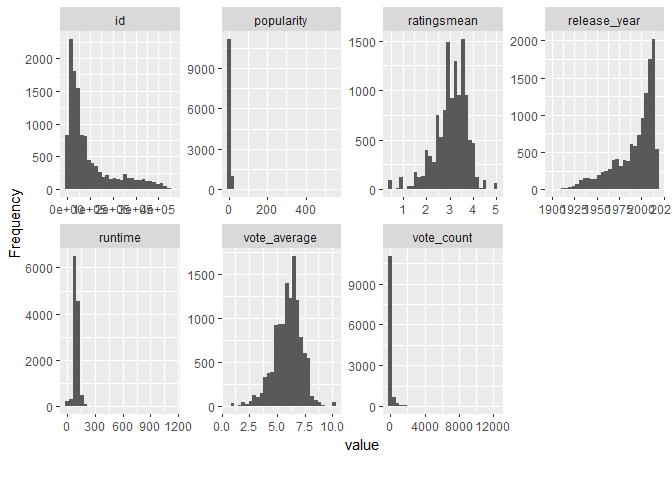

Lab10
================
Mafer Pérez
2 de noviembre de 2019

``` r
library(readr)
library(dplyr)
```

    ## Warning: package 'dplyr' was built under R version 3.5.3

    ## 
    ## Attaching package: 'dplyr'

    ## The following objects are masked from 'package:stats':
    ## 
    ##     filter, lag

    ## The following objects are masked from 'package:base':
    ## 
    ##     intersect, setdiff, setequal, union

``` r
movies <- read_csv(file = "C:/Users/Mafer/Desktop/DataW/movies.csv") %>% select(-X1)
```

    ## Warning: Missing column names filled in: 'X1' [1]

    ## Parsed with column specification:
    ## cols(
    ##   X1 = col_integer(),
    ##   budget = col_double(),
    ##   id = col_integer(),
    ##   imdb_id = col_character(),
    ##   original_language = col_character(),
    ##   original_title = col_character(),
    ##   popularity = col_double(),
    ##   release_year = col_integer(),
    ##   release_date = col_character(),
    ##   revenue = col_double(),
    ##   runtime = col_integer(),
    ##   title = col_character(),
    ##   vote_average = col_double(),
    ##   vote_count = col_integer()
    ## )

``` r
ratings <- read_csv(file = "C:/Users/Mafer/Desktop/DataW/ratings.csv") %>% select(-X1)
```

    ## Warning: Missing column names filled in: 'X1' [1]

    ## Parsed with column specification:
    ## cols(
    ##   X1 = col_integer(),
    ##   userId = col_integer(),
    ##   movieId = col_integer(),
    ##   rating = col_double(),
    ##   timestamp = col_integer()
    ## )

    ## Warning in rbind(names(probs), probs_f): number of columns of result is not
    ## a multiple of vector length (arg 1)

    ## Warning: 27 parsing failures.
    ## row # A tibble: 5 x 5 col       row col      expected           actual  file                          expected     <int> <chr>    <chr>              <chr>   <chr>                         actual 1   30382 timesta~ no trailing chara~ .447e+~ 'C:/Users/Mafer/Desktop/Data~ file 2  422753 timesta~ no trailing chara~ .222e+~ 'C:/Users/Mafer/Desktop/Data~ row 3  714355 timesta~ no trailing chara~ .479e+~ 'C:/Users/Mafer/Desktop/Data~ col 4  729933 timesta~ no trailing chara~ .272e+~ 'C:/Users/Mafer/Desktop/Data~ expected 5 3044625 userId   no trailing chara~ e+05    'C:/Users/Mafer/Desktop/Data~
    ## ... ................. ... ........................................................................... ........ ........................................................................... ...... ........................................................................... .... ........................................................................... ... ........................................................................... ... ........................................................................... ........ ...........................................................................
    ## See problems(...) for more details.

``` r
library(readr)
library(dplyr)
library(plotly)
```

    ## Warning: package 'plotly' was built under R version 3.5.3

    ## Loading required package: ggplot2

    ## 
    ## Attaching package: 'plotly'

    ## The following object is masked from 'package:ggplot2':
    ## 
    ##     last_plot

    ## The following object is masked from 'package:stats':
    ## 
    ##     filter

    ## The following object is masked from 'package:graphics':
    ## 
    ##     layout

``` r
library(DataExplorer)
```

    ## Warning: package 'DataExplorer' was built under R version 3.5.3

``` r
ratings1 <- ratings %>%  group_by(movieId) %>%
  summarise(ratingsmean = mean(rating))
```

``` r
plot_str(ratings1)
```

``` r
introduce(ratings1) %>% View()
```

``` r
movies %>% View()
glimpse(movies)
```

    ## Observations: 13,687
    ## Variables: 13
    ## $ budget            <dbl> 3.0e+07, 6.5e+07, 1.6e+07, 0.0e+00, 3.5e+07,...
    ## $ id                <int> 862, 8844, 31357, 45325, 9091, 12110, 10858,...
    ## $ imdb_id           <chr> "tt0114709", "tt0113497", "tt0114885", "tt01...
    ## $ original_language <chr> "en", "en", "en", "en", "en", "en", "en", "e...
    ## $ original_title    <chr> "Toy Story", "Jumanji", "Waiting to Exhale",...
    ## $ popularity        <dbl> 21.946943, 17.015539, 3.859495, 2.561161, 5....
    ## $ release_year      <int> 1995, 1995, 1995, 1995, 1995, 1995, 1995, 19...
    ## $ release_date      <chr> "10/30/95", "12/15/95", "12/22/95", "12/22/9...
    ## $ revenue           <dbl> 373554033, 262797249, 81452156, 0, 64350171,...
    ## $ runtime           <int> 81, 104, 127, 97, 106, 88, 192, 90, 132, 123...
    ## $ title             <chr> "Toy Story", "Jumanji", "Waiting to Exhale",...
    ## $ vote_average      <dbl> 7.7, 6.9, 6.1, 5.4, 5.5, 5.7, 7.1, 6.1, 6.0,...
    ## $ vote_count        <int> 5415, 2413, 34, 45, 174, 210, 72, 1128, 394,...

``` r
plot_str(movies)
```

``` r
introduce(movies) %>% View()
```

``` r
colnames(ratings1)[colnames(ratings1)=="movieId"] <- "id"
```

``` r
library(tidyverse)
```

    ## -- Attaching packages --------------------------------------- tidyverse 1.2.1 --

    ## v tibble  2.1.3     v purrr   0.2.5
    ## v tidyr   0.8.1     v stringr 1.3.1
    ## v tibble  2.1.3     v forcats 0.3.0

    ## Warning: package 'tibble' was built under R version 3.5.3

    ## -- Conflicts ------------------------------------------ tidyverse_conflicts() --
    ## x plotly::filter() masks dplyr::filter(), stats::filter()
    ## x dplyr::lag()     masks stats::lag()

``` r
movies <- as_tibble(movies)
ratings1 <- as_tibble(ratings1)
```

``` r
datos <- left_join(movies, ratings1, by = "id")
colSums(is.na(datos))
```

    ##            budget                id           imdb_id original_language 
    ##                 1                 1                 5                 4 
    ##    original_title        popularity      release_year      release_date 
    ##                 0                 2                17                31 
    ##           revenue           runtime             title      vote_average 
    ##                 2                91                 2                 2 
    ##        vote_count       ratingsmean 
    ##                 2               240

``` r
introduce(datos) %>% View()
```

``` r
datos[datos == 0] <- NA
summary(datos)
```

    ##      budget                id           imdb_id         
    ##  Min.   :        1   Min.   :    11   Length:13687      
    ##  1st Qu.:  2000000   1st Qu.: 26139   Class :character  
    ##  Median :  9000000   Median : 58431   Mode  :character  
    ##  Mean   : 22034566   Mean   :107082                     
    ##  3rd Qu.: 26000000   3rd Qu.:154210                     
    ##  Max.   :380000000   Max.   :462788                     
    ##  NA's   :11038       NA's   :1                          
    ##  original_language  original_title       popularity        release_year 
    ##  Length:13687       Length:13687       Min.   :  0.0000   Min.   :1900  
    ##  Class :character   Class :character   1st Qu.:  0.3923   1st Qu.:1978  
    ##  Mode  :character   Mode  :character   Median :  1.1330   Median :2001  
    ##                                        Mean   :  2.9706   Mean   :1992  
    ##                                        3rd Qu.:  3.6065   3rd Qu.:2010  
    ##                                        Max.   :547.4883   Max.   :2018  
    ##                                        NA's   :20         NA's   :17    
    ##  release_date          revenue             runtime       
    ##  Length:13687       Min.   :1.000e+00   Min.   :   1.00  
    ##  Class :character   1st Qu.:2.911e+06   1st Qu.:  87.00  
    ##  Mode  :character   Median :1.734e+07   Median :  95.00  
    ##                     Mean   :7.393e+07   Mean   :  97.63  
    ##                     3rd Qu.:7.161e+07   3rd Qu.: 107.00  
    ##                     Max.   :2.068e+09   Max.   :1140.00  
    ##                     NA's   :11469       NA's   :547      
    ##     title            vote_average      vote_count       ratingsmean   
    ##  Length:13687       Min.   : 0.500   Min.   :    1.0   Min.   :0.500  
    ##  Class :character   1st Qu.: 5.300   1st Qu.:    4.0   1st Qu.:2.682  
    ##  Mode  :character   Median : 6.100   Median :   11.0   Median :3.152  
    ##                     Mean   : 5.999   Mean   :  123.4   Mean   :3.055  
    ##                     3rd Qu.: 6.900   3rd Qu.:   38.0   3rd Qu.:3.500  
    ##                     Max.   :10.000   Max.   :12269.0   Max.   :5.000  
    ##                     NA's   :901      NA's   :878       NA's   :240

``` r
plot_missing(datos)
```


``` r
#La columna budget y revenue tienen muchos NA's por lo que sería mejor no tomarlas en cuenta para el análisis
```

``` r
drops <- c("revenue","budget")
datos <- datos[ , !(names(datos) %in% drops)]
```

``` r
plot_missing(datos)
```


``` r
datos1 <- na.omit(datos) 
```

``` r
summary(datos1)
```

    ##        id           imdb_id          original_language  original_title    
    ##  Min.   :    11   Length:12219       Length:12219       Length:12219      
    ##  1st Qu.: 23158   Class :character   Class :character   Class :character  
    ##  Median : 51299   Mode  :character   Mode  :character   Mode  :character  
    ##  Mean   : 97393                                                           
    ##  3rd Qu.:128205                                                           
    ##  Max.   :461297                                                           
    ##    popularity        release_year  release_date          runtime       
    ##  Min.   :  0.0000   Min.   :1900   Length:12219       Min.   :   1.00  
    ##  1st Qu.:  0.5283   1st Qu.:1980   Class :character   1st Qu.:  87.00  
    ##  Median :  1.3556   Median :2001   Mode  :character   Median :  95.00  
    ##  Mean   :  3.2793   Mean   :1993                      Mean   :  98.45  
    ##  3rd Qu.:  4.3356   3rd Qu.:2010                      3rd Qu.: 108.00  
    ##  Max.   :547.4883   Max.   :2017                      Max.   :1140.00  
    ##     title            vote_average      vote_count       ratingsmean   
    ##  Length:12219       Min.   : 0.500   Min.   :    1.0   Min.   :0.500  
    ##  Class :character   1st Qu.: 5.300   1st Qu.:    4.0   1st Qu.:2.725  
    ##  Mode  :character   Median : 6.100   Median :   12.0   Median :3.167  
    ##                     Mean   : 6.011   Mean   :  129.0   Mean   :3.068  
    ##                     3rd Qu.: 6.900   3rd Qu.:   40.5   3rd Qu.:3.500  
    ##                     Max.   :10.000   Max.   :12269.0   Max.   :5.000

``` r
plot_correlation(datos1)
```

    ## Warning in dummify(data, maxcat = maxcat): Ignored all discrete features
    ## since `maxcat` set to 20 categories!


``` r
plot_histogram(datos1)
```



``` r
datos1 %>%  plot_ly(x = ~ratingsmean, y = ~popularity, type = "scatter")
```

    ## No scatter mode specifed:
    ##   Setting the mode to markers
    ##   Read more about this attribute -> https://plot.ly/r/reference/#scatter-mode


``` r
#Conclusiones
#Se hizo una media de los rating para cada id de la película y poder analizar mejor la data
#Se pueden botar las columnas de budget y revenue ya que tienen en su mayoría datos nulos.
#Con introduce se puede ver cuáles varibales son discretas o continuas
#Con glimpse podemos ver cuáles variables son categóricas o númericas
##Se borraron las filas que contienen NA en estas las columnas donde los missing values eran pocos
##Existe correlación entre vote count y popularity, ya que si era popular es posible que mucha gente lo viera. Las demas correlaciones no son significativas.
```
