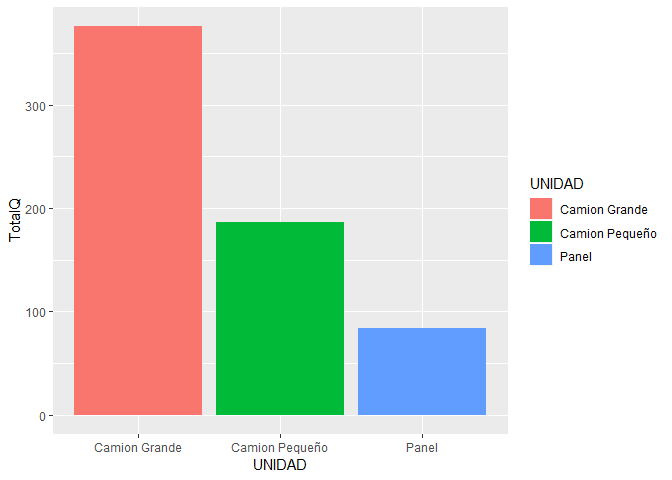
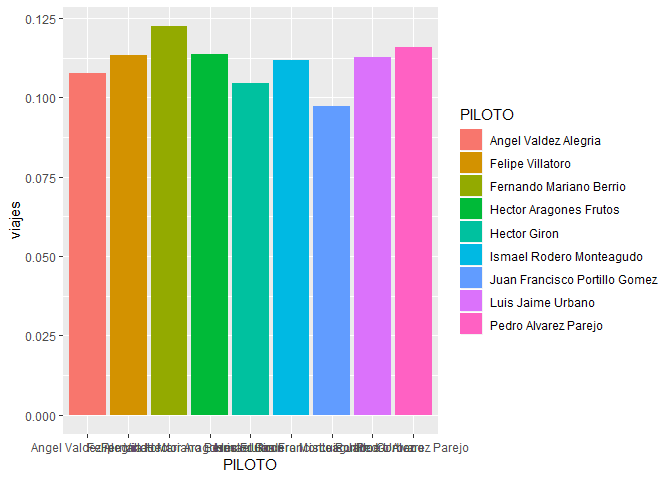
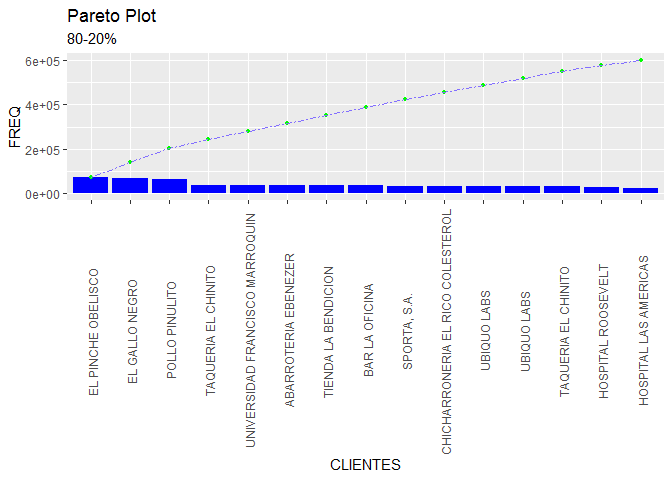

Laboratorio3
================
Mafer Pérez
14 de agosto de 2019

``` r
library(readr)
datos <- read_csv(file = "lab3/tabla_completa.csv",col_names = TRUE, locale = locale(encoding = "latin1"))
```

    ## Warning: Missing column names filled in: 'X1' [1]

    ## Parsed with column specification:
    ## cols(
    ##   X1 = col_integer(),
    ##   COD_VIAJE = col_integer(),
    ##   CLIENTE = col_character(),
    ##   UBICACION = col_integer(),
    ##   CANTIDAD = col_integer(),
    ##   PILOTO = col_character(),
    ##   Q = col_double(),
    ##   CREDITO = col_integer(),
    ##   UNIDAD = col_character(),
    ##   MES = col_character(),
    ##   ANIO = col_integer()
    ## )

``` r
datos$X1 <- NULL
datos
```

    ## # A tibble: 2,180 x 10
    ##    COD_VIAJE CLIENTE UBICACION CANTIDAD PILOTO     Q CREDITO UNIDAD MES  
    ##        <int> <chr>       <int>    <int> <chr>  <dbl>   <int> <chr>  <chr>
    ##  1  10000001 EL PIN~     76002     1200 Ferna~ 300        30 Camio~ 01   
    ##  2  10000002 TAQUER~     76002     1433 Hecto~ 358.       90 Camio~ 01   
    ##  3  10000003 TIENDA~     76002     1857 Pedro~ 464.       60 Camio~ 01   
    ##  4  10000004 TAQUER~     76002      339 Angel~  84.8      30 Panel  01   
    ##  5  10000005 CHICHA~     76001     1644 Juan ~ 411        30 Camio~ 01   
    ##  6  10000006 UBIQUO~     76001     1827 Luis ~ 457.       30 Camio~ 01   
    ##  7  10000007 CHICHA~     76002     1947 Ismae~ 487.       90 Camio~ 01   
    ##  8  10000008 TAQUER~     76001     1716 Juan ~ 429        60 Camio~ 01   
    ##  9  10000009 EL GAL~     76002     1601 Ismae~ 400.       30 Camio~ 01   
    ## 10  10000010 CHICHA~     76002     1343 Ferna~ 336.       90 Camio~ 01   
    ## # ... with 2,170 more rows, and 1 more variable: ANIO <int>

``` r
summary(datos)
```

    ##    COD_VIAJE       CLIENTE            UBICACION        CANTIDAD     
    ##  Min.   :1e+07   Length:2180        Min.   :76001   Min.   : 200.0  
    ##  1st Qu.:1e+07   Class :character   1st Qu.:76001   1st Qu.: 642.5  
    ##  Median :1e+07   Mode  :character   Median :76002   Median :1097.5  
    ##  Mean   :1e+07                      Mean   :76002   Mean   :1098.8  
    ##  3rd Qu.:1e+07                      3rd Qu.:76002   3rd Qu.:1562.0  
    ##  Max.   :1e+07                      Max.   :76002   Max.   :1996.0  
    ##     PILOTO                Q            CREDITO         UNIDAD         
    ##  Length:2180        Min.   : 50.0   Min.   :30.00   Length:2180       
    ##  Class :character   1st Qu.:160.6   1st Qu.:30.00   Class :character  
    ##  Mode  :character   Median :274.4   Median :60.00   Mode  :character  
    ##                     Mean   :274.7   Mean   :58.49                     
    ##                     3rd Qu.:390.5   3rd Qu.:90.00                     
    ##                     Max.   :499.0   Max.   :90.00                     
    ##      MES                 ANIO     
    ##  Length:2180        Min.   :2017  
    ##  Class :character   1st Qu.:2017  
    ##  Mode  :character   Median :2017  
    ##                     Mean   :2017  
    ##                     3rd Qu.:2017  
    ##                     Max.   :2017

``` r
colSums(is.na(datos))
```

    ## COD_VIAJE   CLIENTE UBICACION  CANTIDAD    PILOTO         Q   CREDITO 
    ##         0         0         0         0         0         0         0 
    ##    UNIDAD       MES      ANIO 
    ##         0         0         0

``` r
dplyr::glimpse(datos)
```

    ## Observations: 2,180
    ## Variables: 10
    ## $ COD_VIAJE <int> 10000001, 10000002, 10000003, 10000004, 10000005, 10...
    ## $ CLIENTE   <chr> "EL PINCHE OBELISCO / Despacho a cliente", "TAQUERIA...
    ## $ UBICACION <int> 76002, 76002, 76002, 76002, 76001, 76001, 76002, 760...
    ## $ CANTIDAD  <int> 1200, 1433, 1857, 339, 1644, 1827, 1947, 1716, 1601,...
    ## $ PILOTO    <chr> "Fernando Mariano Berrio", "Hector Aragones Frutos",...
    ## $ Q         <dbl> 300.00, 358.25, 464.25, 84.75, 411.00, 456.75, 486.7...
    ## $ CREDITO   <int> 30, 90, 60, 30, 30, 30, 90, 60, 30, 90, 60, 30, 60, ...
    ## $ UNIDAD    <chr> "Camion Grande", "Camion Grande", "Camion Grande", "...
    ## $ MES       <chr> "01", "01", "01", "01", "01", "01", "01", "01", "01"...
    ## $ ANIO      <int> 2017, 2017, 2017, 2017, 2017, 2017, 2017, 2017, 2017...

``` r
library(dplyr)
```

    ## Warning: package 'dplyr' was built under R version 3.5.3

    ## 
    ## Attaching package: 'dplyr'

    ## The following objects are masked from 'package:stats':
    ## 
    ##     filter, lag

    ## The following objects are masked from 'package:base':
    ## 
    ##     intersect, setdiff, setequal, union

``` r
#Primero hay que saber cuantos pilotos hay
datos %>% select(PILOTO) %>% distinct()
```

    ## # A tibble: 9 x 1
    ##   PILOTO                       
    ##   <chr>                        
    ## 1 Fernando Mariano Berrio      
    ## 2 Hector Aragones Frutos       
    ## 3 Pedro Alvarez Parejo         
    ## 4 Angel Valdez Alegria         
    ## 5 Juan Francisco Portillo Gomez
    ## 6 Luis Jaime Urbano            
    ## 7 Ismael Rodero Monteagudo     
    ## 8 Felipe Villatoro             
    ## 9 Hector Giron

``` r
#PILOTOS Angel, Felipe, #Fernando, Hector Aragones, Hector Giron, #Ismael,Juan, Luis, #Pedro

#Con esto quiero saber cuántos viajes hace cada piloto en un mes
empleados <- datos %>% 
  select(PILOTO, CLIENTE,Q, CANTIDAD, MES, UBICACION, UNIDAD) %>% 
  filter(MES== "01")%>% 
  group_by(PILOTO) %>% 
  count(PILOTO) 

empleados
```

    ## # A tibble: 9 x 2
    ## # Groups:   PILOTO [9]
    ##   PILOTO                            n
    ##   <chr>                         <int>
    ## 1 Angel Valdez Alegria             21
    ## 2 Felipe Villatoro                 20
    ## 3 Fernando Mariano Berrio          25
    ## 4 Hector Aragones Frutos           20
    ## 5 Hector Giron                     18
    ## 6 Ismael Rodero Monteagudo         23
    ## 7 Juan Francisco Portillo Gomez    19
    ## 8 Luis Jaime Urbano                20
    ## 9 Pedro Alvarez Parejo             26

``` r
#En Enero se hicieron 192 viajes
#En promedio se hacen 21 viajes por persona
#Hay dos que hacen 25 y 26 y otros que solo hacen 18, 19

#Lo siguiente es para saber el promedio de cantidad y  dinero que recibe casa piloto en un mes
datos %>% select(PILOTO, Q, CANTIDAD, MES) %>% 
  filter(MES =="01")%>% 
  group_by(PILOTO) %>% 
  summarise(Qmedia = mean(Q),Cantmedia = mean(CANTIDAD)) %>%
  arrange(desc(Qmedia))
```

    ## # A tibble: 9 x 3
    ##   PILOTO                        Qmedia Cantmedia
    ##   <chr>                          <dbl>     <dbl>
    ## 1 Hector Giron                    337.     1348.
    ## 2 Juan Francisco Portillo Gomez   335.     1340.
    ## 3 Pedro Alvarez Parejo            305.     1220.
    ## 4 Ismael Rodero Monteagudo        287.     1150.
    ## 5 Luis Jaime Urbano               282.     1127.
    ## 6 Angel Valdez Alegria            275.     1099.
    ## 7 Hector Aragones Frutos          273.     1091.
    ## 8 Fernando Mariano Berrio         268.     1073.
    ## 9 Felipe Villatoro                244.      976.

``` r
#Para saber si hay que contratar a más personal viendo el numero de viajes que hacen por mes y el dinero que hace en promedio cada uno es muy parecido. Así que yo pensaría que no hay que contratar a nadie más  
```

``` r
#Para saber cuanto clientes son
datos %>% select(CLIENTE) %>% group_by(CLIENTE) %>% count(CLIENTE)
```

    ## # A tibble: 18 x 2
    ## # Groups:   CLIENTE [18]
    ##    CLIENTE                                                n
    ##    <chr>                                              <int>
    ##  1 ABARROTERIA EBENEZER/Despacho a cliente              131
    ##  2 BAR LA OFICINA                                       134
    ##  3 CHICHARRONERIA EL RICO COLESTEROL |||Faltante        114
    ##  4 EL GALLO NEGRO / Despacho a cliente                  126
    ##  5 EL GALLO NEGRO |||DEVOLUCION                         119
    ##  6 EL PINCHE OBELISCO / Despacho a cliente              123
    ##  7 EL PINCHE OBELISCO |||Faltante                       133
    ##  8 HOSPITAL LAS AMERICAS                                 92
    ##  9 HOSPITAL ROOSEVELT / Despacho a cliente              105
    ## 10 POLLO PINULITO/Despacho a cliente                    109
    ## 11 POLLO PINULITO|||FALTANTE                            119
    ## 12 SPORTA, S.A./Despacho a cliente |||Faltante          124
    ## 13 TAQUERIA EL CHINITO                                  139
    ## 14 TAQUERIA EL CHINITO |||Faltante                      108
    ## 15 TIENDA LA BENDICION / Despacho a cliente             129
    ## 16 UBIQUO LABS                                          127
    ## 17 UBIQUO LABS |||FALTANTE                              114
    ## 18 UNIVERSIDAD FRANCISCO MARROQUIN/Despacho a cliente   134

``` r
#Son 13 clientes
datos %>% select(CLIENTE, Q, CANTIDAD,UNIDAD, MES) %>%
  group_by(UNIDAD) %>% 
  summarise(TOTALUNIDAD = sum(CANTIDAD)) %>%
  arrange(desc(TOTALUNIDAD))
```

    ## # A tibble: 3 x 2
    ##   UNIDAD         TOTALUNIDAD
    ##   <chr>                <int>
    ## 1 Camion Grande      1821866
    ## 2 Camion Pequeño      451261
    ## 3 Panel               122266

``` r
#La cantidad mayor es para camiones grandes

#Cantidad de viajes por tipo camion
datos %>% select(CLIENTE, Q, CANTIDAD,UNIDAD, MES) %>%
  count(UNIDAD) 
```

    ## # A tibble: 3 x 2
    ##   UNIDAD             n
    ##   <chr>          <int>
    ## 1 Camion Grande   1211
    ## 2 Camion Pequeño   605
    ## 3 Panel            364

``` r
#Los viajes: 1211 grandes, 605 pequeños, 364 panel

#Cual cantidad de pedidos está aumentando si la de 
datos %>%  select(UNIDAD, Q, CANTIDAD, MES) %>% 
  filter(UNIDAD== "Camion Grande") %>% 
  group_by(MES) %>% 
  summarise(PCANTIDAD=mean(CANTIDAD), TCANTIDAD= sum(CANTIDAD) )
```

    ## # A tibble: 11 x 3
    ##    MES   PCANTIDAD TCANTIDAD
    ##    <chr>     <dbl>     <int>
    ##  1 01        1482.    180826
    ##  2 02        1517.    172886
    ##  3 03        1488.    145812
    ##  4 04        1495.    150963
    ##  5 05        1519.    177750
    ##  6 06        1488.    159228
    ##  7 07        1468.    177585
    ##  8 08        1538.    156912
    ##  9 09        1524.    155405
    ## 10 10        1502.    162249
    ## 11 11        1532.    182250

``` r
datos %>%  select(UNIDAD, Q, CANTIDAD, MES) %>% 
  filter(UNIDAD== "Camion Pequeño") %>% 
  group_by(MES) %>% 
  summarise(PCANTIDAD=mean(CANTIDAD), TCANTIDAD= sum(CANTIDAD))
```

    ## # A tibble: 11 x 3
    ##    MES   PCANTIDAD TCANTIDAD
    ##    <chr>     <dbl>     <int>
    ##  1 01         742.     31900
    ##  2 02         755.     40796
    ##  3 03         747.     33609
    ##  4 04         752.     44361
    ##  5 05         750.     54002
    ##  6 06         733.     36647
    ##  7 07         722.     35368
    ##  8 08         716.     44376
    ##  9 09         735.     39689
    ## 10 10         767.     48324
    ## 11 11         781.     42189

``` r
datos %>%  select(UNIDAD, Q, CANTIDAD, MES) %>% 
  filter(UNIDAD== "Panel") %>% 
  group_by(MES) %>% 
  summarise(PCANTIDAD=sum(CANTIDAD), TCANTIDAD= sum(CANTIDAD))
```

    ## # A tibble: 11 x 3
    ##    MES   PCANTIDAD TCANTIDAD
    ##    <chr>     <int>     <int>
    ##  1 01         8940      8940
    ##  2 02        11224     11224
    ##  3 03        14446     14446
    ##  4 04        11506     11506
    ##  5 05         8548      8548
    ##  6 06        13173     13173
    ##  7 07        13778     13778
    ##  8 08        11762     11762
    ##  9 09        10983     10983
    ## 10 10        10145     10145
    ## 11 11         7761      7761

``` r
datos %>% select(UNIDAD, MES, UBICACION, COD_VIAJE) %>% group_by(UNIDAD, MES) %>% count(UNIDAD) %>% distinct()
```

    ## # A tibble: 33 x 3
    ## # Groups:   UNIDAD, MES [33]
    ##    UNIDAD        MES       n
    ##    <chr>         <chr> <int>
    ##  1 Camion Grande 01      122
    ##  2 Camion Grande 02      114
    ##  3 Camion Grande 03       98
    ##  4 Camion Grande 04      101
    ##  5 Camion Grande 05      117
    ##  6 Camion Grande 06      107
    ##  7 Camion Grande 07      121
    ##  8 Camion Grande 08      102
    ##  9 Camion Grande 09      102
    ## 10 Camion Grande 10      108
    ## # ... with 23 more rows

``` r
datos %>% select(UNIDAD, UBICACION,COD_VIAJE) %>% group_by(UBICACION) %>% summarise(numeroubicacion = n_distinct(COD_VIAJE)) %>% distinct()
```

    ## # A tibble: 2 x 2
    ##   UBICACION numeroubicacion
    ##       <int>           <int>
    ## 1     76001            1085
    ## 2     76002            1095

``` r
datos %>% select(UNIDAD, UBICACION,COD_VIAJE) %>% group_by(UBICACION, UNIDAD) %>% summarise(numeroubicacion = n_distinct(COD_VIAJE)) %>% distinct()
```

    ## # A tibble: 6 x 3
    ## # Groups:   UBICACION [2]
    ##   UBICACION UNIDAD         numeroubicacion
    ##       <int> <chr>                    <int>
    ## 1     76001 Camion Grande              615
    ## 2     76001 Camion Pequeño             287
    ## 3     76001 Panel                      183
    ## 4     76002 Camion Grande              596
    ## 5     76002 Camion Pequeño             318
    ## 6     76002 Panel                      181

``` r
#La mayoría de viajes son en camiones grandes y si se ve la cantidad por mes va aumentando para los camiones grandes. Mientras que para lo pequeños y paneles no, solamente fluctúan.
```

``` r
datos %>% 
  select(CLIENTE,Q, CANTIDAD, MES, UBICACION, UNIDAD) %>% 
  filter(MES== "01")%>%
  group_by(CLIENTE) %>% 
  count(CLIENTE)
```

    ## # A tibble: 18 x 2
    ## # Groups:   CLIENTE [18]
    ##    CLIENTE                                                n
    ##    <chr>                                              <int>
    ##  1 ABARROTERIA EBENEZER/Despacho a cliente               10
    ##  2 BAR LA OFICINA                                        15
    ##  3 CHICHARRONERIA EL RICO COLESTEROL |||Faltante          7
    ##  4 EL GALLO NEGRO / Despacho a cliente                    7
    ##  5 EL GALLO NEGRO |||DEVOLUCION                           8
    ##  6 EL PINCHE OBELISCO / Despacho a cliente               11
    ##  7 EL PINCHE OBELISCO |||Faltante                        16
    ##  8 HOSPITAL LAS AMERICAS                                  2
    ##  9 HOSPITAL ROOSEVELT / Despacho a cliente               11
    ## 10 POLLO PINULITO/Despacho a cliente                      8
    ## 11 POLLO PINULITO|||FALTANTE                              7
    ## 12 SPORTA, S.A./Despacho a cliente |||Faltante           16
    ## 13 TAQUERIA EL CHINITO                                   19
    ## 14 TAQUERIA EL CHINITO |||Faltante                       11
    ## 15 TIENDA LA BENDICION / Despacho a cliente              12
    ## 16 UBIQUO LABS                                           10
    ## 17 UBIQUO LABS |||FALTANTE                                6
    ## 18 UNIVERSIDAD FRANCISCO MARROQUIN/Despacho a cliente    16

``` r
#Para ver si las tarifas actuales son aceptadas por el cliente
datos %>% select(CLIENTE,MES) %>% group_by(MES) %>% 
  count(CLIENTE) %>% distinct() %>% 
  arrange(CLIENTE)
```

    ## # A tibble: 198 x 3
    ## # Groups:   MES [11]
    ##    MES   CLIENTE                                     n
    ##    <chr> <chr>                                   <int>
    ##  1 01    ABARROTERIA EBENEZER/Despacho a cliente    10
    ##  2 02    ABARROTERIA EBENEZER/Despacho a cliente    22
    ##  3 03    ABARROTERIA EBENEZER/Despacho a cliente     9
    ##  4 04    ABARROTERIA EBENEZER/Despacho a cliente    11
    ##  5 05    ABARROTERIA EBENEZER/Despacho a cliente     9
    ##  6 06    ABARROTERIA EBENEZER/Despacho a cliente     9
    ##  7 07    ABARROTERIA EBENEZER/Despacho a cliente    14
    ##  8 08    ABARROTERIA EBENEZER/Despacho a cliente    14
    ##  9 09    ABARROTERIA EBENEZER/Despacho a cliente     8
    ## 10 10    ABARROTERIA EBENEZER/Despacho a cliente    13
    ## # ... with 188 more rows

``` r
#Los viajes que se hacen para cada cliente no están disminuyendo solo fluctúan
#La tarifa actual es de Q4 por cada cosa
datos %>% select(CLIENTE,MES,CANTIDAD) %>% group_by(CLIENTE, MES) %>% 
  summarise(TotalCantidad= sum(CANTIDAD))
```

    ## # A tibble: 198 x 3
    ## # Groups:   CLIENTE [18]
    ##    CLIENTE                                 MES   TotalCantidad
    ##    <chr>                                   <chr>         <int>
    ##  1 ABARROTERIA EBENEZER/Despacho a cliente 01            11136
    ##  2 ABARROTERIA EBENEZER/Despacho a cliente 02            27775
    ##  3 ABARROTERIA EBENEZER/Despacho a cliente 03            11981
    ##  4 ABARROTERIA EBENEZER/Despacho a cliente 04            10121
    ##  5 ABARROTERIA EBENEZER/Despacho a cliente 05            11818
    ##  6 ABARROTERIA EBENEZER/Despacho a cliente 06             8099
    ##  7 ABARROTERIA EBENEZER/Despacho a cliente 07            17843
    ##  8 ABARROTERIA EBENEZER/Despacho a cliente 08            13829
    ##  9 ABARROTERIA EBENEZER/Despacho a cliente 09             9231
    ## 10 ABARROTERIA EBENEZER/Despacho a cliente 10            12567
    ## # ... with 188 more rows

``` r
Devol = data.frame(datos[grep("DEVOLUCION", datos$CLIENTE),])
Devol
```

    ##     COD_VIAJE                      CLIENTE UBICACION CANTIDAD
    ## 1    10000009 EL GALLO NEGRO |||DEVOLUCION     76002     1601
    ## 2    10000047 EL GALLO NEGRO |||DEVOLUCION     76002      362
    ## 3    10000065 EL GALLO NEGRO |||DEVOLUCION     76001     1126
    ## 4    10000110 EL GALLO NEGRO |||DEVOLUCION     76001      696
    ## 5    10000124 EL GALLO NEGRO |||DEVOLUCION     76002     1618
    ## 6    10000135 EL GALLO NEGRO |||DEVOLUCION     76002     1280
    ## 7    10000162 EL GALLO NEGRO |||DEVOLUCION     76002      209
    ## 8    10000174 EL GALLO NEGRO |||DEVOLUCION     76002     1398
    ## 9    10000195 EL GALLO NEGRO |||DEVOLUCION     76001      322
    ## 10   10000201 EL GALLO NEGRO |||DEVOLUCION     76001     1283
    ## 11   10000222 EL GALLO NEGRO |||DEVOLUCION     76001      749
    ## 12   10000224 EL GALLO NEGRO |||DEVOLUCION     76001     1416
    ## 13   10000251 EL GALLO NEGRO |||DEVOLUCION     76001     1498
    ## 14   10000257 EL GALLO NEGRO |||DEVOLUCION     76001      955
    ## 15   10000259 EL GALLO NEGRO |||DEVOLUCION     76002      225
    ## 16   10000263 EL GALLO NEGRO |||DEVOLUCION     76002      222
    ## 17   10000280 EL GALLO NEGRO |||DEVOLUCION     76001      602
    ## 18   10000337 EL GALLO NEGRO |||DEVOLUCION     76002      732
    ## 19   10000386 EL GALLO NEGRO |||DEVOLUCION     76002      373
    ## 20   10000414 EL GALLO NEGRO |||DEVOLUCION     76001     1092
    ## 21   10000432 EL GALLO NEGRO |||DEVOLUCION     76001      703
    ## 22   10000452 EL GALLO NEGRO |||DEVOLUCION     76001     1433
    ## 23   10000456 EL GALLO NEGRO |||DEVOLUCION     76002     1708
    ## 24   10000492 EL GALLO NEGRO |||DEVOLUCION     76001     1724
    ## 25   10000504 EL GALLO NEGRO |||DEVOLUCION     76001     1309
    ## 26   10000557 EL GALLO NEGRO |||DEVOLUCION     76001     1241
    ## 27   10000569 EL GALLO NEGRO |||DEVOLUCION     76002      467
    ## 28   10000594 EL GALLO NEGRO |||DEVOLUCION     76001      311
    ## 29   10000616 EL GALLO NEGRO |||DEVOLUCION     76001     1317
    ## 30   10000637 EL GALLO NEGRO |||DEVOLUCION     76002     1458
    ## 31   10000648 EL GALLO NEGRO |||DEVOLUCION     76001     1012
    ## 32   10000650 EL GALLO NEGRO |||DEVOLUCION     76002     1880
    ## 33   10000658 EL GALLO NEGRO |||DEVOLUCION     76002     1704
    ## 34   10000687 EL GALLO NEGRO |||DEVOLUCION     76002     1867
    ## 35   10000690 EL GALLO NEGRO |||DEVOLUCION     76001     1400
    ## 36   10000705 EL GALLO NEGRO |||DEVOLUCION     76001     1763
    ## 37   10000713 EL GALLO NEGRO |||DEVOLUCION     76001     1373
    ## 38   10000714 EL GALLO NEGRO |||DEVOLUCION     76001      800
    ## 39   10000736 EL GALLO NEGRO |||DEVOLUCION     76001     1180
    ## 40   10000738 EL GALLO NEGRO |||DEVOLUCION     76001      237
    ## 41   10000771 EL GALLO NEGRO |||DEVOLUCION     76002     1640
    ## 42   10000777 EL GALLO NEGRO |||DEVOLUCION     76002      287
    ## 43   10000795 EL GALLO NEGRO |||DEVOLUCION     76001     1914
    ## 44   10000801 EL GALLO NEGRO |||DEVOLUCION     76001     1387
    ## 45   10000820 EL GALLO NEGRO |||DEVOLUCION     76002      937
    ## 46   10000824 EL GALLO NEGRO |||DEVOLUCION     76001     1705
    ## 47   10000828 EL GALLO NEGRO |||DEVOLUCION     76002     1262
    ## 48   10000831 EL GALLO NEGRO |||DEVOLUCION     76002     1821
    ## 49   10000848 EL GALLO NEGRO |||DEVOLUCION     76001     1823
    ## 50   10000882 EL GALLO NEGRO |||DEVOLUCION     76002      331
    ## 51   10000884 EL GALLO NEGRO |||DEVOLUCION     76002     1455
    ## 52   10000911 EL GALLO NEGRO |||DEVOLUCION     76001     1168
    ## 53   10000923 EL GALLO NEGRO |||DEVOLUCION     76002      202
    ## 54   10000981 EL GALLO NEGRO |||DEVOLUCION     76002      682
    ## 55   10000988 EL GALLO NEGRO |||DEVOLUCION     76002     1838
    ## 56   10001001 EL GALLO NEGRO |||DEVOLUCION     76001     1411
    ## 57   10001056 EL GALLO NEGRO |||DEVOLUCION     76002     1660
    ## 58   10001063 EL GALLO NEGRO |||DEVOLUCION     76002     1499
    ## 59   10001131 EL GALLO NEGRO |||DEVOLUCION     76002     1985
    ## 60   10001220 EL GALLO NEGRO |||DEVOLUCION     76002     1864
    ## 61   10001238 EL GALLO NEGRO |||DEVOLUCION     76002     1144
    ## 62   10001254 EL GALLO NEGRO |||DEVOLUCION     76002     1063
    ## 63   10001256 EL GALLO NEGRO |||DEVOLUCION     76001     1564
    ## 64   10001263 EL GALLO NEGRO |||DEVOLUCION     76002     1408
    ## 65   10001277 EL GALLO NEGRO |||DEVOLUCION     76001     1605
    ## 66   10001280 EL GALLO NEGRO |||DEVOLUCION     76002      455
    ## 67   10001296 EL GALLO NEGRO |||DEVOLUCION     76002     1840
    ## 68   10001305 EL GALLO NEGRO |||DEVOLUCION     76001      867
    ## 69   10001315 EL GALLO NEGRO |||DEVOLUCION     76001     1957
    ## 70   10001319 EL GALLO NEGRO |||DEVOLUCION     76002      355
    ## 71   10001322 EL GALLO NEGRO |||DEVOLUCION     76002     1174
    ## 72   10001330 EL GALLO NEGRO |||DEVOLUCION     76001     1858
    ## 73   10001340 EL GALLO NEGRO |||DEVOLUCION     76001      214
    ## 74   10001344 EL GALLO NEGRO |||DEVOLUCION     76002      437
    ## 75   10001358 EL GALLO NEGRO |||DEVOLUCION     76002     1303
    ## 76   10001370 EL GALLO NEGRO |||DEVOLUCION     76002      304
    ## 77   10001377 EL GALLO NEGRO |||DEVOLUCION     76001     1151
    ## 78   10001394 EL GALLO NEGRO |||DEVOLUCION     76001      988
    ## 79   10001418 EL GALLO NEGRO |||DEVOLUCION     76001     1819
    ## 80   10001431 EL GALLO NEGRO |||DEVOLUCION     76001     1343
    ## 81   10001474 EL GALLO NEGRO |||DEVOLUCION     76001     1386
    ## 82   10001494 EL GALLO NEGRO |||DEVOLUCION     76002      204
    ## 83   10001525 EL GALLO NEGRO |||DEVOLUCION     76002     1985
    ## 84   10001570 EL GALLO NEGRO |||DEVOLUCION     76001     1930
    ## 85   10001577 EL GALLO NEGRO |||DEVOLUCION     76001     1585
    ## 86   10001595 EL GALLO NEGRO |||DEVOLUCION     76002      567
    ## 87   10001603 EL GALLO NEGRO |||DEVOLUCION     76001      714
    ## 88   10001605 EL GALLO NEGRO |||DEVOLUCION     76001      720
    ## 89   10001623 EL GALLO NEGRO |||DEVOLUCION     76002     1401
    ## 90   10001662 EL GALLO NEGRO |||DEVOLUCION     76002      563
    ## 91   10001664 EL GALLO NEGRO |||DEVOLUCION     76002      805
    ## 92   10001694 EL GALLO NEGRO |||DEVOLUCION     76002     1853
    ## 93   10001695 EL GALLO NEGRO |||DEVOLUCION     76002     1844
    ## 94   10001730 EL GALLO NEGRO |||DEVOLUCION     76001     1940
    ## 95   10001756 EL GALLO NEGRO |||DEVOLUCION     76002      907
    ## 96   10001785 EL GALLO NEGRO |||DEVOLUCION     76002      349
    ## 97   10001787 EL GALLO NEGRO |||DEVOLUCION     76002      356
    ## 98   10001792 EL GALLO NEGRO |||DEVOLUCION     76002      568
    ## 99   10001796 EL GALLO NEGRO |||DEVOLUCION     76001     1006
    ## 100  10001806 EL GALLO NEGRO |||DEVOLUCION     76002     1387
    ## 101  10001839 EL GALLO NEGRO |||DEVOLUCION     76001      257
    ## 102  10001849 EL GALLO NEGRO |||DEVOLUCION     76002      838
    ## 103  10001858 EL GALLO NEGRO |||DEVOLUCION     76002      429
    ## 104  10001879 EL GALLO NEGRO |||DEVOLUCION     76002      623
    ## 105  10001888 EL GALLO NEGRO |||DEVOLUCION     76001      523
    ## 106  10001957 EL GALLO NEGRO |||DEVOLUCION     76002     1297
    ## 107  10001974 EL GALLO NEGRO |||DEVOLUCION     76001     1228
    ## 108  10001986 EL GALLO NEGRO |||DEVOLUCION     76002      676
    ## 109  10001994 EL GALLO NEGRO |||DEVOLUCION     76001     1055
    ## 110  10001998 EL GALLO NEGRO |||DEVOLUCION     76002      836
    ## 111  10002024 EL GALLO NEGRO |||DEVOLUCION     76002     1699
    ## 112  10002037 EL GALLO NEGRO |||DEVOLUCION     76001      466
    ## 113  10002040 EL GALLO NEGRO |||DEVOLUCION     76001     1771
    ## 114  10002054 EL GALLO NEGRO |||DEVOLUCION     76001     1813
    ## 115  10002060 EL GALLO NEGRO |||DEVOLUCION     76002     1184
    ## 116  10002065 EL GALLO NEGRO |||DEVOLUCION     76002      691
    ## 117  10002095 EL GALLO NEGRO |||DEVOLUCION     76001      503
    ## 118  10002117 EL GALLO NEGRO |||DEVOLUCION     76001     1091
    ## 119  10002148 EL GALLO NEGRO |||DEVOLUCION     76001      866
    ##                            PILOTO      Q CREDITO         UNIDAD MES ANIO
    ## 1        Ismael Rodero Monteagudo 400.25      30  Camion Grande  01 2017
    ## 2               Luis Jaime Urbano  90.50      90          Panel  01 2017
    ## 3            Angel Valdez Alegria 281.50      60  Camion Grande  01 2017
    ## 4               Luis Jaime Urbano 174.00      60 Camion Pequeño  01 2017
    ## 5                Felipe Villatoro 404.50      30  Camion Grande  01 2017
    ## 6         Fernando Mariano Berrio 320.00      60  Camion Grande  01 2017
    ## 7         Fernando Mariano Berrio  52.25      60          Panel  01 2017
    ## 8            Angel Valdez Alegria 349.50      60  Camion Grande  01 2017
    ## 9               Luis Jaime Urbano  80.50      60          Panel  02 2017
    ## 10           Angel Valdez Alegria 320.75      60  Camion Grande  02 2017
    ## 11               Felipe Villatoro 187.25      30 Camion Pequeño  02 2017
    ## 12              Luis Jaime Urbano 354.00      60  Camion Grande  02 2017
    ## 13               Felipe Villatoro 374.50      30  Camion Grande  02 2017
    ## 14               Felipe Villatoro 238.75      30 Camion Pequeño  02 2017
    ## 15         Hector Aragones Frutos  56.25      30          Panel  02 2017
    ## 16       Ismael Rodero Monteagudo  55.50      30          Panel  02 2017
    ## 17         Hector Aragones Frutos 150.50      30 Camion Pequeño  02 2017
    ## 18              Luis Jaime Urbano 183.00      30 Camion Pequeño  02 2017
    ## 19        Fernando Mariano Berrio  93.25      60          Panel  02 2017
    ## 20         Hector Aragones Frutos 273.00      90  Camion Grande  03 2017
    ## 21       Ismael Rodero Monteagudo 175.75      60 Camion Pequeño  03 2017
    ## 22              Luis Jaime Urbano 358.25      90  Camion Grande  03 2017
    ## 23                   Hector Giron 427.00      30  Camion Grande  03 2017
    ## 24               Felipe Villatoro 431.00      60  Camion Grande  03 2017
    ## 25           Pedro Alvarez Parejo 327.25      30  Camion Grande  03 2017
    ## 26              Luis Jaime Urbano 310.25      90  Camion Grande  03 2017
    ## 27         Hector Aragones Frutos 116.75      30          Panel  03 2017
    ## 28           Pedro Alvarez Parejo  77.75      90          Panel  04 2017
    ## 29           Angel Valdez Alegria 329.25      90  Camion Grande  04 2017
    ## 30         Hector Aragones Frutos 364.50      60  Camion Grande  04 2017
    ## 31           Angel Valdez Alegria 253.00      60  Camion Grande  04 2017
    ## 32                   Hector Giron 470.00      90  Camion Grande  04 2017
    ## 33           Angel Valdez Alegria 426.00      90  Camion Grande  04 2017
    ## 34       Ismael Rodero Monteagudo 466.75      60  Camion Grande  04 2017
    ## 35  Juan Francisco Portillo Gomez 350.00      30  Camion Grande  04 2017
    ## 36           Angel Valdez Alegria 440.75      60  Camion Grande  04 2017
    ## 37        Fernando Mariano Berrio 343.25      30  Camion Grande  04 2017
    ## 38               Felipe Villatoro 200.00      60 Camion Pequeño  04 2017
    ## 39         Hector Aragones Frutos 295.00      30  Camion Grande  04 2017
    ## 40           Angel Valdez Alegria  59.25      90          Panel  04 2017
    ## 41         Hector Aragones Frutos 410.00      60  Camion Grande  04 2017
    ## 42              Luis Jaime Urbano  71.75      60          Panel  05 2017
    ## 43              Luis Jaime Urbano 478.50      60  Camion Grande  05 2017
    ## 44         Hector Aragones Frutos 346.75      30  Camion Grande  05 2017
    ## 45              Luis Jaime Urbano 234.25      90 Camion Pequeño  05 2017
    ## 46       Ismael Rodero Monteagudo 426.25      90  Camion Grande  05 2017
    ## 47              Luis Jaime Urbano 315.50      60  Camion Grande  05 2017
    ## 48        Fernando Mariano Berrio 455.25      90  Camion Grande  05 2017
    ## 49        Fernando Mariano Berrio 455.75      90  Camion Grande  05 2017
    ## 50              Luis Jaime Urbano  82.75      60          Panel  05 2017
    ## 51        Fernando Mariano Berrio 363.75      30  Camion Grande  05 2017
    ## 52       Ismael Rodero Monteagudo 292.00      60  Camion Grande  05 2017
    ## 53         Hector Aragones Frutos  50.50      60          Panel  05 2017
    ## 54               Felipe Villatoro 170.50      60 Camion Pequeño  05 2017
    ## 55              Luis Jaime Urbano 459.50      90  Camion Grande  05 2017
    ## 56               Felipe Villatoro 352.75      90  Camion Grande  06 2017
    ## 57              Luis Jaime Urbano 415.00      30  Camion Grande  06 2017
    ## 58           Pedro Alvarez Parejo 374.75      30  Camion Grande  06 2017
    ## 59           Pedro Alvarez Parejo 496.25      90  Camion Grande  06 2017
    ## 60               Felipe Villatoro 466.00      30  Camion Grande  07 2017
    ## 61           Pedro Alvarez Parejo 286.00      30  Camion Grande  07 2017
    ## 62               Felipe Villatoro 265.75      30  Camion Grande  07 2017
    ## 63           Pedro Alvarez Parejo 391.00      30  Camion Grande  07 2017
    ## 64                   Hector Giron 352.00      60  Camion Grande  07 2017
    ## 65        Fernando Mariano Berrio 401.25      90  Camion Grande  07 2017
    ## 66           Pedro Alvarez Parejo 113.75      90          Panel  07 2017
    ## 67       Ismael Rodero Monteagudo 460.00      60  Camion Grande  07 2017
    ## 68         Hector Aragones Frutos 216.75      30 Camion Pequeño  07 2017
    ## 69        Fernando Mariano Berrio 489.25      60  Camion Grande  07 2017
    ## 70           Pedro Alvarez Parejo  88.75      60          Panel  07 2017
    ## 71           Pedro Alvarez Parejo 293.50      90  Camion Grande  07 2017
    ## 72           Angel Valdez Alegria 464.50      60  Camion Grande  07 2017
    ## 73       Ismael Rodero Monteagudo  53.50      60          Panel  07 2017
    ## 74              Luis Jaime Urbano 109.25      60          Panel  07 2017
    ## 75              Luis Jaime Urbano 325.75      60  Camion Grande  07 2017
    ## 76         Hector Aragones Frutos  76.00      90          Panel  07 2017
    ## 77              Luis Jaime Urbano 287.75      30  Camion Grande  07 2017
    ## 78               Felipe Villatoro 247.00      60 Camion Pequeño  07 2017
    ## 79  Juan Francisco Portillo Gomez 454.75      30  Camion Grande  08 2017
    ## 80  Juan Francisco Portillo Gomez 335.75      30  Camion Grande  08 2017
    ## 81           Angel Valdez Alegria 346.50      90  Camion Grande  08 2017
    ## 82               Felipe Villatoro  51.00      60          Panel  08 2017
    ## 83           Pedro Alvarez Parejo 496.25      90  Camion Grande  08 2017
    ## 84  Juan Francisco Portillo Gomez 482.50      60  Camion Grande  08 2017
    ## 85       Ismael Rodero Monteagudo 396.25      60  Camion Grande  08 2017
    ## 86        Fernando Mariano Berrio 141.75      60 Camion Pequeño  08 2017
    ## 87              Luis Jaime Urbano 178.50      30 Camion Pequeño  09 2017
    ## 88         Hector Aragones Frutos 180.00      90 Camion Pequeño  09 2017
    ## 89       Ismael Rodero Monteagudo 350.25      90  Camion Grande  09 2017
    ## 90           Angel Valdez Alegria 140.75      90 Camion Pequeño  09 2017
    ## 91           Angel Valdez Alegria 201.25      60 Camion Pequeño  09 2017
    ## 92  Juan Francisco Portillo Gomez 463.25      30  Camion Grande  09 2017
    ## 93         Hector Aragones Frutos 461.00      30  Camion Grande  09 2017
    ## 94           Pedro Alvarez Parejo 485.00      60  Camion Grande  09 2017
    ## 95           Angel Valdez Alegria 226.75      90 Camion Pequeño  09 2017
    ## 96              Luis Jaime Urbano  87.25      60          Panel  10 2017
    ## 97           Angel Valdez Alegria  89.00      90          Panel  10 2017
    ## 98                   Hector Giron 142.00      60 Camion Pequeño  10 2017
    ## 99         Hector Aragones Frutos 251.50      30  Camion Grande  10 2017
    ## 100          Angel Valdez Alegria 346.75      90  Camion Grande  10 2017
    ## 101      Ismael Rodero Monteagudo  64.25      60          Panel  10 2017
    ## 102       Fernando Mariano Berrio 209.50      90 Camion Pequeño  10 2017
    ## 103              Felipe Villatoro 107.25      30          Panel  10 2017
    ## 104             Luis Jaime Urbano 155.75      60 Camion Pequeño  10 2017
    ## 105          Pedro Alvarez Parejo 130.75      60 Camion Pequeño  10 2017
    ## 106          Angel Valdez Alegria 324.25      90  Camion Grande  10 2017
    ## 107             Luis Jaime Urbano 307.00      30  Camion Grande  10 2017
    ## 108 Juan Francisco Portillo Gomez 169.00      60 Camion Pequeño  11 2017
    ## 109              Felipe Villatoro 263.75      90  Camion Grande  11 2017
    ## 110              Felipe Villatoro 209.00      90 Camion Pequeño  11 2017
    ## 111          Angel Valdez Alegria 424.75      60  Camion Grande  11 2017
    ## 112          Pedro Alvarez Parejo 116.50      30          Panel  11 2017
    ## 113      Ismael Rodero Monteagudo 442.75      60  Camion Grande  11 2017
    ## 114             Luis Jaime Urbano 453.25      90  Camion Grande  11 2017
    ## 115          Angel Valdez Alegria 296.00      60  Camion Grande  11 2017
    ## 116        Hector Aragones Frutos 172.75      60 Camion Pequeño  11 2017
    ## 117        Hector Aragones Frutos 125.75      30 Camion Pequeño  11 2017
    ## 118        Hector Aragones Frutos 272.75      90  Camion Grande  11 2017
    ## 119 Juan Francisco Portillo Gomez 216.50      60 Camion Pequeño  11 2017

``` r
Devol %>% select(CLIENTE) %>% count(CLIENTE)
```

    ## # A tibble: 1 x 2
    ##   CLIENTE                          n
    ##   <chr>                        <int>
    ## 1 EL GALLO NEGRO |||DEVOLUCION   119

``` r
#La cantidad que pide cada cliente por mes no está dismuyendo, el de algunos ha aumentado y el de otros solamente fluctúan
```

``` r
#¿Nos están robando los pilotos?
datos %>% 
  select(CLIENTE,Q, CANTIDAD, MES, UBICACION, UNIDAD) %>% 
  group_by(CLIENTE) %>% 
  count(CLIENTE)
```

    ## # A tibble: 18 x 2
    ## # Groups:   CLIENTE [18]
    ##    CLIENTE                                                n
    ##    <chr>                                              <int>
    ##  1 ABARROTERIA EBENEZER/Despacho a cliente              131
    ##  2 BAR LA OFICINA                                       134
    ##  3 CHICHARRONERIA EL RICO COLESTEROL |||Faltante        114
    ##  4 EL GALLO NEGRO / Despacho a cliente                  126
    ##  5 EL GALLO NEGRO |||DEVOLUCION                         119
    ##  6 EL PINCHE OBELISCO / Despacho a cliente              123
    ##  7 EL PINCHE OBELISCO |||Faltante                       133
    ##  8 HOSPITAL LAS AMERICAS                                 92
    ##  9 HOSPITAL ROOSEVELT / Despacho a cliente              105
    ## 10 POLLO PINULITO/Despacho a cliente                    109
    ## 11 POLLO PINULITO|||FALTANTE                            119
    ## 12 SPORTA, S.A./Despacho a cliente |||Faltante          124
    ## 13 TAQUERIA EL CHINITO                                  139
    ## 14 TAQUERIA EL CHINITO |||Faltante                      108
    ## 15 TIENDA LA BENDICION / Despacho a cliente             129
    ## 16 UBIQUO LABS                                          127
    ## 17 UBIQUO LABS |||FALTANTE                              114
    ## 18 UNIVERSIDAD FRANCISCO MARROQUIN/Despacho a cliente   134

``` r
falta = data.frame(datos[grep("Faltante",datos$CLIENTE),])
falta
```

    ##     COD_VIAJE                                       CLIENTE UBICACION
    ## 1    10000002               TAQUERIA EL CHINITO |||Faltante     76002
    ## 2    10000005 CHICHARRONERIA EL RICO COLESTEROL |||Faltante     76001
    ## 3    10000007 CHICHARRONERIA EL RICO COLESTEROL |||Faltante     76002
    ## 4    10000008               TAQUERIA EL CHINITO |||Faltante     76001
    ## 5    10000010 CHICHARRONERIA EL RICO COLESTEROL |||Faltante     76002
    ## 6    10000017   SPORTA, S.A./Despacho a cliente |||Faltante     76002
    ## 7    10000026 CHICHARRONERIA EL RICO COLESTEROL |||Faltante     76002
    ## 8    10000028   SPORTA, S.A./Despacho a cliente |||Faltante     76002
    ## 9    10000033                EL PINCHE OBELISCO |||Faltante     76002
    ## 10   10000037                EL PINCHE OBELISCO |||Faltante     76001
    ## 11   10000038   SPORTA, S.A./Despacho a cliente |||Faltante     76001
    ## 12   10000048   SPORTA, S.A./Despacho a cliente |||Faltante     76002
    ## 13   10000057                EL PINCHE OBELISCO |||Faltante     76002
    ## 14   10000069               TAQUERIA EL CHINITO |||Faltante     76001
    ## 15   10000070               TAQUERIA EL CHINITO |||Faltante     76002
    ## 16   10000071                EL PINCHE OBELISCO |||Faltante     76002
    ## 17   10000073                EL PINCHE OBELISCO |||Faltante     76002
    ## 18   10000074                EL PINCHE OBELISCO |||Faltante     76001
    ## 19   10000078   SPORTA, S.A./Despacho a cliente |||Faltante     76002
    ## 20   10000080               TAQUERIA EL CHINITO |||Faltante     76002
    ## 21   10000086                EL PINCHE OBELISCO |||Faltante     76001
    ## 22   10000092   SPORTA, S.A./Despacho a cliente |||Faltante     76002
    ## 23   10000096 CHICHARRONERIA EL RICO COLESTEROL |||Faltante     76001
    ## 24   10000099                EL PINCHE OBELISCO |||Faltante     76001
    ## 25   10000101                EL PINCHE OBELISCO |||Faltante     76001
    ## 26   10000103               TAQUERIA EL CHINITO |||Faltante     76002
    ## 27   10000105               TAQUERIA EL CHINITO |||Faltante     76001
    ## 28   10000106   SPORTA, S.A./Despacho a cliente |||Faltante     76001
    ## 29   10000111 CHICHARRONERIA EL RICO COLESTEROL |||Faltante     76002
    ## 30   10000122                EL PINCHE OBELISCO |||Faltante     76001
    ## 31   10000132                EL PINCHE OBELISCO |||Faltante     76002
    ## 32   10000136                EL PINCHE OBELISCO |||Faltante     76001
    ## 33   10000138               TAQUERIA EL CHINITO |||Faltante     76001
    ## 34   10000141                EL PINCHE OBELISCO |||Faltante     76002
    ## 35   10000142   SPORTA, S.A./Despacho a cliente |||Faltante     76001
    ## 36   10000143   SPORTA, S.A./Despacho a cliente |||Faltante     76001
    ## 37   10000144   SPORTA, S.A./Despacho a cliente |||Faltante     76001
    ## 38   10000146               TAQUERIA EL CHINITO |||Faltante     76001
    ## 39   10000147                EL PINCHE OBELISCO |||Faltante     76001
    ## 40   10000151 CHICHARRONERIA EL RICO COLESTEROL |||Faltante     76002
    ## 41   10000153   SPORTA, S.A./Despacho a cliente |||Faltante     76002
    ## 42   10000155               TAQUERIA EL CHINITO |||Faltante     76001
    ## 43   10000158                EL PINCHE OBELISCO |||Faltante     76001
    ## 44   10000161   SPORTA, S.A./Despacho a cliente |||Faltante     76001
    ## 45   10000167   SPORTA, S.A./Despacho a cliente |||Faltante     76001
    ## 46   10000168                EL PINCHE OBELISCO |||Faltante     76001
    ## 47   10000172               TAQUERIA EL CHINITO |||Faltante     76001
    ## 48   10000173   SPORTA, S.A./Despacho a cliente |||Faltante     76001
    ## 49   10000178   SPORTA, S.A./Despacho a cliente |||Faltante     76002
    ## 50   10000190   SPORTA, S.A./Despacho a cliente |||Faltante     76002
    ## 51   10000193   SPORTA, S.A./Despacho a cliente |||Faltante     76001
    ## 52   10000194               TAQUERIA EL CHINITO |||Faltante     76001
    ## 53   10000200                EL PINCHE OBELISCO |||Faltante     76001
    ## 54   10000203                EL PINCHE OBELISCO |||Faltante     76002
    ## 55   10000206   SPORTA, S.A./Despacho a cliente |||Faltante     76001
    ## 56   10000209               TAQUERIA EL CHINITO |||Faltante     76001
    ## 57   10000211 CHICHARRONERIA EL RICO COLESTEROL |||Faltante     76002
    ## 58   10000212 CHICHARRONERIA EL RICO COLESTEROL |||Faltante     76002
    ## 59   10000214               TAQUERIA EL CHINITO |||Faltante     76001
    ## 60   10000221               TAQUERIA EL CHINITO |||Faltante     76002
    ## 61   10000223 CHICHARRONERIA EL RICO COLESTEROL |||Faltante     76002
    ## 62   10000229               TAQUERIA EL CHINITO |||Faltante     76002
    ## 63   10000235   SPORTA, S.A./Despacho a cliente |||Faltante     76002
    ## 64   10000239   SPORTA, S.A./Despacho a cliente |||Faltante     76002
    ## 65   10000240                EL PINCHE OBELISCO |||Faltante     76001
    ## 66   10000249 CHICHARRONERIA EL RICO COLESTEROL |||Faltante     76001
    ## 67   10000252 CHICHARRONERIA EL RICO COLESTEROL |||Faltante     76002
    ## 68   10000253 CHICHARRONERIA EL RICO COLESTEROL |||Faltante     76002
    ## 69   10000264                EL PINCHE OBELISCO |||Faltante     76001
    ## 70   10000273               TAQUERIA EL CHINITO |||Faltante     76001
    ## 71   10000278 CHICHARRONERIA EL RICO COLESTEROL |||Faltante     76001
    ## 72   10000286   SPORTA, S.A./Despacho a cliente |||Faltante     76002
    ## 73   10000292 CHICHARRONERIA EL RICO COLESTEROL |||Faltante     76001
    ## 74   10000297                EL PINCHE OBELISCO |||Faltante     76001
    ## 75   10000301   SPORTA, S.A./Despacho a cliente |||Faltante     76001
    ## 76   10000310 CHICHARRONERIA EL RICO COLESTEROL |||Faltante     76002
    ## 77   10000312               TAQUERIA EL CHINITO |||Faltante     76001
    ## 78   10000340 CHICHARRONERIA EL RICO COLESTEROL |||Faltante     76001
    ## 79   10000341               TAQUERIA EL CHINITO |||Faltante     76001
    ## 80   10000344                EL PINCHE OBELISCO |||Faltante     76002
    ## 81   10000364               TAQUERIA EL CHINITO |||Faltante     76002
    ## 82   10000365               TAQUERIA EL CHINITO |||Faltante     76002
    ## 83   10000370   SPORTA, S.A./Despacho a cliente |||Faltante     76001
    ## 84   10000373                EL PINCHE OBELISCO |||Faltante     76002
    ## 85   10000380                EL PINCHE OBELISCO |||Faltante     76001
    ## 86   10000389   SPORTA, S.A./Despacho a cliente |||Faltante     76002
    ## 87   10000390                EL PINCHE OBELISCO |||Faltante     76001
    ## 88   10000392                EL PINCHE OBELISCO |||Faltante     76001
    ## 89   10000395 CHICHARRONERIA EL RICO COLESTEROL |||Faltante     76002
    ## 90   10000401   SPORTA, S.A./Despacho a cliente |||Faltante     76001
    ## 91   10000407                EL PINCHE OBELISCO |||Faltante     76002
    ## 92   10000409   SPORTA, S.A./Despacho a cliente |||Faltante     76001
    ## 93   10000412   SPORTA, S.A./Despacho a cliente |||Faltante     76001
    ## 94   10000426 CHICHARRONERIA EL RICO COLESTEROL |||Faltante     76001
    ## 95   10000431   SPORTA, S.A./Despacho a cliente |||Faltante     76001
    ## 96   10000433 CHICHARRONERIA EL RICO COLESTEROL |||Faltante     76002
    ## 97   10000438   SPORTA, S.A./Despacho a cliente |||Faltante     76002
    ## 98   10000443 CHICHARRONERIA EL RICO COLESTEROL |||Faltante     76001
    ## 99   10000448   SPORTA, S.A./Despacho a cliente |||Faltante     76002
    ## 100  10000453               TAQUERIA EL CHINITO |||Faltante     76002
    ## 101  10000454 CHICHARRONERIA EL RICO COLESTEROL |||Faltante     76001
    ## 102  10000458 CHICHARRONERIA EL RICO COLESTEROL |||Faltante     76001
    ## 103  10000459                EL PINCHE OBELISCO |||Faltante     76001
    ## 104  10000460                EL PINCHE OBELISCO |||Faltante     76002
    ## 105  10000462                EL PINCHE OBELISCO |||Faltante     76001
    ## 106  10000468               TAQUERIA EL CHINITO |||Faltante     76001
    ## 107  10000473   SPORTA, S.A./Despacho a cliente |||Faltante     76002
    ## 108  10000481                EL PINCHE OBELISCO |||Faltante     76002
    ## 109  10000483 CHICHARRONERIA EL RICO COLESTEROL |||Faltante     76001
    ## 110  10000497               TAQUERIA EL CHINITO |||Faltante     76001
    ## 111  10000501                EL PINCHE OBELISCO |||Faltante     76002
    ## 112  10000503   SPORTA, S.A./Despacho a cliente |||Faltante     76001
    ## 113  10000509                EL PINCHE OBELISCO |||Faltante     76002
    ## 114  10000522               TAQUERIA EL CHINITO |||Faltante     76002
    ## 115  10000530 CHICHARRONERIA EL RICO COLESTEROL |||Faltante     76002
    ## 116  10000534                EL PINCHE OBELISCO |||Faltante     76001
    ## 117  10000536               TAQUERIA EL CHINITO |||Faltante     76002
    ## 118  10000544 CHICHARRONERIA EL RICO COLESTEROL |||Faltante     76002
    ## 119  10000547               TAQUERIA EL CHINITO |||Faltante     76002
    ## 120  10000551                EL PINCHE OBELISCO |||Faltante     76001
    ## 121  10000552                EL PINCHE OBELISCO |||Faltante     76002
    ## 122  10000560               TAQUERIA EL CHINITO |||Faltante     76001
    ## 123  10000561   SPORTA, S.A./Despacho a cliente |||Faltante     76002
    ## 124  10000562   SPORTA, S.A./Despacho a cliente |||Faltante     76001
    ## 125  10000571               TAQUERIA EL CHINITO |||Faltante     76001
    ## 126  10000574   SPORTA, S.A./Despacho a cliente |||Faltante     76002
    ## 127  10000581 CHICHARRONERIA EL RICO COLESTEROL |||Faltante     76001
    ## 128  10000582 CHICHARRONERIA EL RICO COLESTEROL |||Faltante     76002
    ## 129  10000587                EL PINCHE OBELISCO |||Faltante     76002
    ## 130  10000592               TAQUERIA EL CHINITO |||Faltante     76001
    ## 131  10000598                EL PINCHE OBELISCO |||Faltante     76002
    ## 132  10000601                EL PINCHE OBELISCO |||Faltante     76001
    ## 133  10000602 CHICHARRONERIA EL RICO COLESTEROL |||Faltante     76001
    ## 134  10000603                EL PINCHE OBELISCO |||Faltante     76001
    ## 135  10000612   SPORTA, S.A./Despacho a cliente |||Faltante     76001
    ## 136  10000615   SPORTA, S.A./Despacho a cliente |||Faltante     76002
    ## 137  10000628 CHICHARRONERIA EL RICO COLESTEROL |||Faltante     76001
    ## 138  10000631   SPORTA, S.A./Despacho a cliente |||Faltante     76001
    ## 139  10000643               TAQUERIA EL CHINITO |||Faltante     76001
    ## 140  10000645 CHICHARRONERIA EL RICO COLESTEROL |||Faltante     76001
    ## 141  10000661   SPORTA, S.A./Despacho a cliente |||Faltante     76001
    ## 142  10000666   SPORTA, S.A./Despacho a cliente |||Faltante     76001
    ## 143  10000670                EL PINCHE OBELISCO |||Faltante     76002
    ## 144  10000671                EL PINCHE OBELISCO |||Faltante     76002
    ## 145  10000672               TAQUERIA EL CHINITO |||Faltante     76002
    ## 146  10000675                EL PINCHE OBELISCO |||Faltante     76002
    ## 147  10000676   SPORTA, S.A./Despacho a cliente |||Faltante     76002
    ## 148  10000683 CHICHARRONERIA EL RICO COLESTEROL |||Faltante     76002
    ## 149  10000685                EL PINCHE OBELISCO |||Faltante     76001
    ## 150  10000689   SPORTA, S.A./Despacho a cliente |||Faltante     76001
    ## 151  10000692               TAQUERIA EL CHINITO |||Faltante     76002
    ## 152  10000696                EL PINCHE OBELISCO |||Faltante     76001
    ## 153  10000707               TAQUERIA EL CHINITO |||Faltante     76001
    ## 154  10000715 CHICHARRONERIA EL RICO COLESTEROL |||Faltante     76001
    ## 155  10000716 CHICHARRONERIA EL RICO COLESTEROL |||Faltante     76002
    ## 156  10000718   SPORTA, S.A./Despacho a cliente |||Faltante     76001
    ## 157  10000721 CHICHARRONERIA EL RICO COLESTEROL |||Faltante     76001
    ## 158  10000722   SPORTA, S.A./Despacho a cliente |||Faltante     76002
    ## 159  10000727   SPORTA, S.A./Despacho a cliente |||Faltante     76001
    ## 160  10000729 CHICHARRONERIA EL RICO COLESTEROL |||Faltante     76001
    ## 161  10000731                EL PINCHE OBELISCO |||Faltante     76001
    ## 162  10000737   SPORTA, S.A./Despacho a cliente |||Faltante     76001
    ## 163  10000741 CHICHARRONERIA EL RICO COLESTEROL |||Faltante     76001
    ## 164  10000752 CHICHARRONERIA EL RICO COLESTEROL |||Faltante     76001
    ## 165  10000754               TAQUERIA EL CHINITO |||Faltante     76002
    ## 166  10000756               TAQUERIA EL CHINITO |||Faltante     76001
    ## 167  10000761               TAQUERIA EL CHINITO |||Faltante     76001
    ## 168  10000764               TAQUERIA EL CHINITO |||Faltante     76002
    ## 169  10000767                EL PINCHE OBELISCO |||Faltante     76001
    ## 170  10000769                EL PINCHE OBELISCO |||Faltante     76002
    ## 171  10000772   SPORTA, S.A./Despacho a cliente |||Faltante     76002
    ## 172  10000775                EL PINCHE OBELISCO |||Faltante     76001
    ## 173  10000778 CHICHARRONERIA EL RICO COLESTEROL |||Faltante     76002
    ## 174  10000779   SPORTA, S.A./Despacho a cliente |||Faltante     76002
    ## 175  10000786               TAQUERIA EL CHINITO |||Faltante     76002
    ## 176  10000787   SPORTA, S.A./Despacho a cliente |||Faltante     76001
    ## 177  10000812                EL PINCHE OBELISCO |||Faltante     76001
    ## 178  10000818 CHICHARRONERIA EL RICO COLESTEROL |||Faltante     76001
    ## 179  10000819   SPORTA, S.A./Despacho a cliente |||Faltante     76001
    ## 180  10000821                EL PINCHE OBELISCO |||Faltante     76001
    ## 181  10000823               TAQUERIA EL CHINITO |||Faltante     76001
    ## 182  10000832 CHICHARRONERIA EL RICO COLESTEROL |||Faltante     76002
    ## 183  10000833                EL PINCHE OBELISCO |||Faltante     76001
    ## 184  10000835 CHICHARRONERIA EL RICO COLESTEROL |||Faltante     76001
    ## 185  10000837                EL PINCHE OBELISCO |||Faltante     76001
    ## 186  10000840 CHICHARRONERIA EL RICO COLESTEROL |||Faltante     76002
    ## 187  10000845   SPORTA, S.A./Despacho a cliente |||Faltante     76002
    ## 188  10000846                EL PINCHE OBELISCO |||Faltante     76001
    ## 189  10000847                EL PINCHE OBELISCO |||Faltante     76001
    ## 190  10000850 CHICHARRONERIA EL RICO COLESTEROL |||Faltante     76001
    ## 191  10000856 CHICHARRONERIA EL RICO COLESTEROL |||Faltante     76001
    ## 192  10000857   SPORTA, S.A./Despacho a cliente |||Faltante     76001
    ## 193  10000860 CHICHARRONERIA EL RICO COLESTEROL |||Faltante     76001
    ## 194  10000861                EL PINCHE OBELISCO |||Faltante     76002
    ## 195  10000862   SPORTA, S.A./Despacho a cliente |||Faltante     76002
    ## 196  10000863               TAQUERIA EL CHINITO |||Faltante     76002
    ## 197  10000864                EL PINCHE OBELISCO |||Faltante     76002
    ## 198  10000870   SPORTA, S.A./Despacho a cliente |||Faltante     76002
    ## 199  10000871               TAQUERIA EL CHINITO |||Faltante     76002
    ## 200  10000878               TAQUERIA EL CHINITO |||Faltante     76001
    ## 201  10000889               TAQUERIA EL CHINITO |||Faltante     76001
    ## 202  10000896   SPORTA, S.A./Despacho a cliente |||Faltante     76001
    ## 203  10000899                EL PINCHE OBELISCO |||Faltante     76002
    ## 204  10000901 CHICHARRONERIA EL RICO COLESTEROL |||Faltante     76001
    ## 205  10000903 CHICHARRONERIA EL RICO COLESTEROL |||Faltante     76002
    ## 206  10000906               TAQUERIA EL CHINITO |||Faltante     76002
    ## 207  10000912               TAQUERIA EL CHINITO |||Faltante     76001
    ## 208  10000922 CHICHARRONERIA EL RICO COLESTEROL |||Faltante     76002
    ## 209  10000934                EL PINCHE OBELISCO |||Faltante     76001
    ## 210  10000936                EL PINCHE OBELISCO |||Faltante     76002
    ## 211  10000939   SPORTA, S.A./Despacho a cliente |||Faltante     76001
    ## 212  10000951 CHICHARRONERIA EL RICO COLESTEROL |||Faltante     76001
    ## 213  10000953               TAQUERIA EL CHINITO |||Faltante     76001
    ## 214  10000959   SPORTA, S.A./Despacho a cliente |||Faltante     76002
    ## 215  10000960               TAQUERIA EL CHINITO |||Faltante     76002
    ## 216  10000965               TAQUERIA EL CHINITO |||Faltante     76001
    ## 217  10000969               TAQUERIA EL CHINITO |||Faltante     76001
    ## 218  10000971                EL PINCHE OBELISCO |||Faltante     76002
    ## 219  10000989   SPORTA, S.A./Despacho a cliente |||Faltante     76002
    ## 220  10000995 CHICHARRONERIA EL RICO COLESTEROL |||Faltante     76002
    ## 221  10000999                EL PINCHE OBELISCO |||Faltante     76001
    ## 222  10001008               TAQUERIA EL CHINITO |||Faltante     76001
    ## 223  10001017   SPORTA, S.A./Despacho a cliente |||Faltante     76001
    ## 224  10001018                EL PINCHE OBELISCO |||Faltante     76001
    ## 225  10001028               TAQUERIA EL CHINITO |||Faltante     76002
    ## 226  10001029                EL PINCHE OBELISCO |||Faltante     76001
    ## 227  10001031   SPORTA, S.A./Despacho a cliente |||Faltante     76001
    ## 228  10001037   SPORTA, S.A./Despacho a cliente |||Faltante     76002
    ## 229  10001038   SPORTA, S.A./Despacho a cliente |||Faltante     76002
    ## 230  10001046               TAQUERIA EL CHINITO |||Faltante     76002
    ## 231  10001050               TAQUERIA EL CHINITO |||Faltante     76001
    ## 232  10001059   SPORTA, S.A./Despacho a cliente |||Faltante     76002
    ## 233  10001061                EL PINCHE OBELISCO |||Faltante     76002
    ## 234  10001064 CHICHARRONERIA EL RICO COLESTEROL |||Faltante     76002
    ## 235  10001071   SPORTA, S.A./Despacho a cliente |||Faltante     76002
    ## 236  10001085 CHICHARRONERIA EL RICO COLESTEROL |||Faltante     76001
    ## 237  10001093               TAQUERIA EL CHINITO |||Faltante     76001
    ## 238  10001097   SPORTA, S.A./Despacho a cliente |||Faltante     76002
    ## 239  10001098 CHICHARRONERIA EL RICO COLESTEROL |||Faltante     76001
    ## 240  10001102 CHICHARRONERIA EL RICO COLESTEROL |||Faltante     76001
    ## 241  10001103                EL PINCHE OBELISCO |||Faltante     76002
    ## 242  10001110               TAQUERIA EL CHINITO |||Faltante     76002
    ## 243  10001114                EL PINCHE OBELISCO |||Faltante     76002
    ## 244  10001118               TAQUERIA EL CHINITO |||Faltante     76002
    ## 245  10001128   SPORTA, S.A./Despacho a cliente |||Faltante     76001
    ## 246  10001135   SPORTA, S.A./Despacho a cliente |||Faltante     76001
    ## 247  10001136   SPORTA, S.A./Despacho a cliente |||Faltante     76001
    ## 248  10001137 CHICHARRONERIA EL RICO COLESTEROL |||Faltante     76002
    ## 249  10001139   SPORTA, S.A./Despacho a cliente |||Faltante     76002
    ## 250  10001145   SPORTA, S.A./Despacho a cliente |||Faltante     76001
    ## 251  10001151               TAQUERIA EL CHINITO |||Faltante     76001
    ## 252  10001152 CHICHARRONERIA EL RICO COLESTEROL |||Faltante     76002
    ## 253  10001155                EL PINCHE OBELISCO |||Faltante     76001
    ## 254  10001156                EL PINCHE OBELISCO |||Faltante     76001
    ## 255  10001157                EL PINCHE OBELISCO |||Faltante     76001
    ## 256  10001159                EL PINCHE OBELISCO |||Faltante     76002
    ## 257  10001163 CHICHARRONERIA EL RICO COLESTEROL |||Faltante     76001
    ## 258  10001164               TAQUERIA EL CHINITO |||Faltante     76002
    ## 259  10001167 CHICHARRONERIA EL RICO COLESTEROL |||Faltante     76001
    ## 260  10001175                EL PINCHE OBELISCO |||Faltante     76002
    ## 261  10001178                EL PINCHE OBELISCO |||Faltante     76002
    ## 262  10001188   SPORTA, S.A./Despacho a cliente |||Faltante     76002
    ## 263  10001191   SPORTA, S.A./Despacho a cliente |||Faltante     76002
    ## 264  10001193 CHICHARRONERIA EL RICO COLESTEROL |||Faltante     76002
    ## 265  10001199               TAQUERIA EL CHINITO |||Faltante     76001
    ## 266  10001206                EL PINCHE OBELISCO |||Faltante     76002
    ## 267  10001209               TAQUERIA EL CHINITO |||Faltante     76002
    ## 268  10001219               TAQUERIA EL CHINITO |||Faltante     76001
    ## 269  10001226   SPORTA, S.A./Despacho a cliente |||Faltante     76002
    ## 270  10001227                EL PINCHE OBELISCO |||Faltante     76002
    ## 271  10001228 CHICHARRONERIA EL RICO COLESTEROL |||Faltante     76001
    ## 272  10001231               TAQUERIA EL CHINITO |||Faltante     76002
    ## 273  10001232 CHICHARRONERIA EL RICO COLESTEROL |||Faltante     76002
    ## 274  10001233   SPORTA, S.A./Despacho a cliente |||Faltante     76001
    ## 275  10001246               TAQUERIA EL CHINITO |||Faltante     76001
    ## 276  10001251                EL PINCHE OBELISCO |||Faltante     76002
    ## 277  10001265   SPORTA, S.A./Despacho a cliente |||Faltante     76001
    ## 278  10001273   SPORTA, S.A./Despacho a cliente |||Faltante     76002
    ## 279  10001274                EL PINCHE OBELISCO |||Faltante     76002
    ## 280  10001275   SPORTA, S.A./Despacho a cliente |||Faltante     76002
    ## 281  10001278                EL PINCHE OBELISCO |||Faltante     76001
    ## 282  10001281               TAQUERIA EL CHINITO |||Faltante     76002
    ## 283  10001287   SPORTA, S.A./Despacho a cliente |||Faltante     76001
    ## 284  10001295 CHICHARRONERIA EL RICO COLESTEROL |||Faltante     76001
    ## 285  10001304                EL PINCHE OBELISCO |||Faltante     76001
    ## 286  10001310 CHICHARRONERIA EL RICO COLESTEROL |||Faltante     76001
    ## 287  10001320                EL PINCHE OBELISCO |||Faltante     76002
    ## 288  10001323   SPORTA, S.A./Despacho a cliente |||Faltante     76001
    ## 289  10001328               TAQUERIA EL CHINITO |||Faltante     76002
    ## 290  10001342                EL PINCHE OBELISCO |||Faltante     76001
    ## 291  10001348   SPORTA, S.A./Despacho a cliente |||Faltante     76002
    ## 292  10001350 CHICHARRONERIA EL RICO COLESTEROL |||Faltante     76001
    ## 293  10001352               TAQUERIA EL CHINITO |||Faltante     76002
    ## 294  10001353 CHICHARRONERIA EL RICO COLESTEROL |||Faltante     76002
    ## 295  10001354 CHICHARRONERIA EL RICO COLESTEROL |||Faltante     76002
    ## 296  10001356                EL PINCHE OBELISCO |||Faltante     76001
    ## 297  10001360                EL PINCHE OBELISCO |||Faltante     76002
    ## 298  10001361               TAQUERIA EL CHINITO |||Faltante     76002
    ## 299  10001362                EL PINCHE OBELISCO |||Faltante     76002
    ## 300  10001363 CHICHARRONERIA EL RICO COLESTEROL |||Faltante     76001
    ## 301  10001366                EL PINCHE OBELISCO |||Faltante     76001
    ## 302  10001369               TAQUERIA EL CHINITO |||Faltante     76002
    ## 303  10001376               TAQUERIA EL CHINITO |||Faltante     76001
    ## 304  10001381                EL PINCHE OBELISCO |||Faltante     76001
    ## 305  10001382   SPORTA, S.A./Despacho a cliente |||Faltante     76001
    ## 306  10001393               TAQUERIA EL CHINITO |||Faltante     76001
    ## 307  10001396 CHICHARRONERIA EL RICO COLESTEROL |||Faltante     76001
    ## 308  10001399   SPORTA, S.A./Despacho a cliente |||Faltante     76002
    ## 309  10001411 CHICHARRONERIA EL RICO COLESTEROL |||Faltante     76001
    ## 310  10001413                EL PINCHE OBELISCO |||Faltante     76002
    ## 311  10001414               TAQUERIA EL CHINITO |||Faltante     76002
    ## 312  10001415 CHICHARRONERIA EL RICO COLESTEROL |||Faltante     76002
    ## 313  10001419   SPORTA, S.A./Despacho a cliente |||Faltante     76002
    ## 314  10001437 CHICHARRONERIA EL RICO COLESTEROL |||Faltante     76001
    ## 315  10001448   SPORTA, S.A./Despacho a cliente |||Faltante     76002
    ## 316  10001453               TAQUERIA EL CHINITO |||Faltante     76001
    ## 317  10001459 CHICHARRONERIA EL RICO COLESTEROL |||Faltante     76002
    ## 318  10001469               TAQUERIA EL CHINITO |||Faltante     76001
    ## 319  10001473                EL PINCHE OBELISCO |||Faltante     76001
    ## 320  10001478                EL PINCHE OBELISCO |||Faltante     76001
    ## 321  10001483                EL PINCHE OBELISCO |||Faltante     76001
    ## 322  10001484                EL PINCHE OBELISCO |||Faltante     76002
    ## 323  10001486 CHICHARRONERIA EL RICO COLESTEROL |||Faltante     76002
    ## 324  10001491               TAQUERIA EL CHINITO |||Faltante     76002
    ## 325  10001495                EL PINCHE OBELISCO |||Faltante     76001
    ## 326  10001497 CHICHARRONERIA EL RICO COLESTEROL |||Faltante     76001
    ## 327  10001500                EL PINCHE OBELISCO |||Faltante     76002
    ## 328  10001502   SPORTA, S.A./Despacho a cliente |||Faltante     76001
    ## 329  10001503   SPORTA, S.A./Despacho a cliente |||Faltante     76002
    ## 330  10001504   SPORTA, S.A./Despacho a cliente |||Faltante     76002
    ## 331  10001505   SPORTA, S.A./Despacho a cliente |||Faltante     76002
    ## 332  10001507 CHICHARRONERIA EL RICO COLESTEROL |||Faltante     76001
    ## 333  10001509   SPORTA, S.A./Despacho a cliente |||Faltante     76002
    ## 334  10001510 CHICHARRONERIA EL RICO COLESTEROL |||Faltante     76001
    ## 335  10001515 CHICHARRONERIA EL RICO COLESTEROL |||Faltante     76001
    ## 336  10001521 CHICHARRONERIA EL RICO COLESTEROL |||Faltante     76002
    ## 337  10001531 CHICHARRONERIA EL RICO COLESTEROL |||Faltante     76001
    ## 338  10001543 CHICHARRONERIA EL RICO COLESTEROL |||Faltante     76001
    ## 339  10001553               TAQUERIA EL CHINITO |||Faltante     76001
    ## 340  10001554                EL PINCHE OBELISCO |||Faltante     76001
    ## 341  10001559   SPORTA, S.A./Despacho a cliente |||Faltante     76002
    ## 342  10001563               TAQUERIA EL CHINITO |||Faltante     76002
    ## 343  10001571 CHICHARRONERIA EL RICO COLESTEROL |||Faltante     76002
    ## 344  10001575               TAQUERIA EL CHINITO |||Faltante     76001
    ## 345  10001586 CHICHARRONERIA EL RICO COLESTEROL |||Faltante     76002
    ## 346  10001587                EL PINCHE OBELISCO |||Faltante     76001
    ## 347  10001590                EL PINCHE OBELISCO |||Faltante     76002
    ## 348  10001602               TAQUERIA EL CHINITO |||Faltante     76001
    ## 349  10001607                EL PINCHE OBELISCO |||Faltante     76001
    ## 350  10001615 CHICHARRONERIA EL RICO COLESTEROL |||Faltante     76002
    ## 351  10001617                EL PINCHE OBELISCO |||Faltante     76002
    ## 352  10001620                EL PINCHE OBELISCO |||Faltante     76002
    ## 353  10001621   SPORTA, S.A./Despacho a cliente |||Faltante     76002
    ## 354  10001624                EL PINCHE OBELISCO |||Faltante     76001
    ## 355  10001626                EL PINCHE OBELISCO |||Faltante     76001
    ## 356  10001631                EL PINCHE OBELISCO |||Faltante     76002
    ## 357  10001636 CHICHARRONERIA EL RICO COLESTEROL |||Faltante     76002
    ## 358  10001641   SPORTA, S.A./Despacho a cliente |||Faltante     76001
    ## 359  10001642   SPORTA, S.A./Despacho a cliente |||Faltante     76002
    ## 360  10001644               TAQUERIA EL CHINITO |||Faltante     76002
    ## 361  10001645                EL PINCHE OBELISCO |||Faltante     76001
    ## 362  10001656                EL PINCHE OBELISCO |||Faltante     76001
    ## 363  10001667   SPORTA, S.A./Despacho a cliente |||Faltante     76002
    ## 364  10001670               TAQUERIA EL CHINITO |||Faltante     76001
    ## 365  10001671   SPORTA, S.A./Despacho a cliente |||Faltante     76001
    ## 366  10001672 CHICHARRONERIA EL RICO COLESTEROL |||Faltante     76002
    ## 367  10001674   SPORTA, S.A./Despacho a cliente |||Faltante     76002
    ## 368  10001682                EL PINCHE OBELISCO |||Faltante     76001
    ## 369  10001683   SPORTA, S.A./Despacho a cliente |||Faltante     76001
    ## 370  10001692   SPORTA, S.A./Despacho a cliente |||Faltante     76002
    ## 371  10001705                EL PINCHE OBELISCO |||Faltante     76002
    ## 372  10001708 CHICHARRONERIA EL RICO COLESTEROL |||Faltante     76001
    ## 373  10001717   SPORTA, S.A./Despacho a cliente |||Faltante     76001
    ## 374  10001723                EL PINCHE OBELISCO |||Faltante     76001
    ## 375  10001727               TAQUERIA EL CHINITO |||Faltante     76001
    ## 376  10001729 CHICHARRONERIA EL RICO COLESTEROL |||Faltante     76001
    ## 377  10001739   SPORTA, S.A./Despacho a cliente |||Faltante     76002
    ## 378  10001740   SPORTA, S.A./Despacho a cliente |||Faltante     76002
    ## 379  10001743 CHICHARRONERIA EL RICO COLESTEROL |||Faltante     76001
    ## 380  10001744   SPORTA, S.A./Despacho a cliente |||Faltante     76002
    ## 381  10001745   SPORTA, S.A./Despacho a cliente |||Faltante     76002
    ## 382  10001750                EL PINCHE OBELISCO |||Faltante     76001
    ## 383  10001753   SPORTA, S.A./Despacho a cliente |||Faltante     76002
    ## 384  10001754                EL PINCHE OBELISCO |||Faltante     76002
    ## 385  10001755                EL PINCHE OBELISCO |||Faltante     76001
    ## 386  10001759 CHICHARRONERIA EL RICO COLESTEROL |||Faltante     76001
    ## 387  10001766   SPORTA, S.A./Despacho a cliente |||Faltante     76001
    ## 388  10001769 CHICHARRONERIA EL RICO COLESTEROL |||Faltante     76001
    ## 389  10001784               TAQUERIA EL CHINITO |||Faltante     76001
    ## 390  10001798               TAQUERIA EL CHINITO |||Faltante     76001
    ## 391  10001800   SPORTA, S.A./Despacho a cliente |||Faltante     76001
    ## 392  10001802                EL PINCHE OBELISCO |||Faltante     76001
    ## 393  10001808 CHICHARRONERIA EL RICO COLESTEROL |||Faltante     76002
    ## 394  10001810               TAQUERIA EL CHINITO |||Faltante     76002
    ## 395  10001813               TAQUERIA EL CHINITO |||Faltante     76001
    ## 396  10001817                EL PINCHE OBELISCO |||Faltante     76001
    ## 397  10001818               TAQUERIA EL CHINITO |||Faltante     76002
    ## 398  10001819                EL PINCHE OBELISCO |||Faltante     76002
    ## 399  10001822   SPORTA, S.A./Despacho a cliente |||Faltante     76001
    ## 400  10001826 CHICHARRONERIA EL RICO COLESTEROL |||Faltante     76001
    ## 401  10001828               TAQUERIA EL CHINITO |||Faltante     76001
    ## 402  10001829                EL PINCHE OBELISCO |||Faltante     76002
    ## 403  10001831   SPORTA, S.A./Despacho a cliente |||Faltante     76002
    ## 404  10001835   SPORTA, S.A./Despacho a cliente |||Faltante     76001
    ## 405  10001845               TAQUERIA EL CHINITO |||Faltante     76001
    ## 406  10001851 CHICHARRONERIA EL RICO COLESTEROL |||Faltante     76001
    ## 407  10001864                EL PINCHE OBELISCO |||Faltante     76002
    ## 408  10001867 CHICHARRONERIA EL RICO COLESTEROL |||Faltante     76002
    ## 409  10001875 CHICHARRONERIA EL RICO COLESTEROL |||Faltante     76002
    ## 410  10001892                EL PINCHE OBELISCO |||Faltante     76001
    ## 411  10001897               TAQUERIA EL CHINITO |||Faltante     76002
    ## 412  10001908                EL PINCHE OBELISCO |||Faltante     76001
    ## 413  10001909 CHICHARRONERIA EL RICO COLESTEROL |||Faltante     76002
    ## 414  10001915 CHICHARRONERIA EL RICO COLESTEROL |||Faltante     76002
    ## 415  10001918                EL PINCHE OBELISCO |||Faltante     76002
    ## 416  10001919   SPORTA, S.A./Despacho a cliente |||Faltante     76001
    ## 417  10001920   SPORTA, S.A./Despacho a cliente |||Faltante     76002
    ## 418  10001922                EL PINCHE OBELISCO |||Faltante     76002
    ## 419  10001923 CHICHARRONERIA EL RICO COLESTEROL |||Faltante     76002
    ## 420  10001925                EL PINCHE OBELISCO |||Faltante     76001
    ## 421  10001931               TAQUERIA EL CHINITO |||Faltante     76002
    ## 422  10001934   SPORTA, S.A./Despacho a cliente |||Faltante     76002
    ## 423  10001938               TAQUERIA EL CHINITO |||Faltante     76002
    ## 424  10001951               TAQUERIA EL CHINITO |||Faltante     76001
    ## 425  10001964               TAQUERIA EL CHINITO |||Faltante     76002
    ## 426  10001966   SPORTA, S.A./Despacho a cliente |||Faltante     76001
    ## 427  10001969                EL PINCHE OBELISCO |||Faltante     76002
    ## 428  10001971 CHICHARRONERIA EL RICO COLESTEROL |||Faltante     76002
    ## 429  10001972 CHICHARRONERIA EL RICO COLESTEROL |||Faltante     76001
    ## 430  10001977               TAQUERIA EL CHINITO |||Faltante     76001
    ## 431  10001978 CHICHARRONERIA EL RICO COLESTEROL |||Faltante     76001
    ## 432  10001979 CHICHARRONERIA EL RICO COLESTEROL |||Faltante     76001
    ## 433  10001981                EL PINCHE OBELISCO |||Faltante     76002
    ## 434  10001983 CHICHARRONERIA EL RICO COLESTEROL |||Faltante     76002
    ## 435  10001988 CHICHARRONERIA EL RICO COLESTEROL |||Faltante     76001
    ## 436  10001993   SPORTA, S.A./Despacho a cliente |||Faltante     76002
    ## 437  10001995 CHICHARRONERIA EL RICO COLESTEROL |||Faltante     76001
    ## 438  10002000               TAQUERIA EL CHINITO |||Faltante     76001
    ## 439  10002002               TAQUERIA EL CHINITO |||Faltante     76001
    ## 440  10002006   SPORTA, S.A./Despacho a cliente |||Faltante     76002
    ## 441  10002009   SPORTA, S.A./Despacho a cliente |||Faltante     76001
    ## 442  10002014                EL PINCHE OBELISCO |||Faltante     76002
    ## 443  10002016 CHICHARRONERIA EL RICO COLESTEROL |||Faltante     76002
    ## 444  10002025               TAQUERIA EL CHINITO |||Faltante     76001
    ## 445  10002027                EL PINCHE OBELISCO |||Faltante     76001
    ## 446  10002029               TAQUERIA EL CHINITO |||Faltante     76002
    ## 447  10002034                EL PINCHE OBELISCO |||Faltante     76001
    ## 448  10002036               TAQUERIA EL CHINITO |||Faltante     76001
    ## 449  10002041               TAQUERIA EL CHINITO |||Faltante     76002
    ## 450  10002043               TAQUERIA EL CHINITO |||Faltante     76002
    ## 451  10002056   SPORTA, S.A./Despacho a cliente |||Faltante     76002
    ## 452  10002064                EL PINCHE OBELISCO |||Faltante     76002
    ## 453  10002066                EL PINCHE OBELISCO |||Faltante     76002
    ## 454  10002078   SPORTA, S.A./Despacho a cliente |||Faltante     76001
    ## 455  10002079               TAQUERIA EL CHINITO |||Faltante     76002
    ## 456  10002081               TAQUERIA EL CHINITO |||Faltante     76001
    ## 457  10002084 CHICHARRONERIA EL RICO COLESTEROL |||Faltante     76001
    ## 458  10002091                EL PINCHE OBELISCO |||Faltante     76001
    ## 459  10002093 CHICHARRONERIA EL RICO COLESTEROL |||Faltante     76001
    ## 460  10002099               TAQUERIA EL CHINITO |||Faltante     76001
    ## 461  10002103                EL PINCHE OBELISCO |||Faltante     76002
    ## 462  10002111               TAQUERIA EL CHINITO |||Faltante     76002
    ## 463  10002121 CHICHARRONERIA EL RICO COLESTEROL |||Faltante     76002
    ## 464  10002122   SPORTA, S.A./Despacho a cliente |||Faltante     76002
    ## 465  10002127   SPORTA, S.A./Despacho a cliente |||Faltante     76001
    ## 466  10002131                EL PINCHE OBELISCO |||Faltante     76002
    ## 467  10002134   SPORTA, S.A./Despacho a cliente |||Faltante     76002
    ## 468  10002137 CHICHARRONERIA EL RICO COLESTEROL |||Faltante     76002
    ## 469  10002141   SPORTA, S.A./Despacho a cliente |||Faltante     76002
    ## 470  10002149   SPORTA, S.A./Despacho a cliente |||Faltante     76002
    ## 471  10002156                EL PINCHE OBELISCO |||Faltante     76002
    ## 472  10002158                EL PINCHE OBELISCO |||Faltante     76002
    ## 473  10002159                EL PINCHE OBELISCO |||Faltante     76001
    ## 474  10002161 CHICHARRONERIA EL RICO COLESTEROL |||Faltante     76001
    ## 475  10002162 CHICHARRONERIA EL RICO COLESTEROL |||Faltante     76002
    ## 476  10002169               TAQUERIA EL CHINITO |||Faltante     76002
    ## 477  10002170 CHICHARRONERIA EL RICO COLESTEROL |||Faltante     76001
    ## 478  10002174   SPORTA, S.A./Despacho a cliente |||Faltante     76001
    ## 479  10002175               TAQUERIA EL CHINITO |||Faltante     76001
    ##     CANTIDAD                        PILOTO      Q CREDITO         UNIDAD
    ## 1       1433        Hector Aragones Frutos 358.25      90  Camion Grande
    ## 2       1644 Juan Francisco Portillo Gomez 411.00      30  Camion Grande
    ## 3       1947      Ismael Rodero Monteagudo 486.75      90  Camion Grande
    ## 4       1716 Juan Francisco Portillo Gomez 429.00      60  Camion Grande
    ## 5       1343       Fernando Mariano Berrio 335.75      90  Camion Grande
    ## 6       1186      Ismael Rodero Monteagudo 296.50      30  Camion Grande
    ## 7        840 Juan Francisco Portillo Gomez 210.00      30 Camion Pequeño
    ## 8       1330          Angel Valdez Alegria 332.50      30  Camion Grande
    ## 9        875 Juan Francisco Portillo Gomez 218.75      60 Camion Pequeño
    ## 10      1467        Hector Aragones Frutos 366.75      60  Camion Grande
    ## 11      1991        Hector Aragones Frutos 497.75      90  Camion Grande
    ## 12      1937      Ismael Rodero Monteagudo 484.25      60  Camion Grande
    ## 13      1682        Hector Aragones Frutos 420.50      60  Camion Grande
    ## 14      1111        Hector Aragones Frutos 277.75      30  Camion Grande
    ## 15      1092          Pedro Alvarez Parejo 273.00      30  Camion Grande
    ## 16      1107      Ismael Rodero Monteagudo 276.75      30  Camion Grande
    ## 17      1402              Felipe Villatoro 350.50      60  Camion Grande
    ## 18      1059 Juan Francisco Portillo Gomez 264.75      60  Camion Grande
    ## 19      1760 Juan Francisco Portillo Gomez 440.00      30  Camion Grande
    ## 20      1221          Angel Valdez Alegria 305.25      60  Camion Grande
    ## 21      1203      Ismael Rodero Monteagudo 300.75      60  Camion Grande
    ## 22      1134 Juan Francisco Portillo Gomez 283.50      30  Camion Grande
    ## 23       516        Hector Aragones Frutos 129.00      30 Camion Pequeño
    ## 24      1201      Ismael Rodero Monteagudo 300.25      60  Camion Grande
    ## 25      1164       Fernando Mariano Berrio 291.00      90  Camion Grande
    ## 26      1722          Pedro Alvarez Parejo 430.50      30  Camion Grande
    ## 27       595      Ismael Rodero Monteagudo 148.75      60 Camion Pequeño
    ## 28       482              Felipe Villatoro 120.50      90          Panel
    ## 29       414       Fernando Mariano Berrio 103.50      60          Panel
    ## 30      1315       Fernando Mariano Berrio 328.75      90  Camion Grande
    ## 31       456 Juan Francisco Portillo Gomez 114.00      30          Panel
    ## 32      1193              Felipe Villatoro 298.25      30  Camion Grande
    ## 33      1435          Pedro Alvarez Parejo 358.75      90  Camion Grande
    ## 34      1544      Ismael Rodero Monteagudo 386.00      60  Camion Grande
    ## 35       894 Juan Francisco Portillo Gomez 223.50      60 Camion Pequeño
    ## 36      1764                  Hector Giron 441.00      90  Camion Grande
    ## 37       540          Angel Valdez Alegria 135.00      30 Camion Pequeño
    ## 38       288             Luis Jaime Urbano  72.00      60          Panel
    ## 39       636        Hector Aragones Frutos 159.00      90 Camion Pequeño
    ## 40      1459                  Hector Giron 364.75      60  Camion Grande
    ## 41      1952                  Hector Giron 488.00      30  Camion Grande
    ## 42       344          Pedro Alvarez Parejo  86.00      90          Panel
    ## 43      1904          Angel Valdez Alegria 476.00      30  Camion Grande
    ## 44       609      Ismael Rodero Monteagudo 152.25      90 Camion Pequeño
    ## 45       557       Fernando Mariano Berrio 139.25      60 Camion Pequeño
    ## 46       726             Luis Jaime Urbano 181.50      90 Camion Pequeño
    ## 47      1442       Fernando Mariano Berrio 360.50      30  Camion Grande
    ## 48      1245          Angel Valdez Alegria 311.25      30  Camion Grande
    ## 49      1235          Angel Valdez Alegria 308.75      60  Camion Grande
    ## 50      1061                  Hector Giron 265.25      90  Camion Grande
    ## 51       568 Juan Francisco Portillo Gomez 142.00      60 Camion Pequeño
    ## 52       739 Juan Francisco Portillo Gomez 184.75      90 Camion Pequeño
    ## 53      1756          Angel Valdez Alegria 439.00      60  Camion Grande
    ## 54      1509                  Hector Giron 377.25      90  Camion Grande
    ## 55      1062        Hector Aragones Frutos 265.50      30  Camion Grande
    ## 56       294          Pedro Alvarez Parejo  73.50      60          Panel
    ## 57      1817 Juan Francisco Portillo Gomez 454.25      90  Camion Grande
    ## 58      1080       Fernando Mariano Berrio 270.00      60  Camion Grande
    ## 59      1366             Luis Jaime Urbano 341.50      30  Camion Grande
    ## 60      1387          Angel Valdez Alegria 346.75      60  Camion Grande
    ## 61      1763       Fernando Mariano Berrio 440.75      30  Camion Grande
    ## 62      1081      Ismael Rodero Monteagudo 270.25      30  Camion Grande
    ## 63       206 Juan Francisco Portillo Gomez  51.50      90          Panel
    ## 64       698          Angel Valdez Alegria 174.50      90 Camion Pequeño
    ## 65      1101        Hector Aragones Frutos 275.25      90  Camion Grande
    ## 66      1941          Pedro Alvarez Parejo 485.25      90  Camion Grande
    ## 67       521          Pedro Alvarez Parejo 130.25      90 Camion Pequeño
    ## 68      1714 Juan Francisco Portillo Gomez 428.50      60  Camion Grande
    ## 69      1307 Juan Francisco Portillo Gomez 326.75      90  Camion Grande
    ## 70      1003              Felipe Villatoro 250.75      30  Camion Grande
    ## 71       830        Hector Aragones Frutos 207.50      60 Camion Pequeño
    ## 72      1956          Pedro Alvarez Parejo 489.00      90  Camion Grande
    ## 73       350      Ismael Rodero Monteagudo  87.50      90          Panel
    ## 74       244          Pedro Alvarez Parejo  61.00      60          Panel
    ## 75       887 Juan Francisco Portillo Gomez 221.75      90 Camion Pequeño
    ## 76       227 Juan Francisco Portillo Gomez  56.75      60          Panel
    ## 77      1220        Hector Aragones Frutos 305.00      60  Camion Grande
    ## 78      1700       Fernando Mariano Berrio 425.00      90  Camion Grande
    ## 79      1460          Angel Valdez Alegria 365.00      30  Camion Grande
    ## 80       761          Pedro Alvarez Parejo 190.25      30 Camion Pequeño
    ## 81      1267       Fernando Mariano Berrio 316.75      30  Camion Grande
    ## 82       950              Felipe Villatoro 237.50      90 Camion Pequeño
    ## 83      1402       Fernando Mariano Berrio 350.50      90  Camion Grande
    ## 84       945          Angel Valdez Alegria 236.25      90 Camion Pequeño
    ## 85      1304          Angel Valdez Alegria 326.00      60  Camion Grande
    ## 86      1099              Felipe Villatoro 274.75      90  Camion Grande
    ## 87       787              Felipe Villatoro 196.75      30 Camion Pequeño
    ## 88       862      Ismael Rodero Monteagudo 215.50      60 Camion Pequeño
    ## 89       266        Hector Aragones Frutos  66.50      90          Panel
    ## 90      1164        Hector Aragones Frutos 291.00      30  Camion Grande
    ## 91      1957      Ismael Rodero Monteagudo 489.25      30  Camion Grande
    ## 92      1126             Luis Jaime Urbano 281.50      30  Camion Grande
    ## 93      1893          Pedro Alvarez Parejo 473.25      60  Camion Grande
    ## 94      1722                  Hector Giron 430.50      60  Camion Grande
    ## 95       224             Luis Jaime Urbano  56.00      60          Panel
    ## 96       464      Ismael Rodero Monteagudo 116.00      60          Panel
    ## 97      1270             Luis Jaime Urbano 317.50      90  Camion Grande
    ## 98      1788      Ismael Rodero Monteagudo 447.00      60  Camion Grande
    ## 99       769                  Hector Giron 192.25      90 Camion Pequeño
    ## 100      713        Hector Aragones Frutos 178.25      60 Camion Pequeño
    ## 101      636                  Hector Giron 159.00      60 Camion Pequeño
    ## 102      602          Angel Valdez Alegria 150.50      60 Camion Pequeño
    ## 103      323        Hector Aragones Frutos  80.75      60          Panel
    ## 104      320      Ismael Rodero Monteagudo  80.00      60          Panel
    ## 105      535          Angel Valdez Alegria 133.75      60 Camion Pequeño
    ## 106     1458             Luis Jaime Urbano 364.50      30  Camion Grande
    ## 107      840        Hector Aragones Frutos 210.00      60 Camion Pequeño
    ## 108     1052          Pedro Alvarez Parejo 263.00      30  Camion Grande
    ## 109     1953      Ismael Rodero Monteagudo 488.25      30  Camion Grande
    ## 110     1718 Juan Francisco Portillo Gomez 429.50      30  Camion Grande
    ## 111     1040             Luis Jaime Urbano 260.00      60  Camion Grande
    ## 112     1020      Ismael Rodero Monteagudo 255.00      60  Camion Grande
    ## 113     1808 Juan Francisco Portillo Gomez 452.00      30  Camion Grande
    ## 114     1720        Hector Aragones Frutos 430.00      30  Camion Grande
    ## 115     1396 Juan Francisco Portillo Gomez 349.00      90  Camion Grande
    ## 116      924       Fernando Mariano Berrio 231.00      60 Camion Pequeño
    ## 117      253          Angel Valdez Alegria  63.25      60          Panel
    ## 118     1037          Angel Valdez Alegria 259.25      90  Camion Grande
    ## 119      504       Fernando Mariano Berrio 126.00      60 Camion Pequeño
    ## 120     1193      Ismael Rodero Monteagudo 298.25      30  Camion Grande
    ## 121     1865       Fernando Mariano Berrio 466.25      60  Camion Grande
    ## 122     1355              Felipe Villatoro 338.75      60  Camion Grande
    ## 123      474          Angel Valdez Alegria 118.50      90          Panel
    ## 124     1014          Pedro Alvarez Parejo 253.50      60  Camion Grande
    ## 125     1497             Luis Jaime Urbano 374.25      30  Camion Grande
    ## 126      809          Pedro Alvarez Parejo 202.25      90 Camion Pequeño
    ## 127     1987             Luis Jaime Urbano 496.75      60  Camion Grande
    ## 128      649              Felipe Villatoro 162.25      30 Camion Pequeño
    ## 129      502          Pedro Alvarez Parejo 125.50      90 Camion Pequeño
    ## 130      826          Pedro Alvarez Parejo 206.50      30 Camion Pequeño
    ## 131      700          Pedro Alvarez Parejo 175.00      60 Camion Pequeño
    ## 132     1078        Hector Aragones Frutos 269.50      90  Camion Grande
    ## 133     1086          Angel Valdez Alegria 271.50      60  Camion Grande
    ## 134      465              Felipe Villatoro 116.25      90          Panel
    ## 135      461          Angel Valdez Alegria 115.25      90          Panel
    ## 136      718       Fernando Mariano Berrio 179.50      60 Camion Pequeño
    ## 137     1546       Fernando Mariano Berrio 386.50      60  Camion Grande
    ## 138     1416                  Hector Giron 354.00      60  Camion Grande
    ## 139      218             Luis Jaime Urbano  54.50      90          Panel
    ## 140      913      Ismael Rodero Monteagudo 228.25      60 Camion Pequeño
    ## 141     1950        Hector Aragones Frutos 487.50      90  Camion Grande
    ## 142     1571       Fernando Mariano Berrio 392.75      60  Camion Grande
    ## 143     1022                  Hector Giron 255.50      90  Camion Grande
    ## 144      413      Ismael Rodero Monteagudo 103.25      60          Panel
    ## 145      690          Angel Valdez Alegria 172.50      90 Camion Pequeño
    ## 146      735          Pedro Alvarez Parejo 183.75      30 Camion Pequeño
    ## 147      578       Fernando Mariano Berrio 144.50      30 Camion Pequeño
    ## 148     1571        Hector Aragones Frutos 392.75      60  Camion Grande
    ## 149      872          Angel Valdez Alegria 218.00      30 Camion Pequeño
    ## 150      900      Ismael Rodero Monteagudo 225.00      60 Camion Pequeño
    ## 151      358 Juan Francisco Portillo Gomez  89.50      60          Panel
    ## 152     1485        Hector Aragones Frutos 371.25      60  Camion Grande
    ## 153     1349      Ismael Rodero Monteagudo 337.25      90  Camion Grande
    ## 154     1638          Pedro Alvarez Parejo 409.50      60  Camion Grande
    ## 155      591          Angel Valdez Alegria 147.75      30 Camion Pequeño
    ## 156     1302          Angel Valdez Alegria 325.50      30  Camion Grande
    ## 157     1394        Hector Aragones Frutos 348.50      60  Camion Grande
    ## 158     1905        Hector Aragones Frutos 476.25      90  Camion Grande
    ## 159      557              Felipe Villatoro 139.25      90 Camion Pequeño
    ## 160     1784                  Hector Giron 446.00      60  Camion Grande
    ## 161      257        Hector Aragones Frutos  64.25      60          Panel
    ## 162     1595              Felipe Villatoro 398.75      30  Camion Grande
    ## 163     1666              Felipe Villatoro 416.50      90  Camion Grande
    ## 164      300        Hector Aragones Frutos  75.00      30          Panel
    ## 165      946             Luis Jaime Urbano 236.50      60 Camion Pequeño
    ## 166      269          Angel Valdez Alegria  67.25      90          Panel
    ## 167     1748 Juan Francisco Portillo Gomez 437.00      60  Camion Grande
    ## 168     1805              Felipe Villatoro 451.25      30  Camion Grande
    ## 169      630        Hector Aragones Frutos 157.50      30 Camion Pequeño
    ## 170      239          Pedro Alvarez Parejo  59.75      30          Panel
    ## 171      723                  Hector Giron 180.75      30 Camion Pequeño
    ## 172      243       Fernando Mariano Berrio  60.75      30          Panel
    ## 173     1764          Angel Valdez Alegria 441.00      90  Camion Grande
    ## 174     1669 Juan Francisco Portillo Gomez 417.25      90  Camion Grande
    ## 175      711       Fernando Mariano Berrio 177.75      60 Camion Pequeño
    ## 176     1829        Hector Aragones Frutos 457.25      30  Camion Grande
    ## 177     1734      Ismael Rodero Monteagudo 433.50      90  Camion Grande
    ## 178      659          Angel Valdez Alegria 164.75      60 Camion Pequeño
    ## 179      810          Angel Valdez Alegria 202.50      90 Camion Pequeño
    ## 180     1884      Ismael Rodero Monteagudo 471.00      60  Camion Grande
    ## 181     1754      Ismael Rodero Monteagudo 438.50      30  Camion Grande
    ## 182      563          Angel Valdez Alegria 140.75      60 Camion Pequeño
    ## 183     1378 Juan Francisco Portillo Gomez 344.50      90  Camion Grande
    ## 184     1349                  Hector Giron 337.25      30  Camion Grande
    ## 185     1219              Felipe Villatoro 304.75      90  Camion Grande
    ## 186      537       Fernando Mariano Berrio 134.25      60 Camion Pequeño
    ## 187     1507        Hector Aragones Frutos 376.75      60  Camion Grande
    ## 188      752       Fernando Mariano Berrio 188.00      90 Camion Pequeño
    ## 189     1938                  Hector Giron 484.50      60  Camion Grande
    ## 190      937                  Hector Giron 234.25      90 Camion Pequeño
    ## 191      681             Luis Jaime Urbano 170.25      30 Camion Pequeño
    ## 192     1908             Luis Jaime Urbano 477.00      90  Camion Grande
    ## 193     1949        Hector Aragones Frutos 487.25      30  Camion Grande
    ## 194     1583      Ismael Rodero Monteagudo 395.75      30  Camion Grande
    ## 195     1713      Ismael Rodero Monteagudo 428.25      30  Camion Grande
    ## 196     1454             Luis Jaime Urbano 363.50      60  Camion Grande
    ## 197      469       Fernando Mariano Berrio 117.25      60          Panel
    ## 198     1079        Hector Aragones Frutos 269.75      60  Camion Grande
    ## 199      582              Felipe Villatoro 145.50      60 Camion Pequeño
    ## 200      639      Ismael Rodero Monteagudo 159.75      60 Camion Pequeño
    ## 201      875       Fernando Mariano Berrio 218.75      60 Camion Pequeño
    ## 202      714              Felipe Villatoro 178.50      90 Camion Pequeño
    ## 203      807          Pedro Alvarez Parejo 201.75      60 Camion Pequeño
    ## 204     1301       Fernando Mariano Berrio 325.25      60  Camion Grande
    ## 205      225          Pedro Alvarez Parejo  56.25      90          Panel
    ## 206      820             Luis Jaime Urbano 205.00      90 Camion Pequeño
    ## 207     1760 Juan Francisco Portillo Gomez 440.00      90  Camion Grande
    ## 208      319              Felipe Villatoro  79.75      30          Panel
    ## 209     1810       Fernando Mariano Berrio 452.50      90  Camion Grande
    ## 210      681                  Hector Giron 170.25      30 Camion Pequeño
    ## 211      813        Hector Aragones Frutos 203.25      30 Camion Pequeño
    ## 212     1057          Pedro Alvarez Parejo 264.25      90  Camion Grande
    ## 213     1006          Pedro Alvarez Parejo 251.50      30  Camion Grande
    ## 214     1317          Pedro Alvarez Parejo 329.25      30  Camion Grande
    ## 215     1802        Hector Aragones Frutos 450.50      30  Camion Grande
    ## 216     1371          Angel Valdez Alegria 342.75      90  Camion Grande
    ## 217      801          Angel Valdez Alegria 200.25      90 Camion Pequeño
    ## 218      633                  Hector Giron 158.25      60 Camion Pequeño
    ## 219     1325          Pedro Alvarez Parejo 331.25      30  Camion Grande
    ## 220      457          Angel Valdez Alegria 114.25      60          Panel
    ## 221     1852             Luis Jaime Urbano 463.00      60  Camion Grande
    ## 222     1474                  Hector Giron 368.50      30  Camion Grande
    ## 223      264          Pedro Alvarez Parejo  66.00      90          Panel
    ## 224      859              Felipe Villatoro 214.75      30 Camion Pequeño
    ## 225     1915 Juan Francisco Portillo Gomez 478.75      60  Camion Grande
    ## 226     1798             Luis Jaime Urbano 449.50      30  Camion Grande
    ## 227     1167       Fernando Mariano Berrio 291.75      30  Camion Grande
    ## 228      906          Pedro Alvarez Parejo 226.50      60 Camion Pequeño
    ## 229     1921          Angel Valdez Alegria 480.25      90  Camion Grande
    ## 230     1377      Ismael Rodero Monteagudo 344.25      30  Camion Grande
    ## 231     1767             Luis Jaime Urbano 441.75      90  Camion Grande
    ## 232      598          Angel Valdez Alegria 149.50      90 Camion Pequeño
    ## 233     1351              Felipe Villatoro 337.75      90  Camion Grande
    ## 234     1757          Angel Valdez Alegria 439.25      90  Camion Grande
    ## 235      323      Ismael Rodero Monteagudo  80.75      30          Panel
    ## 236     1176             Luis Jaime Urbano 294.00      90  Camion Grande
    ## 237     1263                  Hector Giron 315.75      60  Camion Grande
    ## 238      242          Pedro Alvarez Parejo  60.50      30          Panel
    ## 239      880      Ismael Rodero Monteagudo 220.00      90 Camion Pequeño
    ## 240     1755        Hector Aragones Frutos 438.75      30  Camion Grande
    ## 241      608             Luis Jaime Urbano 152.00      90 Camion Pequeño
    ## 242     1227              Felipe Villatoro 306.75      30  Camion Grande
    ## 243     1029             Luis Jaime Urbano 257.25      30  Camion Grande
    ## 244     1573              Felipe Villatoro 393.25      60  Camion Grande
    ## 245      318      Ismael Rodero Monteagudo  79.50      60          Panel
    ## 246     1694 Juan Francisco Portillo Gomez 423.50      30  Camion Grande
    ## 247      359              Felipe Villatoro  89.75      30          Panel
    ## 248      282          Angel Valdez Alegria  70.50      60          Panel
    ## 249     1095          Pedro Alvarez Parejo 273.75      90  Camion Grande
    ## 250     1872        Hector Aragones Frutos 468.00      90  Camion Grande
    ## 251      973        Hector Aragones Frutos 243.25      90 Camion Pequeño
    ## 252     1060       Fernando Mariano Berrio 265.00      60  Camion Grande
    ## 253     1564              Felipe Villatoro 391.00      30  Camion Grande
    ## 254      210             Luis Jaime Urbano  52.50      60          Panel
    ## 255      474          Angel Valdez Alegria 118.50      90          Panel
    ## 256      668             Luis Jaime Urbano 167.00      60 Camion Pequeño
    ## 257      237                  Hector Giron  59.25      90          Panel
    ## 258      549       Fernando Mariano Berrio 137.25      60 Camion Pequeño
    ## 259      616       Fernando Mariano Berrio 154.00      60 Camion Pequeño
    ## 260     1330 Juan Francisco Portillo Gomez 332.50      90  Camion Grande
    ## 261      668 Juan Francisco Portillo Gomez 167.00      30 Camion Pequeño
    ## 262      899        Hector Aragones Frutos 224.75      30 Camion Pequeño
    ## 263      446          Pedro Alvarez Parejo 111.50      30          Panel
    ## 264      570                  Hector Giron 142.50      60 Camion Pequeño
    ## 265      447 Juan Francisco Portillo Gomez 111.75      60          Panel
    ## 266     1162 Juan Francisco Portillo Gomez 290.50      90  Camion Grande
    ## 267     1368              Felipe Villatoro 342.00      90  Camion Grande
    ## 268     1769       Fernando Mariano Berrio 442.25      90  Camion Grande
    ## 269     1577      Ismael Rodero Monteagudo 394.25      60  Camion Grande
    ## 270      778        Hector Aragones Frutos 194.50      30 Camion Pequeño
    ## 271     1451 Juan Francisco Portillo Gomez 362.75      60  Camion Grande
    ## 272      269       Fernando Mariano Berrio  67.25      30          Panel
    ## 273      562          Pedro Alvarez Parejo 140.50      30 Camion Pequeño
    ## 274     1251       Fernando Mariano Berrio 312.75      60  Camion Grande
    ## 275      520              Felipe Villatoro 130.00      30 Camion Pequeño
    ## 276     1793              Felipe Villatoro 448.25      30  Camion Grande
    ## 277     1452        Hector Aragones Frutos 363.00      90  Camion Grande
    ## 278      260                  Hector Giron  65.00      90          Panel
    ## 279     1330                  Hector Giron 332.50      90  Camion Grande
    ## 280      439              Felipe Villatoro 109.75      60          Panel
    ## 281     1785              Felipe Villatoro 446.25      60  Camion Grande
    ## 282      400 Juan Francisco Portillo Gomez 100.00      60          Panel
    ## 283      417              Felipe Villatoro 104.25      90          Panel
    ## 284     1207 Juan Francisco Portillo Gomez 301.75      30  Camion Grande
    ## 285     1479          Angel Valdez Alegria 369.75      60  Camion Grande
    ## 286     1333      Ismael Rodero Monteagudo 333.25      30  Camion Grande
    ## 287     1524          Pedro Alvarez Parejo 381.00      90  Camion Grande
    ## 288      645              Felipe Villatoro 161.25      90 Camion Pequeño
    ## 289      570              Felipe Villatoro 142.50      60 Camion Pequeño
    ## 290     1349      Ismael Rodero Monteagudo 337.25      60  Camion Grande
    ## 291     1938       Fernando Mariano Berrio 484.50      90  Camion Grande
    ## 292      907       Fernando Mariano Berrio 226.75      60 Camion Pequeño
    ## 293     1387             Luis Jaime Urbano 346.75      90  Camion Grande
    ## 294      316                  Hector Giron  79.00      90          Panel
    ## 295      218                  Hector Giron  54.50      60          Panel
    ## 296      893        Hector Aragones Frutos 223.25      90 Camion Pequeño
    ## 297      703        Hector Aragones Frutos 175.75      30 Camion Pequeño
    ## 298     1149                  Hector Giron 287.25      60  Camion Grande
    ## 299      996          Pedro Alvarez Parejo 249.00      60 Camion Pequeño
    ## 300     1107        Hector Aragones Frutos 276.75      90  Camion Grande
    ## 301     1863 Juan Francisco Portillo Gomez 465.75      30  Camion Grande
    ## 302     1269          Angel Valdez Alegria 317.25      60  Camion Grande
    ## 303      304       Fernando Mariano Berrio  76.00      30          Panel
    ## 304      422        Hector Aragones Frutos 105.50      30          Panel
    ## 305     1641      Ismael Rodero Monteagudo 410.25      60  Camion Grande
    ## 306      397             Luis Jaime Urbano  99.25      30          Panel
    ## 307      459      Ismael Rodero Monteagudo 114.75      60          Panel
    ## 308      661        Hector Aragones Frutos 165.25      30 Camion Pequeño
    ## 309     1702      Ismael Rodero Monteagudo 425.50      60  Camion Grande
    ## 310      726                  Hector Giron 181.50      30 Camion Pequeño
    ## 311     1874      Ismael Rodero Monteagudo 468.50      30  Camion Grande
    ## 312      367      Ismael Rodero Monteagudo  91.75      30          Panel
    ## 313     1993 Juan Francisco Portillo Gomez 498.25      90  Camion Grande
    ## 314      211          Pedro Alvarez Parejo  52.75      60          Panel
    ## 315      885 Juan Francisco Portillo Gomez 221.25      30 Camion Pequeño
    ## 316      704 Juan Francisco Portillo Gomez 176.00      30 Camion Pequeño
    ## 317      819 Juan Francisco Portillo Gomez 204.75      60 Camion Pequeño
    ## 318     1017             Luis Jaime Urbano 254.25      90  Camion Grande
    ## 319      574              Felipe Villatoro 143.50      30 Camion Pequeño
    ## 320      692              Felipe Villatoro 173.00      60 Camion Pequeño
    ## 321      647                  Hector Giron 161.75      30 Camion Pequeño
    ## 322      579        Hector Aragones Frutos 144.75      30 Camion Pequeño
    ## 323      639      Ismael Rodero Monteagudo 159.75      30 Camion Pequeño
    ## 324     1438          Pedro Alvarez Parejo 359.50      60  Camion Grande
    ## 325     1347       Fernando Mariano Berrio 336.75      90  Camion Grande
    ## 326     1184                  Hector Giron 296.00      60  Camion Grande
    ## 327     1175          Pedro Alvarez Parejo 293.75      60  Camion Grande
    ## 328     1793      Ismael Rodero Monteagudo 448.25      30  Camion Grande
    ## 329     1224      Ismael Rodero Monteagudo 306.00      90  Camion Grande
    ## 330     1572      Ismael Rodero Monteagudo 393.00      30  Camion Grande
    ## 331     1026          Pedro Alvarez Parejo 256.50      60  Camion Grande
    ## 332     1899          Pedro Alvarez Parejo 474.75      90  Camion Grande
    ## 333      473              Felipe Villatoro 118.25      90          Panel
    ## 334     1149             Luis Jaime Urbano 287.25      60  Camion Grande
    ## 335     1196       Fernando Mariano Berrio 299.00      90  Camion Grande
    ## 336     1414 Juan Francisco Portillo Gomez 353.50      60  Camion Grande
    ## 337     1037 Juan Francisco Portillo Gomez 259.25      30  Camion Grande
    ## 338      650          Angel Valdez Alegria 162.50      30 Camion Pequeño
    ## 339     1628       Fernando Mariano Berrio 407.00      30  Camion Grande
    ## 340      413       Fernando Mariano Berrio 103.25      60          Panel
    ## 341      573              Felipe Villatoro 143.25      90 Camion Pequeño
    ## 342      686              Felipe Villatoro 171.50      90 Camion Pequeño
    ## 343     1540          Angel Valdez Alegria 385.00      30  Camion Grande
    ## 344     1086              Felipe Villatoro 271.50      60  Camion Grande
    ## 345     1969       Fernando Mariano Berrio 492.25      90  Camion Grande
    ## 346     1413       Fernando Mariano Berrio 353.25      60  Camion Grande
    ## 347     1508       Fernando Mariano Berrio 377.00      30  Camion Grande
    ## 348     1499        Hector Aragones Frutos 374.75      90  Camion Grande
    ## 349      869              Felipe Villatoro 217.25      90 Camion Pequeño
    ## 350      761          Angel Valdez Alegria 190.25      60 Camion Pequeño
    ## 351     1672      Ismael Rodero Monteagudo 418.00      30  Camion Grande
    ## 352     1729        Hector Aragones Frutos 432.25      60  Camion Grande
    ## 353      640        Hector Aragones Frutos 160.00      30 Camion Pequeño
    ## 354     1138             Luis Jaime Urbano 284.50      30  Camion Grande
    ## 355     1524          Angel Valdez Alegria 381.00      30  Camion Grande
    ## 356      360      Ismael Rodero Monteagudo  90.00      90          Panel
    ## 357      957       Fernando Mariano Berrio 239.25      30 Camion Pequeño
    ## 358     1261          Pedro Alvarez Parejo 315.25      90  Camion Grande
    ## 359      660             Luis Jaime Urbano 165.00      90 Camion Pequeño
    ## 360     1725      Ismael Rodero Monteagudo 431.25      90  Camion Grande
    ## 361      843 Juan Francisco Portillo Gomez 210.75      60 Camion Pequeño
    ## 362      941             Luis Jaime Urbano 235.25      30 Camion Pequeño
    ## 363      491              Felipe Villatoro 122.75      90          Panel
    ## 364     1565        Hector Aragones Frutos 391.25      90  Camion Grande
    ## 365     1866 Juan Francisco Portillo Gomez 466.50      30  Camion Grande
    ## 366     1589              Felipe Villatoro 397.25      90  Camion Grande
    ## 367     1517          Pedro Alvarez Parejo 379.25      30  Camion Grande
    ## 368      590       Fernando Mariano Berrio 147.50      90 Camion Pequeño
    ## 369     1728                  Hector Giron 432.00      60  Camion Grande
    ## 370     1669       Fernando Mariano Berrio 417.25      60  Camion Grande
    ## 371      572                  Hector Giron 143.00      90 Camion Pequeño
    ## 372     1133      Ismael Rodero Monteagudo 283.25      60  Camion Grande
    ## 373     1117 Juan Francisco Portillo Gomez 279.25      30  Camion Grande
    ## 374     1273        Hector Aragones Frutos 318.25      30  Camion Grande
    ## 375     1372 Juan Francisco Portillo Gomez 343.00      90  Camion Grande
    ## 376     1247          Pedro Alvarez Parejo 311.75      90  Camion Grande
    ## 377     1416          Angel Valdez Alegria 354.00      90  Camion Grande
    ## 378     1138        Hector Aragones Frutos 284.50      60  Camion Grande
    ## 379     1330 Juan Francisco Portillo Gomez 332.50      60  Camion Grande
    ## 380     1911                  Hector Giron 477.75      90  Camion Grande
    ## 381      429                  Hector Giron 107.25      60          Panel
    ## 382      671       Fernando Mariano Berrio 167.75      30 Camion Pequeño
    ## 383      526                  Hector Giron 131.50      30 Camion Pequeño
    ## 384      451          Angel Valdez Alegria 112.75      30          Panel
    ## 385     1255       Fernando Mariano Berrio 313.75      60  Camion Grande
    ## 386      815             Luis Jaime Urbano 203.75      60 Camion Pequeño
    ## 387     1464       Fernando Mariano Berrio 366.00      90  Camion Grande
    ## 388      430       Fernando Mariano Berrio 107.50      60          Panel
    ## 389      511      Ismael Rodero Monteagudo 127.75      30 Camion Pequeño
    ## 390      249 Juan Francisco Portillo Gomez  62.25      60          Panel
    ## 391     1236 Juan Francisco Portillo Gomez 309.00      30  Camion Grande
    ## 392     1453                  Hector Giron 363.25      60  Camion Grande
    ## 393     1533      Ismael Rodero Monteagudo 383.25      30  Camion Grande
    ## 394      571 Juan Francisco Portillo Gomez 142.75      30 Camion Pequeño
    ## 395     1607          Pedro Alvarez Parejo 401.75      90  Camion Grande
    ## 396     1439                  Hector Giron 359.75      90  Camion Grande
    ## 397      532              Felipe Villatoro 133.00      30 Camion Pequeño
    ## 398      242             Luis Jaime Urbano  60.50      60          Panel
    ## 399     1813 Juan Francisco Portillo Gomez 453.25      90  Camion Grande
    ## 400     1604        Hector Aragones Frutos 401.00      90  Camion Grande
    ## 401     1365       Fernando Mariano Berrio 341.25      60  Camion Grande
    ## 402     1796       Fernando Mariano Berrio 449.00      30  Camion Grande
    ## 403     1728          Angel Valdez Alegria 432.00      30  Camion Grande
    ## 404     1342        Hector Aragones Frutos 335.50      30  Camion Grande
    ## 405     1347        Hector Aragones Frutos 336.75      60  Camion Grande
    ## 406     1309      Ismael Rodero Monteagudo 327.25      60  Camion Grande
    ## 407     1067                  Hector Giron 266.75      90  Camion Grande
    ## 408     1651       Fernando Mariano Berrio 412.75      90  Camion Grande
    ## 409     1812          Angel Valdez Alegria 453.00      30  Camion Grande
    ## 410      956 Juan Francisco Portillo Gomez 239.00      60 Camion Pequeño
    ## 411     1771              Felipe Villatoro 442.75      60  Camion Grande
    ## 412     1272          Pedro Alvarez Parejo 318.00      90  Camion Grande
    ## 413      889                  Hector Giron 222.25      60 Camion Pequeño
    ## 414     1674          Pedro Alvarez Parejo 418.50      30  Camion Grande
    ## 415      999             Luis Jaime Urbano 249.75      60 Camion Pequeño
    ## 416      628      Ismael Rodero Monteagudo 157.00      90 Camion Pequeño
    ## 417      356             Luis Jaime Urbano  89.00      90          Panel
    ## 418     1855      Ismael Rodero Monteagudo 463.75      60  Camion Grande
    ## 419     1262          Pedro Alvarez Parejo 315.50      90  Camion Grande
    ## 420      647          Angel Valdez Alegria 161.75      30 Camion Pequeño
    ## 421     1399                  Hector Giron 349.75      60  Camion Grande
    ## 422     1921      Ismael Rodero Monteagudo 480.25      60  Camion Grande
    ## 423     1878          Pedro Alvarez Parejo 469.50      30  Camion Grande
    ## 424     1658        Hector Aragones Frutos 414.50      30  Camion Grande
    ## 425     1819              Felipe Villatoro 454.75      30  Camion Grande
    ## 426      446      Ismael Rodero Monteagudo 111.50      90          Panel
    ## 427     1808       Fernando Mariano Berrio 452.00      30  Camion Grande
    ## 428     1483      Ismael Rodero Monteagudo 370.75      30  Camion Grande
    ## 429     1155          Pedro Alvarez Parejo 288.75      90  Camion Grande
    ## 430     1679       Fernando Mariano Berrio 419.75      60  Camion Grande
    ## 431      945              Felipe Villatoro 236.25      90 Camion Pequeño
    ## 432     1605              Felipe Villatoro 401.25      60  Camion Grande
    ## 433      225        Hector Aragones Frutos  56.25      60          Panel
    ## 434      967      Ismael Rodero Monteagudo 241.75      90 Camion Pequeño
    ## 435     1723      Ismael Rodero Monteagudo 430.75      30  Camion Grande
    ## 436     1430          Pedro Alvarez Parejo 357.50      60  Camion Grande
    ## 437     1862          Pedro Alvarez Parejo 465.50      60  Camion Grande
    ## 438     1876 Juan Francisco Portillo Gomez 469.00      30  Camion Grande
    ## 439     1597          Pedro Alvarez Parejo 399.25      60  Camion Grande
    ## 440     1757       Fernando Mariano Berrio 439.25      90  Camion Grande
    ## 441      826              Felipe Villatoro 206.50      30 Camion Pequeño
    ## 442     1173          Angel Valdez Alegria 293.25      30  Camion Grande
    ## 443      289      Ismael Rodero Monteagudo  72.25      60          Panel
    ## 444      612          Pedro Alvarez Parejo 153.00      30 Camion Pequeño
    ## 445     1105          Angel Valdez Alegria 276.25      30  Camion Grande
    ## 446      768             Luis Jaime Urbano 192.00      30 Camion Pequeño
    ## 447      505                  Hector Giron 126.25      60 Camion Pequeño
    ## 448      890          Angel Valdez Alegria 222.50      30 Camion Pequeño
    ## 449      632 Juan Francisco Portillo Gomez 158.00      60 Camion Pequeño
    ## 450     1761       Fernando Mariano Berrio 440.25      60  Camion Grande
    ## 451     1512              Felipe Villatoro 378.00      60  Camion Grande
    ## 452     1043             Luis Jaime Urbano 260.75      90  Camion Grande
    ## 453     1731       Fernando Mariano Berrio 432.75      60  Camion Grande
    ## 454      643        Hector Aragones Frutos 160.75      30 Camion Pequeño
    ## 455      961       Fernando Mariano Berrio 240.25      60 Camion Pequeño
    ## 456     1273          Angel Valdez Alegria 318.25      90  Camion Grande
    ## 457     1569                  Hector Giron 392.25      90  Camion Grande
    ## 458     1727          Pedro Alvarez Parejo 431.75      90  Camion Grande
    ## 459     1458       Fernando Mariano Berrio 364.50      30  Camion Grande
    ## 460     1720          Angel Valdez Alegria 430.00      30  Camion Grande
    ## 461     1850              Felipe Villatoro 462.50      30  Camion Grande
    ## 462     1967             Luis Jaime Urbano 491.75      30  Camion Grande
    ## 463     1766          Pedro Alvarez Parejo 441.50      60  Camion Grande
    ## 464     1062 Juan Francisco Portillo Gomez 265.50      60  Camion Grande
    ## 465     1366          Pedro Alvarez Parejo 341.50      30  Camion Grande
    ## 466      758       Fernando Mariano Berrio 189.50      90 Camion Pequeño
    ## 467     1379 Juan Francisco Portillo Gomez 344.75      90  Camion Grande
    ## 468     1626          Angel Valdez Alegria 406.50      60  Camion Grande
    ## 469     1623          Pedro Alvarez Parejo 405.75      60  Camion Grande
    ## 470     1118          Angel Valdez Alegria 279.50      60  Camion Grande
    ## 471     1010 Juan Francisco Portillo Gomez 252.50      60  Camion Grande
    ## 472      941          Pedro Alvarez Parejo 235.25      60 Camion Pequeño
    ## 473      988          Pedro Alvarez Parejo 247.00      30 Camion Pequeño
    ## 474     1401                  Hector Giron 350.25      30  Camion Grande
    ## 475     1854          Pedro Alvarez Parejo 463.50      90  Camion Grande
    ## 476     1573       Fernando Mariano Berrio 393.25      30  Camion Grande
    ## 477     1564 Juan Francisco Portillo Gomez 391.00      90  Camion Grande
    ## 478     1476                  Hector Giron 369.00      30  Camion Grande
    ## 479      701       Fernando Mariano Berrio 175.25      60 Camion Pequeño
    ##     MES ANIO
    ## 1    01 2017
    ## 2    01 2017
    ## 3    01 2017
    ## 4    01 2017
    ## 5    01 2017
    ## 6    01 2017
    ## 7    01 2017
    ## 8    01 2017
    ## 9    01 2017
    ## 10   01 2017
    ## 11   01 2017
    ## 12   01 2017
    ## 13   01 2017
    ## 14   01 2017
    ## 15   01 2017
    ## 16   01 2017
    ## 17   01 2017
    ## 18   01 2017
    ## 19   01 2017
    ## 20   01 2017
    ## 21   01 2017
    ## 22   01 2017
    ## 23   01 2017
    ## 24   01 2017
    ## 25   01 2017
    ## 26   01 2017
    ## 27   01 2017
    ## 28   01 2017
    ## 29   01 2017
    ## 30   01 2017
    ## 31   01 2017
    ## 32   01 2017
    ## 33   01 2017
    ## 34   01 2017
    ## 35   01 2017
    ## 36   01 2017
    ## 37   01 2017
    ## 38   01 2017
    ## 39   01 2017
    ## 40   01 2017
    ## 41   01 2017
    ## 42   01 2017
    ## 43   01 2017
    ## 44   01 2017
    ## 45   01 2017
    ## 46   01 2017
    ## 47   01 2017
    ## 48   01 2017
    ## 49   01 2017
    ## 50   01 2017
    ## 51   02 2017
    ## 52   02 2017
    ## 53   02 2017
    ## 54   02 2017
    ## 55   02 2017
    ## 56   02 2017
    ## 57   02 2017
    ## 58   02 2017
    ## 59   02 2017
    ## 60   02 2017
    ## 61   02 2017
    ## 62   02 2017
    ## 63   02 2017
    ## 64   02 2017
    ## 65   02 2017
    ## 66   02 2017
    ## 67   02 2017
    ## 68   02 2017
    ## 69   02 2017
    ## 70   02 2017
    ## 71   02 2017
    ## 72   02 2017
    ## 73   02 2017
    ## 74   02 2017
    ## 75   02 2017
    ## 76   02 2017
    ## 77   02 2017
    ## 78   02 2017
    ## 79   02 2017
    ## 80   02 2017
    ## 81   02 2017
    ## 82   02 2017
    ## 83   02 2017
    ## 84   02 2017
    ## 85   02 2017
    ## 86   02 2017
    ## 87   02 2017
    ## 88   02 2017
    ## 89   02 2017
    ## 90   03 2017
    ## 91   03 2017
    ## 92   03 2017
    ## 93   03 2017
    ## 94   03 2017
    ## 95   03 2017
    ## 96   03 2017
    ## 97   03 2017
    ## 98   03 2017
    ## 99   03 2017
    ## 100  03 2017
    ## 101  03 2017
    ## 102  03 2017
    ## 103  03 2017
    ## 104  03 2017
    ## 105  03 2017
    ## 106  03 2017
    ## 107  03 2017
    ## 108  03 2017
    ## 109  03 2017
    ## 110  03 2017
    ## 111  03 2017
    ## 112  03 2017
    ## 113  03 2017
    ## 114  03 2017
    ## 115  03 2017
    ## 116  03 2017
    ## 117  03 2017
    ## 118  03 2017
    ## 119  03 2017
    ## 120  03 2017
    ## 121  03 2017
    ## 122  03 2017
    ## 123  03 2017
    ## 124  03 2017
    ## 125  03 2017
    ## 126  03 2017
    ## 127  04 2017
    ## 128  04 2017
    ## 129  04 2017
    ## 130  04 2017
    ## 131  04 2017
    ## 132  04 2017
    ## 133  04 2017
    ## 134  04 2017
    ## 135  04 2017
    ## 136  04 2017
    ## 137  04 2017
    ## 138  04 2017
    ## 139  04 2017
    ## 140  04 2017
    ## 141  04 2017
    ## 142  04 2017
    ## 143  04 2017
    ## 144  04 2017
    ## 145  04 2017
    ## 146  04 2017
    ## 147  04 2017
    ## 148  04 2017
    ## 149  04 2017
    ## 150  04 2017
    ## 151  04 2017
    ## 152  04 2017
    ## 153  04 2017
    ## 154  04 2017
    ## 155  04 2017
    ## 156  04 2017
    ## 157  04 2017
    ## 158  04 2017
    ## 159  04 2017
    ## 160  04 2017
    ## 161  04 2017
    ## 162  04 2017
    ## 163  04 2017
    ## 164  04 2017
    ## 165  04 2017
    ## 166  04 2017
    ## 167  04 2017
    ## 168  04 2017
    ## 169  04 2017
    ## 170  04 2017
    ## 171  04 2017
    ## 172  05 2017
    ## 173  05 2017
    ## 174  05 2017
    ## 175  05 2017
    ## 176  05 2017
    ## 177  05 2017
    ## 178  05 2017
    ## 179  05 2017
    ## 180  05 2017
    ## 181  05 2017
    ## 182  05 2017
    ## 183  05 2017
    ## 184  05 2017
    ## 185  05 2017
    ## 186  05 2017
    ## 187  05 2017
    ## 188  05 2017
    ## 189  05 2017
    ## 190  05 2017
    ## 191  05 2017
    ## 192  05 2017
    ## 193  05 2017
    ## 194  05 2017
    ## 195  05 2017
    ## 196  05 2017
    ## 197  05 2017
    ## 198  05 2017
    ## 199  05 2017
    ## 200  05 2017
    ## 201  05 2017
    ## 202  05 2017
    ## 203  05 2017
    ## 204  05 2017
    ## 205  05 2017
    ## 206  05 2017
    ## 207  05 2017
    ## 208  05 2017
    ## 209  05 2017
    ## 210  05 2017
    ## 211  05 2017
    ## 212  05 2017
    ## 213  05 2017
    ## 214  05 2017
    ## 215  05 2017
    ## 216  05 2017
    ## 217  05 2017
    ## 218  05 2017
    ## 219  06 2017
    ## 220  06 2017
    ## 221  06 2017
    ## 222  06 2017
    ## 223  06 2017
    ## 224  06 2017
    ## 225  06 2017
    ## 226  06 2017
    ## 227  06 2017
    ## 228  06 2017
    ## 229  06 2017
    ## 230  06 2017
    ## 231  06 2017
    ## 232  06 2017
    ## 233  06 2017
    ## 234  06 2017
    ## 235  06 2017
    ## 236  06 2017
    ## 237  06 2017
    ## 238  06 2017
    ## 239  06 2017
    ## 240  06 2017
    ## 241  06 2017
    ## 242  06 2017
    ## 243  06 2017
    ## 244  06 2017
    ## 245  06 2017
    ## 246  06 2017
    ## 247  06 2017
    ## 248  06 2017
    ## 249  06 2017
    ## 250  06 2017
    ## 251  06 2017
    ## 252  06 2017
    ## 253  06 2017
    ## 254  06 2017
    ## 255  06 2017
    ## 256  06 2017
    ## 257  06 2017
    ## 258  06 2017
    ## 259  06 2017
    ## 260  06 2017
    ## 261  06 2017
    ## 262  07 2017
    ## 263  07 2017
    ## 264  07 2017
    ## 265  07 2017
    ## 266  07 2017
    ## 267  07 2017
    ## 268  07 2017
    ## 269  07 2017
    ## 270  07 2017
    ## 271  07 2017
    ## 272  07 2017
    ## 273  07 2017
    ## 274  07 2017
    ## 275  07 2017
    ## 276  07 2017
    ## 277  07 2017
    ## 278  07 2017
    ## 279  07 2017
    ## 280  07 2017
    ## 281  07 2017
    ## 282  07 2017
    ## 283  07 2017
    ## 284  07 2017
    ## 285  07 2017
    ## 286  07 2017
    ## 287  07 2017
    ## 288  07 2017
    ## 289  07 2017
    ## 290  07 2017
    ## 291  07 2017
    ## 292  07 2017
    ## 293  07 2017
    ## 294  07 2017
    ## 295  07 2017
    ## 296  07 2017
    ## 297  07 2017
    ## 298  07 2017
    ## 299  07 2017
    ## 300  07 2017
    ## 301  07 2017
    ## 302  07 2017
    ## 303  07 2017
    ## 304  07 2017
    ## 305  07 2017
    ## 306  07 2017
    ## 307  07 2017
    ## 308  08 2017
    ## 309  08 2017
    ## 310  08 2017
    ## 311  08 2017
    ## 312  08 2017
    ## 313  08 2017
    ## 314  08 2017
    ## 315  08 2017
    ## 316  08 2017
    ## 317  08 2017
    ## 318  08 2017
    ## 319  08 2017
    ## 320  08 2017
    ## 321  08 2017
    ## 322  08 2017
    ## 323  08 2017
    ## 324  08 2017
    ## 325  08 2017
    ## 326  08 2017
    ## 327  08 2017
    ## 328  08 2017
    ## 329  08 2017
    ## 330  08 2017
    ## 331  08 2017
    ## 332  08 2017
    ## 333  08 2017
    ## 334  08 2017
    ## 335  08 2017
    ## 336  08 2017
    ## 337  08 2017
    ## 338  08 2017
    ## 339  08 2017
    ## 340  08 2017
    ## 341  08 2017
    ## 342  08 2017
    ## 343  08 2017
    ## 344  08 2017
    ## 345  08 2017
    ## 346  08 2017
    ## 347  08 2017
    ## 348  09 2017
    ## 349  09 2017
    ## 350  09 2017
    ## 351  09 2017
    ## 352  09 2017
    ## 353  09 2017
    ## 354  09 2017
    ## 355  09 2017
    ## 356  09 2017
    ## 357  09 2017
    ## 358  09 2017
    ## 359  09 2017
    ## 360  09 2017
    ## 361  09 2017
    ## 362  09 2017
    ## 363  09 2017
    ## 364  09 2017
    ## 365  09 2017
    ## 366  09 2017
    ## 367  09 2017
    ## 368  09 2017
    ## 369  09 2017
    ## 370  09 2017
    ## 371  09 2017
    ## 372  09 2017
    ## 373  09 2017
    ## 374  09 2017
    ## 375  09 2017
    ## 376  09 2017
    ## 377  09 2017
    ## 378  09 2017
    ## 379  09 2017
    ## 380  09 2017
    ## 381  09 2017
    ## 382  09 2017
    ## 383  09 2017
    ## 384  09 2017
    ## 385  09 2017
    ## 386  09 2017
    ## 387  09 2017
    ## 388  09 2017
    ## 389  10 2017
    ## 390  10 2017
    ## 391  10 2017
    ## 392  10 2017
    ## 393  10 2017
    ## 394  10 2017
    ## 395  10 2017
    ## 396  10 2017
    ## 397  10 2017
    ## 398  10 2017
    ## 399  10 2017
    ## 400  10 2017
    ## 401  10 2017
    ## 402  10 2017
    ## 403  10 2017
    ## 404  10 2017
    ## 405  10 2017
    ## 406  10 2017
    ## 407  10 2017
    ## 408  10 2017
    ## 409  10 2017
    ## 410  10 2017
    ## 411  10 2017
    ## 412  10 2017
    ## 413  10 2017
    ## 414  10 2017
    ## 415  10 2017
    ## 416  10 2017
    ## 417  10 2017
    ## 418  10 2017
    ## 419  10 2017
    ## 420  10 2017
    ## 421  10 2017
    ## 422  10 2017
    ## 423  10 2017
    ## 424  10 2017
    ## 425  10 2017
    ## 426  10 2017
    ## 427  10 2017
    ## 428  10 2017
    ## 429  10 2017
    ## 430  10 2017
    ## 431  10 2017
    ## 432  10 2017
    ## 433  10 2017
    ## 434  10 2017
    ## 435  11 2017
    ## 436  11 2017
    ## 437  11 2017
    ## 438  11 2017
    ## 439  11 2017
    ## 440  11 2017
    ## 441  11 2017
    ## 442  11 2017
    ## 443  11 2017
    ## 444  11 2017
    ## 445  11 2017
    ## 446  11 2017
    ## 447  11 2017
    ## 448  11 2017
    ## 449  11 2017
    ## 450  11 2017
    ## 451  11 2017
    ## 452  11 2017
    ## 453  11 2017
    ## 454  11 2017
    ## 455  11 2017
    ## 456  11 2017
    ## 457  11 2017
    ## 458  11 2017
    ## 459  11 2017
    ## 460  11 2017
    ## 461  11 2017
    ## 462  11 2017
    ## 463  11 2017
    ## 464  11 2017
    ## 465  11 2017
    ## 466  11 2017
    ## 467  11 2017
    ## 468  11 2017
    ## 469  11 2017
    ## 470  11 2017
    ## 471  11 2017
    ## 472  11 2017
    ## 473  11 2017
    ## 474  11 2017
    ## 475  11 2017
    ## 476  11 2017
    ## 477  11 2017
    ## 478  11 2017
    ## 479  11 2017

``` r
falta2 = data.frame(datos[grep("FALTANTE",datos$CLIENTE),])
falta2
```

    ##     COD_VIAJE                   CLIENTE UBICACION CANTIDAD
    ## 1    10000006   UBIQUO LABS |||FALTANTE     76001     1827
    ## 2    10000013 POLLO PINULITO|||FALTANTE     76001     1542
    ## 3    10000023   UBIQUO LABS |||FALTANTE     76001      335
    ## 4    10000036   UBIQUO LABS |||FALTANTE     76002     1442
    ## 5    10000042   UBIQUO LABS |||FALTANTE     76002      827
    ## 6    10000064 POLLO PINULITO|||FALTANTE     76002     1481
    ## 7    10000090 POLLO PINULITO|||FALTANTE     76002     1144
    ## 8    10000102 POLLO PINULITO|||FALTANTE     76001     1405
    ## 9    10000125 POLLO PINULITO|||FALTANTE     76002     1912
    ## 10   10000133 POLLO PINULITO|||FALTANTE     76002      248
    ## 11   10000170   UBIQUO LABS |||FALTANTE     76001      596
    ## 12   10000177   UBIQUO LABS |||FALTANTE     76002     1047
    ## 13   10000181 POLLO PINULITO|||FALTANTE     76002     1345
    ## 14   10000197 POLLO PINULITO|||FALTANTE     76002     1640
    ## 15   10000198 POLLO PINULITO|||FALTANTE     76002      955
    ## 16   10000218 POLLO PINULITO|||FALTANTE     76001     1163
    ## 17   10000246   UBIQUO LABS |||FALTANTE     76002      627
    ## 18   10000250 POLLO PINULITO|||FALTANTE     76001     1302
    ## 19   10000255 POLLO PINULITO|||FALTANTE     76001     1867
    ## 20   10000260 POLLO PINULITO|||FALTANTE     76001      479
    ## 21   10000268   UBIQUO LABS |||FALTANTE     76001      788
    ## 22   10000275 POLLO PINULITO|||FALTANTE     76001      252
    ## 23   10000291   UBIQUO LABS |||FALTANTE     76001     1872
    ## 24   10000293 POLLO PINULITO|||FALTANTE     76002     1185
    ## 25   10000294 POLLO PINULITO|||FALTANTE     76001     1568
    ## 26   10000304   UBIQUO LABS |||FALTANTE     76001     1008
    ## 27   10000305   UBIQUO LABS |||FALTANTE     76002     1926
    ## 28   10000309   UBIQUO LABS |||FALTANTE     76002      489
    ## 29   10000314   UBIQUO LABS |||FALTANTE     76002     1988
    ## 30   10000321   UBIQUO LABS |||FALTANTE     76002      745
    ## 31   10000333   UBIQUO LABS |||FALTANTE     76001     1055
    ## 32   10000349 POLLO PINULITO|||FALTANTE     76002      841
    ## 33   10000367   UBIQUO LABS |||FALTANTE     76002      905
    ## 34   10000368   UBIQUO LABS |||FALTANTE     76001     1866
    ## 35   10000379 POLLO PINULITO|||FALTANTE     76002      336
    ## 36   10000381   UBIQUO LABS |||FALTANTE     76001      620
    ## 37   10000387   UBIQUO LABS |||FALTANTE     76002      442
    ## 38   10000394   UBIQUO LABS |||FALTANTE     76001      485
    ## 39   10000413   UBIQUO LABS |||FALTANTE     76002      680
    ## 40   10000417 POLLO PINULITO|||FALTANTE     76001      484
    ## 41   10000420   UBIQUO LABS |||FALTANTE     76001     1030
    ## 42   10000422 POLLO PINULITO|||FALTANTE     76002      492
    ## 43   10000428 POLLO PINULITO|||FALTANTE     76001      271
    ## 44   10000463 POLLO PINULITO|||FALTANTE     76001      562
    ## 45   10000465 POLLO PINULITO|||FALTANTE     76002     1883
    ## 46   10000488   UBIQUO LABS |||FALTANTE     76001     1285
    ## 47   10000500 POLLO PINULITO|||FALTANTE     76002      590
    ## 48   10000505   UBIQUO LABS |||FALTANTE     76002      611
    ## 49   10000511   UBIQUO LABS |||FALTANTE     76001     1580
    ## 50   10000514   UBIQUO LABS |||FALTANTE     76002     1683
    ## 51   10000519   UBIQUO LABS |||FALTANTE     76001     1960
    ## 52   10000528 POLLO PINULITO|||FALTANTE     76002      440
    ## 53   10000531   UBIQUO LABS |||FALTANTE     76002      403
    ## 54   10000532   UBIQUO LABS |||FALTANTE     76002     1445
    ## 55   10000535   UBIQUO LABS |||FALTANTE     76001     1444
    ## 56   10000537 POLLO PINULITO|||FALTANTE     76001     1947
    ## 57   10000545 POLLO PINULITO|||FALTANTE     76002     1692
    ## 58   10000564 POLLO PINULITO|||FALTANTE     76001      408
    ## 59   10000579 POLLO PINULITO|||FALTANTE     76001      533
    ## 60   10000580   UBIQUO LABS |||FALTANTE     76002     1788
    ## 61   10000584   UBIQUO LABS |||FALTANTE     76002     1086
    ## 62   10000593   UBIQUO LABS |||FALTANTE     76001      485
    ## 63   10000605   UBIQUO LABS |||FALTANTE     76001     1684
    ## 64   10000617   UBIQUO LABS |||FALTANTE     76002     1945
    ## 65   10000621 POLLO PINULITO|||FALTANTE     76002     1956
    ## 66   10000626   UBIQUO LABS |||FALTANTE     76001     1103
    ## 67   10000633 POLLO PINULITO|||FALTANTE     76001     1838
    ## 68   10000652   UBIQUO LABS |||FALTANTE     76001     1886
    ## 69   10000725 POLLO PINULITO|||FALTANTE     76002     1581
    ## 70   10000743 POLLO PINULITO|||FALTANTE     76001     1168
    ## 71   10000744   UBIQUO LABS |||FALTANTE     76001     1958
    ## 72   10000750   UBIQUO LABS |||FALTANTE     76001     1948
    ## 73   10000759   UBIQUO LABS |||FALTANTE     76002     1090
    ## 74   10000782   UBIQUO LABS |||FALTANTE     76001      267
    ## 75   10000789   UBIQUO LABS |||FALTANTE     76001      559
    ## 76   10000794   UBIQUO LABS |||FALTANTE     76001     1879
    ## 77   10000806   UBIQUO LABS |||FALTANTE     76002      757
    ## 78   10000834   UBIQUO LABS |||FALTANTE     76001      561
    ## 79   10000842   UBIQUO LABS |||FALTANTE     76002     1396
    ## 80   10000859 POLLO PINULITO|||FALTANTE     76001     1902
    ## 81   10000877 POLLO PINULITO|||FALTANTE     76001     1722
    ## 82   10000879   UBIQUO LABS |||FALTANTE     76001      504
    ## 83   10000888 POLLO PINULITO|||FALTANTE     76002      510
    ## 84   10000893 POLLO PINULITO|||FALTANTE     76002      966
    ## 85   10000897   UBIQUO LABS |||FALTANTE     76002     1340
    ## 86   10000898   UBIQUO LABS |||FALTANTE     76001     1289
    ## 87   10000904   UBIQUO LABS |||FALTANTE     76002      935
    ## 88   10000920 POLLO PINULITO|||FALTANTE     76002      885
    ## 89   10000962   UBIQUO LABS |||FALTANTE     76002     1497
    ## 90   10000970   UBIQUO LABS |||FALTANTE     76001     1512
    ## 91   10000979 POLLO PINULITO|||FALTANTE     76002      784
    ## 92   10000986 POLLO PINULITO|||FALTANTE     76002     1311
    ## 93   10000990 POLLO PINULITO|||FALTANTE     76001      497
    ## 94   10000994 POLLO PINULITO|||FALTANTE     76001     1657
    ## 95   10001006   UBIQUO LABS |||FALTANTE     76002     1221
    ## 96   10001016   UBIQUO LABS |||FALTANTE     76001      960
    ## 97   10001021 POLLO PINULITO|||FALTANTE     76002     1186
    ## 98   10001025 POLLO PINULITO|||FALTANTE     76002      805
    ## 99   10001033 POLLO PINULITO|||FALTANTE     76001     1290
    ## 100  10001035   UBIQUO LABS |||FALTANTE     76002      287
    ## 101  10001044 POLLO PINULITO|||FALTANTE     76001      547
    ## 102  10001047 POLLO PINULITO|||FALTANTE     76001     1326
    ## 103  10001051 POLLO PINULITO|||FALTANTE     76001     1048
    ## 104  10001055   UBIQUO LABS |||FALTANTE     76002      609
    ## 105  10001058 POLLO PINULITO|||FALTANTE     76001      526
    ## 106  10001062   UBIQUO LABS |||FALTANTE     76001     1515
    ## 107  10001065   UBIQUO LABS |||FALTANTE     76001     1613
    ## 108  10001074   UBIQUO LABS |||FALTANTE     76002     1625
    ## 109  10001078 POLLO PINULITO|||FALTANTE     76002     1051
    ## 110  10001099   UBIQUO LABS |||FALTANTE     76002     1028
    ## 111  10001111 POLLO PINULITO|||FALTANTE     76001     1266
    ## 112  10001112 POLLO PINULITO|||FALTANTE     76002     1291
    ## 113  10001116 POLLO PINULITO|||FALTANTE     76002      809
    ## 114  10001120 POLLO PINULITO|||FALTANTE     76002      723
    ## 115  10001133 POLLO PINULITO|||FALTANTE     76001     1008
    ## 116  10001154   UBIQUO LABS |||FALTANTE     76001      864
    ## 117  10001170 POLLO PINULITO|||FALTANTE     76001     1641
    ## 118  10001177   UBIQUO LABS |||FALTANTE     76002      294
    ## 119  10001180   UBIQUO LABS |||FALTANTE     76001     1959
    ## 120  10001201   UBIQUO LABS |||FALTANTE     76001      247
    ## 121  10001205   UBIQUO LABS |||FALTANTE     76001      518
    ## 122  10001214 POLLO PINULITO|||FALTANTE     76001     1794
    ## 123  10001221 POLLO PINULITO|||FALTANTE     76001      225
    ## 124  10001223   UBIQUO LABS |||FALTANTE     76002      836
    ## 125  10001236   UBIQUO LABS |||FALTANTE     76002     1852
    ## 126  10001242 POLLO PINULITO|||FALTANTE     76001     1353
    ## 127  10001247 POLLO PINULITO|||FALTANTE     76002     1144
    ## 128  10001250   UBIQUO LABS |||FALTANTE     76001      665
    ## 129  10001259 POLLO PINULITO|||FALTANTE     76001      581
    ## 130  10001268   UBIQUO LABS |||FALTANTE     76002     1205
    ## 131  10001271   UBIQUO LABS |||FALTANTE     76002     1690
    ## 132  10001272   UBIQUO LABS |||FALTANTE     76002      725
    ## 133  10001276   UBIQUO LABS |||FALTANTE     76001      390
    ## 134  10001293   UBIQUO LABS |||FALTANTE     76001     1295
    ## 135  10001300 POLLO PINULITO|||FALTANTE     76002     1292
    ## 136  10001301 POLLO PINULITO|||FALTANTE     76002     1445
    ## 137  10001326   UBIQUO LABS |||FALTANTE     76002      866
    ## 138  10001339 POLLO PINULITO|||FALTANTE     76002      915
    ## 139  10001345   UBIQUO LABS |||FALTANTE     76002      583
    ## 140  10001379 POLLO PINULITO|||FALTANTE     76002     1723
    ## 141  10001384   UBIQUO LABS |||FALTANTE     76001     1079
    ## 142  10001395 POLLO PINULITO|||FALTANTE     76001      716
    ## 143  10001400   UBIQUO LABS |||FALTANTE     76002     1520
    ## 144  10001421 POLLO PINULITO|||FALTANTE     76002     1102
    ## 145  10001423 POLLO PINULITO|||FALTANTE     76002     1290
    ## 146  10001424 POLLO PINULITO|||FALTANTE     76002     1838
    ## 147  10001426 POLLO PINULITO|||FALTANTE     76001      464
    ## 148  10001432 POLLO PINULITO|||FALTANTE     76002      587
    ## 149  10001433   UBIQUO LABS |||FALTANTE     76002     1839
    ## 150  10001438 POLLO PINULITO|||FALTANTE     76001      701
    ## 151  10001440 POLLO PINULITO|||FALTANTE     76002      389
    ## 152  10001441   UBIQUO LABS |||FALTANTE     76002      324
    ## 153  10001446   UBIQUO LABS |||FALTANTE     76002     1919
    ## 154  10001456 POLLO PINULITO|||FALTANTE     76002     1458
    ## 155  10001458   UBIQUO LABS |||FALTANTE     76001     1750
    ## 156  10001466 POLLO PINULITO|||FALTANTE     76002      217
    ## 157  10001470   UBIQUO LABS |||FALTANTE     76001      721
    ## 158  10001477 POLLO PINULITO|||FALTANTE     76001     1835
    ## 159  10001523 POLLO PINULITO|||FALTANTE     76002      361
    ## 160  10001524   UBIQUO LABS |||FALTANTE     76001     1141
    ## 161  10001527 POLLO PINULITO|||FALTANTE     76002      245
    ## 162  10001530 POLLO PINULITO|||FALTANTE     76002      333
    ## 163  10001536   UBIQUO LABS |||FALTANTE     76001      776
    ## 164  10001550 POLLO PINULITO|||FALTANTE     76001     1689
    ## 165  10001561   UBIQUO LABS |||FALTANTE     76002      567
    ## 166  10001576   UBIQUO LABS |||FALTANTE     76002      686
    ## 167  10001579   UBIQUO LABS |||FALTANTE     76001     1559
    ## 168  10001583   UBIQUO LABS |||FALTANTE     76001     1232
    ## 169  10001588 POLLO PINULITO|||FALTANTE     76001     1126
    ## 170  10001612 POLLO PINULITO|||FALTANTE     76001     1466
    ## 171  10001618   UBIQUO LABS |||FALTANTE     76002     1803
    ## 172  10001629 POLLO PINULITO|||FALTANTE     76002     1004
    ## 173  10001630   UBIQUO LABS |||FALTANTE     76002      319
    ## 174  10001632   UBIQUO LABS |||FALTANTE     76001      257
    ## 175  10001639 POLLO PINULITO|||FALTANTE     76001     1963
    ## 176  10001643   UBIQUO LABS |||FALTANTE     76002     1585
    ## 177  10001649 POLLO PINULITO|||FALTANTE     76002      409
    ## 178  10001665   UBIQUO LABS |||FALTANTE     76001      217
    ## 179  10001666 POLLO PINULITO|||FALTANTE     76002      901
    ## 180  10001668 POLLO PINULITO|||FALTANTE     76001     1723
    ## 181  10001678 POLLO PINULITO|||FALTANTE     76002      465
    ## 182  10001691   UBIQUO LABS |||FALTANTE     76002     1083
    ## 183  10001710 POLLO PINULITO|||FALTANTE     76002     1943
    ## 184  10001712 POLLO PINULITO|||FALTANTE     76001     1990
    ## 185  10001714 POLLO PINULITO|||FALTANTE     76002      998
    ## 186  10001734 POLLO PINULITO|||FALTANTE     76002      275
    ## 187  10001736 POLLO PINULITO|||FALTANTE     76002     1706
    ## 188  10001737 POLLO PINULITO|||FALTANTE     76001      553
    ## 189  10001748 POLLO PINULITO|||FALTANTE     76002     1443
    ## 190  10001751   UBIQUO LABS |||FALTANTE     76001      250
    ## 191  10001752 POLLO PINULITO|||FALTANTE     76001     1515
    ## 192  10001761 POLLO PINULITO|||FALTANTE     76001     1233
    ## 193  10001765   UBIQUO LABS |||FALTANTE     76002     1945
    ## 194  10001774 POLLO PINULITO|||FALTANTE     76002     1473
    ## 195  10001789   UBIQUO LABS |||FALTANTE     76001     1949
    ## 196  10001790 POLLO PINULITO|||FALTANTE     76002     1586
    ## 197  10001807   UBIQUO LABS |||FALTANTE     76001      412
    ## 198  10001809   UBIQUO LABS |||FALTANTE     76002     1945
    ## 199  10001843   UBIQUO LABS |||FALTANTE     76001     1000
    ## 200  10001846   UBIQUO LABS |||FALTANTE     76001      802
    ## 201  10001852   UBIQUO LABS |||FALTANTE     76001     1333
    ## 202  10001859   UBIQUO LABS |||FALTANTE     76002     1734
    ## 203  10001863   UBIQUO LABS |||FALTANTE     76001     1583
    ## 204  10001865 POLLO PINULITO|||FALTANTE     76001     1206
    ## 205  10001881   UBIQUO LABS |||FALTANTE     76001      980
    ## 206  10001883   UBIQUO LABS |||FALTANTE     76001     1164
    ## 207  10001889   UBIQUO LABS |||FALTANTE     76001      988
    ## 208  10001893   UBIQUO LABS |||FALTANTE     76001     1432
    ## 209  10001896 POLLO PINULITO|||FALTANTE     76002     1496
    ## 210  10001926 POLLO PINULITO|||FALTANTE     76002      417
    ## 211  10001944 POLLO PINULITO|||FALTANTE     76002      708
    ## 212  10001970 POLLO PINULITO|||FALTANTE     76002     1720
    ## 213  10001982   UBIQUO LABS |||FALTANTE     76002      263
    ## 214  10001990   UBIQUO LABS |||FALTANTE     76001     1524
    ## 215  10002015 POLLO PINULITO|||FALTANTE     76002     1883
    ## 216  10002019   UBIQUO LABS |||FALTANTE     76002     1950
    ## 217  10002028 POLLO PINULITO|||FALTANTE     76001     1973
    ## 218  10002038 POLLO PINULITO|||FALTANTE     76001      410
    ## 219  10002045 POLLO PINULITO|||FALTANTE     76002      640
    ## 220  10002061 POLLO PINULITO|||FALTANTE     76002     1873
    ## 221  10002067 POLLO PINULITO|||FALTANTE     76002     1804
    ## 222  10002074 POLLO PINULITO|||FALTANTE     76001      233
    ## 223  10002076 POLLO PINULITO|||FALTANTE     76001      207
    ## 224  10002083   UBIQUO LABS |||FALTANTE     76002      986
    ## 225  10002087 POLLO PINULITO|||FALTANTE     76001     1151
    ## 226  10002088 POLLO PINULITO|||FALTANTE     76001      304
    ## 227  10002119 POLLO PINULITO|||FALTANTE     76002     1779
    ## 228  10002130 POLLO PINULITO|||FALTANTE     76001     1152
    ## 229  10002132   UBIQUO LABS |||FALTANTE     76002      813
    ## 230  10002135 POLLO PINULITO|||FALTANTE     76002     1258
    ## 231  10002152 POLLO PINULITO|||FALTANTE     76001     1904
    ## 232  10002157 POLLO PINULITO|||FALTANTE     76002     1174
    ## 233  10002178   UBIQUO LABS |||FALTANTE     76002     1743
    ##                            PILOTO      Q CREDITO         UNIDAD MES ANIO
    ## 1               Luis Jaime Urbano 456.75      30  Camion Grande  01 2017
    ## 2          Hector Aragones Frutos 385.50      60  Camion Grande  01 2017
    ## 3            Pedro Alvarez Parejo  83.75      60          Panel  01 2017
    ## 4                Felipe Villatoro 360.50      30  Camion Grande  01 2017
    ## 5          Hector Aragones Frutos 206.75      90 Camion Pequeño  01 2017
    ## 6               Luis Jaime Urbano 370.25      30  Camion Grande  01 2017
    ## 7            Pedro Alvarez Parejo 286.00      60  Camion Grande  01 2017
    ## 8               Luis Jaime Urbano 351.25      60  Camion Grande  01 2017
    ## 9            Angel Valdez Alegria 478.00      30  Camion Grande  01 2017
    ## 10           Pedro Alvarez Parejo  62.00      30          Panel  01 2017
    ## 11           Pedro Alvarez Parejo 149.00      90 Camion Pequeño  01 2017
    ## 12              Luis Jaime Urbano 261.75      30  Camion Grande  01 2017
    ## 13  Juan Francisco Portillo Gomez 336.25      60  Camion Grande  01 2017
    ## 14         Hector Aragones Frutos 410.00      30  Camion Grande  02 2017
    ## 15           Pedro Alvarez Parejo 238.75      30 Camion Pequeño  02 2017
    ## 16                   Hector Giron 290.75      90  Camion Grande  02 2017
    ## 17               Felipe Villatoro 156.75      90 Camion Pequeño  02 2017
    ## 18           Angel Valdez Alegria 325.50      60  Camion Grande  02 2017
    ## 19           Angel Valdez Alegria 466.75      30  Camion Grande  02 2017
    ## 20         Hector Aragones Frutos 119.75      60          Panel  02 2017
    ## 21       Ismael Rodero Monteagudo 197.00      30 Camion Pequeño  02 2017
    ## 22              Luis Jaime Urbano  63.00      30          Panel  02 2017
    ## 23              Luis Jaime Urbano 468.00      90  Camion Grande  02 2017
    ## 24              Luis Jaime Urbano 296.25      30  Camion Grande  02 2017
    ## 25       Ismael Rodero Monteagudo 392.00      30  Camion Grande  02 2017
    ## 26         Hector Aragones Frutos 252.00      90  Camion Grande  02 2017
    ## 27  Juan Francisco Portillo Gomez 481.50      30  Camion Grande  02 2017
    ## 28           Pedro Alvarez Parejo 122.25      30          Panel  02 2017
    ## 29           Pedro Alvarez Parejo 497.00      60  Camion Grande  02 2017
    ## 30                   Hector Giron 186.25      90 Camion Pequeño  02 2017
    ## 31       Ismael Rodero Monteagudo 263.75      90  Camion Grande  02 2017
    ## 32           Angel Valdez Alegria 210.25      60 Camion Pequeño  02 2017
    ## 33               Felipe Villatoro 226.25      90 Camion Pequeño  02 2017
    ## 34              Luis Jaime Urbano 466.50      60  Camion Grande  02 2017
    ## 35               Felipe Villatoro  84.00      90          Panel  02 2017
    ## 36              Luis Jaime Urbano 155.00      60 Camion Pequeño  02 2017
    ## 37               Felipe Villatoro 110.50      60          Panel  02 2017
    ## 38       Ismael Rodero Monteagudo 121.25      30          Panel  02 2017
    ## 39        Fernando Mariano Berrio 170.00      90 Camion Pequeño  03 2017
    ## 40        Fernando Mariano Berrio 121.00      60          Panel  03 2017
    ## 41               Felipe Villatoro 257.50      90  Camion Grande  03 2017
    ## 42  Juan Francisco Portillo Gomez 123.00      30          Panel  03 2017
    ## 43        Fernando Mariano Berrio  67.75      60          Panel  03 2017
    ## 44              Luis Jaime Urbano 140.50      30 Camion Pequeño  03 2017
    ## 45       Ismael Rodero Monteagudo 470.75      60  Camion Grande  03 2017
    ## 46           Angel Valdez Alegria 321.25      60  Camion Grande  03 2017
    ## 47           Angel Valdez Alegria 147.50      60 Camion Pequeño  03 2017
    ## 48       Ismael Rodero Monteagudo 152.75      60 Camion Pequeño  03 2017
    ## 49       Ismael Rodero Monteagudo 395.00      90  Camion Grande  03 2017
    ## 50        Fernando Mariano Berrio 420.75      60  Camion Grande  03 2017
    ## 51           Angel Valdez Alegria 490.00      90  Camion Grande  03 2017
    ## 52       Ismael Rodero Monteagudo 110.00      90          Panel  03 2017
    ## 53                   Hector Giron 100.75      60          Panel  03 2017
    ## 54                   Hector Giron 361.25      30  Camion Grande  03 2017
    ## 55               Felipe Villatoro 361.00      90  Camion Grande  03 2017
    ## 56        Fernando Mariano Berrio 486.75      30  Camion Grande  03 2017
    ## 57         Hector Aragones Frutos 423.00      30  Camion Grande  03 2017
    ## 58        Fernando Mariano Berrio 102.00      30          Panel  03 2017
    ## 59               Felipe Villatoro 133.25      90 Camion Pequeño  04 2017
    ## 60                   Hector Giron 447.00      90  Camion Grande  04 2017
    ## 61       Ismael Rodero Monteagudo 271.50      90  Camion Grande  04 2017
    ## 62         Hector Aragones Frutos 121.25      60          Panel  04 2017
    ## 63                   Hector Giron 421.00      60  Camion Grande  04 2017
    ## 64        Fernando Mariano Berrio 486.25      90  Camion Grande  04 2017
    ## 65           Pedro Alvarez Parejo 489.00      30  Camion Grande  04 2017
    ## 66           Pedro Alvarez Parejo 275.75      90  Camion Grande  04 2017
    ## 67              Luis Jaime Urbano 459.50      60  Camion Grande  04 2017
    ## 68           Pedro Alvarez Parejo 471.50      60  Camion Grande  04 2017
    ## 69       Ismael Rodero Monteagudo 395.25      90  Camion Grande  04 2017
    ## 70               Felipe Villatoro 292.00      60  Camion Grande  04 2017
    ## 71       Ismael Rodero Monteagudo 489.50      60  Camion Grande  04 2017
    ## 72         Hector Aragones Frutos 487.00      90  Camion Grande  04 2017
    ## 73        Fernando Mariano Berrio 272.50      60  Camion Grande  04 2017
    ## 74                   Hector Giron  66.75      90          Panel  05 2017
    ## 75                   Hector Giron 139.75      60 Camion Pequeño  05 2017
    ## 76         Hector Aragones Frutos 469.75      90  Camion Grande  05 2017
    ## 77        Fernando Mariano Berrio 189.25      90 Camion Pequeño  05 2017
    ## 78  Juan Francisco Portillo Gomez 140.25      60 Camion Pequeño  05 2017
    ## 79         Hector Aragones Frutos 349.00      60  Camion Grande  05 2017
    ## 80        Fernando Mariano Berrio 475.50      60  Camion Grande  05 2017
    ## 81              Luis Jaime Urbano 430.50      30  Camion Grande  05 2017
    ## 82         Hector Aragones Frutos 126.00      60 Camion Pequeño  05 2017
    ## 83               Felipe Villatoro 127.50      30 Camion Pequeño  05 2017
    ## 84           Angel Valdez Alegria 241.50      90 Camion Pequeño  05 2017
    ## 85         Hector Aragones Frutos 335.00      30  Camion Grande  05 2017
    ## 86                   Hector Giron 322.25      60  Camion Grande  05 2017
    ## 87  Juan Francisco Portillo Gomez 233.75      90 Camion Pequeño  05 2017
    ## 88               Felipe Villatoro 221.25      60 Camion Pequeño  05 2017
    ## 89           Angel Valdez Alegria 374.25      30  Camion Grande  05 2017
    ## 90  Juan Francisco Portillo Gomez 378.00      30  Camion Grande  05 2017
    ## 91        Fernando Mariano Berrio 196.00      60 Camion Pequeño  05 2017
    ## 92                   Hector Giron 327.75      60  Camion Grande  05 2017
    ## 93                   Hector Giron 124.25      60          Panel  06 2017
    ## 94           Pedro Alvarez Parejo 414.25      90  Camion Grande  06 2017
    ## 95                   Hector Giron 305.25      90  Camion Grande  06 2017
    ## 96                   Hector Giron 240.00      90 Camion Pequeño  06 2017
    ## 97               Felipe Villatoro 296.50      30  Camion Grande  06 2017
    ## 98       Ismael Rodero Monteagudo 201.25      90 Camion Pequeño  06 2017
    ## 99  Juan Francisco Portillo Gomez 322.50      60  Camion Grande  06 2017
    ## 100        Hector Aragones Frutos  71.75      90          Panel  06 2017
    ## 101             Luis Jaime Urbano 136.75      90 Camion Pequeño  06 2017
    ## 102          Angel Valdez Alegria 331.50      60  Camion Grande  06 2017
    ## 103                  Hector Giron 262.00      90  Camion Grande  06 2017
    ## 104              Felipe Villatoro 152.25      60 Camion Pequeño  06 2017
    ## 105       Fernando Mariano Berrio 131.50      90 Camion Pequeño  06 2017
    ## 106          Angel Valdez Alegria 378.75      60  Camion Grande  06 2017
    ## 107      Ismael Rodero Monteagudo 403.25      30  Camion Grande  06 2017
    ## 108      Ismael Rodero Monteagudo 406.25      90  Camion Grande  06 2017
    ## 109 Juan Francisco Portillo Gomez 262.75      90  Camion Grande  06 2017
    ## 110        Hector Aragones Frutos 257.00      30  Camion Grande  06 2017
    ## 111                  Hector Giron 316.50      60  Camion Grande  06 2017
    ## 112              Felipe Villatoro 322.75      60  Camion Grande  06 2017
    ## 113          Pedro Alvarez Parejo 202.25      60 Camion Pequeño  06 2017
    ## 114                  Hector Giron 180.75      60 Camion Pequeño  06 2017
    ## 115      Ismael Rodero Monteagudo 252.00      60  Camion Grande  06 2017
    ## 116                  Hector Giron 216.00      90 Camion Pequeño  06 2017
    ## 117          Angel Valdez Alegria 410.25      90  Camion Grande  06 2017
    ## 118          Angel Valdez Alegria  73.50      90          Panel  06 2017
    ## 119              Felipe Villatoro 489.75      30  Camion Grande  06 2017
    ## 120              Felipe Villatoro  61.75      30          Panel  07 2017
    ## 121          Angel Valdez Alegria 129.50      30 Camion Pequeño  07 2017
    ## 122        Hector Aragones Frutos 448.50      30  Camion Grande  07 2017
    ## 123                  Hector Giron  56.25      60          Panel  07 2017
    ## 124             Luis Jaime Urbano 209.00      90 Camion Pequeño  07 2017
    ## 125 Juan Francisco Portillo Gomez 463.00      30  Camion Grande  07 2017
    ## 126          Angel Valdez Alegria 338.25      90  Camion Grande  07 2017
    ## 127      Ismael Rodero Monteagudo 286.00      30  Camion Grande  07 2017
    ## 128        Hector Aragones Frutos 166.25      90 Camion Pequeño  07 2017
    ## 129          Angel Valdez Alegria 145.25      60 Camion Pequeño  07 2017
    ## 130        Hector Aragones Frutos 301.25      60  Camion Grande  07 2017
    ## 131          Pedro Alvarez Parejo 422.50      30  Camion Grande  07 2017
    ## 132        Hector Aragones Frutos 181.25      60 Camion Pequeño  07 2017
    ## 133      Ismael Rodero Monteagudo  97.50      90          Panel  07 2017
    ## 134       Fernando Mariano Berrio 323.75      30  Camion Grande  07 2017
    ## 135 Juan Francisco Portillo Gomez 323.00      90  Camion Grande  07 2017
    ## 136          Angel Valdez Alegria 361.25      60  Camion Grande  07 2017
    ## 137 Juan Francisco Portillo Gomez 216.50      30 Camion Pequeño  07 2017
    ## 138      Ismael Rodero Monteagudo 228.75      60 Camion Pequeño  07 2017
    ## 139 Juan Francisco Portillo Gomez 145.75      60 Camion Pequeño  07 2017
    ## 140                  Hector Giron 430.75      60  Camion Grande  07 2017
    ## 141          Pedro Alvarez Parejo 269.75      60  Camion Grande  07 2017
    ## 142          Angel Valdez Alegria 179.00      60 Camion Pequeño  07 2017
    ## 143             Luis Jaime Urbano 380.00      30  Camion Grande  08 2017
    ## 144             Luis Jaime Urbano 275.50      30  Camion Grande  08 2017
    ## 145          Pedro Alvarez Parejo 322.50      60  Camion Grande  08 2017
    ## 146                  Hector Giron 459.50      90  Camion Grande  08 2017
    ## 147      Ismael Rodero Monteagudo 116.00      90          Panel  08 2017
    ## 148              Felipe Villatoro 146.75      60 Camion Pequeño  08 2017
    ## 149      Ismael Rodero Monteagudo 459.75      90  Camion Grande  08 2017
    ## 150          Pedro Alvarez Parejo 175.25      60 Camion Pequeño  08 2017
    ## 151              Felipe Villatoro  97.25      60          Panel  08 2017
    ## 152                  Hector Giron  81.00      90          Panel  08 2017
    ## 153              Felipe Villatoro 479.75      30  Camion Grande  08 2017
    ## 154          Angel Valdez Alegria 364.50      30  Camion Grande  08 2017
    ## 155          Angel Valdez Alegria 437.50      90  Camion Grande  08 2017
    ## 156                  Hector Giron  54.25      90          Panel  08 2017
    ## 157 Juan Francisco Portillo Gomez 180.25      60 Camion Pequeño  08 2017
    ## 158       Fernando Mariano Berrio 458.75      60  Camion Grande  08 2017
    ## 159              Felipe Villatoro  90.25      60          Panel  08 2017
    ## 160        Hector Aragones Frutos 285.25      90  Camion Grande  08 2017
    ## 161             Luis Jaime Urbano  61.25      30          Panel  08 2017
    ## 162          Pedro Alvarez Parejo  83.25      60          Panel  08 2017
    ## 163       Fernando Mariano Berrio 194.00      30 Camion Pequeño  08 2017
    ## 164          Pedro Alvarez Parejo 422.25      60  Camion Grande  08 2017
    ## 165          Pedro Alvarez Parejo 141.75      30 Camion Pequeño  08 2017
    ## 166          Pedro Alvarez Parejo 171.50      60 Camion Pequeño  08 2017
    ## 167        Hector Aragones Frutos 389.75      60  Camion Grande  08 2017
    ## 168              Felipe Villatoro 308.00      60  Camion Grande  08 2017
    ## 169       Fernando Mariano Berrio 281.50      90  Camion Grande  08 2017
    ## 170      Ismael Rodero Monteagudo 366.50      30  Camion Grande  09 2017
    ## 171                  Hector Giron 450.75      60  Camion Grande  09 2017
    ## 172       Fernando Mariano Berrio 251.00      90  Camion Grande  09 2017
    ## 173          Pedro Alvarez Parejo  79.75      90          Panel  09 2017
    ## 174        Hector Aragones Frutos  64.25      90          Panel  09 2017
    ## 175          Angel Valdez Alegria 490.75      30  Camion Grande  09 2017
    ## 176       Fernando Mariano Berrio 396.25      30  Camion Grande  09 2017
    ## 177          Pedro Alvarez Parejo 102.25      90          Panel  09 2017
    ## 178        Hector Aragones Frutos  54.25      90          Panel  09 2017
    ## 179        Hector Aragones Frutos 225.25      30 Camion Pequeño  09 2017
    ## 180          Angel Valdez Alegria 430.75      90  Camion Grande  09 2017
    ## 181       Fernando Mariano Berrio 116.25      30          Panel  09 2017
    ## 182                  Hector Giron 270.75      60  Camion Grande  09 2017
    ## 183       Fernando Mariano Berrio 485.75      30  Camion Grande  09 2017
    ## 184                  Hector Giron 497.50      30  Camion Grande  09 2017
    ## 185        Hector Aragones Frutos 249.50      60 Camion Pequeño  09 2017
    ## 186        Hector Aragones Frutos  68.75      30          Panel  09 2017
    ## 187              Felipe Villatoro 426.50      30  Camion Grande  09 2017
    ## 188             Luis Jaime Urbano 138.25      90 Camion Pequeño  09 2017
    ## 189                  Hector Giron 360.75      90  Camion Grande  09 2017
    ## 190       Fernando Mariano Berrio  62.50      30          Panel  09 2017
    ## 191             Luis Jaime Urbano 378.75      60  Camion Grande  09 2017
    ## 192          Pedro Alvarez Parejo 308.25      60  Camion Grande  09 2017
    ## 193 Juan Francisco Portillo Gomez 486.25      30  Camion Grande  09 2017
    ## 194      Ismael Rodero Monteagudo 368.25      30  Camion Grande  09 2017
    ## 195          Angel Valdez Alegria 487.25      90  Camion Grande  10 2017
    ## 196          Pedro Alvarez Parejo 396.50      60  Camion Grande  10 2017
    ## 197        Hector Aragones Frutos 103.00      60          Panel  10 2017
    ## 198        Hector Aragones Frutos 486.25      90  Camion Grande  10 2017
    ## 199              Felipe Villatoro 250.00      90 Camion Pequeño  10 2017
    ## 200        Hector Aragones Frutos 200.50      30 Camion Pequeño  10 2017
    ## 201                  Hector Giron 333.25      30  Camion Grande  10 2017
    ## 202                  Hector Giron 433.50      90  Camion Grande  10 2017
    ## 203        Hector Aragones Frutos 395.75      90  Camion Grande  10 2017
    ## 204       Fernando Mariano Berrio 301.50      30  Camion Grande  10 2017
    ## 205          Angel Valdez Alegria 245.00      90 Camion Pequeño  10 2017
    ## 206       Fernando Mariano Berrio 291.00      60  Camion Grande  10 2017
    ## 207             Luis Jaime Urbano 247.00      90 Camion Pequeño  10 2017
    ## 208       Fernando Mariano Berrio 358.00      90  Camion Grande  10 2017
    ## 209 Juan Francisco Portillo Gomez 374.00      60  Camion Grande  10 2017
    ## 210          Pedro Alvarez Parejo 104.25      60          Panel  10 2017
    ## 211             Luis Jaime Urbano 177.00      90 Camion Pequeño  10 2017
    ## 212              Felipe Villatoro 430.00      30  Camion Grande  10 2017
    ## 213       Fernando Mariano Berrio  65.75      30          Panel  10 2017
    ## 214          Pedro Alvarez Parejo 381.00      30  Camion Grande  11 2017
    ## 215             Luis Jaime Urbano 470.75      90  Camion Grande  11 2017
    ## 216          Pedro Alvarez Parejo 487.50      60  Camion Grande  11 2017
    ## 217      Ismael Rodero Monteagudo 493.25      60  Camion Grande  11 2017
    ## 218          Pedro Alvarez Parejo 102.50      60          Panel  11 2017
    ## 219      Ismael Rodero Monteagudo 160.00      90 Camion Pequeño  11 2017
    ## 220        Hector Aragones Frutos 468.25      30  Camion Grande  11 2017
    ## 221        Hector Aragones Frutos 451.00      60  Camion Grande  11 2017
    ## 222          Pedro Alvarez Parejo  58.25      30          Panel  11 2017
    ## 223          Angel Valdez Alegria  51.75      60          Panel  11 2017
    ## 224      Ismael Rodero Monteagudo 246.50      30 Camion Pequeño  11 2017
    ## 225        Hector Aragones Frutos 287.75      30  Camion Grande  11 2017
    ## 226             Luis Jaime Urbano  76.00      90          Panel  11 2017
    ## 227      Ismael Rodero Monteagudo 444.75      30  Camion Grande  11 2017
    ## 228                  Hector Giron 288.00      30  Camion Grande  11 2017
    ## 229 Juan Francisco Portillo Gomez 203.25      60 Camion Pequeño  11 2017
    ## 230             Luis Jaime Urbano 314.50      60  Camion Grande  11 2017
    ## 231       Fernando Mariano Berrio 476.00      90  Camion Grande  11 2017
    ## 232      Ismael Rodero Monteagudo 293.50      30  Camion Grande  11 2017
    ## 233 Juan Francisco Portillo Gomez 435.75      90  Camion Grande  11 2017

``` r
faltatotal = rbind(falta,falta2)
faltatotal
```

    ##     COD_VIAJE                                       CLIENTE UBICACION
    ## 1    10000002               TAQUERIA EL CHINITO |||Faltante     76002
    ## 2    10000005 CHICHARRONERIA EL RICO COLESTEROL |||Faltante     76001
    ## 3    10000007 CHICHARRONERIA EL RICO COLESTEROL |||Faltante     76002
    ## 4    10000008               TAQUERIA EL CHINITO |||Faltante     76001
    ## 5    10000010 CHICHARRONERIA EL RICO COLESTEROL |||Faltante     76002
    ## 6    10000017   SPORTA, S.A./Despacho a cliente |||Faltante     76002
    ## 7    10000026 CHICHARRONERIA EL RICO COLESTEROL |||Faltante     76002
    ## 8    10000028   SPORTA, S.A./Despacho a cliente |||Faltante     76002
    ## 9    10000033                EL PINCHE OBELISCO |||Faltante     76002
    ## 10   10000037                EL PINCHE OBELISCO |||Faltante     76001
    ## 11   10000038   SPORTA, S.A./Despacho a cliente |||Faltante     76001
    ## 12   10000048   SPORTA, S.A./Despacho a cliente |||Faltante     76002
    ## 13   10000057                EL PINCHE OBELISCO |||Faltante     76002
    ## 14   10000069               TAQUERIA EL CHINITO |||Faltante     76001
    ## 15   10000070               TAQUERIA EL CHINITO |||Faltante     76002
    ## 16   10000071                EL PINCHE OBELISCO |||Faltante     76002
    ## 17   10000073                EL PINCHE OBELISCO |||Faltante     76002
    ## 18   10000074                EL PINCHE OBELISCO |||Faltante     76001
    ## 19   10000078   SPORTA, S.A./Despacho a cliente |||Faltante     76002
    ## 20   10000080               TAQUERIA EL CHINITO |||Faltante     76002
    ## 21   10000086                EL PINCHE OBELISCO |||Faltante     76001
    ## 22   10000092   SPORTA, S.A./Despacho a cliente |||Faltante     76002
    ## 23   10000096 CHICHARRONERIA EL RICO COLESTEROL |||Faltante     76001
    ## 24   10000099                EL PINCHE OBELISCO |||Faltante     76001
    ## 25   10000101                EL PINCHE OBELISCO |||Faltante     76001
    ## 26   10000103               TAQUERIA EL CHINITO |||Faltante     76002
    ## 27   10000105               TAQUERIA EL CHINITO |||Faltante     76001
    ## 28   10000106   SPORTA, S.A./Despacho a cliente |||Faltante     76001
    ## 29   10000111 CHICHARRONERIA EL RICO COLESTEROL |||Faltante     76002
    ## 30   10000122                EL PINCHE OBELISCO |||Faltante     76001
    ## 31   10000132                EL PINCHE OBELISCO |||Faltante     76002
    ## 32   10000136                EL PINCHE OBELISCO |||Faltante     76001
    ## 33   10000138               TAQUERIA EL CHINITO |||Faltante     76001
    ## 34   10000141                EL PINCHE OBELISCO |||Faltante     76002
    ## 35   10000142   SPORTA, S.A./Despacho a cliente |||Faltante     76001
    ## 36   10000143   SPORTA, S.A./Despacho a cliente |||Faltante     76001
    ## 37   10000144   SPORTA, S.A./Despacho a cliente |||Faltante     76001
    ## 38   10000146               TAQUERIA EL CHINITO |||Faltante     76001
    ## 39   10000147                EL PINCHE OBELISCO |||Faltante     76001
    ## 40   10000151 CHICHARRONERIA EL RICO COLESTEROL |||Faltante     76002
    ## 41   10000153   SPORTA, S.A./Despacho a cliente |||Faltante     76002
    ## 42   10000155               TAQUERIA EL CHINITO |||Faltante     76001
    ## 43   10000158                EL PINCHE OBELISCO |||Faltante     76001
    ## 44   10000161   SPORTA, S.A./Despacho a cliente |||Faltante     76001
    ## 45   10000167   SPORTA, S.A./Despacho a cliente |||Faltante     76001
    ## 46   10000168                EL PINCHE OBELISCO |||Faltante     76001
    ## 47   10000172               TAQUERIA EL CHINITO |||Faltante     76001
    ## 48   10000173   SPORTA, S.A./Despacho a cliente |||Faltante     76001
    ## 49   10000178   SPORTA, S.A./Despacho a cliente |||Faltante     76002
    ## 50   10000190   SPORTA, S.A./Despacho a cliente |||Faltante     76002
    ## 51   10000193   SPORTA, S.A./Despacho a cliente |||Faltante     76001
    ## 52   10000194               TAQUERIA EL CHINITO |||Faltante     76001
    ## 53   10000200                EL PINCHE OBELISCO |||Faltante     76001
    ## 54   10000203                EL PINCHE OBELISCO |||Faltante     76002
    ## 55   10000206   SPORTA, S.A./Despacho a cliente |||Faltante     76001
    ## 56   10000209               TAQUERIA EL CHINITO |||Faltante     76001
    ## 57   10000211 CHICHARRONERIA EL RICO COLESTEROL |||Faltante     76002
    ## 58   10000212 CHICHARRONERIA EL RICO COLESTEROL |||Faltante     76002
    ## 59   10000214               TAQUERIA EL CHINITO |||Faltante     76001
    ## 60   10000221               TAQUERIA EL CHINITO |||Faltante     76002
    ## 61   10000223 CHICHARRONERIA EL RICO COLESTEROL |||Faltante     76002
    ## 62   10000229               TAQUERIA EL CHINITO |||Faltante     76002
    ## 63   10000235   SPORTA, S.A./Despacho a cliente |||Faltante     76002
    ## 64   10000239   SPORTA, S.A./Despacho a cliente |||Faltante     76002
    ## 65   10000240                EL PINCHE OBELISCO |||Faltante     76001
    ## 66   10000249 CHICHARRONERIA EL RICO COLESTEROL |||Faltante     76001
    ## 67   10000252 CHICHARRONERIA EL RICO COLESTEROL |||Faltante     76002
    ## 68   10000253 CHICHARRONERIA EL RICO COLESTEROL |||Faltante     76002
    ## 69   10000264                EL PINCHE OBELISCO |||Faltante     76001
    ## 70   10000273               TAQUERIA EL CHINITO |||Faltante     76001
    ## 71   10000278 CHICHARRONERIA EL RICO COLESTEROL |||Faltante     76001
    ## 72   10000286   SPORTA, S.A./Despacho a cliente |||Faltante     76002
    ## 73   10000292 CHICHARRONERIA EL RICO COLESTEROL |||Faltante     76001
    ## 74   10000297                EL PINCHE OBELISCO |||Faltante     76001
    ## 75   10000301   SPORTA, S.A./Despacho a cliente |||Faltante     76001
    ## 76   10000310 CHICHARRONERIA EL RICO COLESTEROL |||Faltante     76002
    ## 77   10000312               TAQUERIA EL CHINITO |||Faltante     76001
    ## 78   10000340 CHICHARRONERIA EL RICO COLESTEROL |||Faltante     76001
    ## 79   10000341               TAQUERIA EL CHINITO |||Faltante     76001
    ## 80   10000344                EL PINCHE OBELISCO |||Faltante     76002
    ## 81   10000364               TAQUERIA EL CHINITO |||Faltante     76002
    ## 82   10000365               TAQUERIA EL CHINITO |||Faltante     76002
    ## 83   10000370   SPORTA, S.A./Despacho a cliente |||Faltante     76001
    ## 84   10000373                EL PINCHE OBELISCO |||Faltante     76002
    ## 85   10000380                EL PINCHE OBELISCO |||Faltante     76001
    ## 86   10000389   SPORTA, S.A./Despacho a cliente |||Faltante     76002
    ## 87   10000390                EL PINCHE OBELISCO |||Faltante     76001
    ## 88   10000392                EL PINCHE OBELISCO |||Faltante     76001
    ## 89   10000395 CHICHARRONERIA EL RICO COLESTEROL |||Faltante     76002
    ## 90   10000401   SPORTA, S.A./Despacho a cliente |||Faltante     76001
    ## 91   10000407                EL PINCHE OBELISCO |||Faltante     76002
    ## 92   10000409   SPORTA, S.A./Despacho a cliente |||Faltante     76001
    ## 93   10000412   SPORTA, S.A./Despacho a cliente |||Faltante     76001
    ## 94   10000426 CHICHARRONERIA EL RICO COLESTEROL |||Faltante     76001
    ## 95   10000431   SPORTA, S.A./Despacho a cliente |||Faltante     76001
    ## 96   10000433 CHICHARRONERIA EL RICO COLESTEROL |||Faltante     76002
    ## 97   10000438   SPORTA, S.A./Despacho a cliente |||Faltante     76002
    ## 98   10000443 CHICHARRONERIA EL RICO COLESTEROL |||Faltante     76001
    ## 99   10000448   SPORTA, S.A./Despacho a cliente |||Faltante     76002
    ## 100  10000453               TAQUERIA EL CHINITO |||Faltante     76002
    ## 101  10000454 CHICHARRONERIA EL RICO COLESTEROL |||Faltante     76001
    ## 102  10000458 CHICHARRONERIA EL RICO COLESTEROL |||Faltante     76001
    ## 103  10000459                EL PINCHE OBELISCO |||Faltante     76001
    ## 104  10000460                EL PINCHE OBELISCO |||Faltante     76002
    ## 105  10000462                EL PINCHE OBELISCO |||Faltante     76001
    ## 106  10000468               TAQUERIA EL CHINITO |||Faltante     76001
    ## 107  10000473   SPORTA, S.A./Despacho a cliente |||Faltante     76002
    ## 108  10000481                EL PINCHE OBELISCO |||Faltante     76002
    ## 109  10000483 CHICHARRONERIA EL RICO COLESTEROL |||Faltante     76001
    ## 110  10000497               TAQUERIA EL CHINITO |||Faltante     76001
    ## 111  10000501                EL PINCHE OBELISCO |||Faltante     76002
    ## 112  10000503   SPORTA, S.A./Despacho a cliente |||Faltante     76001
    ## 113  10000509                EL PINCHE OBELISCO |||Faltante     76002
    ## 114  10000522               TAQUERIA EL CHINITO |||Faltante     76002
    ## 115  10000530 CHICHARRONERIA EL RICO COLESTEROL |||Faltante     76002
    ## 116  10000534                EL PINCHE OBELISCO |||Faltante     76001
    ## 117  10000536               TAQUERIA EL CHINITO |||Faltante     76002
    ## 118  10000544 CHICHARRONERIA EL RICO COLESTEROL |||Faltante     76002
    ## 119  10000547               TAQUERIA EL CHINITO |||Faltante     76002
    ## 120  10000551                EL PINCHE OBELISCO |||Faltante     76001
    ## 121  10000552                EL PINCHE OBELISCO |||Faltante     76002
    ## 122  10000560               TAQUERIA EL CHINITO |||Faltante     76001
    ## 123  10000561   SPORTA, S.A./Despacho a cliente |||Faltante     76002
    ## 124  10000562   SPORTA, S.A./Despacho a cliente |||Faltante     76001
    ## 125  10000571               TAQUERIA EL CHINITO |||Faltante     76001
    ## 126  10000574   SPORTA, S.A./Despacho a cliente |||Faltante     76002
    ## 127  10000581 CHICHARRONERIA EL RICO COLESTEROL |||Faltante     76001
    ## 128  10000582 CHICHARRONERIA EL RICO COLESTEROL |||Faltante     76002
    ## 129  10000587                EL PINCHE OBELISCO |||Faltante     76002
    ## 130  10000592               TAQUERIA EL CHINITO |||Faltante     76001
    ## 131  10000598                EL PINCHE OBELISCO |||Faltante     76002
    ## 132  10000601                EL PINCHE OBELISCO |||Faltante     76001
    ## 133  10000602 CHICHARRONERIA EL RICO COLESTEROL |||Faltante     76001
    ## 134  10000603                EL PINCHE OBELISCO |||Faltante     76001
    ## 135  10000612   SPORTA, S.A./Despacho a cliente |||Faltante     76001
    ## 136  10000615   SPORTA, S.A./Despacho a cliente |||Faltante     76002
    ## 137  10000628 CHICHARRONERIA EL RICO COLESTEROL |||Faltante     76001
    ## 138  10000631   SPORTA, S.A./Despacho a cliente |||Faltante     76001
    ## 139  10000643               TAQUERIA EL CHINITO |||Faltante     76001
    ## 140  10000645 CHICHARRONERIA EL RICO COLESTEROL |||Faltante     76001
    ## 141  10000661   SPORTA, S.A./Despacho a cliente |||Faltante     76001
    ## 142  10000666   SPORTA, S.A./Despacho a cliente |||Faltante     76001
    ## 143  10000670                EL PINCHE OBELISCO |||Faltante     76002
    ## 144  10000671                EL PINCHE OBELISCO |||Faltante     76002
    ## 145  10000672               TAQUERIA EL CHINITO |||Faltante     76002
    ## 146  10000675                EL PINCHE OBELISCO |||Faltante     76002
    ## 147  10000676   SPORTA, S.A./Despacho a cliente |||Faltante     76002
    ## 148  10000683 CHICHARRONERIA EL RICO COLESTEROL |||Faltante     76002
    ## 149  10000685                EL PINCHE OBELISCO |||Faltante     76001
    ## 150  10000689   SPORTA, S.A./Despacho a cliente |||Faltante     76001
    ## 151  10000692               TAQUERIA EL CHINITO |||Faltante     76002
    ## 152  10000696                EL PINCHE OBELISCO |||Faltante     76001
    ## 153  10000707               TAQUERIA EL CHINITO |||Faltante     76001
    ## 154  10000715 CHICHARRONERIA EL RICO COLESTEROL |||Faltante     76001
    ## 155  10000716 CHICHARRONERIA EL RICO COLESTEROL |||Faltante     76002
    ## 156  10000718   SPORTA, S.A./Despacho a cliente |||Faltante     76001
    ## 157  10000721 CHICHARRONERIA EL RICO COLESTEROL |||Faltante     76001
    ## 158  10000722   SPORTA, S.A./Despacho a cliente |||Faltante     76002
    ## 159  10000727   SPORTA, S.A./Despacho a cliente |||Faltante     76001
    ## 160  10000729 CHICHARRONERIA EL RICO COLESTEROL |||Faltante     76001
    ## 161  10000731                EL PINCHE OBELISCO |||Faltante     76001
    ## 162  10000737   SPORTA, S.A./Despacho a cliente |||Faltante     76001
    ## 163  10000741 CHICHARRONERIA EL RICO COLESTEROL |||Faltante     76001
    ## 164  10000752 CHICHARRONERIA EL RICO COLESTEROL |||Faltante     76001
    ## 165  10000754               TAQUERIA EL CHINITO |||Faltante     76002
    ## 166  10000756               TAQUERIA EL CHINITO |||Faltante     76001
    ## 167  10000761               TAQUERIA EL CHINITO |||Faltante     76001
    ## 168  10000764               TAQUERIA EL CHINITO |||Faltante     76002
    ## 169  10000767                EL PINCHE OBELISCO |||Faltante     76001
    ## 170  10000769                EL PINCHE OBELISCO |||Faltante     76002
    ## 171  10000772   SPORTA, S.A./Despacho a cliente |||Faltante     76002
    ## 172  10000775                EL PINCHE OBELISCO |||Faltante     76001
    ## 173  10000778 CHICHARRONERIA EL RICO COLESTEROL |||Faltante     76002
    ## 174  10000779   SPORTA, S.A./Despacho a cliente |||Faltante     76002
    ## 175  10000786               TAQUERIA EL CHINITO |||Faltante     76002
    ## 176  10000787   SPORTA, S.A./Despacho a cliente |||Faltante     76001
    ## 177  10000812                EL PINCHE OBELISCO |||Faltante     76001
    ## 178  10000818 CHICHARRONERIA EL RICO COLESTEROL |||Faltante     76001
    ## 179  10000819   SPORTA, S.A./Despacho a cliente |||Faltante     76001
    ## 180  10000821                EL PINCHE OBELISCO |||Faltante     76001
    ## 181  10000823               TAQUERIA EL CHINITO |||Faltante     76001
    ## 182  10000832 CHICHARRONERIA EL RICO COLESTEROL |||Faltante     76002
    ## 183  10000833                EL PINCHE OBELISCO |||Faltante     76001
    ## 184  10000835 CHICHARRONERIA EL RICO COLESTEROL |||Faltante     76001
    ## 185  10000837                EL PINCHE OBELISCO |||Faltante     76001
    ## 186  10000840 CHICHARRONERIA EL RICO COLESTEROL |||Faltante     76002
    ## 187  10000845   SPORTA, S.A./Despacho a cliente |||Faltante     76002
    ## 188  10000846                EL PINCHE OBELISCO |||Faltante     76001
    ## 189  10000847                EL PINCHE OBELISCO |||Faltante     76001
    ## 190  10000850 CHICHARRONERIA EL RICO COLESTEROL |||Faltante     76001
    ## 191  10000856 CHICHARRONERIA EL RICO COLESTEROL |||Faltante     76001
    ## 192  10000857   SPORTA, S.A./Despacho a cliente |||Faltante     76001
    ## 193  10000860 CHICHARRONERIA EL RICO COLESTEROL |||Faltante     76001
    ## 194  10000861                EL PINCHE OBELISCO |||Faltante     76002
    ## 195  10000862   SPORTA, S.A./Despacho a cliente |||Faltante     76002
    ## 196  10000863               TAQUERIA EL CHINITO |||Faltante     76002
    ## 197  10000864                EL PINCHE OBELISCO |||Faltante     76002
    ## 198  10000870   SPORTA, S.A./Despacho a cliente |||Faltante     76002
    ## 199  10000871               TAQUERIA EL CHINITO |||Faltante     76002
    ## 200  10000878               TAQUERIA EL CHINITO |||Faltante     76001
    ## 201  10000889               TAQUERIA EL CHINITO |||Faltante     76001
    ## 202  10000896   SPORTA, S.A./Despacho a cliente |||Faltante     76001
    ## 203  10000899                EL PINCHE OBELISCO |||Faltante     76002
    ## 204  10000901 CHICHARRONERIA EL RICO COLESTEROL |||Faltante     76001
    ## 205  10000903 CHICHARRONERIA EL RICO COLESTEROL |||Faltante     76002
    ## 206  10000906               TAQUERIA EL CHINITO |||Faltante     76002
    ## 207  10000912               TAQUERIA EL CHINITO |||Faltante     76001
    ## 208  10000922 CHICHARRONERIA EL RICO COLESTEROL |||Faltante     76002
    ## 209  10000934                EL PINCHE OBELISCO |||Faltante     76001
    ## 210  10000936                EL PINCHE OBELISCO |||Faltante     76002
    ## 211  10000939   SPORTA, S.A./Despacho a cliente |||Faltante     76001
    ## 212  10000951 CHICHARRONERIA EL RICO COLESTEROL |||Faltante     76001
    ## 213  10000953               TAQUERIA EL CHINITO |||Faltante     76001
    ## 214  10000959   SPORTA, S.A./Despacho a cliente |||Faltante     76002
    ## 215  10000960               TAQUERIA EL CHINITO |||Faltante     76002
    ## 216  10000965               TAQUERIA EL CHINITO |||Faltante     76001
    ## 217  10000969               TAQUERIA EL CHINITO |||Faltante     76001
    ## 218  10000971                EL PINCHE OBELISCO |||Faltante     76002
    ## 219  10000989   SPORTA, S.A./Despacho a cliente |||Faltante     76002
    ## 220  10000995 CHICHARRONERIA EL RICO COLESTEROL |||Faltante     76002
    ## 221  10000999                EL PINCHE OBELISCO |||Faltante     76001
    ## 222  10001008               TAQUERIA EL CHINITO |||Faltante     76001
    ## 223  10001017   SPORTA, S.A./Despacho a cliente |||Faltante     76001
    ## 224  10001018                EL PINCHE OBELISCO |||Faltante     76001
    ## 225  10001028               TAQUERIA EL CHINITO |||Faltante     76002
    ## 226  10001029                EL PINCHE OBELISCO |||Faltante     76001
    ## 227  10001031   SPORTA, S.A./Despacho a cliente |||Faltante     76001
    ## 228  10001037   SPORTA, S.A./Despacho a cliente |||Faltante     76002
    ## 229  10001038   SPORTA, S.A./Despacho a cliente |||Faltante     76002
    ## 230  10001046               TAQUERIA EL CHINITO |||Faltante     76002
    ## 231  10001050               TAQUERIA EL CHINITO |||Faltante     76001
    ## 232  10001059   SPORTA, S.A./Despacho a cliente |||Faltante     76002
    ## 233  10001061                EL PINCHE OBELISCO |||Faltante     76002
    ## 234  10001064 CHICHARRONERIA EL RICO COLESTEROL |||Faltante     76002
    ## 235  10001071   SPORTA, S.A./Despacho a cliente |||Faltante     76002
    ## 236  10001085 CHICHARRONERIA EL RICO COLESTEROL |||Faltante     76001
    ## 237  10001093               TAQUERIA EL CHINITO |||Faltante     76001
    ## 238  10001097   SPORTA, S.A./Despacho a cliente |||Faltante     76002
    ## 239  10001098 CHICHARRONERIA EL RICO COLESTEROL |||Faltante     76001
    ## 240  10001102 CHICHARRONERIA EL RICO COLESTEROL |||Faltante     76001
    ## 241  10001103                EL PINCHE OBELISCO |||Faltante     76002
    ## 242  10001110               TAQUERIA EL CHINITO |||Faltante     76002
    ## 243  10001114                EL PINCHE OBELISCO |||Faltante     76002
    ## 244  10001118               TAQUERIA EL CHINITO |||Faltante     76002
    ## 245  10001128   SPORTA, S.A./Despacho a cliente |||Faltante     76001
    ## 246  10001135   SPORTA, S.A./Despacho a cliente |||Faltante     76001
    ## 247  10001136   SPORTA, S.A./Despacho a cliente |||Faltante     76001
    ## 248  10001137 CHICHARRONERIA EL RICO COLESTEROL |||Faltante     76002
    ## 249  10001139   SPORTA, S.A./Despacho a cliente |||Faltante     76002
    ## 250  10001145   SPORTA, S.A./Despacho a cliente |||Faltante     76001
    ## 251  10001151               TAQUERIA EL CHINITO |||Faltante     76001
    ## 252  10001152 CHICHARRONERIA EL RICO COLESTEROL |||Faltante     76002
    ## 253  10001155                EL PINCHE OBELISCO |||Faltante     76001
    ## 254  10001156                EL PINCHE OBELISCO |||Faltante     76001
    ## 255  10001157                EL PINCHE OBELISCO |||Faltante     76001
    ## 256  10001159                EL PINCHE OBELISCO |||Faltante     76002
    ## 257  10001163 CHICHARRONERIA EL RICO COLESTEROL |||Faltante     76001
    ## 258  10001164               TAQUERIA EL CHINITO |||Faltante     76002
    ## 259  10001167 CHICHARRONERIA EL RICO COLESTEROL |||Faltante     76001
    ## 260  10001175                EL PINCHE OBELISCO |||Faltante     76002
    ## 261  10001178                EL PINCHE OBELISCO |||Faltante     76002
    ## 262  10001188   SPORTA, S.A./Despacho a cliente |||Faltante     76002
    ## 263  10001191   SPORTA, S.A./Despacho a cliente |||Faltante     76002
    ## 264  10001193 CHICHARRONERIA EL RICO COLESTEROL |||Faltante     76002
    ## 265  10001199               TAQUERIA EL CHINITO |||Faltante     76001
    ## 266  10001206                EL PINCHE OBELISCO |||Faltante     76002
    ## 267  10001209               TAQUERIA EL CHINITO |||Faltante     76002
    ## 268  10001219               TAQUERIA EL CHINITO |||Faltante     76001
    ## 269  10001226   SPORTA, S.A./Despacho a cliente |||Faltante     76002
    ## 270  10001227                EL PINCHE OBELISCO |||Faltante     76002
    ## 271  10001228 CHICHARRONERIA EL RICO COLESTEROL |||Faltante     76001
    ## 272  10001231               TAQUERIA EL CHINITO |||Faltante     76002
    ## 273  10001232 CHICHARRONERIA EL RICO COLESTEROL |||Faltante     76002
    ## 274  10001233   SPORTA, S.A./Despacho a cliente |||Faltante     76001
    ## 275  10001246               TAQUERIA EL CHINITO |||Faltante     76001
    ## 276  10001251                EL PINCHE OBELISCO |||Faltante     76002
    ## 277  10001265   SPORTA, S.A./Despacho a cliente |||Faltante     76001
    ## 278  10001273   SPORTA, S.A./Despacho a cliente |||Faltante     76002
    ## 279  10001274                EL PINCHE OBELISCO |||Faltante     76002
    ## 280  10001275   SPORTA, S.A./Despacho a cliente |||Faltante     76002
    ## 281  10001278                EL PINCHE OBELISCO |||Faltante     76001
    ## 282  10001281               TAQUERIA EL CHINITO |||Faltante     76002
    ## 283  10001287   SPORTA, S.A./Despacho a cliente |||Faltante     76001
    ## 284  10001295 CHICHARRONERIA EL RICO COLESTEROL |||Faltante     76001
    ## 285  10001304                EL PINCHE OBELISCO |||Faltante     76001
    ## 286  10001310 CHICHARRONERIA EL RICO COLESTEROL |||Faltante     76001
    ## 287  10001320                EL PINCHE OBELISCO |||Faltante     76002
    ## 288  10001323   SPORTA, S.A./Despacho a cliente |||Faltante     76001
    ## 289  10001328               TAQUERIA EL CHINITO |||Faltante     76002
    ## 290  10001342                EL PINCHE OBELISCO |||Faltante     76001
    ## 291  10001348   SPORTA, S.A./Despacho a cliente |||Faltante     76002
    ## 292  10001350 CHICHARRONERIA EL RICO COLESTEROL |||Faltante     76001
    ## 293  10001352               TAQUERIA EL CHINITO |||Faltante     76002
    ## 294  10001353 CHICHARRONERIA EL RICO COLESTEROL |||Faltante     76002
    ## 295  10001354 CHICHARRONERIA EL RICO COLESTEROL |||Faltante     76002
    ## 296  10001356                EL PINCHE OBELISCO |||Faltante     76001
    ## 297  10001360                EL PINCHE OBELISCO |||Faltante     76002
    ## 298  10001361               TAQUERIA EL CHINITO |||Faltante     76002
    ## 299  10001362                EL PINCHE OBELISCO |||Faltante     76002
    ## 300  10001363 CHICHARRONERIA EL RICO COLESTEROL |||Faltante     76001
    ## 301  10001366                EL PINCHE OBELISCO |||Faltante     76001
    ## 302  10001369               TAQUERIA EL CHINITO |||Faltante     76002
    ## 303  10001376               TAQUERIA EL CHINITO |||Faltante     76001
    ## 304  10001381                EL PINCHE OBELISCO |||Faltante     76001
    ## 305  10001382   SPORTA, S.A./Despacho a cliente |||Faltante     76001
    ## 306  10001393               TAQUERIA EL CHINITO |||Faltante     76001
    ## 307  10001396 CHICHARRONERIA EL RICO COLESTEROL |||Faltante     76001
    ## 308  10001399   SPORTA, S.A./Despacho a cliente |||Faltante     76002
    ## 309  10001411 CHICHARRONERIA EL RICO COLESTEROL |||Faltante     76001
    ## 310  10001413                EL PINCHE OBELISCO |||Faltante     76002
    ## 311  10001414               TAQUERIA EL CHINITO |||Faltante     76002
    ## 312  10001415 CHICHARRONERIA EL RICO COLESTEROL |||Faltante     76002
    ## 313  10001419   SPORTA, S.A./Despacho a cliente |||Faltante     76002
    ## 314  10001437 CHICHARRONERIA EL RICO COLESTEROL |||Faltante     76001
    ## 315  10001448   SPORTA, S.A./Despacho a cliente |||Faltante     76002
    ## 316  10001453               TAQUERIA EL CHINITO |||Faltante     76001
    ## 317  10001459 CHICHARRONERIA EL RICO COLESTEROL |||Faltante     76002
    ## 318  10001469               TAQUERIA EL CHINITO |||Faltante     76001
    ## 319  10001473                EL PINCHE OBELISCO |||Faltante     76001
    ## 320  10001478                EL PINCHE OBELISCO |||Faltante     76001
    ## 321  10001483                EL PINCHE OBELISCO |||Faltante     76001
    ## 322  10001484                EL PINCHE OBELISCO |||Faltante     76002
    ## 323  10001486 CHICHARRONERIA EL RICO COLESTEROL |||Faltante     76002
    ## 324  10001491               TAQUERIA EL CHINITO |||Faltante     76002
    ## 325  10001495                EL PINCHE OBELISCO |||Faltante     76001
    ## 326  10001497 CHICHARRONERIA EL RICO COLESTEROL |||Faltante     76001
    ## 327  10001500                EL PINCHE OBELISCO |||Faltante     76002
    ## 328  10001502   SPORTA, S.A./Despacho a cliente |||Faltante     76001
    ## 329  10001503   SPORTA, S.A./Despacho a cliente |||Faltante     76002
    ## 330  10001504   SPORTA, S.A./Despacho a cliente |||Faltante     76002
    ## 331  10001505   SPORTA, S.A./Despacho a cliente |||Faltante     76002
    ## 332  10001507 CHICHARRONERIA EL RICO COLESTEROL |||Faltante     76001
    ## 333  10001509   SPORTA, S.A./Despacho a cliente |||Faltante     76002
    ## 334  10001510 CHICHARRONERIA EL RICO COLESTEROL |||Faltante     76001
    ## 335  10001515 CHICHARRONERIA EL RICO COLESTEROL |||Faltante     76001
    ## 336  10001521 CHICHARRONERIA EL RICO COLESTEROL |||Faltante     76002
    ## 337  10001531 CHICHARRONERIA EL RICO COLESTEROL |||Faltante     76001
    ## 338  10001543 CHICHARRONERIA EL RICO COLESTEROL |||Faltante     76001
    ## 339  10001553               TAQUERIA EL CHINITO |||Faltante     76001
    ## 340  10001554                EL PINCHE OBELISCO |||Faltante     76001
    ## 341  10001559   SPORTA, S.A./Despacho a cliente |||Faltante     76002
    ## 342  10001563               TAQUERIA EL CHINITO |||Faltante     76002
    ## 343  10001571 CHICHARRONERIA EL RICO COLESTEROL |||Faltante     76002
    ## 344  10001575               TAQUERIA EL CHINITO |||Faltante     76001
    ## 345  10001586 CHICHARRONERIA EL RICO COLESTEROL |||Faltante     76002
    ## 346  10001587                EL PINCHE OBELISCO |||Faltante     76001
    ## 347  10001590                EL PINCHE OBELISCO |||Faltante     76002
    ## 348  10001602               TAQUERIA EL CHINITO |||Faltante     76001
    ## 349  10001607                EL PINCHE OBELISCO |||Faltante     76001
    ## 350  10001615 CHICHARRONERIA EL RICO COLESTEROL |||Faltante     76002
    ## 351  10001617                EL PINCHE OBELISCO |||Faltante     76002
    ## 352  10001620                EL PINCHE OBELISCO |||Faltante     76002
    ## 353  10001621   SPORTA, S.A./Despacho a cliente |||Faltante     76002
    ## 354  10001624                EL PINCHE OBELISCO |||Faltante     76001
    ## 355  10001626                EL PINCHE OBELISCO |||Faltante     76001
    ## 356  10001631                EL PINCHE OBELISCO |||Faltante     76002
    ## 357  10001636 CHICHARRONERIA EL RICO COLESTEROL |||Faltante     76002
    ## 358  10001641   SPORTA, S.A./Despacho a cliente |||Faltante     76001
    ## 359  10001642   SPORTA, S.A./Despacho a cliente |||Faltante     76002
    ## 360  10001644               TAQUERIA EL CHINITO |||Faltante     76002
    ## 361  10001645                EL PINCHE OBELISCO |||Faltante     76001
    ## 362  10001656                EL PINCHE OBELISCO |||Faltante     76001
    ## 363  10001667   SPORTA, S.A./Despacho a cliente |||Faltante     76002
    ## 364  10001670               TAQUERIA EL CHINITO |||Faltante     76001
    ## 365  10001671   SPORTA, S.A./Despacho a cliente |||Faltante     76001
    ## 366  10001672 CHICHARRONERIA EL RICO COLESTEROL |||Faltante     76002
    ## 367  10001674   SPORTA, S.A./Despacho a cliente |||Faltante     76002
    ## 368  10001682                EL PINCHE OBELISCO |||Faltante     76001
    ## 369  10001683   SPORTA, S.A./Despacho a cliente |||Faltante     76001
    ## 370  10001692   SPORTA, S.A./Despacho a cliente |||Faltante     76002
    ## 371  10001705                EL PINCHE OBELISCO |||Faltante     76002
    ## 372  10001708 CHICHARRONERIA EL RICO COLESTEROL |||Faltante     76001
    ## 373  10001717   SPORTA, S.A./Despacho a cliente |||Faltante     76001
    ## 374  10001723                EL PINCHE OBELISCO |||Faltante     76001
    ## 375  10001727               TAQUERIA EL CHINITO |||Faltante     76001
    ## 376  10001729 CHICHARRONERIA EL RICO COLESTEROL |||Faltante     76001
    ## 377  10001739   SPORTA, S.A./Despacho a cliente |||Faltante     76002
    ## 378  10001740   SPORTA, S.A./Despacho a cliente |||Faltante     76002
    ## 379  10001743 CHICHARRONERIA EL RICO COLESTEROL |||Faltante     76001
    ## 380  10001744   SPORTA, S.A./Despacho a cliente |||Faltante     76002
    ## 381  10001745   SPORTA, S.A./Despacho a cliente |||Faltante     76002
    ## 382  10001750                EL PINCHE OBELISCO |||Faltante     76001
    ## 383  10001753   SPORTA, S.A./Despacho a cliente |||Faltante     76002
    ## 384  10001754                EL PINCHE OBELISCO |||Faltante     76002
    ## 385  10001755                EL PINCHE OBELISCO |||Faltante     76001
    ## 386  10001759 CHICHARRONERIA EL RICO COLESTEROL |||Faltante     76001
    ## 387  10001766   SPORTA, S.A./Despacho a cliente |||Faltante     76001
    ## 388  10001769 CHICHARRONERIA EL RICO COLESTEROL |||Faltante     76001
    ## 389  10001784               TAQUERIA EL CHINITO |||Faltante     76001
    ## 390  10001798               TAQUERIA EL CHINITO |||Faltante     76001
    ## 391  10001800   SPORTA, S.A./Despacho a cliente |||Faltante     76001
    ## 392  10001802                EL PINCHE OBELISCO |||Faltante     76001
    ## 393  10001808 CHICHARRONERIA EL RICO COLESTEROL |||Faltante     76002
    ## 394  10001810               TAQUERIA EL CHINITO |||Faltante     76002
    ## 395  10001813               TAQUERIA EL CHINITO |||Faltante     76001
    ## 396  10001817                EL PINCHE OBELISCO |||Faltante     76001
    ## 397  10001818               TAQUERIA EL CHINITO |||Faltante     76002
    ## 398  10001819                EL PINCHE OBELISCO |||Faltante     76002
    ## 399  10001822   SPORTA, S.A./Despacho a cliente |||Faltante     76001
    ## 400  10001826 CHICHARRONERIA EL RICO COLESTEROL |||Faltante     76001
    ## 401  10001828               TAQUERIA EL CHINITO |||Faltante     76001
    ## 402  10001829                EL PINCHE OBELISCO |||Faltante     76002
    ## 403  10001831   SPORTA, S.A./Despacho a cliente |||Faltante     76002
    ## 404  10001835   SPORTA, S.A./Despacho a cliente |||Faltante     76001
    ## 405  10001845               TAQUERIA EL CHINITO |||Faltante     76001
    ## 406  10001851 CHICHARRONERIA EL RICO COLESTEROL |||Faltante     76001
    ## 407  10001864                EL PINCHE OBELISCO |||Faltante     76002
    ## 408  10001867 CHICHARRONERIA EL RICO COLESTEROL |||Faltante     76002
    ## 409  10001875 CHICHARRONERIA EL RICO COLESTEROL |||Faltante     76002
    ## 410  10001892                EL PINCHE OBELISCO |||Faltante     76001
    ## 411  10001897               TAQUERIA EL CHINITO |||Faltante     76002
    ## 412  10001908                EL PINCHE OBELISCO |||Faltante     76001
    ## 413  10001909 CHICHARRONERIA EL RICO COLESTEROL |||Faltante     76002
    ## 414  10001915 CHICHARRONERIA EL RICO COLESTEROL |||Faltante     76002
    ## 415  10001918                EL PINCHE OBELISCO |||Faltante     76002
    ## 416  10001919   SPORTA, S.A./Despacho a cliente |||Faltante     76001
    ## 417  10001920   SPORTA, S.A./Despacho a cliente |||Faltante     76002
    ## 418  10001922                EL PINCHE OBELISCO |||Faltante     76002
    ## 419  10001923 CHICHARRONERIA EL RICO COLESTEROL |||Faltante     76002
    ## 420  10001925                EL PINCHE OBELISCO |||Faltante     76001
    ## 421  10001931               TAQUERIA EL CHINITO |||Faltante     76002
    ## 422  10001934   SPORTA, S.A./Despacho a cliente |||Faltante     76002
    ## 423  10001938               TAQUERIA EL CHINITO |||Faltante     76002
    ## 424  10001951               TAQUERIA EL CHINITO |||Faltante     76001
    ## 425  10001964               TAQUERIA EL CHINITO |||Faltante     76002
    ## 426  10001966   SPORTA, S.A./Despacho a cliente |||Faltante     76001
    ## 427  10001969                EL PINCHE OBELISCO |||Faltante     76002
    ## 428  10001971 CHICHARRONERIA EL RICO COLESTEROL |||Faltante     76002
    ## 429  10001972 CHICHARRONERIA EL RICO COLESTEROL |||Faltante     76001
    ## 430  10001977               TAQUERIA EL CHINITO |||Faltante     76001
    ## 431  10001978 CHICHARRONERIA EL RICO COLESTEROL |||Faltante     76001
    ## 432  10001979 CHICHARRONERIA EL RICO COLESTEROL |||Faltante     76001
    ## 433  10001981                EL PINCHE OBELISCO |||Faltante     76002
    ## 434  10001983 CHICHARRONERIA EL RICO COLESTEROL |||Faltante     76002
    ## 435  10001988 CHICHARRONERIA EL RICO COLESTEROL |||Faltante     76001
    ## 436  10001993   SPORTA, S.A./Despacho a cliente |||Faltante     76002
    ## 437  10001995 CHICHARRONERIA EL RICO COLESTEROL |||Faltante     76001
    ## 438  10002000               TAQUERIA EL CHINITO |||Faltante     76001
    ## 439  10002002               TAQUERIA EL CHINITO |||Faltante     76001
    ## 440  10002006   SPORTA, S.A./Despacho a cliente |||Faltante     76002
    ## 441  10002009   SPORTA, S.A./Despacho a cliente |||Faltante     76001
    ## 442  10002014                EL PINCHE OBELISCO |||Faltante     76002
    ## 443  10002016 CHICHARRONERIA EL RICO COLESTEROL |||Faltante     76002
    ## 444  10002025               TAQUERIA EL CHINITO |||Faltante     76001
    ## 445  10002027                EL PINCHE OBELISCO |||Faltante     76001
    ## 446  10002029               TAQUERIA EL CHINITO |||Faltante     76002
    ## 447  10002034                EL PINCHE OBELISCO |||Faltante     76001
    ## 448  10002036               TAQUERIA EL CHINITO |||Faltante     76001
    ## 449  10002041               TAQUERIA EL CHINITO |||Faltante     76002
    ## 450  10002043               TAQUERIA EL CHINITO |||Faltante     76002
    ## 451  10002056   SPORTA, S.A./Despacho a cliente |||Faltante     76002
    ## 452  10002064                EL PINCHE OBELISCO |||Faltante     76002
    ## 453  10002066                EL PINCHE OBELISCO |||Faltante     76002
    ## 454  10002078   SPORTA, S.A./Despacho a cliente |||Faltante     76001
    ## 455  10002079               TAQUERIA EL CHINITO |||Faltante     76002
    ## 456  10002081               TAQUERIA EL CHINITO |||Faltante     76001
    ## 457  10002084 CHICHARRONERIA EL RICO COLESTEROL |||Faltante     76001
    ## 458  10002091                EL PINCHE OBELISCO |||Faltante     76001
    ## 459  10002093 CHICHARRONERIA EL RICO COLESTEROL |||Faltante     76001
    ## 460  10002099               TAQUERIA EL CHINITO |||Faltante     76001
    ## 461  10002103                EL PINCHE OBELISCO |||Faltante     76002
    ## 462  10002111               TAQUERIA EL CHINITO |||Faltante     76002
    ## 463  10002121 CHICHARRONERIA EL RICO COLESTEROL |||Faltante     76002
    ## 464  10002122   SPORTA, S.A./Despacho a cliente |||Faltante     76002
    ## 465  10002127   SPORTA, S.A./Despacho a cliente |||Faltante     76001
    ## 466  10002131                EL PINCHE OBELISCO |||Faltante     76002
    ## 467  10002134   SPORTA, S.A./Despacho a cliente |||Faltante     76002
    ## 468  10002137 CHICHARRONERIA EL RICO COLESTEROL |||Faltante     76002
    ## 469  10002141   SPORTA, S.A./Despacho a cliente |||Faltante     76002
    ## 470  10002149   SPORTA, S.A./Despacho a cliente |||Faltante     76002
    ## 471  10002156                EL PINCHE OBELISCO |||Faltante     76002
    ## 472  10002158                EL PINCHE OBELISCO |||Faltante     76002
    ## 473  10002159                EL PINCHE OBELISCO |||Faltante     76001
    ## 474  10002161 CHICHARRONERIA EL RICO COLESTEROL |||Faltante     76001
    ## 475  10002162 CHICHARRONERIA EL RICO COLESTEROL |||Faltante     76002
    ## 476  10002169               TAQUERIA EL CHINITO |||Faltante     76002
    ## 477  10002170 CHICHARRONERIA EL RICO COLESTEROL |||Faltante     76001
    ## 478  10002174   SPORTA, S.A./Despacho a cliente |||Faltante     76001
    ## 479  10002175               TAQUERIA EL CHINITO |||Faltante     76001
    ## 480  10000006                       UBIQUO LABS |||FALTANTE     76001
    ## 481  10000013                     POLLO PINULITO|||FALTANTE     76001
    ## 482  10000023                       UBIQUO LABS |||FALTANTE     76001
    ## 483  10000036                       UBIQUO LABS |||FALTANTE     76002
    ## 484  10000042                       UBIQUO LABS |||FALTANTE     76002
    ## 485  10000064                     POLLO PINULITO|||FALTANTE     76002
    ## 486  10000090                     POLLO PINULITO|||FALTANTE     76002
    ## 487  10000102                     POLLO PINULITO|||FALTANTE     76001
    ## 488  10000125                     POLLO PINULITO|||FALTANTE     76002
    ## 489  10000133                     POLLO PINULITO|||FALTANTE     76002
    ## 490  10000170                       UBIQUO LABS |||FALTANTE     76001
    ## 491  10000177                       UBIQUO LABS |||FALTANTE     76002
    ## 492  10000181                     POLLO PINULITO|||FALTANTE     76002
    ## 493  10000197                     POLLO PINULITO|||FALTANTE     76002
    ## 494  10000198                     POLLO PINULITO|||FALTANTE     76002
    ## 495  10000218                     POLLO PINULITO|||FALTANTE     76001
    ## 496  10000246                       UBIQUO LABS |||FALTANTE     76002
    ## 497  10000250                     POLLO PINULITO|||FALTANTE     76001
    ## 498  10000255                     POLLO PINULITO|||FALTANTE     76001
    ## 499  10000260                     POLLO PINULITO|||FALTANTE     76001
    ## 500  10000268                       UBIQUO LABS |||FALTANTE     76001
    ## 501  10000275                     POLLO PINULITO|||FALTANTE     76001
    ## 502  10000291                       UBIQUO LABS |||FALTANTE     76001
    ## 503  10000293                     POLLO PINULITO|||FALTANTE     76002
    ## 504  10000294                     POLLO PINULITO|||FALTANTE     76001
    ## 505  10000304                       UBIQUO LABS |||FALTANTE     76001
    ## 506  10000305                       UBIQUO LABS |||FALTANTE     76002
    ## 507  10000309                       UBIQUO LABS |||FALTANTE     76002
    ## 508  10000314                       UBIQUO LABS |||FALTANTE     76002
    ## 509  10000321                       UBIQUO LABS |||FALTANTE     76002
    ## 510  10000333                       UBIQUO LABS |||FALTANTE     76001
    ## 511  10000349                     POLLO PINULITO|||FALTANTE     76002
    ## 512  10000367                       UBIQUO LABS |||FALTANTE     76002
    ## 513  10000368                       UBIQUO LABS |||FALTANTE     76001
    ## 514  10000379                     POLLO PINULITO|||FALTANTE     76002
    ## 515  10000381                       UBIQUO LABS |||FALTANTE     76001
    ## 516  10000387                       UBIQUO LABS |||FALTANTE     76002
    ## 517  10000394                       UBIQUO LABS |||FALTANTE     76001
    ## 518  10000413                       UBIQUO LABS |||FALTANTE     76002
    ## 519  10000417                     POLLO PINULITO|||FALTANTE     76001
    ## 520  10000420                       UBIQUO LABS |||FALTANTE     76001
    ## 521  10000422                     POLLO PINULITO|||FALTANTE     76002
    ## 522  10000428                     POLLO PINULITO|||FALTANTE     76001
    ## 523  10000463                     POLLO PINULITO|||FALTANTE     76001
    ## 524  10000465                     POLLO PINULITO|||FALTANTE     76002
    ## 525  10000488                       UBIQUO LABS |||FALTANTE     76001
    ## 526  10000500                     POLLO PINULITO|||FALTANTE     76002
    ## 527  10000505                       UBIQUO LABS |||FALTANTE     76002
    ## 528  10000511                       UBIQUO LABS |||FALTANTE     76001
    ## 529  10000514                       UBIQUO LABS |||FALTANTE     76002
    ## 530  10000519                       UBIQUO LABS |||FALTANTE     76001
    ## 531  10000528                     POLLO PINULITO|||FALTANTE     76002
    ## 532  10000531                       UBIQUO LABS |||FALTANTE     76002
    ## 533  10000532                       UBIQUO LABS |||FALTANTE     76002
    ## 534  10000535                       UBIQUO LABS |||FALTANTE     76001
    ## 535  10000537                     POLLO PINULITO|||FALTANTE     76001
    ## 536  10000545                     POLLO PINULITO|||FALTANTE     76002
    ## 537  10000564                     POLLO PINULITO|||FALTANTE     76001
    ## 538  10000579                     POLLO PINULITO|||FALTANTE     76001
    ## 539  10000580                       UBIQUO LABS |||FALTANTE     76002
    ## 540  10000584                       UBIQUO LABS |||FALTANTE     76002
    ## 541  10000593                       UBIQUO LABS |||FALTANTE     76001
    ## 542  10000605                       UBIQUO LABS |||FALTANTE     76001
    ## 543  10000617                       UBIQUO LABS |||FALTANTE     76002
    ## 544  10000621                     POLLO PINULITO|||FALTANTE     76002
    ## 545  10000626                       UBIQUO LABS |||FALTANTE     76001
    ## 546  10000633                     POLLO PINULITO|||FALTANTE     76001
    ## 547  10000652                       UBIQUO LABS |||FALTANTE     76001
    ## 548  10000725                     POLLO PINULITO|||FALTANTE     76002
    ## 549  10000743                     POLLO PINULITO|||FALTANTE     76001
    ## 550  10000744                       UBIQUO LABS |||FALTANTE     76001
    ## 551  10000750                       UBIQUO LABS |||FALTANTE     76001
    ## 552  10000759                       UBIQUO LABS |||FALTANTE     76002
    ## 553  10000782                       UBIQUO LABS |||FALTANTE     76001
    ## 554  10000789                       UBIQUO LABS |||FALTANTE     76001
    ## 555  10000794                       UBIQUO LABS |||FALTANTE     76001
    ## 556  10000806                       UBIQUO LABS |||FALTANTE     76002
    ## 557  10000834                       UBIQUO LABS |||FALTANTE     76001
    ## 558  10000842                       UBIQUO LABS |||FALTANTE     76002
    ## 559  10000859                     POLLO PINULITO|||FALTANTE     76001
    ## 560  10000877                     POLLO PINULITO|||FALTANTE     76001
    ## 561  10000879                       UBIQUO LABS |||FALTANTE     76001
    ## 562  10000888                     POLLO PINULITO|||FALTANTE     76002
    ## 563  10000893                     POLLO PINULITO|||FALTANTE     76002
    ## 564  10000897                       UBIQUO LABS |||FALTANTE     76002
    ## 565  10000898                       UBIQUO LABS |||FALTANTE     76001
    ## 566  10000904                       UBIQUO LABS |||FALTANTE     76002
    ## 567  10000920                     POLLO PINULITO|||FALTANTE     76002
    ## 568  10000962                       UBIQUO LABS |||FALTANTE     76002
    ## 569  10000970                       UBIQUO LABS |||FALTANTE     76001
    ## 570  10000979                     POLLO PINULITO|||FALTANTE     76002
    ## 571  10000986                     POLLO PINULITO|||FALTANTE     76002
    ## 572  10000990                     POLLO PINULITO|||FALTANTE     76001
    ## 573  10000994                     POLLO PINULITO|||FALTANTE     76001
    ## 574  10001006                       UBIQUO LABS |||FALTANTE     76002
    ## 575  10001016                       UBIQUO LABS |||FALTANTE     76001
    ## 576  10001021                     POLLO PINULITO|||FALTANTE     76002
    ## 577  10001025                     POLLO PINULITO|||FALTANTE     76002
    ## 578  10001033                     POLLO PINULITO|||FALTANTE     76001
    ## 579  10001035                       UBIQUO LABS |||FALTANTE     76002
    ## 580  10001044                     POLLO PINULITO|||FALTANTE     76001
    ## 581  10001047                     POLLO PINULITO|||FALTANTE     76001
    ## 582  10001051                     POLLO PINULITO|||FALTANTE     76001
    ## 583  10001055                       UBIQUO LABS |||FALTANTE     76002
    ## 584  10001058                     POLLO PINULITO|||FALTANTE     76001
    ## 585  10001062                       UBIQUO LABS |||FALTANTE     76001
    ## 586  10001065                       UBIQUO LABS |||FALTANTE     76001
    ## 587  10001074                       UBIQUO LABS |||FALTANTE     76002
    ## 588  10001078                     POLLO PINULITO|||FALTANTE     76002
    ## 589  10001099                       UBIQUO LABS |||FALTANTE     76002
    ## 590  10001111                     POLLO PINULITO|||FALTANTE     76001
    ## 591  10001112                     POLLO PINULITO|||FALTANTE     76002
    ## 592  10001116                     POLLO PINULITO|||FALTANTE     76002
    ## 593  10001120                     POLLO PINULITO|||FALTANTE     76002
    ## 594  10001133                     POLLO PINULITO|||FALTANTE     76001
    ## 595  10001154                       UBIQUO LABS |||FALTANTE     76001
    ## 596  10001170                     POLLO PINULITO|||FALTANTE     76001
    ## 597  10001177                       UBIQUO LABS |||FALTANTE     76002
    ## 598  10001180                       UBIQUO LABS |||FALTANTE     76001
    ## 599  10001201                       UBIQUO LABS |||FALTANTE     76001
    ## 600  10001205                       UBIQUO LABS |||FALTANTE     76001
    ## 601  10001214                     POLLO PINULITO|||FALTANTE     76001
    ## 602  10001221                     POLLO PINULITO|||FALTANTE     76001
    ## 603  10001223                       UBIQUO LABS |||FALTANTE     76002
    ## 604  10001236                       UBIQUO LABS |||FALTANTE     76002
    ## 605  10001242                     POLLO PINULITO|||FALTANTE     76001
    ## 606  10001247                     POLLO PINULITO|||FALTANTE     76002
    ## 607  10001250                       UBIQUO LABS |||FALTANTE     76001
    ## 608  10001259                     POLLO PINULITO|||FALTANTE     76001
    ## 609  10001268                       UBIQUO LABS |||FALTANTE     76002
    ## 610  10001271                       UBIQUO LABS |||FALTANTE     76002
    ## 611  10001272                       UBIQUO LABS |||FALTANTE     76002
    ## 612  10001276                       UBIQUO LABS |||FALTANTE     76001
    ## 613  10001293                       UBIQUO LABS |||FALTANTE     76001
    ## 614  10001300                     POLLO PINULITO|||FALTANTE     76002
    ## 615  10001301                     POLLO PINULITO|||FALTANTE     76002
    ## 616  10001326                       UBIQUO LABS |||FALTANTE     76002
    ## 617  10001339                     POLLO PINULITO|||FALTANTE     76002
    ## 618  10001345                       UBIQUO LABS |||FALTANTE     76002
    ## 619  10001379                     POLLO PINULITO|||FALTANTE     76002
    ## 620  10001384                       UBIQUO LABS |||FALTANTE     76001
    ## 621  10001395                     POLLO PINULITO|||FALTANTE     76001
    ## 622  10001400                       UBIQUO LABS |||FALTANTE     76002
    ## 623  10001421                     POLLO PINULITO|||FALTANTE     76002
    ## 624  10001423                     POLLO PINULITO|||FALTANTE     76002
    ## 625  10001424                     POLLO PINULITO|||FALTANTE     76002
    ## 626  10001426                     POLLO PINULITO|||FALTANTE     76001
    ## 627  10001432                     POLLO PINULITO|||FALTANTE     76002
    ## 628  10001433                       UBIQUO LABS |||FALTANTE     76002
    ## 629  10001438                     POLLO PINULITO|||FALTANTE     76001
    ## 630  10001440                     POLLO PINULITO|||FALTANTE     76002
    ## 631  10001441                       UBIQUO LABS |||FALTANTE     76002
    ## 632  10001446                       UBIQUO LABS |||FALTANTE     76002
    ## 633  10001456                     POLLO PINULITO|||FALTANTE     76002
    ## 634  10001458                       UBIQUO LABS |||FALTANTE     76001
    ## 635  10001466                     POLLO PINULITO|||FALTANTE     76002
    ## 636  10001470                       UBIQUO LABS |||FALTANTE     76001
    ## 637  10001477                     POLLO PINULITO|||FALTANTE     76001
    ## 638  10001523                     POLLO PINULITO|||FALTANTE     76002
    ## 639  10001524                       UBIQUO LABS |||FALTANTE     76001
    ## 640  10001527                     POLLO PINULITO|||FALTANTE     76002
    ## 641  10001530                     POLLO PINULITO|||FALTANTE     76002
    ## 642  10001536                       UBIQUO LABS |||FALTANTE     76001
    ## 643  10001550                     POLLO PINULITO|||FALTANTE     76001
    ## 644  10001561                       UBIQUO LABS |||FALTANTE     76002
    ## 645  10001576                       UBIQUO LABS |||FALTANTE     76002
    ## 646  10001579                       UBIQUO LABS |||FALTANTE     76001
    ## 647  10001583                       UBIQUO LABS |||FALTANTE     76001
    ## 648  10001588                     POLLO PINULITO|||FALTANTE     76001
    ## 649  10001612                     POLLO PINULITO|||FALTANTE     76001
    ## 650  10001618                       UBIQUO LABS |||FALTANTE     76002
    ## 651  10001629                     POLLO PINULITO|||FALTANTE     76002
    ## 652  10001630                       UBIQUO LABS |||FALTANTE     76002
    ## 653  10001632                       UBIQUO LABS |||FALTANTE     76001
    ## 654  10001639                     POLLO PINULITO|||FALTANTE     76001
    ## 655  10001643                       UBIQUO LABS |||FALTANTE     76002
    ## 656  10001649                     POLLO PINULITO|||FALTANTE     76002
    ## 657  10001665                       UBIQUO LABS |||FALTANTE     76001
    ## 658  10001666                     POLLO PINULITO|||FALTANTE     76002
    ## 659  10001668                     POLLO PINULITO|||FALTANTE     76001
    ## 660  10001678                     POLLO PINULITO|||FALTANTE     76002
    ## 661  10001691                       UBIQUO LABS |||FALTANTE     76002
    ## 662  10001710                     POLLO PINULITO|||FALTANTE     76002
    ## 663  10001712                     POLLO PINULITO|||FALTANTE     76001
    ## 664  10001714                     POLLO PINULITO|||FALTANTE     76002
    ## 665  10001734                     POLLO PINULITO|||FALTANTE     76002
    ## 666  10001736                     POLLO PINULITO|||FALTANTE     76002
    ## 667  10001737                     POLLO PINULITO|||FALTANTE     76001
    ## 668  10001748                     POLLO PINULITO|||FALTANTE     76002
    ## 669  10001751                       UBIQUO LABS |||FALTANTE     76001
    ## 670  10001752                     POLLO PINULITO|||FALTANTE     76001
    ## 671  10001761                     POLLO PINULITO|||FALTANTE     76001
    ## 672  10001765                       UBIQUO LABS |||FALTANTE     76002
    ## 673  10001774                     POLLO PINULITO|||FALTANTE     76002
    ## 674  10001789                       UBIQUO LABS |||FALTANTE     76001
    ## 675  10001790                     POLLO PINULITO|||FALTANTE     76002
    ## 676  10001807                       UBIQUO LABS |||FALTANTE     76001
    ## 677  10001809                       UBIQUO LABS |||FALTANTE     76002
    ## 678  10001843                       UBIQUO LABS |||FALTANTE     76001
    ## 679  10001846                       UBIQUO LABS |||FALTANTE     76001
    ## 680  10001852                       UBIQUO LABS |||FALTANTE     76001
    ## 681  10001859                       UBIQUO LABS |||FALTANTE     76002
    ## 682  10001863                       UBIQUO LABS |||FALTANTE     76001
    ## 683  10001865                     POLLO PINULITO|||FALTANTE     76001
    ## 684  10001881                       UBIQUO LABS |||FALTANTE     76001
    ## 685  10001883                       UBIQUO LABS |||FALTANTE     76001
    ## 686  10001889                       UBIQUO LABS |||FALTANTE     76001
    ## 687  10001893                       UBIQUO LABS |||FALTANTE     76001
    ## 688  10001896                     POLLO PINULITO|||FALTANTE     76002
    ## 689  10001926                     POLLO PINULITO|||FALTANTE     76002
    ## 690  10001944                     POLLO PINULITO|||FALTANTE     76002
    ## 691  10001970                     POLLO PINULITO|||FALTANTE     76002
    ## 692  10001982                       UBIQUO LABS |||FALTANTE     76002
    ## 693  10001990                       UBIQUO LABS |||FALTANTE     76001
    ## 694  10002015                     POLLO PINULITO|||FALTANTE     76002
    ## 695  10002019                       UBIQUO LABS |||FALTANTE     76002
    ## 696  10002028                     POLLO PINULITO|||FALTANTE     76001
    ## 697  10002038                     POLLO PINULITO|||FALTANTE     76001
    ## 698  10002045                     POLLO PINULITO|||FALTANTE     76002
    ## 699  10002061                     POLLO PINULITO|||FALTANTE     76002
    ## 700  10002067                     POLLO PINULITO|||FALTANTE     76002
    ## 701  10002074                     POLLO PINULITO|||FALTANTE     76001
    ## 702  10002076                     POLLO PINULITO|||FALTANTE     76001
    ## 703  10002083                       UBIQUO LABS |||FALTANTE     76002
    ## 704  10002087                     POLLO PINULITO|||FALTANTE     76001
    ## 705  10002088                     POLLO PINULITO|||FALTANTE     76001
    ## 706  10002119                     POLLO PINULITO|||FALTANTE     76002
    ## 707  10002130                     POLLO PINULITO|||FALTANTE     76001
    ## 708  10002132                       UBIQUO LABS |||FALTANTE     76002
    ## 709  10002135                     POLLO PINULITO|||FALTANTE     76002
    ## 710  10002152                     POLLO PINULITO|||FALTANTE     76001
    ## 711  10002157                     POLLO PINULITO|||FALTANTE     76002
    ## 712  10002178                       UBIQUO LABS |||FALTANTE     76002
    ##     CANTIDAD                        PILOTO      Q CREDITO         UNIDAD
    ## 1       1433        Hector Aragones Frutos 358.25      90  Camion Grande
    ## 2       1644 Juan Francisco Portillo Gomez 411.00      30  Camion Grande
    ## 3       1947      Ismael Rodero Monteagudo 486.75      90  Camion Grande
    ## 4       1716 Juan Francisco Portillo Gomez 429.00      60  Camion Grande
    ## 5       1343       Fernando Mariano Berrio 335.75      90  Camion Grande
    ## 6       1186      Ismael Rodero Monteagudo 296.50      30  Camion Grande
    ## 7        840 Juan Francisco Portillo Gomez 210.00      30 Camion Pequeño
    ## 8       1330          Angel Valdez Alegria 332.50      30  Camion Grande
    ## 9        875 Juan Francisco Portillo Gomez 218.75      60 Camion Pequeño
    ## 10      1467        Hector Aragones Frutos 366.75      60  Camion Grande
    ## 11      1991        Hector Aragones Frutos 497.75      90  Camion Grande
    ## 12      1937      Ismael Rodero Monteagudo 484.25      60  Camion Grande
    ## 13      1682        Hector Aragones Frutos 420.50      60  Camion Grande
    ## 14      1111        Hector Aragones Frutos 277.75      30  Camion Grande
    ## 15      1092          Pedro Alvarez Parejo 273.00      30  Camion Grande
    ## 16      1107      Ismael Rodero Monteagudo 276.75      30  Camion Grande
    ## 17      1402              Felipe Villatoro 350.50      60  Camion Grande
    ## 18      1059 Juan Francisco Portillo Gomez 264.75      60  Camion Grande
    ## 19      1760 Juan Francisco Portillo Gomez 440.00      30  Camion Grande
    ## 20      1221          Angel Valdez Alegria 305.25      60  Camion Grande
    ## 21      1203      Ismael Rodero Monteagudo 300.75      60  Camion Grande
    ## 22      1134 Juan Francisco Portillo Gomez 283.50      30  Camion Grande
    ## 23       516        Hector Aragones Frutos 129.00      30 Camion Pequeño
    ## 24      1201      Ismael Rodero Monteagudo 300.25      60  Camion Grande
    ## 25      1164       Fernando Mariano Berrio 291.00      90  Camion Grande
    ## 26      1722          Pedro Alvarez Parejo 430.50      30  Camion Grande
    ## 27       595      Ismael Rodero Monteagudo 148.75      60 Camion Pequeño
    ## 28       482              Felipe Villatoro 120.50      90          Panel
    ## 29       414       Fernando Mariano Berrio 103.50      60          Panel
    ## 30      1315       Fernando Mariano Berrio 328.75      90  Camion Grande
    ## 31       456 Juan Francisco Portillo Gomez 114.00      30          Panel
    ## 32      1193              Felipe Villatoro 298.25      30  Camion Grande
    ## 33      1435          Pedro Alvarez Parejo 358.75      90  Camion Grande
    ## 34      1544      Ismael Rodero Monteagudo 386.00      60  Camion Grande
    ## 35       894 Juan Francisco Portillo Gomez 223.50      60 Camion Pequeño
    ## 36      1764                  Hector Giron 441.00      90  Camion Grande
    ## 37       540          Angel Valdez Alegria 135.00      30 Camion Pequeño
    ## 38       288             Luis Jaime Urbano  72.00      60          Panel
    ## 39       636        Hector Aragones Frutos 159.00      90 Camion Pequeño
    ## 40      1459                  Hector Giron 364.75      60  Camion Grande
    ## 41      1952                  Hector Giron 488.00      30  Camion Grande
    ## 42       344          Pedro Alvarez Parejo  86.00      90          Panel
    ## 43      1904          Angel Valdez Alegria 476.00      30  Camion Grande
    ## 44       609      Ismael Rodero Monteagudo 152.25      90 Camion Pequeño
    ## 45       557       Fernando Mariano Berrio 139.25      60 Camion Pequeño
    ## 46       726             Luis Jaime Urbano 181.50      90 Camion Pequeño
    ## 47      1442       Fernando Mariano Berrio 360.50      30  Camion Grande
    ## 48      1245          Angel Valdez Alegria 311.25      30  Camion Grande
    ## 49      1235          Angel Valdez Alegria 308.75      60  Camion Grande
    ## 50      1061                  Hector Giron 265.25      90  Camion Grande
    ## 51       568 Juan Francisco Portillo Gomez 142.00      60 Camion Pequeño
    ## 52       739 Juan Francisco Portillo Gomez 184.75      90 Camion Pequeño
    ## 53      1756          Angel Valdez Alegria 439.00      60  Camion Grande
    ## 54      1509                  Hector Giron 377.25      90  Camion Grande
    ## 55      1062        Hector Aragones Frutos 265.50      30  Camion Grande
    ## 56       294          Pedro Alvarez Parejo  73.50      60          Panel
    ## 57      1817 Juan Francisco Portillo Gomez 454.25      90  Camion Grande
    ## 58      1080       Fernando Mariano Berrio 270.00      60  Camion Grande
    ## 59      1366             Luis Jaime Urbano 341.50      30  Camion Grande
    ## 60      1387          Angel Valdez Alegria 346.75      60  Camion Grande
    ## 61      1763       Fernando Mariano Berrio 440.75      30  Camion Grande
    ## 62      1081      Ismael Rodero Monteagudo 270.25      30  Camion Grande
    ## 63       206 Juan Francisco Portillo Gomez  51.50      90          Panel
    ## 64       698          Angel Valdez Alegria 174.50      90 Camion Pequeño
    ## 65      1101        Hector Aragones Frutos 275.25      90  Camion Grande
    ## 66      1941          Pedro Alvarez Parejo 485.25      90  Camion Grande
    ## 67       521          Pedro Alvarez Parejo 130.25      90 Camion Pequeño
    ## 68      1714 Juan Francisco Portillo Gomez 428.50      60  Camion Grande
    ## 69      1307 Juan Francisco Portillo Gomez 326.75      90  Camion Grande
    ## 70      1003              Felipe Villatoro 250.75      30  Camion Grande
    ## 71       830        Hector Aragones Frutos 207.50      60 Camion Pequeño
    ## 72      1956          Pedro Alvarez Parejo 489.00      90  Camion Grande
    ## 73       350      Ismael Rodero Monteagudo  87.50      90          Panel
    ## 74       244          Pedro Alvarez Parejo  61.00      60          Panel
    ## 75       887 Juan Francisco Portillo Gomez 221.75      90 Camion Pequeño
    ## 76       227 Juan Francisco Portillo Gomez  56.75      60          Panel
    ## 77      1220        Hector Aragones Frutos 305.00      60  Camion Grande
    ## 78      1700       Fernando Mariano Berrio 425.00      90  Camion Grande
    ## 79      1460          Angel Valdez Alegria 365.00      30  Camion Grande
    ## 80       761          Pedro Alvarez Parejo 190.25      30 Camion Pequeño
    ## 81      1267       Fernando Mariano Berrio 316.75      30  Camion Grande
    ## 82       950              Felipe Villatoro 237.50      90 Camion Pequeño
    ## 83      1402       Fernando Mariano Berrio 350.50      90  Camion Grande
    ## 84       945          Angel Valdez Alegria 236.25      90 Camion Pequeño
    ## 85      1304          Angel Valdez Alegria 326.00      60  Camion Grande
    ## 86      1099              Felipe Villatoro 274.75      90  Camion Grande
    ## 87       787              Felipe Villatoro 196.75      30 Camion Pequeño
    ## 88       862      Ismael Rodero Monteagudo 215.50      60 Camion Pequeño
    ## 89       266        Hector Aragones Frutos  66.50      90          Panel
    ## 90      1164        Hector Aragones Frutos 291.00      30  Camion Grande
    ## 91      1957      Ismael Rodero Monteagudo 489.25      30  Camion Grande
    ## 92      1126             Luis Jaime Urbano 281.50      30  Camion Grande
    ## 93      1893          Pedro Alvarez Parejo 473.25      60  Camion Grande
    ## 94      1722                  Hector Giron 430.50      60  Camion Grande
    ## 95       224             Luis Jaime Urbano  56.00      60          Panel
    ## 96       464      Ismael Rodero Monteagudo 116.00      60          Panel
    ## 97      1270             Luis Jaime Urbano 317.50      90  Camion Grande
    ## 98      1788      Ismael Rodero Monteagudo 447.00      60  Camion Grande
    ## 99       769                  Hector Giron 192.25      90 Camion Pequeño
    ## 100      713        Hector Aragones Frutos 178.25      60 Camion Pequeño
    ## 101      636                  Hector Giron 159.00      60 Camion Pequeño
    ## 102      602          Angel Valdez Alegria 150.50      60 Camion Pequeño
    ## 103      323        Hector Aragones Frutos  80.75      60          Panel
    ## 104      320      Ismael Rodero Monteagudo  80.00      60          Panel
    ## 105      535          Angel Valdez Alegria 133.75      60 Camion Pequeño
    ## 106     1458             Luis Jaime Urbano 364.50      30  Camion Grande
    ## 107      840        Hector Aragones Frutos 210.00      60 Camion Pequeño
    ## 108     1052          Pedro Alvarez Parejo 263.00      30  Camion Grande
    ## 109     1953      Ismael Rodero Monteagudo 488.25      30  Camion Grande
    ## 110     1718 Juan Francisco Portillo Gomez 429.50      30  Camion Grande
    ## 111     1040             Luis Jaime Urbano 260.00      60  Camion Grande
    ## 112     1020      Ismael Rodero Monteagudo 255.00      60  Camion Grande
    ## 113     1808 Juan Francisco Portillo Gomez 452.00      30  Camion Grande
    ## 114     1720        Hector Aragones Frutos 430.00      30  Camion Grande
    ## 115     1396 Juan Francisco Portillo Gomez 349.00      90  Camion Grande
    ## 116      924       Fernando Mariano Berrio 231.00      60 Camion Pequeño
    ## 117      253          Angel Valdez Alegria  63.25      60          Panel
    ## 118     1037          Angel Valdez Alegria 259.25      90  Camion Grande
    ## 119      504       Fernando Mariano Berrio 126.00      60 Camion Pequeño
    ## 120     1193      Ismael Rodero Monteagudo 298.25      30  Camion Grande
    ## 121     1865       Fernando Mariano Berrio 466.25      60  Camion Grande
    ## 122     1355              Felipe Villatoro 338.75      60  Camion Grande
    ## 123      474          Angel Valdez Alegria 118.50      90          Panel
    ## 124     1014          Pedro Alvarez Parejo 253.50      60  Camion Grande
    ## 125     1497             Luis Jaime Urbano 374.25      30  Camion Grande
    ## 126      809          Pedro Alvarez Parejo 202.25      90 Camion Pequeño
    ## 127     1987             Luis Jaime Urbano 496.75      60  Camion Grande
    ## 128      649              Felipe Villatoro 162.25      30 Camion Pequeño
    ## 129      502          Pedro Alvarez Parejo 125.50      90 Camion Pequeño
    ## 130      826          Pedro Alvarez Parejo 206.50      30 Camion Pequeño
    ## 131      700          Pedro Alvarez Parejo 175.00      60 Camion Pequeño
    ## 132     1078        Hector Aragones Frutos 269.50      90  Camion Grande
    ## 133     1086          Angel Valdez Alegria 271.50      60  Camion Grande
    ## 134      465              Felipe Villatoro 116.25      90          Panel
    ## 135      461          Angel Valdez Alegria 115.25      90          Panel
    ## 136      718       Fernando Mariano Berrio 179.50      60 Camion Pequeño
    ## 137     1546       Fernando Mariano Berrio 386.50      60  Camion Grande
    ## 138     1416                  Hector Giron 354.00      60  Camion Grande
    ## 139      218             Luis Jaime Urbano  54.50      90          Panel
    ## 140      913      Ismael Rodero Monteagudo 228.25      60 Camion Pequeño
    ## 141     1950        Hector Aragones Frutos 487.50      90  Camion Grande
    ## 142     1571       Fernando Mariano Berrio 392.75      60  Camion Grande
    ## 143     1022                  Hector Giron 255.50      90  Camion Grande
    ## 144      413      Ismael Rodero Monteagudo 103.25      60          Panel
    ## 145      690          Angel Valdez Alegria 172.50      90 Camion Pequeño
    ## 146      735          Pedro Alvarez Parejo 183.75      30 Camion Pequeño
    ## 147      578       Fernando Mariano Berrio 144.50      30 Camion Pequeño
    ## 148     1571        Hector Aragones Frutos 392.75      60  Camion Grande
    ## 149      872          Angel Valdez Alegria 218.00      30 Camion Pequeño
    ## 150      900      Ismael Rodero Monteagudo 225.00      60 Camion Pequeño
    ## 151      358 Juan Francisco Portillo Gomez  89.50      60          Panel
    ## 152     1485        Hector Aragones Frutos 371.25      60  Camion Grande
    ## 153     1349      Ismael Rodero Monteagudo 337.25      90  Camion Grande
    ## 154     1638          Pedro Alvarez Parejo 409.50      60  Camion Grande
    ## 155      591          Angel Valdez Alegria 147.75      30 Camion Pequeño
    ## 156     1302          Angel Valdez Alegria 325.50      30  Camion Grande
    ## 157     1394        Hector Aragones Frutos 348.50      60  Camion Grande
    ## 158     1905        Hector Aragones Frutos 476.25      90  Camion Grande
    ## 159      557              Felipe Villatoro 139.25      90 Camion Pequeño
    ## 160     1784                  Hector Giron 446.00      60  Camion Grande
    ## 161      257        Hector Aragones Frutos  64.25      60          Panel
    ## 162     1595              Felipe Villatoro 398.75      30  Camion Grande
    ## 163     1666              Felipe Villatoro 416.50      90  Camion Grande
    ## 164      300        Hector Aragones Frutos  75.00      30          Panel
    ## 165      946             Luis Jaime Urbano 236.50      60 Camion Pequeño
    ## 166      269          Angel Valdez Alegria  67.25      90          Panel
    ## 167     1748 Juan Francisco Portillo Gomez 437.00      60  Camion Grande
    ## 168     1805              Felipe Villatoro 451.25      30  Camion Grande
    ## 169      630        Hector Aragones Frutos 157.50      30 Camion Pequeño
    ## 170      239          Pedro Alvarez Parejo  59.75      30          Panel
    ## 171      723                  Hector Giron 180.75      30 Camion Pequeño
    ## 172      243       Fernando Mariano Berrio  60.75      30          Panel
    ## 173     1764          Angel Valdez Alegria 441.00      90  Camion Grande
    ## 174     1669 Juan Francisco Portillo Gomez 417.25      90  Camion Grande
    ## 175      711       Fernando Mariano Berrio 177.75      60 Camion Pequeño
    ## 176     1829        Hector Aragones Frutos 457.25      30  Camion Grande
    ## 177     1734      Ismael Rodero Monteagudo 433.50      90  Camion Grande
    ## 178      659          Angel Valdez Alegria 164.75      60 Camion Pequeño
    ## 179      810          Angel Valdez Alegria 202.50      90 Camion Pequeño
    ## 180     1884      Ismael Rodero Monteagudo 471.00      60  Camion Grande
    ## 181     1754      Ismael Rodero Monteagudo 438.50      30  Camion Grande
    ## 182      563          Angel Valdez Alegria 140.75      60 Camion Pequeño
    ## 183     1378 Juan Francisco Portillo Gomez 344.50      90  Camion Grande
    ## 184     1349                  Hector Giron 337.25      30  Camion Grande
    ## 185     1219              Felipe Villatoro 304.75      90  Camion Grande
    ## 186      537       Fernando Mariano Berrio 134.25      60 Camion Pequeño
    ## 187     1507        Hector Aragones Frutos 376.75      60  Camion Grande
    ## 188      752       Fernando Mariano Berrio 188.00      90 Camion Pequeño
    ## 189     1938                  Hector Giron 484.50      60  Camion Grande
    ## 190      937                  Hector Giron 234.25      90 Camion Pequeño
    ## 191      681             Luis Jaime Urbano 170.25      30 Camion Pequeño
    ## 192     1908             Luis Jaime Urbano 477.00      90  Camion Grande
    ## 193     1949        Hector Aragones Frutos 487.25      30  Camion Grande
    ## 194     1583      Ismael Rodero Monteagudo 395.75      30  Camion Grande
    ## 195     1713      Ismael Rodero Monteagudo 428.25      30  Camion Grande
    ## 196     1454             Luis Jaime Urbano 363.50      60  Camion Grande
    ## 197      469       Fernando Mariano Berrio 117.25      60          Panel
    ## 198     1079        Hector Aragones Frutos 269.75      60  Camion Grande
    ## 199      582              Felipe Villatoro 145.50      60 Camion Pequeño
    ## 200      639      Ismael Rodero Monteagudo 159.75      60 Camion Pequeño
    ## 201      875       Fernando Mariano Berrio 218.75      60 Camion Pequeño
    ## 202      714              Felipe Villatoro 178.50      90 Camion Pequeño
    ## 203      807          Pedro Alvarez Parejo 201.75      60 Camion Pequeño
    ## 204     1301       Fernando Mariano Berrio 325.25      60  Camion Grande
    ## 205      225          Pedro Alvarez Parejo  56.25      90          Panel
    ## 206      820             Luis Jaime Urbano 205.00      90 Camion Pequeño
    ## 207     1760 Juan Francisco Portillo Gomez 440.00      90  Camion Grande
    ## 208      319              Felipe Villatoro  79.75      30          Panel
    ## 209     1810       Fernando Mariano Berrio 452.50      90  Camion Grande
    ## 210      681                  Hector Giron 170.25      30 Camion Pequeño
    ## 211      813        Hector Aragones Frutos 203.25      30 Camion Pequeño
    ## 212     1057          Pedro Alvarez Parejo 264.25      90  Camion Grande
    ## 213     1006          Pedro Alvarez Parejo 251.50      30  Camion Grande
    ## 214     1317          Pedro Alvarez Parejo 329.25      30  Camion Grande
    ## 215     1802        Hector Aragones Frutos 450.50      30  Camion Grande
    ## 216     1371          Angel Valdez Alegria 342.75      90  Camion Grande
    ## 217      801          Angel Valdez Alegria 200.25      90 Camion Pequeño
    ## 218      633                  Hector Giron 158.25      60 Camion Pequeño
    ## 219     1325          Pedro Alvarez Parejo 331.25      30  Camion Grande
    ## 220      457          Angel Valdez Alegria 114.25      60          Panel
    ## 221     1852             Luis Jaime Urbano 463.00      60  Camion Grande
    ## 222     1474                  Hector Giron 368.50      30  Camion Grande
    ## 223      264          Pedro Alvarez Parejo  66.00      90          Panel
    ## 224      859              Felipe Villatoro 214.75      30 Camion Pequeño
    ## 225     1915 Juan Francisco Portillo Gomez 478.75      60  Camion Grande
    ## 226     1798             Luis Jaime Urbano 449.50      30  Camion Grande
    ## 227     1167       Fernando Mariano Berrio 291.75      30  Camion Grande
    ## 228      906          Pedro Alvarez Parejo 226.50      60 Camion Pequeño
    ## 229     1921          Angel Valdez Alegria 480.25      90  Camion Grande
    ## 230     1377      Ismael Rodero Monteagudo 344.25      30  Camion Grande
    ## 231     1767             Luis Jaime Urbano 441.75      90  Camion Grande
    ## 232      598          Angel Valdez Alegria 149.50      90 Camion Pequeño
    ## 233     1351              Felipe Villatoro 337.75      90  Camion Grande
    ## 234     1757          Angel Valdez Alegria 439.25      90  Camion Grande
    ## 235      323      Ismael Rodero Monteagudo  80.75      30          Panel
    ## 236     1176             Luis Jaime Urbano 294.00      90  Camion Grande
    ## 237     1263                  Hector Giron 315.75      60  Camion Grande
    ## 238      242          Pedro Alvarez Parejo  60.50      30          Panel
    ## 239      880      Ismael Rodero Monteagudo 220.00      90 Camion Pequeño
    ## 240     1755        Hector Aragones Frutos 438.75      30  Camion Grande
    ## 241      608             Luis Jaime Urbano 152.00      90 Camion Pequeño
    ## 242     1227              Felipe Villatoro 306.75      30  Camion Grande
    ## 243     1029             Luis Jaime Urbano 257.25      30  Camion Grande
    ## 244     1573              Felipe Villatoro 393.25      60  Camion Grande
    ## 245      318      Ismael Rodero Monteagudo  79.50      60          Panel
    ## 246     1694 Juan Francisco Portillo Gomez 423.50      30  Camion Grande
    ## 247      359              Felipe Villatoro  89.75      30          Panel
    ## 248      282          Angel Valdez Alegria  70.50      60          Panel
    ## 249     1095          Pedro Alvarez Parejo 273.75      90  Camion Grande
    ## 250     1872        Hector Aragones Frutos 468.00      90  Camion Grande
    ## 251      973        Hector Aragones Frutos 243.25      90 Camion Pequeño
    ## 252     1060       Fernando Mariano Berrio 265.00      60  Camion Grande
    ## 253     1564              Felipe Villatoro 391.00      30  Camion Grande
    ## 254      210             Luis Jaime Urbano  52.50      60          Panel
    ## 255      474          Angel Valdez Alegria 118.50      90          Panel
    ## 256      668             Luis Jaime Urbano 167.00      60 Camion Pequeño
    ## 257      237                  Hector Giron  59.25      90          Panel
    ## 258      549       Fernando Mariano Berrio 137.25      60 Camion Pequeño
    ## 259      616       Fernando Mariano Berrio 154.00      60 Camion Pequeño
    ## 260     1330 Juan Francisco Portillo Gomez 332.50      90  Camion Grande
    ## 261      668 Juan Francisco Portillo Gomez 167.00      30 Camion Pequeño
    ## 262      899        Hector Aragones Frutos 224.75      30 Camion Pequeño
    ## 263      446          Pedro Alvarez Parejo 111.50      30          Panel
    ## 264      570                  Hector Giron 142.50      60 Camion Pequeño
    ## 265      447 Juan Francisco Portillo Gomez 111.75      60          Panel
    ## 266     1162 Juan Francisco Portillo Gomez 290.50      90  Camion Grande
    ## 267     1368              Felipe Villatoro 342.00      90  Camion Grande
    ## 268     1769       Fernando Mariano Berrio 442.25      90  Camion Grande
    ## 269     1577      Ismael Rodero Monteagudo 394.25      60  Camion Grande
    ## 270      778        Hector Aragones Frutos 194.50      30 Camion Pequeño
    ## 271     1451 Juan Francisco Portillo Gomez 362.75      60  Camion Grande
    ## 272      269       Fernando Mariano Berrio  67.25      30          Panel
    ## 273      562          Pedro Alvarez Parejo 140.50      30 Camion Pequeño
    ## 274     1251       Fernando Mariano Berrio 312.75      60  Camion Grande
    ## 275      520              Felipe Villatoro 130.00      30 Camion Pequeño
    ## 276     1793              Felipe Villatoro 448.25      30  Camion Grande
    ## 277     1452        Hector Aragones Frutos 363.00      90  Camion Grande
    ## 278      260                  Hector Giron  65.00      90          Panel
    ## 279     1330                  Hector Giron 332.50      90  Camion Grande
    ## 280      439              Felipe Villatoro 109.75      60          Panel
    ## 281     1785              Felipe Villatoro 446.25      60  Camion Grande
    ## 282      400 Juan Francisco Portillo Gomez 100.00      60          Panel
    ## 283      417              Felipe Villatoro 104.25      90          Panel
    ## 284     1207 Juan Francisco Portillo Gomez 301.75      30  Camion Grande
    ## 285     1479          Angel Valdez Alegria 369.75      60  Camion Grande
    ## 286     1333      Ismael Rodero Monteagudo 333.25      30  Camion Grande
    ## 287     1524          Pedro Alvarez Parejo 381.00      90  Camion Grande
    ## 288      645              Felipe Villatoro 161.25      90 Camion Pequeño
    ## 289      570              Felipe Villatoro 142.50      60 Camion Pequeño
    ## 290     1349      Ismael Rodero Monteagudo 337.25      60  Camion Grande
    ## 291     1938       Fernando Mariano Berrio 484.50      90  Camion Grande
    ## 292      907       Fernando Mariano Berrio 226.75      60 Camion Pequeño
    ## 293     1387             Luis Jaime Urbano 346.75      90  Camion Grande
    ## 294      316                  Hector Giron  79.00      90          Panel
    ## 295      218                  Hector Giron  54.50      60          Panel
    ## 296      893        Hector Aragones Frutos 223.25      90 Camion Pequeño
    ## 297      703        Hector Aragones Frutos 175.75      30 Camion Pequeño
    ## 298     1149                  Hector Giron 287.25      60  Camion Grande
    ## 299      996          Pedro Alvarez Parejo 249.00      60 Camion Pequeño
    ## 300     1107        Hector Aragones Frutos 276.75      90  Camion Grande
    ## 301     1863 Juan Francisco Portillo Gomez 465.75      30  Camion Grande
    ## 302     1269          Angel Valdez Alegria 317.25      60  Camion Grande
    ## 303      304       Fernando Mariano Berrio  76.00      30          Panel
    ## 304      422        Hector Aragones Frutos 105.50      30          Panel
    ## 305     1641      Ismael Rodero Monteagudo 410.25      60  Camion Grande
    ## 306      397             Luis Jaime Urbano  99.25      30          Panel
    ## 307      459      Ismael Rodero Monteagudo 114.75      60          Panel
    ## 308      661        Hector Aragones Frutos 165.25      30 Camion Pequeño
    ## 309     1702      Ismael Rodero Monteagudo 425.50      60  Camion Grande
    ## 310      726                  Hector Giron 181.50      30 Camion Pequeño
    ## 311     1874      Ismael Rodero Monteagudo 468.50      30  Camion Grande
    ## 312      367      Ismael Rodero Monteagudo  91.75      30          Panel
    ## 313     1993 Juan Francisco Portillo Gomez 498.25      90  Camion Grande
    ## 314      211          Pedro Alvarez Parejo  52.75      60          Panel
    ## 315      885 Juan Francisco Portillo Gomez 221.25      30 Camion Pequeño
    ## 316      704 Juan Francisco Portillo Gomez 176.00      30 Camion Pequeño
    ## 317      819 Juan Francisco Portillo Gomez 204.75      60 Camion Pequeño
    ## 318     1017             Luis Jaime Urbano 254.25      90  Camion Grande
    ## 319      574              Felipe Villatoro 143.50      30 Camion Pequeño
    ## 320      692              Felipe Villatoro 173.00      60 Camion Pequeño
    ## 321      647                  Hector Giron 161.75      30 Camion Pequeño
    ## 322      579        Hector Aragones Frutos 144.75      30 Camion Pequeño
    ## 323      639      Ismael Rodero Monteagudo 159.75      30 Camion Pequeño
    ## 324     1438          Pedro Alvarez Parejo 359.50      60  Camion Grande
    ## 325     1347       Fernando Mariano Berrio 336.75      90  Camion Grande
    ## 326     1184                  Hector Giron 296.00      60  Camion Grande
    ## 327     1175          Pedro Alvarez Parejo 293.75      60  Camion Grande
    ## 328     1793      Ismael Rodero Monteagudo 448.25      30  Camion Grande
    ## 329     1224      Ismael Rodero Monteagudo 306.00      90  Camion Grande
    ## 330     1572      Ismael Rodero Monteagudo 393.00      30  Camion Grande
    ## 331     1026          Pedro Alvarez Parejo 256.50      60  Camion Grande
    ## 332     1899          Pedro Alvarez Parejo 474.75      90  Camion Grande
    ## 333      473              Felipe Villatoro 118.25      90          Panel
    ## 334     1149             Luis Jaime Urbano 287.25      60  Camion Grande
    ## 335     1196       Fernando Mariano Berrio 299.00      90  Camion Grande
    ## 336     1414 Juan Francisco Portillo Gomez 353.50      60  Camion Grande
    ## 337     1037 Juan Francisco Portillo Gomez 259.25      30  Camion Grande
    ## 338      650          Angel Valdez Alegria 162.50      30 Camion Pequeño
    ## 339     1628       Fernando Mariano Berrio 407.00      30  Camion Grande
    ## 340      413       Fernando Mariano Berrio 103.25      60          Panel
    ## 341      573              Felipe Villatoro 143.25      90 Camion Pequeño
    ## 342      686              Felipe Villatoro 171.50      90 Camion Pequeño
    ## 343     1540          Angel Valdez Alegria 385.00      30  Camion Grande
    ## 344     1086              Felipe Villatoro 271.50      60  Camion Grande
    ## 345     1969       Fernando Mariano Berrio 492.25      90  Camion Grande
    ## 346     1413       Fernando Mariano Berrio 353.25      60  Camion Grande
    ## 347     1508       Fernando Mariano Berrio 377.00      30  Camion Grande
    ## 348     1499        Hector Aragones Frutos 374.75      90  Camion Grande
    ## 349      869              Felipe Villatoro 217.25      90 Camion Pequeño
    ## 350      761          Angel Valdez Alegria 190.25      60 Camion Pequeño
    ## 351     1672      Ismael Rodero Monteagudo 418.00      30  Camion Grande
    ## 352     1729        Hector Aragones Frutos 432.25      60  Camion Grande
    ## 353      640        Hector Aragones Frutos 160.00      30 Camion Pequeño
    ## 354     1138             Luis Jaime Urbano 284.50      30  Camion Grande
    ## 355     1524          Angel Valdez Alegria 381.00      30  Camion Grande
    ## 356      360      Ismael Rodero Monteagudo  90.00      90          Panel
    ## 357      957       Fernando Mariano Berrio 239.25      30 Camion Pequeño
    ## 358     1261          Pedro Alvarez Parejo 315.25      90  Camion Grande
    ## 359      660             Luis Jaime Urbano 165.00      90 Camion Pequeño
    ## 360     1725      Ismael Rodero Monteagudo 431.25      90  Camion Grande
    ## 361      843 Juan Francisco Portillo Gomez 210.75      60 Camion Pequeño
    ## 362      941             Luis Jaime Urbano 235.25      30 Camion Pequeño
    ## 363      491              Felipe Villatoro 122.75      90          Panel
    ## 364     1565        Hector Aragones Frutos 391.25      90  Camion Grande
    ## 365     1866 Juan Francisco Portillo Gomez 466.50      30  Camion Grande
    ## 366     1589              Felipe Villatoro 397.25      90  Camion Grande
    ## 367     1517          Pedro Alvarez Parejo 379.25      30  Camion Grande
    ## 368      590       Fernando Mariano Berrio 147.50      90 Camion Pequeño
    ## 369     1728                  Hector Giron 432.00      60  Camion Grande
    ## 370     1669       Fernando Mariano Berrio 417.25      60  Camion Grande
    ## 371      572                  Hector Giron 143.00      90 Camion Pequeño
    ## 372     1133      Ismael Rodero Monteagudo 283.25      60  Camion Grande
    ## 373     1117 Juan Francisco Portillo Gomez 279.25      30  Camion Grande
    ## 374     1273        Hector Aragones Frutos 318.25      30  Camion Grande
    ## 375     1372 Juan Francisco Portillo Gomez 343.00      90  Camion Grande
    ## 376     1247          Pedro Alvarez Parejo 311.75      90  Camion Grande
    ## 377     1416          Angel Valdez Alegria 354.00      90  Camion Grande
    ## 378     1138        Hector Aragones Frutos 284.50      60  Camion Grande
    ## 379     1330 Juan Francisco Portillo Gomez 332.50      60  Camion Grande
    ## 380     1911                  Hector Giron 477.75      90  Camion Grande
    ## 381      429                  Hector Giron 107.25      60          Panel
    ## 382      671       Fernando Mariano Berrio 167.75      30 Camion Pequeño
    ## 383      526                  Hector Giron 131.50      30 Camion Pequeño
    ## 384      451          Angel Valdez Alegria 112.75      30          Panel
    ## 385     1255       Fernando Mariano Berrio 313.75      60  Camion Grande
    ## 386      815             Luis Jaime Urbano 203.75      60 Camion Pequeño
    ## 387     1464       Fernando Mariano Berrio 366.00      90  Camion Grande
    ## 388      430       Fernando Mariano Berrio 107.50      60          Panel
    ## 389      511      Ismael Rodero Monteagudo 127.75      30 Camion Pequeño
    ## 390      249 Juan Francisco Portillo Gomez  62.25      60          Panel
    ## 391     1236 Juan Francisco Portillo Gomez 309.00      30  Camion Grande
    ## 392     1453                  Hector Giron 363.25      60  Camion Grande
    ## 393     1533      Ismael Rodero Monteagudo 383.25      30  Camion Grande
    ## 394      571 Juan Francisco Portillo Gomez 142.75      30 Camion Pequeño
    ## 395     1607          Pedro Alvarez Parejo 401.75      90  Camion Grande
    ## 396     1439                  Hector Giron 359.75      90  Camion Grande
    ## 397      532              Felipe Villatoro 133.00      30 Camion Pequeño
    ## 398      242             Luis Jaime Urbano  60.50      60          Panel
    ## 399     1813 Juan Francisco Portillo Gomez 453.25      90  Camion Grande
    ## 400     1604        Hector Aragones Frutos 401.00      90  Camion Grande
    ## 401     1365       Fernando Mariano Berrio 341.25      60  Camion Grande
    ## 402     1796       Fernando Mariano Berrio 449.00      30  Camion Grande
    ## 403     1728          Angel Valdez Alegria 432.00      30  Camion Grande
    ## 404     1342        Hector Aragones Frutos 335.50      30  Camion Grande
    ## 405     1347        Hector Aragones Frutos 336.75      60  Camion Grande
    ## 406     1309      Ismael Rodero Monteagudo 327.25      60  Camion Grande
    ## 407     1067                  Hector Giron 266.75      90  Camion Grande
    ## 408     1651       Fernando Mariano Berrio 412.75      90  Camion Grande
    ## 409     1812          Angel Valdez Alegria 453.00      30  Camion Grande
    ## 410      956 Juan Francisco Portillo Gomez 239.00      60 Camion Pequeño
    ## 411     1771              Felipe Villatoro 442.75      60  Camion Grande
    ## 412     1272          Pedro Alvarez Parejo 318.00      90  Camion Grande
    ## 413      889                  Hector Giron 222.25      60 Camion Pequeño
    ## 414     1674          Pedro Alvarez Parejo 418.50      30  Camion Grande
    ## 415      999             Luis Jaime Urbano 249.75      60 Camion Pequeño
    ## 416      628      Ismael Rodero Monteagudo 157.00      90 Camion Pequeño
    ## 417      356             Luis Jaime Urbano  89.00      90          Panel
    ## 418     1855      Ismael Rodero Monteagudo 463.75      60  Camion Grande
    ## 419     1262          Pedro Alvarez Parejo 315.50      90  Camion Grande
    ## 420      647          Angel Valdez Alegria 161.75      30 Camion Pequeño
    ## 421     1399                  Hector Giron 349.75      60  Camion Grande
    ## 422     1921      Ismael Rodero Monteagudo 480.25      60  Camion Grande
    ## 423     1878          Pedro Alvarez Parejo 469.50      30  Camion Grande
    ## 424     1658        Hector Aragones Frutos 414.50      30  Camion Grande
    ## 425     1819              Felipe Villatoro 454.75      30  Camion Grande
    ## 426      446      Ismael Rodero Monteagudo 111.50      90          Panel
    ## 427     1808       Fernando Mariano Berrio 452.00      30  Camion Grande
    ## 428     1483      Ismael Rodero Monteagudo 370.75      30  Camion Grande
    ## 429     1155          Pedro Alvarez Parejo 288.75      90  Camion Grande
    ## 430     1679       Fernando Mariano Berrio 419.75      60  Camion Grande
    ## 431      945              Felipe Villatoro 236.25      90 Camion Pequeño
    ## 432     1605              Felipe Villatoro 401.25      60  Camion Grande
    ## 433      225        Hector Aragones Frutos  56.25      60          Panel
    ## 434      967      Ismael Rodero Monteagudo 241.75      90 Camion Pequeño
    ## 435     1723      Ismael Rodero Monteagudo 430.75      30  Camion Grande
    ## 436     1430          Pedro Alvarez Parejo 357.50      60  Camion Grande
    ## 437     1862          Pedro Alvarez Parejo 465.50      60  Camion Grande
    ## 438     1876 Juan Francisco Portillo Gomez 469.00      30  Camion Grande
    ## 439     1597          Pedro Alvarez Parejo 399.25      60  Camion Grande
    ## 440     1757       Fernando Mariano Berrio 439.25      90  Camion Grande
    ## 441      826              Felipe Villatoro 206.50      30 Camion Pequeño
    ## 442     1173          Angel Valdez Alegria 293.25      30  Camion Grande
    ## 443      289      Ismael Rodero Monteagudo  72.25      60          Panel
    ## 444      612          Pedro Alvarez Parejo 153.00      30 Camion Pequeño
    ## 445     1105          Angel Valdez Alegria 276.25      30  Camion Grande
    ## 446      768             Luis Jaime Urbano 192.00      30 Camion Pequeño
    ## 447      505                  Hector Giron 126.25      60 Camion Pequeño
    ## 448      890          Angel Valdez Alegria 222.50      30 Camion Pequeño
    ## 449      632 Juan Francisco Portillo Gomez 158.00      60 Camion Pequeño
    ## 450     1761       Fernando Mariano Berrio 440.25      60  Camion Grande
    ## 451     1512              Felipe Villatoro 378.00      60  Camion Grande
    ## 452     1043             Luis Jaime Urbano 260.75      90  Camion Grande
    ## 453     1731       Fernando Mariano Berrio 432.75      60  Camion Grande
    ## 454      643        Hector Aragones Frutos 160.75      30 Camion Pequeño
    ## 455      961       Fernando Mariano Berrio 240.25      60 Camion Pequeño
    ## 456     1273          Angel Valdez Alegria 318.25      90  Camion Grande
    ## 457     1569                  Hector Giron 392.25      90  Camion Grande
    ## 458     1727          Pedro Alvarez Parejo 431.75      90  Camion Grande
    ## 459     1458       Fernando Mariano Berrio 364.50      30  Camion Grande
    ## 460     1720          Angel Valdez Alegria 430.00      30  Camion Grande
    ## 461     1850              Felipe Villatoro 462.50      30  Camion Grande
    ## 462     1967             Luis Jaime Urbano 491.75      30  Camion Grande
    ## 463     1766          Pedro Alvarez Parejo 441.50      60  Camion Grande
    ## 464     1062 Juan Francisco Portillo Gomez 265.50      60  Camion Grande
    ## 465     1366          Pedro Alvarez Parejo 341.50      30  Camion Grande
    ## 466      758       Fernando Mariano Berrio 189.50      90 Camion Pequeño
    ## 467     1379 Juan Francisco Portillo Gomez 344.75      90  Camion Grande
    ## 468     1626          Angel Valdez Alegria 406.50      60  Camion Grande
    ## 469     1623          Pedro Alvarez Parejo 405.75      60  Camion Grande
    ## 470     1118          Angel Valdez Alegria 279.50      60  Camion Grande
    ## 471     1010 Juan Francisco Portillo Gomez 252.50      60  Camion Grande
    ## 472      941          Pedro Alvarez Parejo 235.25      60 Camion Pequeño
    ## 473      988          Pedro Alvarez Parejo 247.00      30 Camion Pequeño
    ## 474     1401                  Hector Giron 350.25      30  Camion Grande
    ## 475     1854          Pedro Alvarez Parejo 463.50      90  Camion Grande
    ## 476     1573       Fernando Mariano Berrio 393.25      30  Camion Grande
    ## 477     1564 Juan Francisco Portillo Gomez 391.00      90  Camion Grande
    ## 478     1476                  Hector Giron 369.00      30  Camion Grande
    ## 479      701       Fernando Mariano Berrio 175.25      60 Camion Pequeño
    ## 480     1827             Luis Jaime Urbano 456.75      30  Camion Grande
    ## 481     1542        Hector Aragones Frutos 385.50      60  Camion Grande
    ## 482      335          Pedro Alvarez Parejo  83.75      60          Panel
    ## 483     1442              Felipe Villatoro 360.50      30  Camion Grande
    ## 484      827        Hector Aragones Frutos 206.75      90 Camion Pequeño
    ## 485     1481             Luis Jaime Urbano 370.25      30  Camion Grande
    ## 486     1144          Pedro Alvarez Parejo 286.00      60  Camion Grande
    ## 487     1405             Luis Jaime Urbano 351.25      60  Camion Grande
    ## 488     1912          Angel Valdez Alegria 478.00      30  Camion Grande
    ## 489      248          Pedro Alvarez Parejo  62.00      30          Panel
    ## 490      596          Pedro Alvarez Parejo 149.00      90 Camion Pequeño
    ## 491     1047             Luis Jaime Urbano 261.75      30  Camion Grande
    ## 492     1345 Juan Francisco Portillo Gomez 336.25      60  Camion Grande
    ## 493     1640        Hector Aragones Frutos 410.00      30  Camion Grande
    ## 494      955          Pedro Alvarez Parejo 238.75      30 Camion Pequeño
    ## 495     1163                  Hector Giron 290.75      90  Camion Grande
    ## 496      627              Felipe Villatoro 156.75      90 Camion Pequeño
    ## 497     1302          Angel Valdez Alegria 325.50      60  Camion Grande
    ## 498     1867          Angel Valdez Alegria 466.75      30  Camion Grande
    ## 499      479        Hector Aragones Frutos 119.75      60          Panel
    ## 500      788      Ismael Rodero Monteagudo 197.00      30 Camion Pequeño
    ## 501      252             Luis Jaime Urbano  63.00      30          Panel
    ## 502     1872             Luis Jaime Urbano 468.00      90  Camion Grande
    ## 503     1185             Luis Jaime Urbano 296.25      30  Camion Grande
    ## 504     1568      Ismael Rodero Monteagudo 392.00      30  Camion Grande
    ## 505     1008        Hector Aragones Frutos 252.00      90  Camion Grande
    ## 506     1926 Juan Francisco Portillo Gomez 481.50      30  Camion Grande
    ## 507      489          Pedro Alvarez Parejo 122.25      30          Panel
    ## 508     1988          Pedro Alvarez Parejo 497.00      60  Camion Grande
    ## 509      745                  Hector Giron 186.25      90 Camion Pequeño
    ## 510     1055      Ismael Rodero Monteagudo 263.75      90  Camion Grande
    ## 511      841          Angel Valdez Alegria 210.25      60 Camion Pequeño
    ## 512      905              Felipe Villatoro 226.25      90 Camion Pequeño
    ## 513     1866             Luis Jaime Urbano 466.50      60  Camion Grande
    ## 514      336              Felipe Villatoro  84.00      90          Panel
    ## 515      620             Luis Jaime Urbano 155.00      60 Camion Pequeño
    ## 516      442              Felipe Villatoro 110.50      60          Panel
    ## 517      485      Ismael Rodero Monteagudo 121.25      30          Panel
    ## 518      680       Fernando Mariano Berrio 170.00      90 Camion Pequeño
    ## 519      484       Fernando Mariano Berrio 121.00      60          Panel
    ## 520     1030              Felipe Villatoro 257.50      90  Camion Grande
    ## 521      492 Juan Francisco Portillo Gomez 123.00      30          Panel
    ## 522      271       Fernando Mariano Berrio  67.75      60          Panel
    ## 523      562             Luis Jaime Urbano 140.50      30 Camion Pequeño
    ## 524     1883      Ismael Rodero Monteagudo 470.75      60  Camion Grande
    ## 525     1285          Angel Valdez Alegria 321.25      60  Camion Grande
    ## 526      590          Angel Valdez Alegria 147.50      60 Camion Pequeño
    ## 527      611      Ismael Rodero Monteagudo 152.75      60 Camion Pequeño
    ## 528     1580      Ismael Rodero Monteagudo 395.00      90  Camion Grande
    ## 529     1683       Fernando Mariano Berrio 420.75      60  Camion Grande
    ## 530     1960          Angel Valdez Alegria 490.00      90  Camion Grande
    ## 531      440      Ismael Rodero Monteagudo 110.00      90          Panel
    ## 532      403                  Hector Giron 100.75      60          Panel
    ## 533     1445                  Hector Giron 361.25      30  Camion Grande
    ## 534     1444              Felipe Villatoro 361.00      90  Camion Grande
    ## 535     1947       Fernando Mariano Berrio 486.75      30  Camion Grande
    ## 536     1692        Hector Aragones Frutos 423.00      30  Camion Grande
    ## 537      408       Fernando Mariano Berrio 102.00      30          Panel
    ## 538      533              Felipe Villatoro 133.25      90 Camion Pequeño
    ## 539     1788                  Hector Giron 447.00      90  Camion Grande
    ## 540     1086      Ismael Rodero Monteagudo 271.50      90  Camion Grande
    ## 541      485        Hector Aragones Frutos 121.25      60          Panel
    ## 542     1684                  Hector Giron 421.00      60  Camion Grande
    ## 543     1945       Fernando Mariano Berrio 486.25      90  Camion Grande
    ## 544     1956          Pedro Alvarez Parejo 489.00      30  Camion Grande
    ## 545     1103          Pedro Alvarez Parejo 275.75      90  Camion Grande
    ## 546     1838             Luis Jaime Urbano 459.50      60  Camion Grande
    ## 547     1886          Pedro Alvarez Parejo 471.50      60  Camion Grande
    ## 548     1581      Ismael Rodero Monteagudo 395.25      90  Camion Grande
    ## 549     1168              Felipe Villatoro 292.00      60  Camion Grande
    ## 550     1958      Ismael Rodero Monteagudo 489.50      60  Camion Grande
    ## 551     1948        Hector Aragones Frutos 487.00      90  Camion Grande
    ## 552     1090       Fernando Mariano Berrio 272.50      60  Camion Grande
    ## 553      267                  Hector Giron  66.75      90          Panel
    ## 554      559                  Hector Giron 139.75      60 Camion Pequeño
    ## 555     1879        Hector Aragones Frutos 469.75      90  Camion Grande
    ## 556      757       Fernando Mariano Berrio 189.25      90 Camion Pequeño
    ## 557      561 Juan Francisco Portillo Gomez 140.25      60 Camion Pequeño
    ## 558     1396        Hector Aragones Frutos 349.00      60  Camion Grande
    ## 559     1902       Fernando Mariano Berrio 475.50      60  Camion Grande
    ## 560     1722             Luis Jaime Urbano 430.50      30  Camion Grande
    ## 561      504        Hector Aragones Frutos 126.00      60 Camion Pequeño
    ## 562      510              Felipe Villatoro 127.50      30 Camion Pequeño
    ## 563      966          Angel Valdez Alegria 241.50      90 Camion Pequeño
    ## 564     1340        Hector Aragones Frutos 335.00      30  Camion Grande
    ## 565     1289                  Hector Giron 322.25      60  Camion Grande
    ## 566      935 Juan Francisco Portillo Gomez 233.75      90 Camion Pequeño
    ## 567      885              Felipe Villatoro 221.25      60 Camion Pequeño
    ## 568     1497          Angel Valdez Alegria 374.25      30  Camion Grande
    ## 569     1512 Juan Francisco Portillo Gomez 378.00      30  Camion Grande
    ## 570      784       Fernando Mariano Berrio 196.00      60 Camion Pequeño
    ## 571     1311                  Hector Giron 327.75      60  Camion Grande
    ## 572      497                  Hector Giron 124.25      60          Panel
    ## 573     1657          Pedro Alvarez Parejo 414.25      90  Camion Grande
    ## 574     1221                  Hector Giron 305.25      90  Camion Grande
    ## 575      960                  Hector Giron 240.00      90 Camion Pequeño
    ## 576     1186              Felipe Villatoro 296.50      30  Camion Grande
    ## 577      805      Ismael Rodero Monteagudo 201.25      90 Camion Pequeño
    ## 578     1290 Juan Francisco Portillo Gomez 322.50      60  Camion Grande
    ## 579      287        Hector Aragones Frutos  71.75      90          Panel
    ## 580      547             Luis Jaime Urbano 136.75      90 Camion Pequeño
    ## 581     1326          Angel Valdez Alegria 331.50      60  Camion Grande
    ## 582     1048                  Hector Giron 262.00      90  Camion Grande
    ## 583      609              Felipe Villatoro 152.25      60 Camion Pequeño
    ## 584      526       Fernando Mariano Berrio 131.50      90 Camion Pequeño
    ## 585     1515          Angel Valdez Alegria 378.75      60  Camion Grande
    ## 586     1613      Ismael Rodero Monteagudo 403.25      30  Camion Grande
    ## 587     1625      Ismael Rodero Monteagudo 406.25      90  Camion Grande
    ## 588     1051 Juan Francisco Portillo Gomez 262.75      90  Camion Grande
    ## 589     1028        Hector Aragones Frutos 257.00      30  Camion Grande
    ## 590     1266                  Hector Giron 316.50      60  Camion Grande
    ## 591     1291              Felipe Villatoro 322.75      60  Camion Grande
    ## 592      809          Pedro Alvarez Parejo 202.25      60 Camion Pequeño
    ## 593      723                  Hector Giron 180.75      60 Camion Pequeño
    ## 594     1008      Ismael Rodero Monteagudo 252.00      60  Camion Grande
    ## 595      864                  Hector Giron 216.00      90 Camion Pequeño
    ## 596     1641          Angel Valdez Alegria 410.25      90  Camion Grande
    ## 597      294          Angel Valdez Alegria  73.50      90          Panel
    ## 598     1959              Felipe Villatoro 489.75      30  Camion Grande
    ## 599      247              Felipe Villatoro  61.75      30          Panel
    ## 600      518          Angel Valdez Alegria 129.50      30 Camion Pequeño
    ## 601     1794        Hector Aragones Frutos 448.50      30  Camion Grande
    ## 602      225                  Hector Giron  56.25      60          Panel
    ## 603      836             Luis Jaime Urbano 209.00      90 Camion Pequeño
    ## 604     1852 Juan Francisco Portillo Gomez 463.00      30  Camion Grande
    ## 605     1353          Angel Valdez Alegria 338.25      90  Camion Grande
    ## 606     1144      Ismael Rodero Monteagudo 286.00      30  Camion Grande
    ## 607      665        Hector Aragones Frutos 166.25      90 Camion Pequeño
    ## 608      581          Angel Valdez Alegria 145.25      60 Camion Pequeño
    ## 609     1205        Hector Aragones Frutos 301.25      60  Camion Grande
    ## 610     1690          Pedro Alvarez Parejo 422.50      30  Camion Grande
    ## 611      725        Hector Aragones Frutos 181.25      60 Camion Pequeño
    ## 612      390      Ismael Rodero Monteagudo  97.50      90          Panel
    ## 613     1295       Fernando Mariano Berrio 323.75      30  Camion Grande
    ## 614     1292 Juan Francisco Portillo Gomez 323.00      90  Camion Grande
    ## 615     1445          Angel Valdez Alegria 361.25      60  Camion Grande
    ## 616      866 Juan Francisco Portillo Gomez 216.50      30 Camion Pequeño
    ## 617      915      Ismael Rodero Monteagudo 228.75      60 Camion Pequeño
    ## 618      583 Juan Francisco Portillo Gomez 145.75      60 Camion Pequeño
    ## 619     1723                  Hector Giron 430.75      60  Camion Grande
    ## 620     1079          Pedro Alvarez Parejo 269.75      60  Camion Grande
    ## 621      716          Angel Valdez Alegria 179.00      60 Camion Pequeño
    ## 622     1520             Luis Jaime Urbano 380.00      30  Camion Grande
    ## 623     1102             Luis Jaime Urbano 275.50      30  Camion Grande
    ## 624     1290          Pedro Alvarez Parejo 322.50      60  Camion Grande
    ## 625     1838                  Hector Giron 459.50      90  Camion Grande
    ## 626      464      Ismael Rodero Monteagudo 116.00      90          Panel
    ## 627      587              Felipe Villatoro 146.75      60 Camion Pequeño
    ## 628     1839      Ismael Rodero Monteagudo 459.75      90  Camion Grande
    ## 629      701          Pedro Alvarez Parejo 175.25      60 Camion Pequeño
    ## 630      389              Felipe Villatoro  97.25      60          Panel
    ## 631      324                  Hector Giron  81.00      90          Panel
    ## 632     1919              Felipe Villatoro 479.75      30  Camion Grande
    ## 633     1458          Angel Valdez Alegria 364.50      30  Camion Grande
    ## 634     1750          Angel Valdez Alegria 437.50      90  Camion Grande
    ## 635      217                  Hector Giron  54.25      90          Panel
    ## 636      721 Juan Francisco Portillo Gomez 180.25      60 Camion Pequeño
    ## 637     1835       Fernando Mariano Berrio 458.75      60  Camion Grande
    ## 638      361              Felipe Villatoro  90.25      60          Panel
    ## 639     1141        Hector Aragones Frutos 285.25      90  Camion Grande
    ## 640      245             Luis Jaime Urbano  61.25      30          Panel
    ## 641      333          Pedro Alvarez Parejo  83.25      60          Panel
    ## 642      776       Fernando Mariano Berrio 194.00      30 Camion Pequeño
    ## 643     1689          Pedro Alvarez Parejo 422.25      60  Camion Grande
    ## 644      567          Pedro Alvarez Parejo 141.75      30 Camion Pequeño
    ## 645      686          Pedro Alvarez Parejo 171.50      60 Camion Pequeño
    ## 646     1559        Hector Aragones Frutos 389.75      60  Camion Grande
    ## 647     1232              Felipe Villatoro 308.00      60  Camion Grande
    ## 648     1126       Fernando Mariano Berrio 281.50      90  Camion Grande
    ## 649     1466      Ismael Rodero Monteagudo 366.50      30  Camion Grande
    ## 650     1803                  Hector Giron 450.75      60  Camion Grande
    ## 651     1004       Fernando Mariano Berrio 251.00      90  Camion Grande
    ## 652      319          Pedro Alvarez Parejo  79.75      90          Panel
    ## 653      257        Hector Aragones Frutos  64.25      90          Panel
    ## 654     1963          Angel Valdez Alegria 490.75      30  Camion Grande
    ## 655     1585       Fernando Mariano Berrio 396.25      30  Camion Grande
    ## 656      409          Pedro Alvarez Parejo 102.25      90          Panel
    ## 657      217        Hector Aragones Frutos  54.25      90          Panel
    ## 658      901        Hector Aragones Frutos 225.25      30 Camion Pequeño
    ## 659     1723          Angel Valdez Alegria 430.75      90  Camion Grande
    ## 660      465       Fernando Mariano Berrio 116.25      30          Panel
    ## 661     1083                  Hector Giron 270.75      60  Camion Grande
    ## 662     1943       Fernando Mariano Berrio 485.75      30  Camion Grande
    ## 663     1990                  Hector Giron 497.50      30  Camion Grande
    ## 664      998        Hector Aragones Frutos 249.50      60 Camion Pequeño
    ## 665      275        Hector Aragones Frutos  68.75      30          Panel
    ## 666     1706              Felipe Villatoro 426.50      30  Camion Grande
    ## 667      553             Luis Jaime Urbano 138.25      90 Camion Pequeño
    ## 668     1443                  Hector Giron 360.75      90  Camion Grande
    ## 669      250       Fernando Mariano Berrio  62.50      30          Panel
    ## 670     1515             Luis Jaime Urbano 378.75      60  Camion Grande
    ## 671     1233          Pedro Alvarez Parejo 308.25      60  Camion Grande
    ## 672     1945 Juan Francisco Portillo Gomez 486.25      30  Camion Grande
    ## 673     1473      Ismael Rodero Monteagudo 368.25      30  Camion Grande
    ## 674     1949          Angel Valdez Alegria 487.25      90  Camion Grande
    ## 675     1586          Pedro Alvarez Parejo 396.50      60  Camion Grande
    ## 676      412        Hector Aragones Frutos 103.00      60          Panel
    ## 677     1945        Hector Aragones Frutos 486.25      90  Camion Grande
    ## 678     1000              Felipe Villatoro 250.00      90 Camion Pequeño
    ## 679      802        Hector Aragones Frutos 200.50      30 Camion Pequeño
    ## 680     1333                  Hector Giron 333.25      30  Camion Grande
    ## 681     1734                  Hector Giron 433.50      90  Camion Grande
    ## 682     1583        Hector Aragones Frutos 395.75      90  Camion Grande
    ## 683     1206       Fernando Mariano Berrio 301.50      30  Camion Grande
    ## 684      980          Angel Valdez Alegria 245.00      90 Camion Pequeño
    ## 685     1164       Fernando Mariano Berrio 291.00      60  Camion Grande
    ## 686      988             Luis Jaime Urbano 247.00      90 Camion Pequeño
    ## 687     1432       Fernando Mariano Berrio 358.00      90  Camion Grande
    ## 688     1496 Juan Francisco Portillo Gomez 374.00      60  Camion Grande
    ## 689      417          Pedro Alvarez Parejo 104.25      60          Panel
    ## 690      708             Luis Jaime Urbano 177.00      90 Camion Pequeño
    ## 691     1720              Felipe Villatoro 430.00      30  Camion Grande
    ## 692      263       Fernando Mariano Berrio  65.75      30          Panel
    ## 693     1524          Pedro Alvarez Parejo 381.00      30  Camion Grande
    ## 694     1883             Luis Jaime Urbano 470.75      90  Camion Grande
    ## 695     1950          Pedro Alvarez Parejo 487.50      60  Camion Grande
    ## 696     1973      Ismael Rodero Monteagudo 493.25      60  Camion Grande
    ## 697      410          Pedro Alvarez Parejo 102.50      60          Panel
    ## 698      640      Ismael Rodero Monteagudo 160.00      90 Camion Pequeño
    ## 699     1873        Hector Aragones Frutos 468.25      30  Camion Grande
    ## 700     1804        Hector Aragones Frutos 451.00      60  Camion Grande
    ## 701      233          Pedro Alvarez Parejo  58.25      30          Panel
    ## 702      207          Angel Valdez Alegria  51.75      60          Panel
    ## 703      986      Ismael Rodero Monteagudo 246.50      30 Camion Pequeño
    ## 704     1151        Hector Aragones Frutos 287.75      30  Camion Grande
    ## 705      304             Luis Jaime Urbano  76.00      90          Panel
    ## 706     1779      Ismael Rodero Monteagudo 444.75      30  Camion Grande
    ## 707     1152                  Hector Giron 288.00      30  Camion Grande
    ## 708      813 Juan Francisco Portillo Gomez 203.25      60 Camion Pequeño
    ## 709     1258             Luis Jaime Urbano 314.50      60  Camion Grande
    ## 710     1904       Fernando Mariano Berrio 476.00      90  Camion Grande
    ## 711     1174      Ismael Rodero Monteagudo 293.50      30  Camion Grande
    ## 712     1743 Juan Francisco Portillo Gomez 435.75      90  Camion Grande
    ##     MES ANIO
    ## 1    01 2017
    ## 2    01 2017
    ## 3    01 2017
    ## 4    01 2017
    ## 5    01 2017
    ## 6    01 2017
    ## 7    01 2017
    ## 8    01 2017
    ## 9    01 2017
    ## 10   01 2017
    ## 11   01 2017
    ## 12   01 2017
    ## 13   01 2017
    ## 14   01 2017
    ## 15   01 2017
    ## 16   01 2017
    ## 17   01 2017
    ## 18   01 2017
    ## 19   01 2017
    ## 20   01 2017
    ## 21   01 2017
    ## 22   01 2017
    ## 23   01 2017
    ## 24   01 2017
    ## 25   01 2017
    ## 26   01 2017
    ## 27   01 2017
    ## 28   01 2017
    ## 29   01 2017
    ## 30   01 2017
    ## 31   01 2017
    ## 32   01 2017
    ## 33   01 2017
    ## 34   01 2017
    ## 35   01 2017
    ## 36   01 2017
    ## 37   01 2017
    ## 38   01 2017
    ## 39   01 2017
    ## 40   01 2017
    ## 41   01 2017
    ## 42   01 2017
    ## 43   01 2017
    ## 44   01 2017
    ## 45   01 2017
    ## 46   01 2017
    ## 47   01 2017
    ## 48   01 2017
    ## 49   01 2017
    ## 50   01 2017
    ## 51   02 2017
    ## 52   02 2017
    ## 53   02 2017
    ## 54   02 2017
    ## 55   02 2017
    ## 56   02 2017
    ## 57   02 2017
    ## 58   02 2017
    ## 59   02 2017
    ## 60   02 2017
    ## 61   02 2017
    ## 62   02 2017
    ## 63   02 2017
    ## 64   02 2017
    ## 65   02 2017
    ## 66   02 2017
    ## 67   02 2017
    ## 68   02 2017
    ## 69   02 2017
    ## 70   02 2017
    ## 71   02 2017
    ## 72   02 2017
    ## 73   02 2017
    ## 74   02 2017
    ## 75   02 2017
    ## 76   02 2017
    ## 77   02 2017
    ## 78   02 2017
    ## 79   02 2017
    ## 80   02 2017
    ## 81   02 2017
    ## 82   02 2017
    ## 83   02 2017
    ## 84   02 2017
    ## 85   02 2017
    ## 86   02 2017
    ## 87   02 2017
    ## 88   02 2017
    ## 89   02 2017
    ## 90   03 2017
    ## 91   03 2017
    ## 92   03 2017
    ## 93   03 2017
    ## 94   03 2017
    ## 95   03 2017
    ## 96   03 2017
    ## 97   03 2017
    ## 98   03 2017
    ## 99   03 2017
    ## 100  03 2017
    ## 101  03 2017
    ## 102  03 2017
    ## 103  03 2017
    ## 104  03 2017
    ## 105  03 2017
    ## 106  03 2017
    ## 107  03 2017
    ## 108  03 2017
    ## 109  03 2017
    ## 110  03 2017
    ## 111  03 2017
    ## 112  03 2017
    ## 113  03 2017
    ## 114  03 2017
    ## 115  03 2017
    ## 116  03 2017
    ## 117  03 2017
    ## 118  03 2017
    ## 119  03 2017
    ## 120  03 2017
    ## 121  03 2017
    ## 122  03 2017
    ## 123  03 2017
    ## 124  03 2017
    ## 125  03 2017
    ## 126  03 2017
    ## 127  04 2017
    ## 128  04 2017
    ## 129  04 2017
    ## 130  04 2017
    ## 131  04 2017
    ## 132  04 2017
    ## 133  04 2017
    ## 134  04 2017
    ## 135  04 2017
    ## 136  04 2017
    ## 137  04 2017
    ## 138  04 2017
    ## 139  04 2017
    ## 140  04 2017
    ## 141  04 2017
    ## 142  04 2017
    ## 143  04 2017
    ## 144  04 2017
    ## 145  04 2017
    ## 146  04 2017
    ## 147  04 2017
    ## 148  04 2017
    ## 149  04 2017
    ## 150  04 2017
    ## 151  04 2017
    ## 152  04 2017
    ## 153  04 2017
    ## 154  04 2017
    ## 155  04 2017
    ## 156  04 2017
    ## 157  04 2017
    ## 158  04 2017
    ## 159  04 2017
    ## 160  04 2017
    ## 161  04 2017
    ## 162  04 2017
    ## 163  04 2017
    ## 164  04 2017
    ## 165  04 2017
    ## 166  04 2017
    ## 167  04 2017
    ## 168  04 2017
    ## 169  04 2017
    ## 170  04 2017
    ## 171  04 2017
    ## 172  05 2017
    ## 173  05 2017
    ## 174  05 2017
    ## 175  05 2017
    ## 176  05 2017
    ## 177  05 2017
    ## 178  05 2017
    ## 179  05 2017
    ## 180  05 2017
    ## 181  05 2017
    ## 182  05 2017
    ## 183  05 2017
    ## 184  05 2017
    ## 185  05 2017
    ## 186  05 2017
    ## 187  05 2017
    ## 188  05 2017
    ## 189  05 2017
    ## 190  05 2017
    ## 191  05 2017
    ## 192  05 2017
    ## 193  05 2017
    ## 194  05 2017
    ## 195  05 2017
    ## 196  05 2017
    ## 197  05 2017
    ## 198  05 2017
    ## 199  05 2017
    ## 200  05 2017
    ## 201  05 2017
    ## 202  05 2017
    ## 203  05 2017
    ## 204  05 2017
    ## 205  05 2017
    ## 206  05 2017
    ## 207  05 2017
    ## 208  05 2017
    ## 209  05 2017
    ## 210  05 2017
    ## 211  05 2017
    ## 212  05 2017
    ## 213  05 2017
    ## 214  05 2017
    ## 215  05 2017
    ## 216  05 2017
    ## 217  05 2017
    ## 218  05 2017
    ## 219  06 2017
    ## 220  06 2017
    ## 221  06 2017
    ## 222  06 2017
    ## 223  06 2017
    ## 224  06 2017
    ## 225  06 2017
    ## 226  06 2017
    ## 227  06 2017
    ## 228  06 2017
    ## 229  06 2017
    ## 230  06 2017
    ## 231  06 2017
    ## 232  06 2017
    ## 233  06 2017
    ## 234  06 2017
    ## 235  06 2017
    ## 236  06 2017
    ## 237  06 2017
    ## 238  06 2017
    ## 239  06 2017
    ## 240  06 2017
    ## 241  06 2017
    ## 242  06 2017
    ## 243  06 2017
    ## 244  06 2017
    ## 245  06 2017
    ## 246  06 2017
    ## 247  06 2017
    ## 248  06 2017
    ## 249  06 2017
    ## 250  06 2017
    ## 251  06 2017
    ## 252  06 2017
    ## 253  06 2017
    ## 254  06 2017
    ## 255  06 2017
    ## 256  06 2017
    ## 257  06 2017
    ## 258  06 2017
    ## 259  06 2017
    ## 260  06 2017
    ## 261  06 2017
    ## 262  07 2017
    ## 263  07 2017
    ## 264  07 2017
    ## 265  07 2017
    ## 266  07 2017
    ## 267  07 2017
    ## 268  07 2017
    ## 269  07 2017
    ## 270  07 2017
    ## 271  07 2017
    ## 272  07 2017
    ## 273  07 2017
    ## 274  07 2017
    ## 275  07 2017
    ## 276  07 2017
    ## 277  07 2017
    ## 278  07 2017
    ## 279  07 2017
    ## 280  07 2017
    ## 281  07 2017
    ## 282  07 2017
    ## 283  07 2017
    ## 284  07 2017
    ## 285  07 2017
    ## 286  07 2017
    ## 287  07 2017
    ## 288  07 2017
    ## 289  07 2017
    ## 290  07 2017
    ## 291  07 2017
    ## 292  07 2017
    ## 293  07 2017
    ## 294  07 2017
    ## 295  07 2017
    ## 296  07 2017
    ## 297  07 2017
    ## 298  07 2017
    ## 299  07 2017
    ## 300  07 2017
    ## 301  07 2017
    ## 302  07 2017
    ## 303  07 2017
    ## 304  07 2017
    ## 305  07 2017
    ## 306  07 2017
    ## 307  07 2017
    ## 308  08 2017
    ## 309  08 2017
    ## 310  08 2017
    ## 311  08 2017
    ## 312  08 2017
    ## 313  08 2017
    ## 314  08 2017
    ## 315  08 2017
    ## 316  08 2017
    ## 317  08 2017
    ## 318  08 2017
    ## 319  08 2017
    ## 320  08 2017
    ## 321  08 2017
    ## 322  08 2017
    ## 323  08 2017
    ## 324  08 2017
    ## 325  08 2017
    ## 326  08 2017
    ## 327  08 2017
    ## 328  08 2017
    ## 329  08 2017
    ## 330  08 2017
    ## 331  08 2017
    ## 332  08 2017
    ## 333  08 2017
    ## 334  08 2017
    ## 335  08 2017
    ## 336  08 2017
    ## 337  08 2017
    ## 338  08 2017
    ## 339  08 2017
    ## 340  08 2017
    ## 341  08 2017
    ## 342  08 2017
    ## 343  08 2017
    ## 344  08 2017
    ## 345  08 2017
    ## 346  08 2017
    ## 347  08 2017
    ## 348  09 2017
    ## 349  09 2017
    ## 350  09 2017
    ## 351  09 2017
    ## 352  09 2017
    ## 353  09 2017
    ## 354  09 2017
    ## 355  09 2017
    ## 356  09 2017
    ## 357  09 2017
    ## 358  09 2017
    ## 359  09 2017
    ## 360  09 2017
    ## 361  09 2017
    ## 362  09 2017
    ## 363  09 2017
    ## 364  09 2017
    ## 365  09 2017
    ## 366  09 2017
    ## 367  09 2017
    ## 368  09 2017
    ## 369  09 2017
    ## 370  09 2017
    ## 371  09 2017
    ## 372  09 2017
    ## 373  09 2017
    ## 374  09 2017
    ## 375  09 2017
    ## 376  09 2017
    ## 377  09 2017
    ## 378  09 2017
    ## 379  09 2017
    ## 380  09 2017
    ## 381  09 2017
    ## 382  09 2017
    ## 383  09 2017
    ## 384  09 2017
    ## 385  09 2017
    ## 386  09 2017
    ## 387  09 2017
    ## 388  09 2017
    ## 389  10 2017
    ## 390  10 2017
    ## 391  10 2017
    ## 392  10 2017
    ## 393  10 2017
    ## 394  10 2017
    ## 395  10 2017
    ## 396  10 2017
    ## 397  10 2017
    ## 398  10 2017
    ## 399  10 2017
    ## 400  10 2017
    ## 401  10 2017
    ## 402  10 2017
    ## 403  10 2017
    ## 404  10 2017
    ## 405  10 2017
    ## 406  10 2017
    ## 407  10 2017
    ## 408  10 2017
    ## 409  10 2017
    ## 410  10 2017
    ## 411  10 2017
    ## 412  10 2017
    ## 413  10 2017
    ## 414  10 2017
    ## 415  10 2017
    ## 416  10 2017
    ## 417  10 2017
    ## 418  10 2017
    ## 419  10 2017
    ## 420  10 2017
    ## 421  10 2017
    ## 422  10 2017
    ## 423  10 2017
    ## 424  10 2017
    ## 425  10 2017
    ## 426  10 2017
    ## 427  10 2017
    ## 428  10 2017
    ## 429  10 2017
    ## 430  10 2017
    ## 431  10 2017
    ## 432  10 2017
    ## 433  10 2017
    ## 434  10 2017
    ## 435  11 2017
    ## 436  11 2017
    ## 437  11 2017
    ## 438  11 2017
    ## 439  11 2017
    ## 440  11 2017
    ## 441  11 2017
    ## 442  11 2017
    ## 443  11 2017
    ## 444  11 2017
    ## 445  11 2017
    ## 446  11 2017
    ## 447  11 2017
    ## 448  11 2017
    ## 449  11 2017
    ## 450  11 2017
    ## 451  11 2017
    ## 452  11 2017
    ## 453  11 2017
    ## 454  11 2017
    ## 455  11 2017
    ## 456  11 2017
    ## 457  11 2017
    ## 458  11 2017
    ## 459  11 2017
    ## 460  11 2017
    ## 461  11 2017
    ## 462  11 2017
    ## 463  11 2017
    ## 464  11 2017
    ## 465  11 2017
    ## 466  11 2017
    ## 467  11 2017
    ## 468  11 2017
    ## 469  11 2017
    ## 470  11 2017
    ## 471  11 2017
    ## 472  11 2017
    ## 473  11 2017
    ## 474  11 2017
    ## 475  11 2017
    ## 476  11 2017
    ## 477  11 2017
    ## 478  11 2017
    ## 479  11 2017
    ## 480  01 2017
    ## 481  01 2017
    ## 482  01 2017
    ## 483  01 2017
    ## 484  01 2017
    ## 485  01 2017
    ## 486  01 2017
    ## 487  01 2017
    ## 488  01 2017
    ## 489  01 2017
    ## 490  01 2017
    ## 491  01 2017
    ## 492  01 2017
    ## 493  02 2017
    ## 494  02 2017
    ## 495  02 2017
    ## 496  02 2017
    ## 497  02 2017
    ## 498  02 2017
    ## 499  02 2017
    ## 500  02 2017
    ## 501  02 2017
    ## 502  02 2017
    ## 503  02 2017
    ## 504  02 2017
    ## 505  02 2017
    ## 506  02 2017
    ## 507  02 2017
    ## 508  02 2017
    ## 509  02 2017
    ## 510  02 2017
    ## 511  02 2017
    ## 512  02 2017
    ## 513  02 2017
    ## 514  02 2017
    ## 515  02 2017
    ## 516  02 2017
    ## 517  02 2017
    ## 518  03 2017
    ## 519  03 2017
    ## 520  03 2017
    ## 521  03 2017
    ## 522  03 2017
    ## 523  03 2017
    ## 524  03 2017
    ## 525  03 2017
    ## 526  03 2017
    ## 527  03 2017
    ## 528  03 2017
    ## 529  03 2017
    ## 530  03 2017
    ## 531  03 2017
    ## 532  03 2017
    ## 533  03 2017
    ## 534  03 2017
    ## 535  03 2017
    ## 536  03 2017
    ## 537  03 2017
    ## 538  04 2017
    ## 539  04 2017
    ## 540  04 2017
    ## 541  04 2017
    ## 542  04 2017
    ## 543  04 2017
    ## 544  04 2017
    ## 545  04 2017
    ## 546  04 2017
    ## 547  04 2017
    ## 548  04 2017
    ## 549  04 2017
    ## 550  04 2017
    ## 551  04 2017
    ## 552  04 2017
    ## 553  05 2017
    ## 554  05 2017
    ## 555  05 2017
    ## 556  05 2017
    ## 557  05 2017
    ## 558  05 2017
    ## 559  05 2017
    ## 560  05 2017
    ## 561  05 2017
    ## 562  05 2017
    ## 563  05 2017
    ## 564  05 2017
    ## 565  05 2017
    ## 566  05 2017
    ## 567  05 2017
    ## 568  05 2017
    ## 569  05 2017
    ## 570  05 2017
    ## 571  05 2017
    ## 572  06 2017
    ## 573  06 2017
    ## 574  06 2017
    ## 575  06 2017
    ## 576  06 2017
    ## 577  06 2017
    ## 578  06 2017
    ## 579  06 2017
    ## 580  06 2017
    ## 581  06 2017
    ## 582  06 2017
    ## 583  06 2017
    ## 584  06 2017
    ## 585  06 2017
    ## 586  06 2017
    ## 587  06 2017
    ## 588  06 2017
    ## 589  06 2017
    ## 590  06 2017
    ## 591  06 2017
    ## 592  06 2017
    ## 593  06 2017
    ## 594  06 2017
    ## 595  06 2017
    ## 596  06 2017
    ## 597  06 2017
    ## 598  06 2017
    ## 599  07 2017
    ## 600  07 2017
    ## 601  07 2017
    ## 602  07 2017
    ## 603  07 2017
    ## 604  07 2017
    ## 605  07 2017
    ## 606  07 2017
    ## 607  07 2017
    ## 608  07 2017
    ## 609  07 2017
    ## 610  07 2017
    ## 611  07 2017
    ## 612  07 2017
    ## 613  07 2017
    ## 614  07 2017
    ## 615  07 2017
    ## 616  07 2017
    ## 617  07 2017
    ## 618  07 2017
    ## 619  07 2017
    ## 620  07 2017
    ## 621  07 2017
    ## 622  08 2017
    ## 623  08 2017
    ## 624  08 2017
    ## 625  08 2017
    ## 626  08 2017
    ## 627  08 2017
    ## 628  08 2017
    ## 629  08 2017
    ## 630  08 2017
    ## 631  08 2017
    ## 632  08 2017
    ## 633  08 2017
    ## 634  08 2017
    ## 635  08 2017
    ## 636  08 2017
    ## 637  08 2017
    ## 638  08 2017
    ## 639  08 2017
    ## 640  08 2017
    ## 641  08 2017
    ## 642  08 2017
    ## 643  08 2017
    ## 644  08 2017
    ## 645  08 2017
    ## 646  08 2017
    ## 647  08 2017
    ## 648  08 2017
    ## 649  09 2017
    ## 650  09 2017
    ## 651  09 2017
    ## 652  09 2017
    ## 653  09 2017
    ## 654  09 2017
    ## 655  09 2017
    ## 656  09 2017
    ## 657  09 2017
    ## 658  09 2017
    ## 659  09 2017
    ## 660  09 2017
    ## 661  09 2017
    ## 662  09 2017
    ## 663  09 2017
    ## 664  09 2017
    ## 665  09 2017
    ## 666  09 2017
    ## 667  09 2017
    ## 668  09 2017
    ## 669  09 2017
    ## 670  09 2017
    ## 671  09 2017
    ## 672  09 2017
    ## 673  09 2017
    ## 674  10 2017
    ## 675  10 2017
    ## 676  10 2017
    ## 677  10 2017
    ## 678  10 2017
    ## 679  10 2017
    ## 680  10 2017
    ## 681  10 2017
    ## 682  10 2017
    ## 683  10 2017
    ## 684  10 2017
    ## 685  10 2017
    ## 686  10 2017
    ## 687  10 2017
    ## 688  10 2017
    ## 689  10 2017
    ## 690  10 2017
    ## 691  10 2017
    ## 692  10 2017
    ## 693  11 2017
    ## 694  11 2017
    ## 695  11 2017
    ## 696  11 2017
    ## 697  11 2017
    ## 698  11 2017
    ## 699  11 2017
    ## 700  11 2017
    ## 701  11 2017
    ## 702  11 2017
    ## 703  11 2017
    ## 704  11 2017
    ## 705  11 2017
    ## 706  11 2017
    ## 707  11 2017
    ## 708  11 2017
    ## 709  11 2017
    ## 710  11 2017
    ## 711  11 2017
    ## 712  11 2017

``` r
faltatotal %>% select(PILOTO, CLIENTE, MES, CANTIDAD) %>% 
  count(CLIENTE) %>% 
  arrange(desc(CLIENTE))
```

    ## # A tibble: 6 x 2
    ##   CLIENTE                                           n
    ##   <chr>                                         <int>
    ## 1 UBIQUO LABS |||FALTANTE                         114
    ## 2 TAQUERIA EL CHINITO |||Faltante                 108
    ## 3 SPORTA, S.A./Despacho a cliente |||Faltante     124
    ## 4 POLLO PINULITO|||FALTANTE                       119
    ## 5 EL PINCHE OBELISCO |||Faltante                  133
    ## 6 CHICHARRONERIA EL RICO COLESTEROL |||Faltante   114

``` r
faltatotal %>% select(PILOTO, CLIENTE, MES, CANTIDAD) %>% 
  filter(stringr::str_detect(CLIENTE, 'EL PINCHE')) %>%
  group_by(MES) %>% 
  count(CLIENTE) %>% 
  arrange(desc(CLIENTE))
```

    ## # A tibble: 11 x 3
    ## # Groups:   MES [11]
    ##    MES   CLIENTE                            n
    ##    <chr> <chr>                          <int>
    ##  1 01    EL PINCHE OBELISCO |||Faltante    16
    ##  2 02    EL PINCHE OBELISCO |||Faltante    10
    ##  3 03    EL PINCHE OBELISCO |||Faltante    10
    ##  4 04    EL PINCHE OBELISCO |||Faltante    12
    ##  5 05    EL PINCHE OBELISCO |||Faltante    13
    ##  6 06    EL PINCHE OBELISCO |||Faltante    12
    ##  7 07    EL PINCHE OBELISCO |||Faltante    13
    ##  8 08    EL PINCHE OBELISCO |||Faltante    10
    ##  9 09    EL PINCHE OBELISCO |||Faltante    14
    ## 10 10    EL PINCHE OBELISCO |||Faltante    12
    ## 11 11    EL PINCHE OBELISCO |||Faltante    11

``` r
datos %>%  select(CLIENTE, PILOTO, CANTIDAD, MES) %>% 
  filter(stringr::str_detect(CLIENTE, 'EL PINCHE')) %>% 
  filter(MES=="08") %>% 
  count(PILOTO)
```

    ## # A tibble: 8 x 2
    ##   PILOTO                            n
    ##   <chr>                         <int>
    ## 1 Angel Valdez Alegria              1
    ## 2 Felipe Villatoro                  4
    ## 3 Fernando Mariano Berrio           6
    ## 4 Hector Aragones Frutos            2
    ## 5 Hector Giron                      2
    ## 6 Juan Francisco Portillo Gomez     2
    ## 7 Luis Jaime Urbano                 2
    ## 8 Pedro Alvarez Parejo              1

``` r
#El mes en que más le robaron a el Pinche es en septiembre
#Fernando Mariano Berrio es el que entrego en el mes de agosto más veces, tiene más probabilidad que sea el
#Para saber si nos están robando primero vi la empresa que más faltantes se le entregaban y en que mes
```

``` r
#La estrategia que se debería tomar es tener más control del producto que sale y quién se lo lleva para poder saber quién es el responsable del faltante. Se debe tratar de aumentar la cantidad que actualmente están pidiendo los clientes para obtener más ganancias.
```

``` r
library(stringr)
datos$CLIENTE <- gsub("|||", "", datos$CLIENTE, fixed=TRUE)
datos$CLIENTE <- gsub("/", "", datos$CLIENTE, fixed=TRUE)
datos$CLIENTE <- gsub("\\s+", " ", str_trim(datos$CLIENTE))
datos$CLIENTE <- gsub("Faltante", "", datos$CLIENTE, fixed=TRUE)
datos$CLIENTE <- gsub("FALTANTE", "", datos$CLIENTE, fixed=TRUE)
datos$CLIENTE <- gsub("DEVOLUCION", "", datos$CLIENTE,fixed=TRUE)
datos$CLIENTE <- gsub("Despacho a cliente", "", datos$CLIENTE,fixed=TRUE)
datos %>% select(CLIENTE) %>% group_by(CLIENTE) %>% count(CLIENTE)
```

    ## # A tibble: 15 x 2
    ## # Groups:   CLIENTE [15]
    ##    CLIENTE                                  n
    ##    <chr>                                <int>
    ##  1 ABARROTERIA EBENEZER                   131
    ##  2 BAR LA OFICINA                         134
    ##  3 "CHICHARRONERIA EL RICO COLESTEROL "   114
    ##  4 "EL GALLO NEGRO "                      245
    ##  5 "EL PINCHE OBELISCO "                  256
    ##  6 HOSPITAL LAS AMERICAS                   92
    ##  7 "HOSPITAL ROOSEVELT "                  105
    ##  8 POLLO PINULITO                         228
    ##  9 "SPORTA, S.A. "                        124
    ## 10 TAQUERIA EL CHINITO                    139
    ## 11 "TAQUERIA EL CHINITO "                 108
    ## 12 "TIENDA LA BENDICION "                 129
    ## 13 UBIQUO LABS                            127
    ## 14 "UBIQUO LABS "                         114
    ## 15 UNIVERSIDAD FRANCISCO MARROQUIN        134

``` r
clientes <- datos %>% select(CLIENTE, Q, COD_VIAJE) %>% group_by(CLIENTE) %>% summarise(Q = sum(Q), cantidadviajes = n()) %>% arrange(desc(Q)) %>% ungroup()
clientes
```

    ## # A tibble: 15 x 3
    ##    CLIENTE                                   Q cantidadviajes
    ##    <chr>                                 <dbl>          <int>
    ##  1 "EL PINCHE OBELISCO "                71079             256
    ##  2 "EL GALLO NEGRO "                    67556.            245
    ##  3 POLLO PINULITO                       65106.            228
    ##  4 TAQUERIA EL CHINITO                  38274             139
    ##  5 UNIVERSIDAD FRANCISCO MARROQUIN      37889.            134
    ##  6 ABARROTERIA EBENEZER                 37129             131
    ##  7 "TIENDA LA BENDICION "               35338             129
    ##  8 BAR LA OFICINA                       35164.            134
    ##  9 "SPORTA, S.A. "                      34984.            124
    ## 10 "CHICHARRONERIA EL RICO COLESTEROL " 32456.            114
    ## 11 UBIQUO LABS                          32126.            127
    ## 12 "UBIQUO LABS "                       32125             114
    ## 13 "TAQUERIA EL CHINITO "               30862.            108
    ## 14 "HOSPITAL ROOSEVELT "                26276.            105
    ## 15 HOSPITAL LAS AMERICAS                22486              92

``` r
clientes1 <- datos %>% 
  select(CLIENTE) %>% 
  distinct() %>% 
  count()
clientes2 <- clientes1*0.2
clientes2
```

    ##   n
    ## 1 3

``` r
#2.6 son los clientes que representan el 20% del total

ventas <- datos %>% 
  select(Q) %>% 
  sum()
ventas 
```

    ## [1] 598848.2

``` r
ventas1 <- ventas*.8
ventas1
```

    ## [1] 479078.6

``` r
#80% de ingresos vs 20% de clientes
#El total de ingresos de los clientes
clientestotal <- datos %>% 
  select(CLIENTE,Q) %>% 
  group_by(CLIENTE) %>% 
  summarise(TotalQ = sum(Q)) %>% 
  arrange(desc(TotalQ))
#Los que representan el 20% de todo
clientes_20 <- head(clientestotal,3)
clientes_20
```

    ## # A tibble: 3 x 2
    ##   CLIENTE               TotalQ
    ##   <chr>                  <dbl>
    ## 1 "EL PINCHE OBELISCO " 71079 
    ## 2 "EL GALLO NEGRO "     67556.
    ## 3 POLLO PINULITO        65106.

``` r
#Luego cuanto es el 80% de los ingresos
ventas_80 <- clientes_20 %>% 
  summarise(ventas= sum(TotalQ))
ventas_80
```

    ## # A tibble: 1 x 1
    ##   ventas
    ##    <dbl>
    ## 1 203740

``` r
#Para ver el porcentaje que representa los tres negocios de los ingresos
porcentaje <- ventas_80/ventas*100

porcentaje
```

    ##     ventas
    ## 1 34.02197

``` r
resultado <- data.frame(ventas_80,porcentaje)
resultado
```

    ##   ventas ventas.1
    ## 1 203740 34.02197

``` r
#Los tres clientes principales representan solo el 35% de los ingresos totales. El pinche, el gallo negro y pollopinulito
```

``` r
#Mejores Pilotos y más eficientes
library(ggplot2)
ingreso_unidad <- datos %>% 
  select(UNIDAD,Q) %>% 
  group_by(UNIDAD) %>% 
  summarise(TotalQ = sum(Q)) %>% 
  arrange(desc(TotalQ)) 
ingreso_unidad
```

    ## # A tibble: 3 x 2
    ##   UNIDAD          TotalQ
    ##   <chr>            <dbl>
    ## 1 Camion Grande  455466.
    ## 2 Camion Pequeño 112815.
    ## 3 Panel           30566.

``` r
numero_viajes <- datos %>% 
  select(UNIDAD,COD_VIAJE) %>% 
  group_by(UNIDAD) %>% 
  summarise(viajes = n()) %>%
  arrange(desc(viajes)) 
numero_viajes
```

    ## # A tibble: 3 x 2
    ##   UNIDAD         viajes
    ##   <chr>           <int>
    ## 1 Camion Grande    1211
    ## 2 Camion Pequeño    605
    ## 3 Panel             364

``` r
ingreso_viaje <- datos %>% 
  select(UNIDAD,Q, COD_VIAJE) %>% 
  group_by(UNIDAD) %>% 
  summarise(TotalQ = sum(Q)/n()) %>% 
  arrange((TotalQ))
ingreso_viaje
```

    ## # A tibble: 3 x 2
    ##   UNIDAD         TotalQ
    ##   <chr>           <dbl>
    ## 1 Panel            84.0
    ## 2 Camion Pequeño  186. 
    ## 3 Camion Grande   376.

``` r
ggplot(ingreso_viaje, aes(fill=UNIDAD, y=TotalQ, x=UNIDAD)) + 
    geom_bar(position="dodge", stat="identity")
```



``` r
#Eficiencia de los pilotos en base a los viajes
viajes_piloto <- datos %>% 
  select(PILOTO,COD_VIAJE) %>%
  group_by(PILOTO) %>% 
  summarise(viajes = n()/2180) %>%
  arrange(desc(viajes)) 
viajes_piloto
```

    ## # A tibble: 9 x 2
    ##   PILOTO                        viajes
    ##   <chr>                          <dbl>
    ## 1 Fernando Mariano Berrio       0.122 
    ## 2 Pedro Alvarez Parejo          0.116 
    ## 3 Hector Aragones Frutos        0.114 
    ## 4 Felipe Villatoro              0.113 
    ## 5 Luis Jaime Urbano             0.113 
    ## 6 Ismael Rodero Monteagudo      0.112 
    ## 7 Angel Valdez Alegria          0.108 
    ## 8 Hector Giron                  0.105 
    ## 9 Juan Francisco Portillo Gomez 0.0972

``` r
ggplot(viajes_piloto, aes(fill=PILOTO, y=viajes, x=PILOTO)) + 
    geom_bar(position="dodge", stat="identity")
```



``` r
library(ggplot2)
datos = data.frame(datos %>% select(CLIENTE, Q) %>% group_by(CLIENTE) %>% summarise(Total = sum(Q)) %>% arrange(desc(Total)))
datos <- datos[order(datos$Total, decreasing=TRUE), ]
datos$cumulative <- cumsum(datos$Total)
datos$CLIENTE <- factor(datos$CLIENTE, levels=datos$CLIENTE)
library(ggplot2)
ggplot(datos, aes(x=datos$CLIENTE)) +
geom_bar(aes(y=datos$Total), fill='blue', stat="identity", size=1) +
geom_point(aes(y=datos$cumulative), color = rgb(0, 1, 0), pch=16, size=1) +
geom_path(aes(y=datos$cumulative, group=1), colour="slateblue1", lty=6, size=0.6) +
theme(axis.text.x = element_text(angle=90, vjust=0.6)) +
labs(title = "Pareto Plot", subtitle = "80-20%", x = 'CLIENTES', y = 'FREQ')
```


