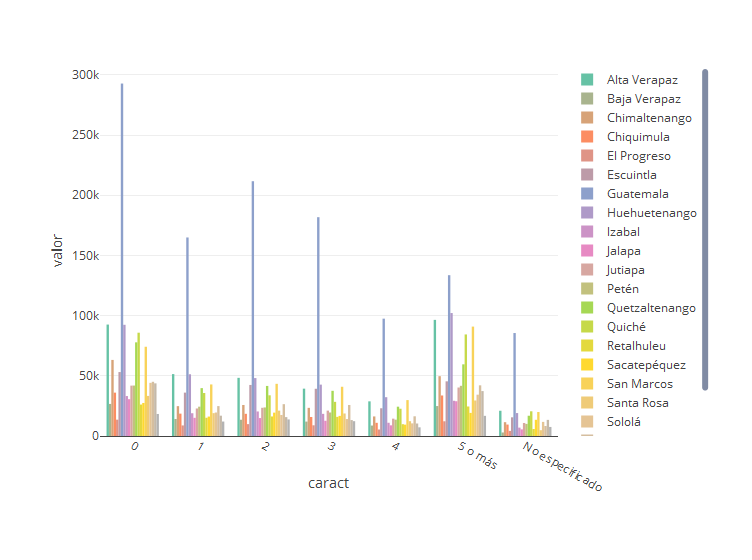
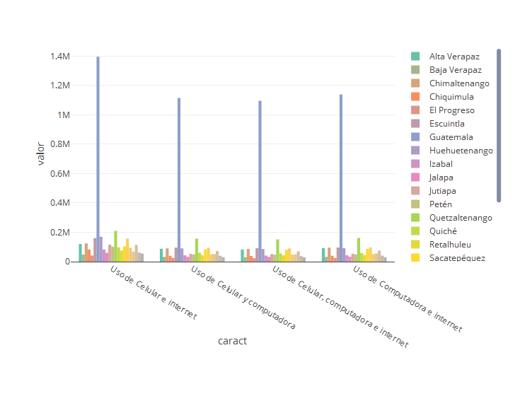

Proyectofinal
================
Mafer Pérez
6 de noviembre de 2019

``` r
library(readr)
library(dplyr)
```

    ## Warning: package 'dplyr' was built under R version 3.5.3

    ## 
    ## Attaching package: 'dplyr'

    ## The following objects are masked from 'package:stats':
    ## 
    ##     filter, lag

    ## The following objects are masked from 'package:base':
    ## 
    ##     intersect, setdiff, setequal, union

``` r
library(lubridate)
```

    ## Warning: package 'lubridate' was built under R version 3.5.3

    ## 
    ## Attaching package: 'lubridate'

    ## The following object is masked from 'package:base':
    ## 
    ##     date

``` r
library(readxl)
library(openxlsx)
```

    ## Warning: package 'openxlsx' was built under R version 3.5.3

``` r
#función para importar las tablas#
import_dep <- function(file, start_column =2, start_row=9){
  datos <- read_xlsx(file, range=cell_limits(c(start_row, start_column),c(32,NA)))
  return(datos)
}
carac_dep <- import_dep("ProyectoFinal/caracteristicas_departamental.xlsx")
edu_dep <- import_dep("ProyectoFinal/educacion_departamental.xlsx")
empleo_dep <- import_dep("ProyectoFinal/empleo_departamental.xlsx")
hogar_dep <- import_dep("ProyectoFinal/hogares_departamental.xlsx")
pob_dep <- import_dep("ProyectoFinal/poblacion_departamental.xlsx")
pueblo_dep <- import_dep("ProyectoFinal/pueblo_departamental.xlsx")
tec_dep <- import_dep("ProyectoFinal/tecnologia_departamental.xlsx")
vivi_dep <- import_dep("ProyectoFinal/vivienda_departamental.xlsx")

#Cambiar nombres de las tablas
names(carac_dep) <- c(NA, NA, "total", "nacimiento", "nacimiento", "nacimiento", "nacimiento", "residencia", "residencia", "residencia", "residencia", "residencia","poblacioncuatro", "vista", "vista", "vista", "escucha", "escucha", "escucha", "caminar", "caminar", "caminar", "recordar", "recordar", "recordar","cuidado", "cuidado", "cuidado","comunicacion", "comunicacion", "comunicacion","totalfertil", "hijosnacidos","hijosnacidos","hijosnacidos","hijosnacidos","hijosnacidos","hijosnacidos","hijosnacidos", "hijossobrevivientes","hijossobrevivientes","hijossobrevivientes","hijossobrevivientes","hijossobrevivientes","hijossobrevivientes" )
names(edu_dep) <- c(NA,NA,"niveleducativo", "niveleducativo","niveleducativo","niveleducativo","niveleducativo","niveleducativo","niveleducativo","niveleducativo","niveleducativo", "inasistencia","inasistencia","inasistencia","inasistencia","inasistencia","inasistencia","inasistencia","inasistencia","inasistencia", "poblacionsiete", "alfabetismo","alfabetismo", "asistencia", "asistencia", "lugarestudio", "lugarestudio", "lugarestudio", "lugarestudio")
names(empleo_dep) <- c(NA,NA,"poblacionsiete", "activa", "ocupada", "cesante", "aspirante", "nodeclarado", "uno")
names(hogar_dep) <- c(NA, NA, "distribucion", "distribucion", "promedio", "promedio")
names(pob_dep) <- c(NA,NA, "total", "sexo", "sexo", "edad", "edad", "edad","edad","edad","grupo","grupo","grupo","grupo","grupo","grupo","grupo","grupo","grupo","grupo","grupo","grupo","grupo","grupo","grupo","grupo","grupo","grupo","grupo","grupo","grupo","area","area", "parentesco","parentesco","parentesco","parentesco","parentesco","parentesco","parentesco","parentesco","parentesco","parentesco","parentesco","colectiva", "poblaciondiez", "estadocivil","estadocivil","estadocivil","estadocivil","estadocivil","estadocivil")
names(pueblo_dep) <- c(NA, NA, "total","pueblo","pueblo","pueblo","pueblo","pueblo","pueblo","comunidad","comunidad","comunidad","comunidad","comunidad","comunidad","comunidad","comunidad","comunidad","comunidad","comunidad","comunidad","comunidad","comunidad","comunidad","comunidad","comunidad","comunidad","comunidad","comunidad","comunidad","comunidad","Idioma","Idioma","Idioma","Idioma","Idioma","Idioma","Idioma","Idioma","Idioma","Idioma","Idioma","Idioma","Idioma","Idioma","Idioma","Idioma","Idioma","Idioma","Idioma","Idioma","Idioma", "Idioma", "Idioma", "Idioma", "Idioma","Idioma", "Idioma", "Idioma", "Idioma","poblacioncuatro")
names(tec_dep) <- c(NA, NA, "poblacionsiete", "celular", "celular", "celular", "computadora", "computadora", "computadora", "internet", "internet","internet", "uso", "uso","uso","uso")
names(vivi_dep) <- c(NA,NA,"totalvivi", "vivienda", "vivienda","tipovivienda","tipovivienda","tipovivienda","tipovivienda","tipovivienda","tipovivienda","tipovivienda", "tipoocupacion","tipoocupacion","tipoocupacion","tipoocupacion","pared","pared","pared","pared","pared","pared","pared","pared","pared","pared","pared","techo","techo","techo","techo","techo","techo","techo","techo","piso","piso","piso","piso","piso","piso","piso","piso")
```

``` r
library(tidyr)
#Función para unir los nombres de la primera fila y la segunda fila
cols <- function(datos){
  colnames1 <- colnames(datos)
  colnames2 <- as.character(as.vector(datos[1,]))
  for (x in 1:ncol(datos)) {
    if(is.na(colnames1[x])){
      colnames(datos)[x] <- paste0(colnames2[x])
    }
    else{
      colnames(datos)[x] <- paste0(colnames1[x],"_",colnames2[x])
    }
  }
  datos = datos[-1,]
  return(datos)
}
carac_dep <- cols(carac_dep)
edu_dep <- cols(edu_dep)
empleo_dep <- cols(empleo_dep)
hogar_dep <- cols(hogar_dep)
pob_dep <- cols(pob_dep)
pueblo_dep <- cols(pueblo_dep)
tec_dep <- cols(tec_dep)
vivi_dep <- cols(vivi_dep)

#Gather de las tablas
carac_dep <- gather(carac_dep, key = "llave", value = "valor", 3:ncol(carac_dep)) %>%  separate(llave, into = c("llave", "caract"), sep = "_")
edu_dep <- gather(edu_dep, key = "llave", value = "valor", 3:ncol(edu_dep)) %>%  separate(llave, into = c("llave", "caract"), sep = "_")
empleo_dep <- gather(empleo_dep, key = "llave", value = "valor", 3:ncol(empleo_dep)) %>%  separate(llave, into = c("llave", "caract"), sep = "_")
hogar_dep <- gather(hogar_dep, key = "llave", value = "valor", 3:ncol(hogar_dep)) %>%  separate(llave, into = c("llave", "caract"), sep = "_")
pob_dep <- gather(pob_dep, key = "llave", value = "valor", 3:ncol(pob_dep)) %>%  separate(llave, into = c("llave", "caract"), sep = "_")
pueblo_dep <- gather(pueblo_dep, key = "llave", value = "valor", 3:ncol(pueblo_dep)) %>%  separate(llave, into = c("llave", "caract"), sep = "_")
tec_dep <- gather(tec_dep, key = "llave", value = "valor", 3:ncol(tec_dep)) %>%  separate(llave, into = c("llave", "caract"), sep = "_")
vivi_dep <- gather(vivi_dep, key = "llave", value = "valor", 3:ncol(vivi_dep)) %>%  separate(llave, into = c("llave", "caract"), sep = "_")
```

``` r
#Función para importar tablas de municipios
import_mun <- function(file, start_column =2, start_row=9){
  datos <- read_xlsx(file, range=cell_limits(c(start_row, start_column),c(350,NA)))
  return(datos)
}
carac_mun <- import_mun("ProyectoFinal/caracteristicas_municipal.xlsx")
edu_mun <- import_mun("ProyectoFinal/educacion_municipal.xlsx")
empleo_mun <- import_mun("ProyectoFinal/empleo_municipal.xlsx")
hogar_mun <- import_mun("ProyectoFinal/hogares_municipal.xlsx")
pob_mun <- import_mun("ProyectoFinal/poblacion_municipal.xlsx")
tec_mun <- import_mun("ProyectoFinal/tecnologia_municipal.xlsx")
vivi_mun <- import_mun("ProyectoFinal/vivienda_municipal.xlsx")

#Cambiar nombres de las tablas
names(carac_mun) <- c(NA, NA, "total", "nacimiento", "nacimiento", "nacimiento", "nacimiento", "residencia", "residencia", "residencia", "residencia", "residencia","poblacioncuatro", "vista", "vista", "vista", "escucha", "escucha", "escucha", "caminar", "caminar", "caminar", "recordar", "recordar", "recordar","cuidado", "cuidado", "cuidado","comunicacion", "comunicacion", "comunicacion","totalfertil", "hijosnacidos","hijosnacidos","hijosnacidos","hijosnacidos","hijosnacidos","hijosnacidos","hijosnacidos", "hijossobrevivientes","hijossobrevivientes","hijossobrevivientes","hijossobrevivientes","hijossobrevivientes","hijossobrevivientes" )
names(edu_mun) <- c(NA,NA,"niveleducativo", "niveleducativo","niveleducativo","niveleducativo","niveleducativo","niveleducativo","niveleducativo","niveleducativo","niveleducativo", "inasistencia","inasistencia","inasistencia","inasistencia","inasistencia","inasistencia","inasistencia","inasistencia","inasistencia", "poblacionsiete", "alfabetismo","alfabetismo", "asistencia", "asistencia", "lugarestudio", "lugarestudio", "lugarestudio", "lugarestudio")
names(empleo_mun) <- c(NA,NA,"poblacionsiete", "activa", "ocupada", "cesante", "aspirante", "nodeclarado", "uno")
names(hogar_mun) <- c(NA, NA, "distribucion", "distribucion", "promedio", "promedio")
names(pob_mun) <- c(NA,NA, "total", "sexo", "sexo", "edad", "edad", "edad","edad","edad","grupo","grupo","grupo","grupo","grupo","grupo","grupo","grupo","grupo","grupo","grupo","grupo","grupo","grupo","grupo","grupo","grupo","grupo","grupo","grupo","grupo","area","area", "parentesco","parentesco","parentesco","parentesco","parentesco","parentesco","parentesco","parentesco","parentesco","parentesco","parentesco","colectiva", "poblaciondiez", "estadocivil","estadocivil","estadocivil","estadocivil","estadocivil","estadocivil")
names(tec_mun) <- c(NA, NA, "poblacionsiete", "celular", "celular", "celular", "computadora", "computadora", "computadora", "internet", "internet","internet", "uso", "uso","uso","uso")
names(vivi_mun) <- c(NA,NA,"totalvivi", "vivienda", "vivienda","tipovivienda","tipovivienda","tipovivienda","tipovivienda","tipovivienda","tipovivienda","tipovivienda", "tipoocupacion","tipoocupacion","tipoocupacion","tipoocupacion","pared","pared","pared","pared","pared","pared","pared","pared","pared","pared","pared","techo","techo","techo","techo","techo","techo","techo","techo","piso","piso","piso","piso","piso","piso","piso","piso")
```

``` r
library(tidyr)
#Función para unir los nombres de la primera fila y la segunda fila
cols <- function(datos){
  colnames1 <- colnames(datos)
  colnames2 <- as.character(as.vector(datos[1,]))
  for (x in 1:ncol(datos)) {
    if(is.na(colnames1[x])){
      colnames(datos)[x] <- paste0(colnames2[x])
    }
    else{
      colnames(datos)[x] <- paste0(colnames1[x],"_",colnames2[x])
    }
  }
  datos = datos[-1,]
  return(datos)
}
carac_mun <- cols(carac_mun)
edu_mun <- cols(edu_mun)
empleo_mun <- cols(empleo_mun)
hogar_mun <- cols(hogar_mun)
pob_mun <- cols(pob_mun)
tec_mun <- cols(tec_mun)
vivi_mun <- cols(vivi_mun)

#Gather de las tablas
carac_mun <- gather(carac_mun, key = "llave", value = "valor", 3:ncol(carac_mun)) %>%  separate(llave, into = c("llave", "caract"), sep = "_")
edu_mun <- gather(edu_mun, key = "llave", value = "valor", 3:ncol(edu_mun)) %>%  separate(llave, into = c("llave", "caract"), sep = "_")
empleo_mun <- gather(empleo_mun, key = "llave", value = "valor", 3:ncol(empleo_mun)) %>%  separate(llave, into = c("llave", "caract"), sep = "_")
hogar_mun <- gather(hogar_mun, key = "llave", value = "valor", 3:ncol(hogar_mun)) %>%  separate(llave, into = c("llave", "caract"), sep = "_")
pob_mun <- gather(pob_mun, key = "llave", value = "valor", 3:ncol(pob_mun)) %>%  separate(llave, into = c("llave", "caract"), sep = "_")

tec_mun <- gather(tec_mun, key = "llave", value = "valor", 3:ncol(tec_mun)) %>%  separate(llave, into = c("llave", "caract"), sep = "_")
vivi_mun <- gather(vivi_mun, key = "llave", value = "valor", 3:ncol(vivi_mun)) %>%  separate(llave, into = c("llave", "caract"), sep = "_")
tec_mun %>% View()
```

``` r
#Tablas de departamentos y de municipios
departamentos <- rbind(carac_dep, edu_dep, empleo_dep, hogar_dep, pob_dep, pueblo_dep, tec_dep, vivi_dep)
municipios <- rbind(carac_mun, edu_mun, empleo_mun, hogar_mun, pob_mun, tec_mun, vivi_mun)
```

``` r
library(DataExplorer)
```

    ## Warning: package 'DataExplorer' was built under R version 3.5.3

``` r
library(plotly)
```

    ## Warning: package 'plotly' was built under R version 3.5.3

    ## Loading required package: ggplot2

    ## 
    ## Attaching package: 'plotly'

    ## The following object is masked from 'package:ggplot2':
    ## 
    ##     last_plot

    ## The following object is masked from 'package:stats':
    ## 
    ##     filter

    ## The following object is masked from 'package:graphics':
    ## 
    ##     layout

``` r
#Se puede ver que no hay missing values
plot_missing(departamentos)
```


``` r
plot_missing(municipios)
```


``` r
library(ggplot2)
library(plotly)
departamentos <- departamentos %>% distinct()
departamentos$valor <- as.double(departamentos$valor)
#Población por departamento 
pobpordep <- departamentos %>% filter(caract =="Total de personas") %>% select(`Código`, Departamento,valor) %>% mutate(porcentaje = valor/sum(valor)) 
pobpordep$`Código` <- factor(pobpordep$`Código`, levels = pobpordep$`Código`[order(pobpordep$`Código`)])
plot_ly(
  x = pobpordep[order(pobpordep$`Código`), ],
  y = pobpordep$valor,
  color = pobpordep$Departamento,
  type = "bar"
)
```

    ## Warning in RColorBrewer::brewer.pal(N, "Set2"): n too large, allowed maximum for palette Set2 is 8
    ## Returning the palette you asked for with that many colors

    ## Warning in RColorBrewer::brewer.pal(N, "Set2"): n too large, allowed maximum for palette Set2 is 8
    ## Returning the palette you asked for with that many colors


``` r
#Población por sexo
totalpob <- departamentos %>% select(Departamento, llave, caract, valor) %>% filter(llave=="sexo")
totalsuma <- sum(totalpob$valor)
hombres <- departamentos %>% select(Departamento, llave, caract, valor) %>% filter(llave=="sexo") %>% filter(caract=="Hombre")
hombre <- hombres$valor
mujeres <- departamentos %>% select(Departamento, llave, caract, valor) %>% filter(llave=="sexo") %>% filter(caract=="Mujer")
mujer <- mujeres$valor
dep <- hombres$Departamento
p <- plot_ly(x = dep, y = hombre, type = 'bar', name = 'Hombre') %>% add_trace(y = mujer, name = 'Mujer') 
p
```


``` r
porcentajehombres <- sum(hombres$valor)/totalsuma
porcentajemujeres <- sum(mujeres$valor)/totalsuma
plot_ly(x = "hombre", y = porcentajehombres, type = 'bar', name = 'Hombre') %>% add_trace(x= "mujer", y = porcentajemujeres, name = 'Mujer')
```


``` r
#Población por grupos de edad

edades <- departamentos %>% filter(llave == "edad") %>% group_by(caract)
edades$caract <- as.factor(edades$caract)
#Departamento por población de edad
plot_ly(
  x = edades$Departamento,
  y = edades$valor,
  color = edades$caract,
  type = "bar"
)
```


``` r
#Población por grupo
grupo1 <- edades %>% filter(caract == "0 - 14") %>% mutate(`0-14` = sum(valor))
grupo1 <- grupo1$`0-14`
grupo1<- grupo1[1]
grupo2<- edades %>% filter(caract == "15 - 29") %>% mutate(`15-29` = sum(valor))
grupo2 <- grupo2$`15-29`
grupo2<- grupo2[1]
grupo3 <-edades %>% filter(caract == "30 - 64") %>% mutate(`30-64` = sum(valor))
grupo3 <- grupo3$`30-64`
grupo3<- grupo3[1]
grupo4 <-edades %>% filter(caract == "65 - 84") %>% mutate(`65-84` = sum(valor))
grupo4 <- grupo4$`65-84`
grupo4 <- grupo4[1]
grupo5 <-edades %>% filter(caract == "85 o más") %>% mutate(`85+` = sum(valor))
grupo5 <- grupo5$`85+`
grupo5 <- grupo5[1]
grupos <- c("0-14","15-29","30-64","65-84","85+")
subgrupos<- c(grupo1, grupo2, grupo3, grupo4, grupo5)
plot_ly(x = grupos, y = subgrupos, type = 'bar', color = grupos)
```


``` r
histogram <- function(df, data){
  ggplot(df, aes(x = caract, y = valor, fill = Departamento)) +
    geom_bar(stat = 'identity', position = 'dodge') +
    ggtitle(data)
  
}
lugarnacimiento <- departamentos %>% filter(llave =="nacimiento") 

naci <- plot_ly(x = lugarnacimiento$caract, y = lugarnacimiento$valor, type = 'bar')
naci
```


``` r
nacidep <- plot_ly(x = lugarnacimiento$caract, y = lugarnacimiento$valor, type = 'bar', color = lugarnacimiento$Departamento)
nacidep
```

    ## Warning in RColorBrewer::brewer.pal(N, "Set2"): n too large, allowed maximum for palette Set2 is 8
    ## Returning the palette you asked for with that many colors

    ## Warning in RColorBrewer::brewer.pal(N, "Set2"): n too large, allowed maximum for palette Set2 is 8
    ## Returning the palette you asked for with that many colors


``` r
lugarresidencia <- departamentos %>% filter(llave =="residencia") 

resi <- plot_ly(x = lugarresidencia$caract, y = lugarresidencia$valor, type = 'bar')
resi
```


``` r
residep <- plot_ly(x = lugarresidencia$caract, y = lugarresidencia$valor, type = 'bar', color = lugarresidencia$Departamento)
residep
```

    ## Warning in RColorBrewer::brewer.pal(N, "Set2"): n too large, allowed maximum for palette Set2 is 8
    ## Returning the palette you asked for with that many colors

    ## Warning in RColorBrewer::brewer.pal(N, "Set2"): n too large, allowed maximum for palette Set2 is 8
    ## Returning the palette you asked for with that many colors


``` r
departamentos %>% filter(llave =="poblacioncuatro") %>%  plot_ly(x = ~caract, y = ~valor, type = 'bar', color = ~Departamento)
```

    ## Warning in RColorBrewer::brewer.pal(N, "Set2"): n too large, allowed maximum for palette Set2 is 8
    ## Returning the palette you asked for with that many colors

    ## Warning in RColorBrewer::brewer.pal(N, "Set2"): n too large, allowed maximum for palette Set2 is 8
    ## Returning the palette you asked for with that many colors


``` r
#Vista
vistageneral <- departamentos %>% filter(llave =="vista") %>%  plot_ly(x = ~caract, y = ~valor, type = 'bar', color = ~caract)
vistadep <- departamentos %>% filter(llave =="vista") %>%  plot_ly(x = ~caract, y = ~valor, type = 'bar', color = ~Departamento)
#Escucha
escuchadep<- departamentos %>% filter(llave =="escucha") %>%  plot_ly(x = ~caract, y = ~valor, type = 'bar', color = ~Departamento)
escuchageneral <- departamentos %>% filter(llave =="escucha") %>%  plot_ly(x = ~caract, y = ~valor, type = 'bar', color = ~caract)
#caminar
caminargeneral <- departamentos %>% filter(llave =="caminar") %>%  plot_ly(x = ~caract, y = ~valor, type = 'bar', color = ~caract)
caminardep <- departamentos %>% filter(llave =="caminar") %>%  plot_ly(x = ~caract, y = ~valor, type = 'bar', color = ~Departamento)
#recordar
recordargeneral <- departamentos %>% filter(llave =="recordar") %>%  plot_ly(x = ~caract, y = ~valor, type = 'bar', color = ~caract)
recordardep <- departamentos %>% filter(llave =="recordar") %>%  plot_ly(x = ~caract, y = ~valor, type = 'bar', color = ~Departamento)
#cuidado
cuidadogeneral <- departamentos %>% filter(llave =="cuidado") %>%  plot_ly(x = ~caract, y = ~valor, type = 'bar', color = ~caract)
cuidadodep <- departamentos %>% filter(llave =="cuidado") %>%  plot_ly(x = ~caract, y = ~valor, type = 'bar', color = ~Departamento)
#comunicación
comunicaciongeneral <- departamentos %>% filter(llave =="comunicacion") %>%  plot_ly(x = ~caract, y = ~valor, type = 'bar', color = ~caract)
comudep <- departamentos %>% filter(llave =="comunicacion") %>%  plot_ly(x = ~caract, y = ~valor, type = 'bar', color = ~Departamento)
vistadep
```

    ## Warning in RColorBrewer::brewer.pal(N, "Set2"): n too large, allowed maximum for palette Set2 is 8
    ## Returning the palette you asked for with that many colors

    ## Warning in RColorBrewer::brewer.pal(N, "Set2"): n too large, allowed maximum for palette Set2 is 8
    ## Returning the palette you asked for with that many colors


``` r
escuchadep
```

    ## Warning in RColorBrewer::brewer.pal(N, "Set2"): n too large, allowed maximum for palette Set2 is 8
    ## Returning the palette you asked for with that many colors

    ## Warning in RColorBrewer::brewer.pal(N, "Set2"): n too large, allowed maximum for palette Set2 is 8
    ## Returning the palette you asked for with that many colors


``` r
caminardep
```

    ## Warning in RColorBrewer::brewer.pal(N, "Set2"): n too large, allowed maximum for palette Set2 is 8
    ## Returning the palette you asked for with that many colors

    ## Warning in RColorBrewer::brewer.pal(N, "Set2"): n too large, allowed maximum for palette Set2 is 8
    ## Returning the palette you asked for with that many colors


``` r
recordardep
```

    ## Warning in RColorBrewer::brewer.pal(N, "Set2"): n too large, allowed maximum for palette Set2 is 8
    ## Returning the palette you asked for with that many colors

    ## Warning in RColorBrewer::brewer.pal(N, "Set2"): n too large, allowed maximum for palette Set2 is 8
    ## Returning the palette you asked for with that many colors


``` r
cuidadodep
```

    ## Warning in RColorBrewer::brewer.pal(N, "Set2"): n too large, allowed maximum for palette Set2 is 8
    ## Returning the palette you asked for with that many colors

    ## Warning in RColorBrewer::brewer.pal(N, "Set2"): n too large, allowed maximum for palette Set2 is 8
    ## Returning the palette you asked for with that many colors


``` r
comudep
```

    ## Warning in RColorBrewer::brewer.pal(N, "Set2"): n too large, allowed maximum for palette Set2 is 8
    ## Returning the palette you asked for with that many colors

    ## Warning in RColorBrewer::brewer.pal(N, "Set2"): n too large, allowed maximum for palette Set2 is 8
    ## Returning the palette you asked for with that many colors


``` r
hijos <- departamentos %>% filter(llave =="hijosnacidos") %>%  plot_ly(x = ~caract, y = ~valor, type = 'bar', color = ~Departamento)
hijos
```

    ## Warning in RColorBrewer::brewer.pal(N, "Set2"): n too large, allowed maximum for palette Set2 is 8
    ## Returning the palette you asked for with that many colors

    ## Warning in RColorBrewer::brewer.pal(N, "Set2"): n too large, allowed maximum for palette Set2 is 8
    ## Returning the palette you asked for with that many colors



``` r
hijosgeneral <- departamentos %>% filter(llave =="hijosnacidos") %>%  plot_ly(x = ~caract, y = ~valor, type = 'bar', color = ~caract)
hijosgeneral
```


``` r
hijoss <- departamentos %>% filter(llave =="hijossobrevivientes") %>%  plot_ly(x = ~caract, y = ~valor, type = 'bar', color = ~Departamento)
hijoss
```

    ## Warning in RColorBrewer::brewer.pal(N, "Set2"): n too large, allowed maximum for palette Set2 is 8
    ## Returning the palette you asked for with that many colors

    ## Warning in RColorBrewer::brewer.pal(N, "Set2"): n too large, allowed maximum for palette Set2 is 8
    ## Returning the palette you asked for with that many colors


``` r
hijossgeneral <- departamentos %>% filter(llave =="hijossobrevivientes") %>%  plot_ly(x = ~caract, y = ~valor, type = 'bar', color = ~caract)
hijossgeneral
```


``` r
#nivel educativo
edupordep <- departamentos %>% filter(llave =="niveleducativo") %>%  plot_ly(x = ~caract, y = ~valor, type = 'bar', color = ~Departamento)
edupordep
```

    ## Warning in RColorBrewer::brewer.pal(N, "Set2"): n too large, allowed maximum for palette Set2 is 8
    ## Returning the palette you asked for with that many colors

    ## Warning in RColorBrewer::brewer.pal(N, "Set2"): n too large, allowed maximum for palette Set2 is 8
    ## Returning the palette you asked for with that many colors


``` r
edugeneral <- departamentos %>% filter(llave =="niveleducativo") %>%  plot_ly(x = ~caract, y = ~valor, type = 'bar', color = ~caract)
edugeneral
```

    ## Warning in RColorBrewer::brewer.pal(N, "Set2"): n too large, allowed maximum for palette Set2 is 8
    ## Returning the palette you asked for with that many colors

    ## Warning in RColorBrewer::brewer.pal(N, "Set2"): n too large, allowed maximum for palette Set2 is 8
    ## Returning the palette you asked for with that many colors


``` r
inasistenciadep <- departamentos %>% filter(llave =="inasistencia") %>%  plot_ly(x = ~caract, y = ~valor, type = 'bar', color = ~Departamento)
inasistenciadep
```

    ## Warning in RColorBrewer::brewer.pal(N, "Set2"): n too large, allowed maximum for palette Set2 is 8
    ## Returning the palette you asked for with that many colors

    ## Warning in RColorBrewer::brewer.pal(N, "Set2"): n too large, allowed maximum for palette Set2 is 8
    ## Returning the palette you asked for with that many colors


``` r
inasistenciageneral <- departamentos %>% filter(llave =="inasistencia") %>%  plot_ly(x = ~caract, y = ~valor, type = 'bar', color = ~caract)
inasistenciageneral
```

    ## Warning in RColorBrewer::brewer.pal(N, "Set2"): n too large, allowed maximum for palette Set2 is 8
    ## Returning the palette you asked for with that many colors

    ## Warning in RColorBrewer::brewer.pal(N, "Set2"): n too large, allowed maximum for palette Set2 is 8
    ## Returning the palette you asked for with that many colors


``` r
#lugar estudio
lugarestudiodep <- departamentos %>% filter(llave =="lugarestudio") %>%  plot_ly(x = ~caract, y = ~valor, type = 'bar', color = ~Departamento)
lugarestudiodep
```

    ## Warning in RColorBrewer::brewer.pal(N, "Set2"): n too large, allowed maximum for palette Set2 is 8
    ## Returning the palette you asked for with that many colors

    ## Warning in RColorBrewer::brewer.pal(N, "Set2"): n too large, allowed maximum for palette Set2 is 8
    ## Returning the palette you asked for with that many colors


``` r
pueblodep <- departamentos %>% filter(llave =="pueblo") %>%  plot_ly(x = ~caract, y = ~valor, type = 'bar', color = ~Departamento)
pueblodep
```

    ## Warning in RColorBrewer::brewer.pal(N, "Set2"): n too large, allowed maximum for palette Set2 is 8
    ## Returning the palette you asked for with that many colors

    ## Warning in RColorBrewer::brewer.pal(N, "Set2"): n too large, allowed maximum for palette Set2 is 8
    ## Returning the palette you asked for with that many colors


``` r
idiomadep <- departamentos %>% filter(llave =="Idioma") %>%  plot_ly(x = ~caract, y = ~valor, type = 'bar', color = ~Departamento)
idiomadep
```

    ## Warning in RColorBrewer::brewer.pal(N, "Set2"): n too large, allowed maximum for palette Set2 is 8
    ## Returning the palette you asked for with that many colors

    ## Warning in RColorBrewer::brewer.pal(N, "Set2"): n too large, allowed maximum for palette Set2 is 8
    ## Returning the palette you asked for with that many colors


``` r
celdep <- departamentos %>% filter(llave =="celular") %>%  plot_ly(x = ~caract, y = ~valor, type = 'bar', color = ~Departamento)
celdep
```

    ## Warning in RColorBrewer::brewer.pal(N, "Set2"): n too large, allowed maximum for palette Set2 is 8
    ## Returning the palette you asked for with that many colors

    ## Warning in RColorBrewer::brewer.pal(N, "Set2"): n too large, allowed maximum for palette Set2 is 8
    ## Returning the palette you asked for with that many colors


``` r
compudep <- departamentos %>% filter(llave =="computadora") %>%  plot_ly(x = ~caract, y = ~valor, type = 'bar', color = ~Departamento)
compudep
```

    ## Warning in RColorBrewer::brewer.pal(N, "Set2"): n too large, allowed maximum for palette Set2 is 8
    ## Returning the palette you asked for with that many colors

    ## Warning in RColorBrewer::brewer.pal(N, "Set2"): n too large, allowed maximum for palette Set2 is 8
    ## Returning the palette you asked for with that many colors


``` r
internetdep <- departamentos %>% filter(llave =="internet") %>%  plot_ly(x = ~caract, y = ~valor, type = 'bar', color = ~Departamento)
internetdep
```

    ## Warning in RColorBrewer::brewer.pal(N, "Set2"): n too large, allowed maximum for palette Set2 is 8
    ## Returning the palette you asked for with that many colors

    ## Warning in RColorBrewer::brewer.pal(N, "Set2"): n too large, allowed maximum for palette Set2 is 8
    ## Returning the palette you asked for with that many colors


``` r
usodep <- departamentos %>% filter(llave =="uso") %>%  plot_ly(x = ~caract, y = ~valor, type = 'bar', color = ~Departamento)
usodep
```

    ## Warning in RColorBrewer::brewer.pal(N, "Set2"): n too large, allowed maximum for palette Set2 is 8
    ## Returning the palette you asked for with that many colors

    ## Warning in RColorBrewer::brewer.pal(N, "Set2"): n too large, allowed maximum for palette Set2 is 8
    ## Returning the palette you asked for with that many colors



``` r
tipovividep <- departamentos %>% filter(llave =="tipovivienda") %>%  plot_ly(x = ~caract, y = ~valor, type = 'bar', color = ~Departamento)
tipovividep
```

    ## Warning in RColorBrewer::brewer.pal(N, "Set2"): n too large, allowed maximum for palette Set2 is 8
    ## Returning the palette you asked for with that many colors

    ## Warning in RColorBrewer::brewer.pal(N, "Set2"): n too large, allowed maximum for palette Set2 is 8
    ## Returning the palette you asked for with that many colors


``` r
#Vivienda
pareddep <- departamentos %>% filter(llave =="pared") %>%  plot_ly(x = ~caract, y = ~valor, type = 'bar', color = ~Departamento)
pareddep
```

    ## Warning in RColorBrewer::brewer.pal(N, "Set2"): n too large, allowed maximum for palette Set2 is 8
    ## Returning the palette you asked for with that many colors

    ## Warning in RColorBrewer::brewer.pal(N, "Set2"): n too large, allowed maximum for palette Set2 is 8
    ## Returning the palette you asked for with that many colors


``` r
techodep <- departamentos %>% filter(llave =="techo") %>%  plot_ly(x = ~caract, y = ~valor, type = 'bar', color = ~Departamento)
techodep
```

    ## Warning in RColorBrewer::brewer.pal(N, "Set2"): n too large, allowed maximum for palette Set2 is 8
    ## Returning the palette you asked for with that many colors

    ## Warning in RColorBrewer::brewer.pal(N, "Set2"): n too large, allowed maximum for palette Set2 is 8
    ## Returning the palette you asked for with that many colors


``` r
pisodep <- departamentos %>% filter(llave =="piso") %>%  plot_ly(x = ~caract, y = ~valor, type = 'bar', color = ~Departamento)
pisodep
```

    ## Warning in RColorBrewer::brewer.pal(N, "Set2"): n too large, allowed maximum for palette Set2 is 8
    ## Returning the palette you asked for with that many colors

    ## Warning in RColorBrewer::brewer.pal(N, "Set2"): n too large, allowed maximum for palette Set2 is 8
    ## Returning the palette you asked for with that many colors


``` r
boxplot <- function(datos, titulo){
  ggplot(datos, aes(x = caract, y = valor)) +
    geom_boxplot() +
    ggtitle(titulo)
}

totalpersonas <- departamentos %>% filter(caract =="Total de personas")
boxpareddep <- departamentos %>% filter(llave =="pared") %>%  plot_ly(x = ~caract, y = ~valor, type = 'box')
boxpareddep
```


``` r
boxnacidep <- plot_ly(x = lugarnacimiento$caract, y = lugarnacimiento$valor, type = 'box')
boxnacidep
```


``` r
boxresidep <- plot_ly(x = lugarresidencia$caract, y = lugarresidencia$valor, type = 'box')
boxresidep
```


``` r
#Vista
vistabox <- departamentos %>% filter(llave =="vista") %>%  plot_ly(x = ~caract, y = ~valor, type = 'box')
vistabox
```


``` r
#Escucha
escuchabox<- departamentos %>% filter(llave =="escucha") %>%  plot_ly(x = ~caract, y = ~valor, type = 'box')
escuchabox
```


``` r
#caminar
caminarbox <- departamentos %>% filter(llave =="caminar") %>%  plot_ly(x = ~caract, y = ~valor, type = 'box')
caminarbox
```


``` r
#recordar
recordarbox <- departamentos %>% filter(llave =="recordar") %>%  plot_ly(x = ~caract, y = ~valor, type = 'box', color = ~caract)
recordarbox
```


``` r
#cuidado
cuidadobox <- departamentos %>% filter(llave =="cuidado") %>%  plot_ly(x = ~caract, y = ~valor, type = 'box')

#comunicación
comunicacionbox <- departamentos %>% filter(llave =="comunicacion") %>%  plot_ly(x = ~caract, y = ~valor, type = 'box')

#Hijos
hijosbox <- departamentos %>% filter(llave =="hijosnacidos") %>%  plot_ly(x = ~caract, y = ~valor, type = 'box')

edubox <- departamentos %>% filter(llave =="niveleducativo") %>%  plot_ly(x = ~caract, y = ~valor, type = 'box')
edubox
```


``` r
celbox <- departamentos %>% filter(llave =="celular") %>%  plot_ly(x = ~caract, y = ~valor, type = 'box')
celbox
```


``` r
#Correlación
df24 <-departamentos %>% filter(llave == 'alfabetismo') %>% filter(caract == 'Alfabeta')%>% select(valor)
colnames(df24) <- "Alfabeta"
df25 <- departamentos %>% filter(llave == 'alfabetismo') %>% filter(caract == 'Analfabeta')%>% select(valor)
colnames(df25) <- "Analfabeta"
df1<- departamentos %>% filter(llave == 'niveleducativo') %>% filter(caract == 'Preprimaria')%>% select(valor)
colnames(df1) <- "EducacionPreprimaria"
df2<- departamentos %>% filter(llave == 'niveleducativo') %>% filter(caract == 'Primaria, 1-3')%>% select(valor)
colnames(df2) <- "EducacionPrimaria"
df3<- departamentos %>% filter(llave == 'niveleducativo') %>% filter(caract == 'Primaria, 4-5')%>% select(valor)
colnames(df3) <- "EducacionPrimaria"
df4<- departamentos %>% filter(llave == 'niveleducativo') %>% filter(caract == 'Primaria, 6')%>% select(valor)
colnames(df4) <- "EducacionPrimaria"
df5<- departamentos %>% filter(llave == 'niveleducativo') %>% filter(caract == 'Basico')%>% select(valor)
colnames(df5) <- "EducacionBasico"
df6<- departamentos %>% filter(llave == 'niveleducativo') %>% filter(caract == 'Diversificado')%>% select(valor)
colnames(df6) <- "EducacionDiversificado"
df7<- departamentos %>% filter(llave == 'niveleducativo') %>% filter(caract == 'Licenciatura')%>% select(valor)
colnames(df7) <- "EducacionLicenciatura"
df8<- departamentos %>% filter(llave == 'niveleducativo') %>% filter(caract == 'Maestria y doctorado')%>% select(valor)
colnames(df8) <- "EducacionMaestriaDoctorado"
df9<- departamentos %>% filter(llave == 'inasistencia') %>% filter(caract == 'Falta de dinero')%>% select(valor)
colnames(df9) <- "InasistenciaFaltaDinero"
df10<- departamentos %>% filter(llave == 'inasistencia') %>% filter(caract == 'Tiene que trabajar')%>% select(valor)
colnames(df10) <- "InasistenciaTrabajo"
df11<- departamentos %>% filter(llave == 'inasistencia') %>% filter(caract == 'No hay escuela, instituto o universidad')%>% select(valor)
colnames(df11) <- "InasistenciaNoEscuela"
df14<- departamentos %>% filter(llave == 'Idioma') %>% filter(caract == 'Español')%>% select(valor)
colnames(df14) <- "IdiomaEspañol"
df15<- departamentos %>% filter(llave == 'Idioma') %>% filter(caract == 'Kaqchiquel')%>% select(valor)
colnames(df15) <- "IdiomaKaqchiquel"
df16<- departamentos %>% filter(llave == 'sexo') %>% filter(caract == 'Hombre')%>% select(valor)
colnames(df16) <- "Hombre"
df17<- departamentos %>% filter(llave == 'sexo') %>% filter(caract == 'Mujer')%>% select(valor)
colnames(df17) <- "Mujer"
df18<- departamentos %>% filter(llave == 'area') %>% filter(caract == 'Urbano')%>% select(valor)
colnames(df18) <- "Urbano"
df19<- departamentos %>% filter(llave == 'area') %>% filter(caract == 'Rural')%>% select(valor)
colnames(df19) <- "Rural"
df20<- departamentos %>% filter(llave == 'estadocivil') %>% filter(caract == 'Soltera(o)')%>% select(valor)
colnames(df20) <- "Soltero"
df21<- departamentos %>% filter(llave == 'estadocivil') %>% filter(caract == 'Casada(o)')%>% select(valor)
colnames(df21) <- "Casado"
df22<- departamentos %>% filter(llave == 'activa') %>% filter(caract == 'Población Económicamente Activa')%>% select(valor)
colnames(df22) <- "PoblacionActiva"
df23<- departamentos %>% filter(llave == 'cesante') %>% filter(caract == 'Cesante')%>% select(valor)
colnames(df23) <- "PoblacionCesante"
depart <- cbind(df1,df2,df3,df4,df5,df6,df7,df8,df9,df10,df11,df14,df15,df16,df17,df18,df19,df20,df21,df22,df23,df24,df25)
depart <- depart[, !duplicated(colnames(depart))]
plot_correlation(depart)
```


``` r
municipios <- municipios %>% distinct()
municipios$valor <- as.double(municipios$valor)
municipios %>% filter(llave=="poblacionsiete") %>% mutate(porcentajepob = valor/sum(valor)) %>% arrange(desc(porcentajepob))
```

    ## # A tibble: 340 x 6
    ##    Código Municipio        llave      caract            valor porcentajepob
    ##    <chr>  <chr>            <chr>      <chr>             <dbl>         <dbl>
    ##  1 101    Guatemala        poblacion~ Población de 7 ~ 823541        0.0657
    ##  2 108    Mixco            poblacion~ Población de 7 ~ 413084        0.0330
    ##  3 115    Villa Nueva      poblacion~ Población de 7 ~ 378827        0.0302
    ##  4 1609   San Pedro Carchá poblacion~ Población de 7 ~ 190682        0.0152
    ##  5 110    San Juan Sacate~ poblacion~ Población de 7 ~ 184474        0.0147
    ##  6 1601   Cobán            poblacion~ Población de 7 ~ 176556        0.0141
    ##  7 901    Quetzaltenango   poblacion~ Población de 7 ~ 158834        0.0127
    ##  8 501    Escuintla        poblacion~ Población de 7 ~ 135581        0.0108
    ##  9 116    Villa Canales    poblacion~ Población de 7 ~ 133606        0.0107
    ## 10 2101   Jalapa           poblacion~ Población de 7 ~ 130920        0.0104
    ## # ... with 330 more rows

``` r
municipios
```

    ## # A tibble: 62,220 x 5
    ##    Código Municipio              llave caract             valor
    ##    <chr>  <chr>                  <chr> <chr>              <dbl>
    ##  1 101    Guatemala              total Total de personas 923392
    ##  2 102    Santa Catarina Pinula  total Total de personas  80582
    ##  3 103    San José Pinula        total Total de personas  79844
    ##  4 104    San José del Golfo     total Total de personas   7229
    ##  5 105    Palencia               total Total de personas  70973
    ##  6 106    Chinautla              total Total de personas 114752
    ##  7 107    San Pedro Ayampuc      total Total de personas  58609
    ##  8 108    Mixco                  total Total de personas 465773
    ##  9 109    San Pedro Sacatepéquez total Total de personas  51292
    ## 10 110    San Juan Sacatepéquez  total Total de personas 218156
    ## # ... with 62,210 more rows

``` r
principales <- municipios %>%filter(Municipio%in% c("Guatemala","Mixco", "Villa Nueva","San Pedro Carchá","San Juan Sacatepéquez","Cobán","Quetzaltenango","Escuintla","Villa Canales","Jalapa"))
```

``` r
edupormun <- principales %>% filter(llave =="niveleducativo") %>%  plot_ly(x = ~caract, y = ~valor, type = 'bar', color = ~Municipio)
edupormun
```

    ## Warning in RColorBrewer::brewer.pal(N, "Set2"): n too large, allowed maximum for palette Set2 is 8
    ## Returning the palette you asked for with that many colors

    ## Warning in RColorBrewer::brewer.pal(N, "Set2"): n too large, allowed maximum for palette Set2 is 8
    ## Returning the palette you asked for with that many colors


``` r
edugeneralmun <- principales %>% filter(llave =="niveleducativo") %>%  plot_ly(x = ~caract, y = ~valor, type = 'bar', color = ~caract)
edugeneralmun
```

    ## Warning in RColorBrewer::brewer.pal(N, "Set2"): n too large, allowed maximum for palette Set2 is 8
    ## Returning the palette you asked for with that many colors

    ## Warning in RColorBrewer::brewer.pal(N, "Set2"): n too large, allowed maximum for palette Set2 is 8
    ## Returning the palette you asked for with that many colors


``` r
inasistenciamun <- principales %>% filter(llave =="inasistencia") %>%  plot_ly(x = ~caract, y = ~valor, type = 'bar', color = ~Municipio)
inasistenciamun
```

    ## Warning in RColorBrewer::brewer.pal(N, "Set2"): n too large, allowed maximum for palette Set2 is 8
    ## Returning the palette you asked for with that many colors

    ## Warning in RColorBrewer::brewer.pal(N, "Set2"): n too large, allowed maximum for palette Set2 is 8
    ## Returning the palette you asked for with that many colors


``` r
eduboxmun <- principales %>% filter(llave =="niveleducativo") %>%  plot_ly(x = ~caract, y = ~valor, type = 'box')
eduboxmun
```


``` r
celboxmun <- principales %>% filter(llave =="celular") %>%  plot_ly(x = ~caract, y = ~valor, type = 'box')
celboxmun
```


